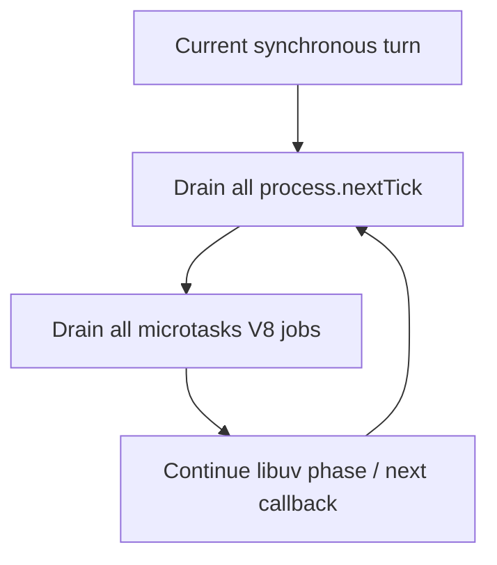
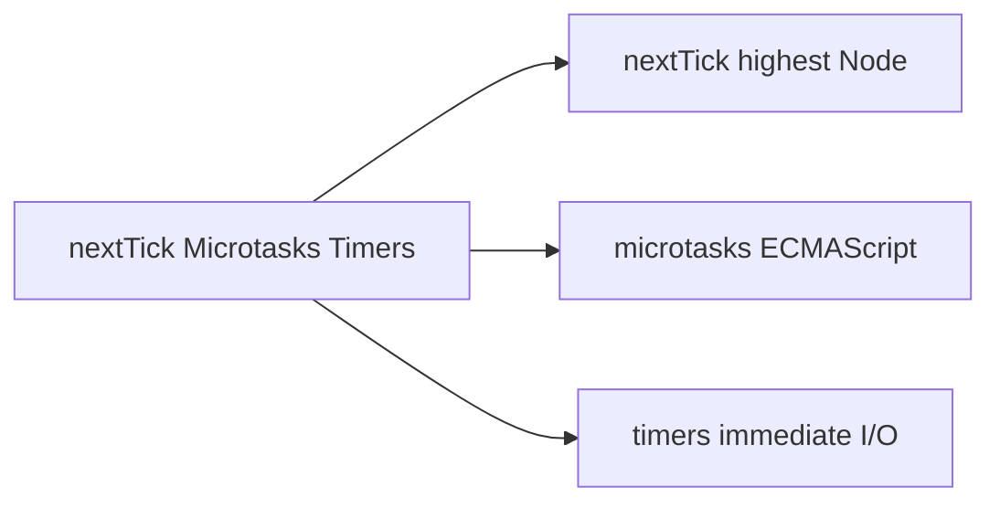
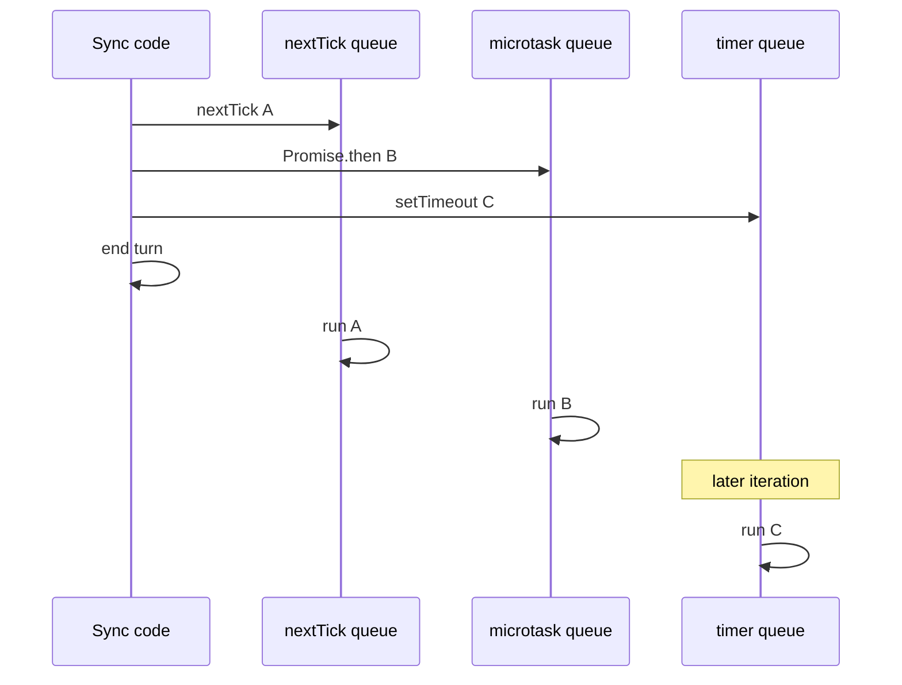

# process.nextTick vs Microtasks vs Timers

## Overview

Node schedules JavaScript work from **three familiar buckets**—`process.nextTick`, **microtasks** (`queueMicrotask`, promise reactions), and **timers/macrotasks** (`setTimeout`, `setInterval`, `setImmediate`)—but the **priority rules differ from browsers**. Node drains the entire `nextTick` queue before microtasks, and both drain between libuv phase steps—potentially **starving I/O** if abused.

Promise reaction semantics are **language-defined** ([[02-JavaScript/05-Async-and-Concurrency/Promises Internals|Promises Internals]]). This note covers **host scheduling**: where Node inserts each queue relative to libuv ([[06-NodeJS/02-Event-Loop-and-libuv/Event Loop Phases|Event Loop Phases]]).

## Learning Objectives

- State Node's ordering: sync → nextTick → microtasks → libuv phase continuation
- Predict output of mixed `nextTick`, `Promise.then`, and `setTimeout` scripts
- Explain starvation when `nextTick` recursively schedules itself
- Choose `queueMicrotask` vs. `process.nextTick` vs. `setImmediate` appropriately
- Relate scheduling choices to library compatibility and production latency

## Prerequisites

- [[06-NodeJS/02-Event-Loop-and-libuv/Event Loop Phases|Event Loop Phases]]
- [[02-JavaScript/05-Async-and-Concurrency/Tasks Microtasks and Rendering|Tasks Microtasks and Rendering]]
- [[02-JavaScript/05-Async-and-Concurrency/Promises Internals|Promises Internals]]

## Difficulty

`advanced`

## Estimated Time

- Reading: 2 hours
- Exercises: 3 hours
- Mini project: 4 hours

## History

`process.nextTick` predates standardized microtasks in ECMAScript—Node used it to defer callbacks before promises existed. When promises landed, Node prioritized `nextTick` over V8 microtasks to preserve legacy stream and `util.promisify` behavior—creating a **host-specific priority** not found in browsers. `queueMicrotask` (ES2019) gave portable "run after current turn" semantics; Node docs now steer library authors toward microtasks for cross-host code.

## Problem It Solves

- **Ordering bugs** in libraries assuming browser-only microtask rules
- **Event-loop starvation** from unbounded `nextTick` chains blocking poll phase
- **Test flakes** in Jest/Vitest comparing timer vs. promise ordering
- **API selection**: defer invariant setup vs. yield to I/O vs. time-based delay

## Internal Implementation

### Priority stack (Node main thread)



Within one **macrotask/libuv callback**, the pattern repeats until queues empty before moving to next libuv event.

### Comparison table

| Mechanism | Standard | Runs before | Typical use |
| --- | --- | --- | --- |
| `process.nextTick` | Node-only | microtasks + I/O | legacy stream compat (avoid in new code) |
| `queueMicrotask` / promises | ECMAScript | next macrotask phase step | portable deferral |
| `setImmediate` | Node (check phase) | next timers often | after I/O callback batch |
| `setTimeout(fn,0)` | Host | timers phase | time-based minimum delay |

Browser comparison: [[02-JavaScript/05-Async-and-Concurrency/Tasks Microtasks and Rendering|Tasks Microtasks and Rendering]]—no `nextTick`, rendering between tasks.

## Mermaid Diagrams

### Structure



### Sequence / Lifecycle — ordering demo



## Examples

### Minimal Example — canonical ordering

```typescript
// Node 20+ / TypeScript 5+
// Portability: nextTick is Node-only; rest is cross-host.
import { nextTick } from "node:process";

console.log("1 sync");

nextTick(() => console.log("2 nextTick"));

Promise.resolve().then(() => console.log("3 microtask"));

queueMicrotask(() => console.log("4 queueMicrotask"));

setTimeout(() => console.log("5 timeout"), 0);

// Output: 1, 2, 3, 4, 5 (3/4 order among microtasks is insertion order)
```

### Production-Shaped Example — avoid nextTick starvation

```typescript
// Node 20+ / TypeScript 5+
// BAD: recursive nextTick prevents poll phase — stalls HTTP responses.
function badDrain(items: number[]): void {
  const item = items.shift();
  if (item == null) return;
  doWork(item);
  nextTick(() => badDrain(items)); // starves I/O
}

// GOOD: yield with setImmediate or batch + microtask for portable libs.
function goodDrain(items: number[]): void {
  function batch(): void {
    const deadline = Date.now() + 5; // 5ms budget
    while (items.length && Date.now() < deadline) {
      doWork(items.shift()!);
    }
    if (items.length) setImmediate(batch);
  }
  batch();
}

function doWork(n: number): void {
  void n;
}

import { setImmediate } from "node:timers";
import { nextTick } from "node:process";
```

## Trade-offs

| Dimension | Upside | Downside | When it matters |
| --- | --- | --- | --- |
| nextTick priority | Fixes legacy ordering | Starves I/O | streams internals |
| microtasks | Portable, spec-backed | Flood blocks timers | shared libraries |
| setTimeout(0) | Simple defer | Min delay clamped | coarse yielding |
| setImmediate | After I/O burst | Node-only | server batch jobs |

### When to Use

- `queueMicrotask` / promises for portable deferral in libraries
- `setImmediate` to chunk CPU on server event loop
- `setTimeout` when time-based delay semantics required

### When Not to Use

- Do not use `process.nextTick` in new public APIs unless emulating Node streams internals
- Do not recursively schedule nextTick/microtasks without yielding to macrotasks

## Exercises

1. Implement recursive `nextTick` 10,000 times—observe HTTP latency during load.
2. Repeat with `setImmediate` chunking—compare loop delay metrics.
3. Predict output when `nextTick` schedules a microtask that schedules nextTick.
4. Port ordering test to browser—document differences.
5. Explain why `await Promise.resolve()` yields microtasks, not nextTick.

## Mini Project

**Scheduler quiz tool.** CLI prints expected vs. actual order for randomized snippets; explain using phase diagram.

## Portfolio Project

Add ordering labs to [[06-NodeJS/projects/Node Runtime Toolkit/README|Node Runtime Toolkit]] cross-linked to JS microtask note.

## Interview Questions

1. Node priority: nextTick vs. microtasks vs. setTimeout?
2. Why can nextTick starve I/O?
3. Is `queueMicrotask` identical in Node and browser?
4. When prefer `setImmediate` over `setTimeout(0)` in Node?
5. Where do `await` continuations run?

### Stretch / Staff-Level

1. How did streams `._write` use nextTick for error propagation—why risky today?
2. Relate microtask floods to [[01-Computer-Science/05-Concurrency-Fundamentals/Deadlocks Livelocks and Starvation|Starvation]] concepts.

## Common Mistakes

- Assuming browser ordering in Node without nextTick consideration
- Using nextTick for "async" API in cross-platform libraries
- Awaiting only `setTimeout(0)` expecting microtasks to run first—they will, before timer fires
- Infinite microtask loop: `queueMicrotask(() => queueMicrotask(...))`

## Best Practices

- Prefer promises/`queueMicrotask` for portable deferral
- Chunk long sync work with `setImmediate` and time budgets
- Measure `perf_hooks.monitorEventLoopDelay` when adjusting schedulers
- Document Node-specific scheduling in server-only code paths

## Summary

Node extends browser-like microtask draining with a higher-priority `process.nextTick` queue that runs before promise jobs and between libuv steps. Timers and `setImmediate` are macrotasks scheduled in libuv phases—later than all nextTick and microtask work from the current callback. Abuse of nextTick or microtask floods starves poll-phase I/O; production code yields to macrotasks and offloads CPU.

## Further Reading

- [[00-References/NodeJS/README|Node.js References]]
- Node.js — `process.nextTick` documentation
- [[02-JavaScript/05-Async-and-Concurrency/Tasks Microtasks and Rendering|Tasks Microtasks and Rendering]]

## Related Notes

- [[06-NodeJS/02-Event-Loop-and-libuv/Event Loop Phases|Event Loop Phases]]
- [[06-NodeJS/02-Event-Loop-and-libuv/Starvation Backpressure and Loop Health|Starvation Backpressure and Loop Health]]
- [[02-JavaScript/05-Async-and-Concurrency/Promises Internals|Promises Internals]]
- [[02-JavaScript/05-Async-and-Concurrency/Async and Await|Async and Await]]

## Progress Checklist

- [ ] Explained from first principles
- [ ] Drew at least one Mermaid diagram
- [ ] Implemented a minimal version
- [ ] Documented trade-offs and non-goals
- [ ] Completed exercises
- [ ] Practiced interview questions aloud
- [ ] Linked prerequisites and dependents
