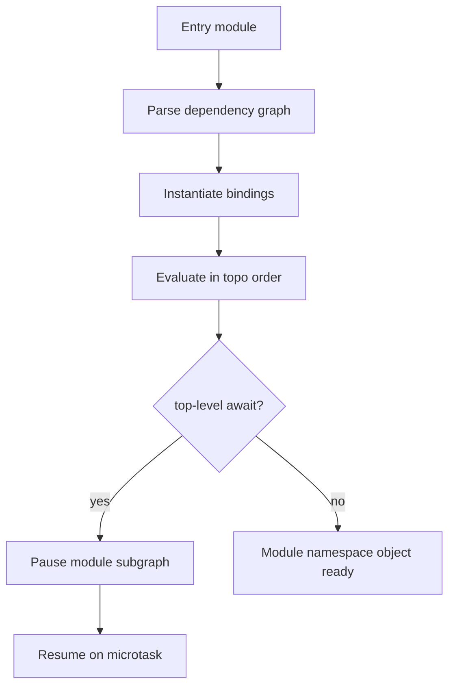
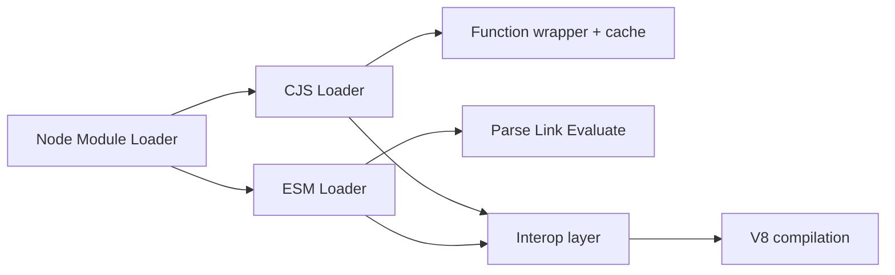
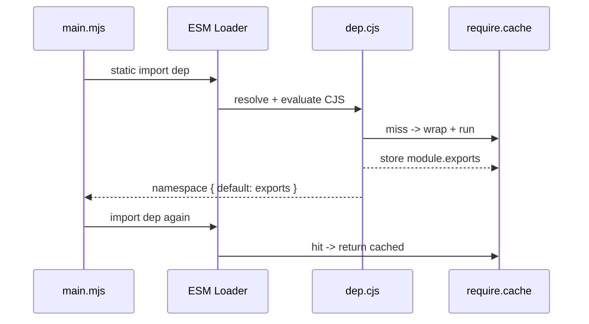

# CJS and ESM Execution in Node

## Overview

Node.js runs **two module systems** with different execution models. **CommonJS (CJS)** wraps each file in a function, evaluates synchronously on first `require()`, caches `module.exports`, and resolves specifiers at call time. **ECMAScript Modules (ESM)** parse into a static dependency graph, link bindings before evaluation, enforce live exports, and support top-level `await`. The `"type"` field in `package.json` selects the default parser for `.js` files; `.mjs` is always ESM and `.cjs` always CJS.

This note covers **how Node executes** each format—wrappers, caching, interop, and evaluation order—not the portable `exports` contract (see [[02-JavaScript/06-Modules-and-Tooling/Module Resolution and Package Exports|Module Resolution and Package Exports]]).

## Learning Objectives

- Explain the CJS wrapper, `module`/`exports`/`require`, and the module cache
- Trace ESM linking, live bindings, and evaluation order in Node
- Predict interop behavior: `import()` of CJS, `require()` of ESM, and `createRequire`
- Diagnose dual-format bugs: `__dirname`, top-level `await`, and circular dependencies
- Choose `"type"`, `.mjs`, and `.cjs` boundaries for a mixed codebase

## Prerequisites

- [[02-JavaScript/06-Modules-and-Tooling/ES Modules|ES Modules]]
- [[02-JavaScript/06-Modules-and-Tooling/CommonJS and Interoperability|CommonJS and Interoperability]]
- [[06-NodeJS/02-Event-Loop-and-libuv/Event Loop Phases|Event Loop Phases]]

## Difficulty

`advanced`

## Estimated Time

- Reading: 2.5 hours
- Exercises: 3 hours
- Mini project: 4 hours

## History

Node 0.x adopted CommonJS because ES modules did not exist. CJS's synchronous `require()` matched Node's early single-threaded scripting model. ES2015 modules arrived in browsers; Node added experimental ESM in v8.5 (2017), stable `"type": "module"` in v12+, and `--experimental-require-module` / improved CJS↔ESM interop through v20–22. The split persists because millions of packages and tools assume CJS semantics.

## Problem It Solves

- **Interop during migration**: run legacy CJS libraries from ESM apps without rewriting the ecosystem overnight
- **Correct evaluation order**: ESM static imports prevent use-before-init bugs that dynamic `require()` ordering can hide
- **Performance and caching**: module cache avoids re-parsing; ESM can tree-shake at bundle time
- **Host-specific needs**: `__filename`, `import.meta.url`, and conditional loading differ per system

## Internal Implementation

### CJS execution model

Node compiles each CJS file into a wrapper function:

```javascript
(function (exports, require, module, __filename, __dirname) {
  // user code
});
```

On first `require(specifier)`:

1. Resolve specifier to absolute path (see [[06-NodeJS/03-Modules-and-Loading/node_modules Resolution in Practice|node_modules Resolution in Practice]])
2. Check `require.cache[resolvedPath]` — return cached `exports` if hit
3. Create `module = { exports: {}, id, filename, loaded: false, ... }`
4. Run wrapper; user assigns `module.exports` or `exports.foo = ...`
5. Set `module.loaded = true`, store in cache, return `module.exports`

Circular CJS: partially initialized `exports` object is placed in cache **before** evaluation completes, so dependents may see incomplete exports.

### ESM execution model

ESM uses three phases (simplified):

1. **Parse** — build Module Record with static `import`/`export` edges
2. **Instantiate** — allocate export/import binding slots (not yet filled)
3. **Evaluate** — run module bodies in dependency order; fill bindings (live)

Top-level `await` pauses evaluation of that module and its dependents until the promise settles—this is a **host scheduling** concern tied to the event loop.



### Interop surface

| Consumer | Provider | Mechanism |
| --- | --- | --- |
| ESM `import` | CJS | Namespace object; default export = `module.exports` |
| CSM `require()` | ESM (sync) | Error unless ESM is sync-loadable or `--experimental-require-module` |
| Either | Either | Dynamic `import()` always async |

`createRequire(import.meta.url)` builds a `require()` function scoped to an ESM file's location.

## Mermaid Diagrams

### Structure



### Sequence / Lifecycle



## Examples

### Minimal Example — CJS cache and circular reference

```typescript
// a.cjs
exports.loaded = false;
exports.b = require("./b.cjs");
exports.loaded = true;

// b.cjs
const a = require("./a.cjs");
module.exports = { aLoaded: a.loaded }; // often false — partial export
```

```typescript
// run.mjs
import { createRequire } from "node:module";
const require = createRequire(import.meta.url);
const b = require("./b.cjs");
console.log(b.aLoaded); // demonstrates circular CJS visibility
```

### Production-Shaped Example — ESM entry with CJS legacy deps

```typescript
// src/server.mjs
import { createRequire } from "node:module";
import { fileURLToPath } from "node:url";
import path from "node:path";

const require = createRequire(import.meta.url);
const __dirname = path.dirname(fileURLToPath(import.meta.url));

// Legacy metrics library — CJS only
const legacyMetrics = require("@vendor/legacy-metrics");

export async function start() {
  await legacyMetrics.init({ configPath: path.join(__dirname, "../config") });
  // ESM-native HTTP — see [[06-NodeJS/05-Networking/http and https Platform Servers|http and https Platform Servers]]
  const { createServer } = await import("./http-server.mjs");
  return createServer();
}
```

Key constraints: no top-level `require` in `.mjs`; use `createRequire` or dynamic `import()` for CJS; avoid assuming `__dirname` exists in ESM.

## Trade-offs

| Dimension | Upside | Downside | When it matters |
| --- | --- | --- | --- |
| CJS | Sync load, simple mental model, huge ecosystem | No static analysis, mutable exports, circular footguns | CLI tools, legacy libs |
| ESM | Live bindings, top-level await, tree-shaking | Async graph, interop friction, tooling complexity | New apps, libraries |
| Mixed codebase | Incremental migration | Dual-package hazard, test config pain | Large org repos |
| `"type": "module"` | One default for `.js` | Breaks CJS `.js` without `.cjs` rename | Greenfield packages |

### When to Use

- **ESM** for new application entry points and libraries targeting Node 18+
- **CJS** when a dependency chain or tool requires synchronous `require()`
- **`.cjs` / `.mjs` extensions** when a package must serve both formats explicitly

### When Not to Use

- Do not `require()` ESM modules synchronously in hot paths without verifying support
- Do not mix default export interop assumptions (`export default` vs `module.exports =`) without tests
- Do not rely on evaluation order across dynamic `import()` and `require()` in the same tick without tracing

## Exercises

1. Build two-file circular CJS graph; log export visibility at each line. Repeat with ESM static imports and compare.
2. Convert a small CJS CLI to ESM: replace `__dirname`, `require`, and `module.exports`; document each change.
3. Write a test that asserts `import()` of a CJS module returns the same object identity on second import.
4. Use `node --input-type=module -e "import 'node:fs'"` vs `-e "require('node:fs')"` and explain flag differences.

## Mini Project

**Dual-Format Library Skeleton**: publish a package with `src/index.mjs` and `src/index.cjs`, `"exports"` conditions, and a smoke test suite that loads both entry points under Node 18 and 22. Document interop guarantees in README.

## Portfolio Project

Extend [[06-NodeJS/projects/Module Resolution and Exports Clinic/README|Module Resolution and Exports Clinic]] with an execution-order tracer that logs CJS cache hits and ESM evaluation phases.

## Interview Questions

1. Walk through what happens when `require("./foo.js")` runs for the first time vs the second time.
2. Why can circular ESM imports work differently from circular CJS requires?
3. How does Node map `module.exports = X` to ESM `import X from "pkg"`?
4. What breaks when you set `"type": "module"` on a repo full of `require()` calls?
5. Explain top-level `await` impact on module dependents.

### Stretch / Staff-Level

1. Design a migration plan for a 500k-line CJS monorepo: entry strategy, test matrix, and rollback gates.
2. When would you reject ESM entirely for a Node library and why?

## Common Mistakes

- Using `__dirname` in ESM without `fileURLToPath(import.meta.url)`
- Assuming `import pkg from "cjs-pkg"` always equals `require("cjs-pkg")` for namespace / default edge cases
- Renaming only entry to `.mjs` while leaving deep CJS files that expect `require` semantics
- Ignoring that `require.cache` bypass breaks HMR and test isolation if not reset

## Best Practices

- Pick one default `"type"` per package; use explicit `.cjs`/`.mjs` at boundaries
- Prefer static `import` in ESM; reserve dynamic `import()` for conditional loading
- Test both `import` and `require` entry points if publishing dual packages
- Use `createRequire` sparingly at integration seams, not throughout application code
- Document which modules may use top-level `await`

## Summary

Node executes CJS through a synchronous wrapper and module cache, while ESM builds a static graph with live bindings and optional top-level await. Interop bridges the two via namespace objects, dynamic import, and `createRequire`, but semantics differ enough that mixed codebases need explicit boundaries and tests. Production readiness means knowing not just syntax but evaluation order, cache behavior, and how your `"type"` choice propagates through the dependency tree.

## Further Reading

- [Node.js ESM documentation](https://nodejs.org/api/esm.html)
- [Node.js Modules CJS documentation](https://nodejs.org/api/modules.html)
- [[02-JavaScript/06-Modules-and-Tooling/CommonJS and Interoperability|CommonJS and Interoperability]]

## Related Notes

- [[06-NodeJS/03-Modules-and-Loading/package.json type exports and Dual Package Hazard|package.json type exports and Dual Package Hazard]]
- [[06-NodeJS/03-Modules-and-Loading/node_modules Resolution in Practice|node_modules Resolution in Practice]]
- [[06-NodeJS/03-Modules-and-Loading/Custom Loaders and Module Hooks|Custom Loaders and Module Hooks]]
- [[02-JavaScript/06-Modules-and-Tooling/Module Resolution and Package Exports|Module Resolution and Package Exports]]
- [[06-NodeJS/README|Node.js]]

## Progress Checklist

- [ ] Explained from first principles
- [ ] Drew at least one Mermaid diagram
- [ ] Implemented a minimal version
- [ ] Documented trade-offs and non-goals
- [ ] Completed exercises
- [ ] Practiced interview questions aloud
- [ ] Linked prerequisites and dependents
