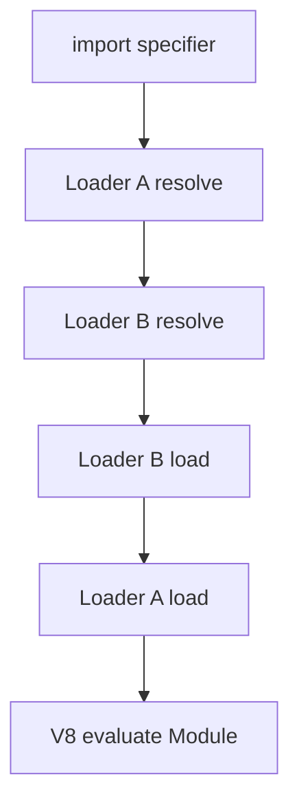
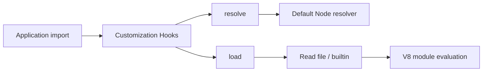
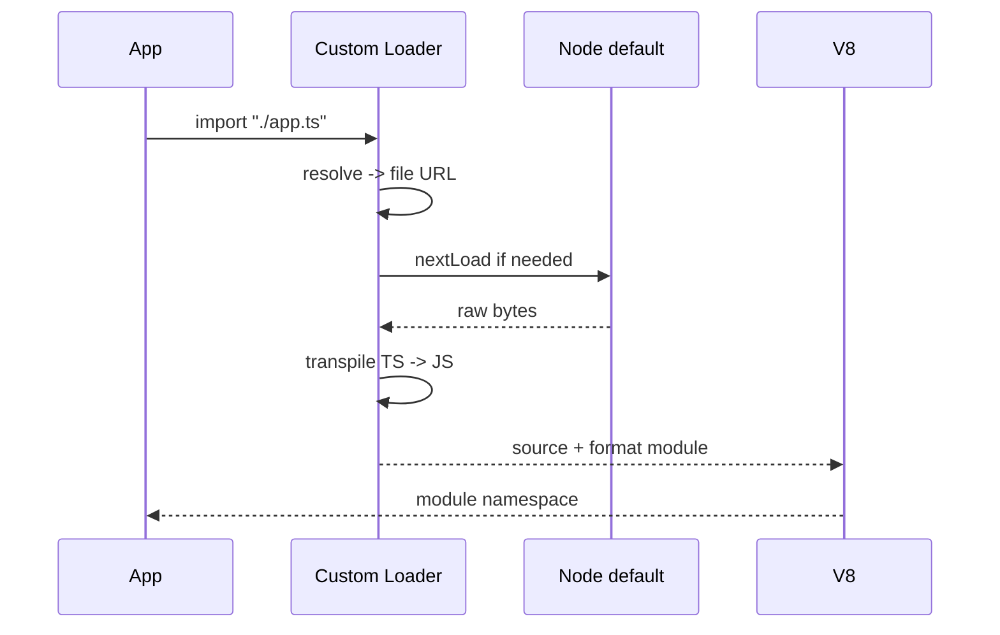

# Custom Loaders and Module Hooks

## Overview

Node's **module customization hooks** let programs intercept ESM resolution and loading: translate TypeScript on the fly, inject instrumentation, rewrite specifiers, or enforce policy before code reaches V8. Loaders register via `--import` / `--loader` (Node version-dependent) and export hook functions (`resolve`, `load`, and in newer APIs `initialize`). This is **host execution machinery**—distinct from bundler transforms or portable package `exports` maps.

Custom loaders power test runners, observability agents, and internal monorepo tooling, but they add startup complexity, version fragility, and debugging cost.

## Learning Objectives

- Name the ESM hook pipeline: `resolve` → `load` → evaluation
- Register a loader with modern Node flags (`--import`, `register()`)
- Implement resolve aliases and source transforms safely
- Understand loader isolation, worker threads, and `import.meta.resolve`
- Avoid breaking source maps, integrity, and production observability

## Prerequisites

- [[06-NodeJS/03-Modules-and-Loading/CJS and ESM Execution in Node|CJS and ESM Execution in Node]]
- [[06-NodeJS/03-Modules-and-Loading/node_modules Resolution in Practice|node_modules Resolution in Practice]]

## Difficulty

`expert`

## Estimated Time

- Reading: 2 hours
- Exercises: 4 hours
- Mini project: 6 hours

## History

Early Node had no official extension story beyond CJS `require.extensions` (deprecated). Experimental ESM loaders arrived ~Node 8–12; the API evolved through `--experimental-loader`, `module.register`, and consolidation with **customization hooks** in Node 20+. Test frameworks (tsx, jiti, vitest) and APM vendors rely on loaders or preloads to hook module graph construction before user code runs.

## Problem It Solves

- **On-the-fly compilation**: run TypeScript/JSX without a separate build step in dev
- **Cross-cutting instrumentation**: inject tracing, policy, or mocking at import time
- **Monorepo path aliasing**: map `#internal/*` or package names to workspace sources
- **Security policy**: block or rewrite forbidden specifiers before evaluation

## Internal Implementation

### Hook chain

For each `import`, Node walks registered loaders (order matters). Each loader may:

- **`resolve(specifier, context, nextResolve)`** — return `{ url, shortCircuit?, format? }` or delegate via `nextResolve`
- **`load(url, context, nextLoad)`** — return `{ source, format, shortCircuit? }` or delegate via `nextLoad`



**Short-circuiting** stops the chain—use only when the loader fully owns resolution/loading.

### Registration surfaces

| Mechanism | When it runs | Typical use |
| --- | --- | --- |
| `--import ./setup.mjs` | Before application entry | Preload instrumentation |
| `module.register('./loader.mjs')` | Programmatic registration | Libraries, test runners |
| `--experimental-loader` (legacy) | Loader thread | Being phased toward register API |

Loaders run in a **dedicated thread** in some configurations—keep hooks minimal and avoid heavy sync I/O.

### `import.meta.resolve`

Within ESM, `import.meta.resolve(specifier)` applies the same resolver as static imports, returning a URL string—useful for building paths without duplicating resolution logic.

## Mermaid Diagrams

### Structure



### Sequence / Lifecycle



## Examples

### Minimal Example — path alias loader

```typescript
// alias-loader.mjs
export async function resolve(specifier, context, nextResolve) {
  if (specifier.startsWith("@app/")) {
    const path = specifier.replace("@app/", "./src/");
    return nextResolve(path, context);
  }
  return nextResolve(specifier, context);
}
```

```bash
node --import ./alias-loader.mjs ./src/main.mjs
```

### Production-Shaped Example — coverage instrumentation loader

```typescript
// coverage-loader.mjs
import fs from "node:fs/promises";
import path from "node:path";

const INSTRUMENT = new Set(["/src/services/"]);

export async function load(url, context, nextLoad) {
  const result = await nextLoad(url, context);
  if (result.format !== "module" && result.format !== "commonjs") {
    return result;
  }

  const filePath = new URL(url).pathname;
  if (![...INSTRUMENT].some((p) => filePath.includes(p))) {
    return result;
  }

  let source = typeof result.source === "string"
    ? result.source
    : Buffer.from(result.source).toString("utf8");

  // Inject counter — real tools use AST (c8, istanbul)
  source = `globalThis.__cov__ = globalThis.__cov__ ?? {};\n${source}`;

  return { ...result, source };
}
```

Constraints: preserve `sourceURL` / source maps for stack traces; avoid transforming `node:` builtins; test on Node LTS you deploy.

## Trade-offs

| Dimension | Upside | Downside | When it matters |
| --- | --- | --- | --- |
| Dev ergonomics | No separate build for TS | Slower cold start, harder stacks | Local dev, tests |
| Instrumentation | Transparent cross-cutting | Ordering bugs, loader conflicts | APM, security policy |
| Resolution control | Monorepo aliases without bundler | Diverges from production resolution | CI must mirror prod |
| API stability | Official extension point | Breaking changes across Node majors | Pin Node version |

### When to Use

- Test runners and dev-only TypeScript execution
- Organization-wide import policy or telemetry injection
- Prototyping resolution rules before baking into `exports`

### When Not to Use

- Production hot paths where precompiled artifacts exist
- When a bundler or `tsc` already defines the canonical module graph
- Security boundaries that belong in OS containers or seccomp—not loader hacks alone

## Exercises

1. Write a loader that rejects any import from `node:child_process` in test environment.
2. Chain two loaders: one for alias resolve, one for `.txt` → string export load.
3. Compare startup time with and without loader on a 500-module app import graph.
4. Use `import.meta.resolve` to locate a config file relative to the importing module.

## Mini Project

Build a **dev loader** that resolves `@workspace/*` to monorepo packages and transpiles TypeScript with esbuild in `load`. Document Node version and flags required.

## Portfolio Project

Integrate a loader-based tracer into [[06-NodeJS/projects/Node Runtime Toolkit/README|Node Runtime Toolkit]] that logs module evaluation order and timing.

## Interview Questions

1. Difference between `--import` preload and a customization hook loader?
2. What happens if two loaders both short-circuit `resolve` with different URLs?
3. Why are loaders risky for production security enforcement?
4. How does loader-based TS differ from `tsc` + compiled output for stack traces?
5. Explain `nextResolve` / `nextLoad` delegation.

### Stretch / Staff-Level

1. Design loader architecture for a polyglot monorepo (TS, JSON schema imports, WASM) without breaking source maps.
2. Compare Node loaders vs V8 snapshots vs prebundled ESM for serverless cold start.

## Common Mistakes

- Transforming builtins or breaking `node:` URL assumptions
- Heavy synchronous work in hooks blocking module thread
- Assuming loader behavior matches webpack/tsconfig paths in production
- Omitting source map support after transpile

## Best Practices

- Pin Node version; integration-test loader on upgrade
- Delegate to `nextResolve`/`nextLoad` when not fully handling a case
- Keep transforms idempotent; detect already-transformed files
- Separate dev loaders from production builds
- Log resolved URLs at debug level for diagnosis

## Summary

Custom loaders intercept ESM resolution and loading before evaluation, enabling transpilation, aliasing, and instrumentation at the Node host layer. They trade startup cost and API churn for flexibility in development and testing. Production systems should treat loaders as part of the runtime contract—version-pinned, tested, and not a substitute for compile-time module graphs or portable package exports.

## Further Reading

- [Node.js ECMAScript Module Customization Hooks](https://nodejs.org/api/module.html#customization-hooks)
- [Node.js `module.register`](https://nodejs.org/api/module.html#moduleregisterspecifier-parenturl-options)

## Related Notes

- [[06-NodeJS/03-Modules-and-Loading/CJS and ESM Execution in Node|CJS and ESM Execution in Node]]
- [[06-NodeJS/03-Modules-and-Loading/node_modules Resolution in Practice|node_modules Resolution in Practice]]
- [[02-JavaScript/06-Modules-and-Tooling/Module Resolution and Package Exports|Module Resolution and Package Exports]]
- [[06-NodeJS/08-Diagnostics-and-Performance/Diagnostics Channel and Async Context Tracking|Diagnostics Channel and Async Context Tracking]]
- [[06-NodeJS/README|Node.js]]

## Progress Checklist

- [ ] Explained from first principles
- [ ] Drew at least one Mermaid diagram
- [ ] Implemented a minimal version
- [ ] Documented trade-offs and non-goals
- [ ] Completed exercises
- [ ] Practiced interview questions aloud
- [ ] Linked prerequisites and dependents
