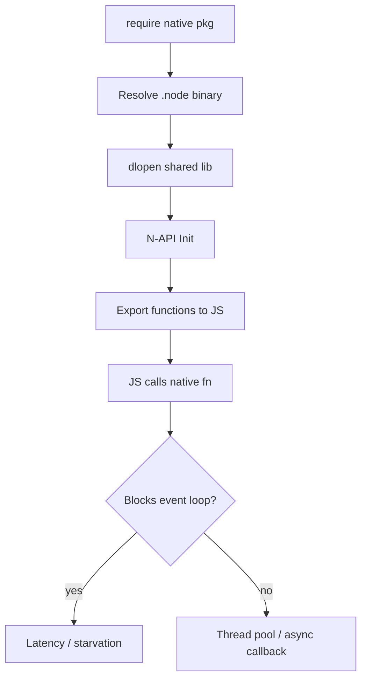
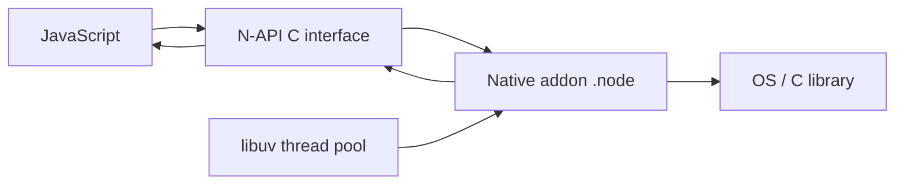
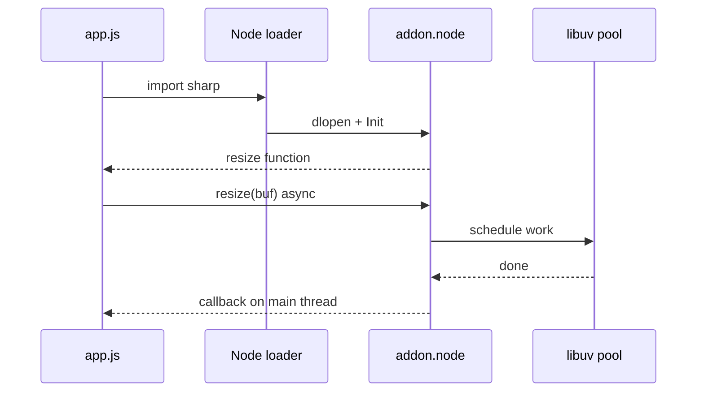

# Native Addons and N-API Concepts

## Overview

**Native addons** are shared libraries (`.node` files) loaded by Node to call C/C++/Rust code for performance, OS APIs, or existing libraries. **N-API** (Node-API) is a **ABI-stable C interface** between native code and V8/Node versions; **node-addon-api** wraps it in C++. Addons run on the main thread unless they offload to libuv's thread pool or use async N-API patterns—blocking the event loop remains a primary failure mode.

This note covers loading, threading, and operational constraints—not authoring full C++ tutorials.

## Learning Objectives

- Explain how Node loads `.node` binaries via `process.dlopen`
- Describe N-API ABI stability vs legacy NAN/V8-direct addons
- Recognize thread-safe async work patterns (`napi_async_work`, `ThreadSafeFunction`)
- Diagnose rebuild requirements across Node versions and platforms
- Assess security and supply-chain risk of prebuilt native binaries

## Prerequisites

- [[06-NodeJS/03-Modules-and-Loading/CJS and ESM Execution in Node|CJS and ESM Execution in Node]]
- [[06-NodeJS/02-Event-Loop-and-libuv/Thread Pool and Blocking Work|Thread Pool and Blocking Work]]

## Difficulty

`expert`

## Estimated Time

- Reading: 2.5 hours
- Exercises: 3 hours
- Mini project: 6 hours

## History

Early addons linked directly against V8 internals—every Node major broke them. NAN abstracted some churn. N-API (Node 8+, promoted stable) decouples addon ABI from V8 versions so one binary can run across Node releases (within N-API version support). `node-gyp` / `cmake-js` / `prebuildify` automate builds; npm packages like `bcrypt`, `sharp`, and `sqlite3` ship prebuilds.

## Problem It Solves

- **Performance**: crypto, compression, image processing, DB drivers
- **OS integration**: filesystem watchers, serial ports, GPU
- **Reuse**: wrap mature C/C++ libraries instead of reimplementing in JS
- **Memory layout**: operate on buffers without copying through JS loops

## Internal Implementation

### Load path

1. JS `require("addon.node")` or import triggers CJS/ESM load
2. Node locates `.node` file (package `"main"` or explicit path)
3. `process.dlopen` loads shared library into process
4. Addon `Init` registers exports via N-API (`napi_define_properties`)
5. JS receives bound functions/objects



### Threading model

- **Sync N-API calls on main thread** block JavaScript execution
- **`napi_create_async_work`** runs compute on libuv pool, callback on main thread
- **`napi_threadsafe_function`** queues JS callbacks from worker threads safely
- **Worker threads** can load some addons separately—check addon docs

Memory: use `Buffer` / `TypedArray` with explicit lifetime rules; avoid use-after-free when passing pointers to async work.

## Mermaid Diagrams

### Structure



### Sequence / Lifecycle



## Examples

### Minimal Example — detect native load failure

```typescript
// load-native.mjs
try {
  const bcrypt = await import("bcrypt");
  console.log("native ok", typeof bcrypt.hash);
} catch (err) {
  console.error("native load failed — rebuild or wrong platform", err);
  process.exit(1);
}
```

Common errors: `MODULE_NOT_FOUND` for missing prebuild, `ERR_DLOPEN_FAILED` for glibc mismatch.

### Production-Shaped Example — async pattern expectation

```typescript
// image-service.mts
import sharp from "sharp";
import { performance } from "node:perf_hooks";

export async function thumbnail(input: Buffer): Promise<Buffer> {
  const t0 = performance.now();
  // sharp uses libuv thread pool internally — does not block loop for CPU work
  const out = await sharp(input).resize(128).jpeg().toBuffer();
  const ms = performance.now() - t0;
  if (ms > 500) {
    // observability — see [[06-NodeJS/08-Diagnostics-and-Performance/perf_hooks and Event Loop Delay|perf_hooks]]
    console.warn(JSON.stringify({ event: "thumbnail_slow", ms }));
  }
  return out;
}
```

Operational checklist: pin Node LTS; use packages with prebuilds for your CI targets; fall back to `npm rebuild` in Docker multi-stage builds; never `npm install` on Alpine without musl prebuilds.

## Trade-offs

| Dimension | Upside | Downside | When it matters |
| --- | --- | --- | --- |
| Native speed | Orders of magnitude for hot paths | Build/deploy complexity | Media, crypto, DB |
| N-API stability | Fewer rebuilds per Node upgrade | Not all addons migrated | Long-lived services |
| Prebuilds | Fast install | Supply-chain trust, platform matrix | CI/CD |
| Pure JS fallback | Portable | Slow or missing features | Edge deployments |

### When to Use

- Proven native library with maintained prebuilds for your platforms
- CPU-bound work that cannot meet SLA in pure JS
- Interop with existing C/C++ investment

### When Not to Use

- Simple string manipulation or JSON (JS is fast enough)
- Serverless with unsupported custom binaries without bundling strategy
- When WASM meets portability needs with less deploy pain

## Exercises

1. Install a native module on Windows and Linux CI; compare prebuild vs compile-from-source times.
2. Use `perf_hooks` to show event loop delay spike during **sync** native call vs async wrapper.
3. Read `binding.gyp` or `Cargo.toml` of a native npm package; list linked libraries.
4. Trace `npm ls` for packages pulling multiple versions of same native addon.

## Mini Project

Dockerfile matrix: build app with native dependency on `node:20-bookworm` and `node:20-alpine`; document which fails and why (glibc vs musl).

## Portfolio Project

Add native module health check to [[06-NodeJS/projects/Node Runtime Toolkit/README|Node Runtime Toolkit]] startup (load, micro-benchmark, version pin).

## Interview Questions

1. What problem does N-API solve compared to V8-direct addons?
2. Why can `npm install` succeed but runtime `dlopen` fail?
3. How should long-running native compute avoid blocking the event loop?
4. Security implications of prebuilt `.node` binaries from npm?
5. When prefer WASM over N-API?

### Stretch / Staff-Level

1. Design deployment pipeline for native addons across arm64/x64 and glibc/musl.
2. Explain how worker_threads interact with native addons that use thread-local state.

## Common Mistakes

- Deploying devDependency-built binaries to prod with different Node arch
- Calling sync native APIs on every HTTP request
- Ignoring `engines` field vs actual Node in containers
- Trusting prebuilds without checksum / provenance verification

## Best Practices

- Pin Node LTS; test `npm ci` on target image
- Prefer maintained packages with broad prebuild matrix
- Monitor event loop delay when introducing native deps
- Document rebuild steps for security patches
- Use `--build-from-source` flag consciously in CI audits

## Summary

Native addons extend Node via `.node` shared libraries, ideally through N-API for ABI stability. They enable performance and OS access but introduce build matrices, blocking risks, and supply-chain trust decisions. Production ownership means async boundaries, platform-tested installs, and treating native modules as part of deploy compatibility—not just npm metadata.

## Further Reading

- [Node.js N-API documentation](https://nodejs.org/api/n-api.html)
- [node-addon-api C++ wrapper](https://github.com/nodejs/node-addon-api)
- [node-gyp](https://github.com/nodejs/node-gyp)

## Related Notes

- [[06-NodeJS/02-Event-Loop-and-libuv/Thread Pool and Blocking Work|Thread Pool and Blocking Work]]
- [[06-NodeJS/04-Buffers-Streams-and-IO/Buffer and Typed Array Boundaries|Buffer and Typed Array Boundaries]]
- [[06-NodeJS/09-Security-and-Supply-Chain/npm Lockfiles Integrity and Audit|npm Lockfiles Integrity and Audit]]
- [[06-NodeJS/06-Concurrency-and-Scaling/worker_threads Model|worker_threads Model]]
- [[06-NodeJS/README|Node.js]]

## Progress Checklist

- [ ] Explained from first principles
- [ ] Drew at least one Mermaid diagram
- [ ] Implemented a minimal version
- [ ] Documented trade-offs and non-goals
- [ ] Completed exercises
- [ ] Practiced interview questions aloud
- [ ] Linked prerequisites and dependents
