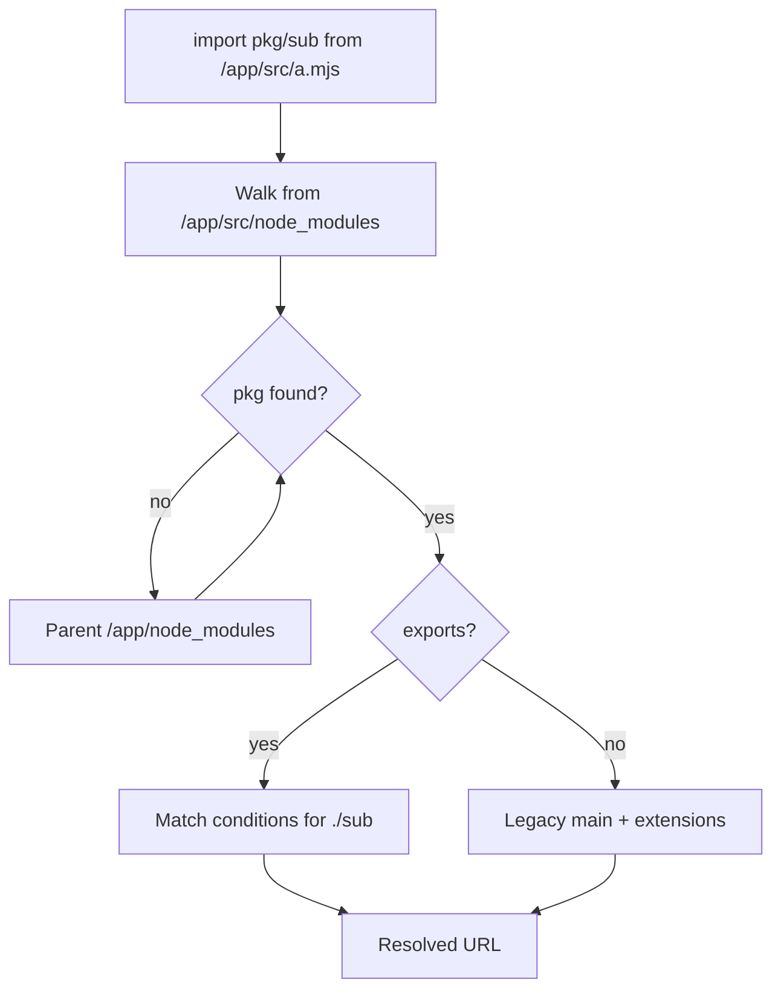
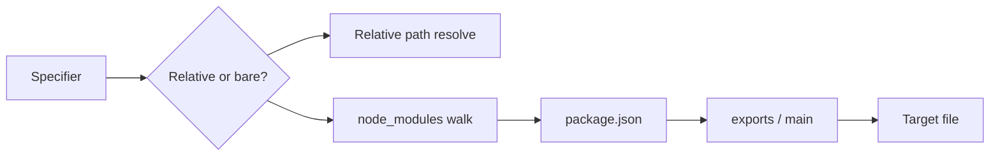
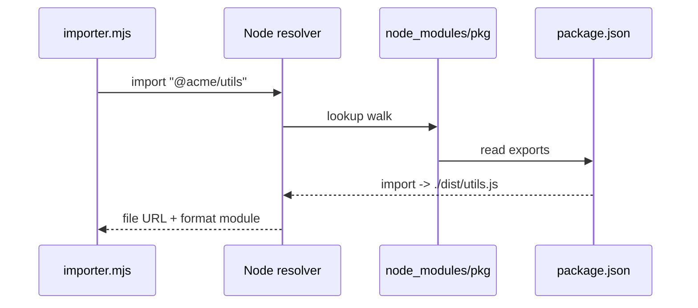

# node_modules Resolution in Practice

## Overview

When Node encounters a **bare specifier** (`import "lodash"`, `require("pkg/sub")`), it runs a deterministic **resolution algorithm**: walk parent directories for `node_modules`, read `package.json`, apply `"exports"` or legacy `"main"` probing, honor `"imports"` for internal `#` aliases, and respect `"type"` for extension interpretation. This note is **Node's resolver in production**—debugging `ERR_MODULE_NOT_FOUND`, hoisting surprises, and monorepo symlinks—not the portable contract theory alone.

## Learning Objectives

- Trace the node_modules upward walk for nested packages
- Resolve subpaths via `exports` with condition matching (`import`, `require`, `node`)
- Use `"imports"` for package-internal aliases
- Diagnose hoisting, deduplication, and symlinked workspace packages
- Configure `NODE_PATH` (legacy), `--preserve-symlinks`, and `package.json` `"imports"`

## Prerequisites

- [[02-JavaScript/06-Modules-and-Tooling/Module Resolution and Package Exports|Module Resolution and Package Exports]]
- [[06-NodeJS/03-Modules-and-Loading/CJS and ESM Execution in Node|CJS and ESM Execution in Node]]

## Difficulty

`advanced`

## Estimated Time

- Reading: 2 hours
- Exercises: 3 hours
- Mini project: 4 hours

## History

npm popularized flat/nested `node_modules` trees (v2 vs v3 hoisting). Node's resolver predates `exports`; extension probing (`index.js`, `.json`, `.node`) remains fallback when `exports` absent. Yarn PnP and pnpm use different layouts but emulate Node resolution at install time. Node 20+ tightened `exports` enforcement and ESM directory imports.

## Problem It Solves

- **Deterministic lookup**: same specifier → same file across machines when lockfile honored
- **Encapsulation enforcement**: block deep imports not in `exports`
- **Monorepo development**: link workspace packages without duplicate resolution logic
- **Environment-specific files**: `node` condition in `exports` for Node-only builds

## Internal Implementation

### Bare specifier resolution steps

1. Parse specifier into **package name** + **subpath** (`@scope/pkg` + `./feature`)
2. Starting at importer directory, check `./node_modules/<name>/package.json`
3. Walk to parent until filesystem root
4. For scoped packages, check `@scope/node_modules/<name>` in same walk
5. Apply `exports` map for subpath or legacy main/index resolution
6. Return absolute path or URL (`file://`)



### `"imports"` (internal)

Only resolvable from inside the owning package:

```json
{
  "imports": {
    "#config": "./config/default.json",
    "#internal/*": "./src/internal/*"
  }
}
```

```typescript
import cfg from "#config" with { type: "json" };
```

### Symlinks and monorepos

`npm link` / workspace symlinks: realpath may differ from logical path. `--preserve-symlinks` (and `preserveSymlinks` in `module.register`) affects whether resolution follows symlinks for nested `node_modules` lookup—critical for duplicate dependency debugging.

## Mermaid Diagrams

### Structure



### Sequence / Lifecycle



## Examples

### Minimal Example — trace resolution manually

```typescript
// scripts/resolve-check.mjs
import { register } from "node:module";
import { pathToFileURL } from "node:url";
import path from "node:path";

const base = pathToFileURL(path.resolve("./src/app.mjs")).href;

async function resolve(spec: string) {
  const url = await import.meta.resolve(spec, base);
  console.log(spec, "->", url);
}

await resolve("lodash");
await resolve("./config.js");
```

### Production-Shaped Example — monorepo hoisting debug

```typescript
// tools/why-pkg.mjs — list physical paths for duplicate risk
import fs from "node:fs";
import path from "node:path";
import { createRequire } from "node:module";

const require = createRequire(import.meta.url);

function findAll(name: string, start: string): string[] {
  const hits: string[] = [];
  let dir = start;
  while (true) {
    const candidate = path.join(dir, "node_modules", name, "package.json");
    if (fs.existsSync(candidate)) hits.push(path.dirname(candidate));
    const parent = path.dirname(dir);
    if (parent === dir) break;
    dir = parent;
  }
  return hits;
}

const hits = findAll("react", process.cwd());
if (hits.length > 1) {
  console.warn("Multiple react copies:", hits);
  for (const h of hits) {
    console.log(require(path.join(h, "package.json")).version);
  }
}
```

Use with lockfile audits; prefer npm overrides / pnpm `packageExtensions` to dedupe.

## Trade-offs

| Dimension | Upside | Downside | When it matters |
| --- | --- | --- | --- |
| `exports` | Encapsulation, conditions | Breaks deep imports | Library authors |
| Hoisting | Dedupe, disk savings | Phantom dependency bugs | Large apps |
| Symlinks | Fast monorepo dev | Duplicate resolution paths | Workspaces |
| Legacy probing | Old packages work | Slow, leaky | Maintenance mode |

### When to Use

- Always define `exports` for published packages
- Use `imports` for internal aliases instead of deep relative paths
- Run duplicate detection in CI for critical singleton packages

### When Not to Use

- `NODE_PATH` for new projects (global mutable search path)
- Deep imports into `node_modules/pkg/dist/internal` (unsupported)
- Assuming bundler resolution equals Node native resolution without tests

## Exercises

1. Trigger `ERR_PACKAGE_PATH_NOT_EXPORTED` and fix with official subpath export.
2. Create nested `node_modules` layout showing hoisted vs nested duplicate.
3. Resolve `#imports` alias from package root vs consumer import (expect failure).
4. Compare resolution with `--preserve-symlinks` on linked workspace package.

## Mini Project

Build a **resolution CLI** that prints walk steps, matched export condition, and final URL for any specifier from a given importer file.

## Portfolio Project

[[06-NodeJS/projects/Module Resolution and Exports Clinic/README|Module Resolution and Exports Clinic]] — add visualization of node_modules walks.

## Interview Questions

1. Describe node_modules upward walk from `/app/packages/api/src/index.mjs`.
2. What error means a subpath is not exported?
3. Difference between `"main"` and `"exports"."."`?
4. Why can hoisting cause "Module not found" despite package in lockfile?
5. How do pnpm isolated node_modules change debugging?

### Stretch / Staff-Level

1. Design resolution strategy for native addons with optional peer dependencies.
2. Explain `import.meta.resolve` vs `require.resolve` differences in ESM/CJS graphs.

## Common Mistakes

- Importing paths not listed in `exports`
- Wrong `"type"` causing `.js` parse errors after resolution succeeds
- Testing only with bundler dev server, not `node` native run
- Ignoring duplicate physical copies when debugging singleton bugs

## Best Practices

- Lock dependencies; use `npm ls <pkg>` / `pnpm why`
- Integration-test `node dist/index.js` post-build
- Expose explicit subpaths; never rely on directory structure stability
- Document peer dependency resolution for native modules
- Use `import.meta.resolve` in ESM for path discovery

## Summary

Node resolves bare specifiers by walking `node_modules`, reading package metadata, and applying `exports` conditions before falling back to legacy probing. Production failures are usually wrong subpaths, hoisting duplicates, or symlink layout—not mysterious runtime magic. Owning resolution means tracing the walk, aligning package.json contracts, and verifying native Node loads match your bundler assumptions.

## Further Reading

- [Node.js package resolver](https://nodejs.org/api/esm.html#resolver-algorithm-specification)
- [Node.js `packages` documentation](https://nodejs.org/api/packages.html)

## Related Notes

- [[02-JavaScript/06-Modules-and-Tooling/Module Resolution and Package Exports|Module Resolution and Package Exports]]
- [[06-NodeJS/03-Modules-and-Loading/package.json type exports and Dual Package Hazard|package.json type exports and Dual Package Hazard]]
- [[06-NodeJS/03-Modules-and-Loading/CJS and ESM Execution in Node|CJS and ESM Execution in Node]]
- [[06-NodeJS/09-Security-and-Supply-Chain/Dependency Confusion Typosquatting and Install Scripts|Dependency Confusion Typosquatting and Install Scripts]]
- [[06-NodeJS/README|Node.js]]

## Progress Checklist

- [ ] Explained from first principles
- [ ] Drew at least one Mermaid diagram
- [ ] Implemented a minimal version
- [ ] Documented trade-offs and non-goals
- [ ] Completed exercises
- [ ] Practiced interview questions aloud
- [ ] Linked prerequisites and dependents
