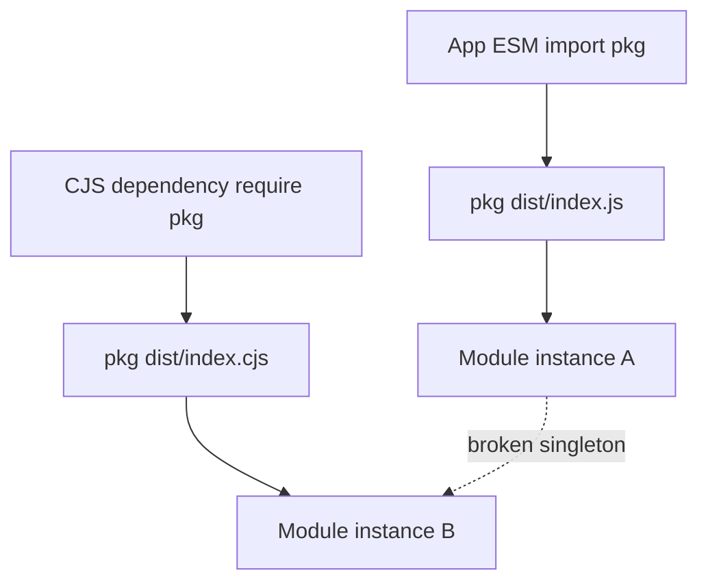
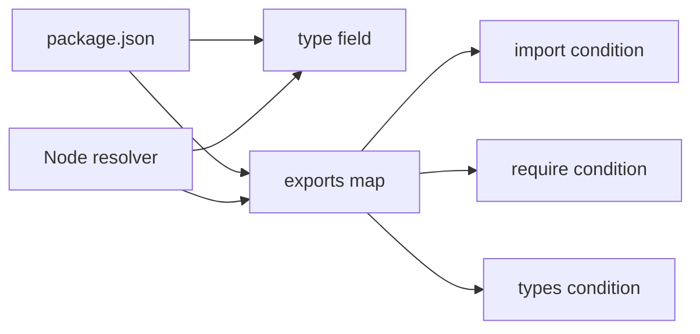
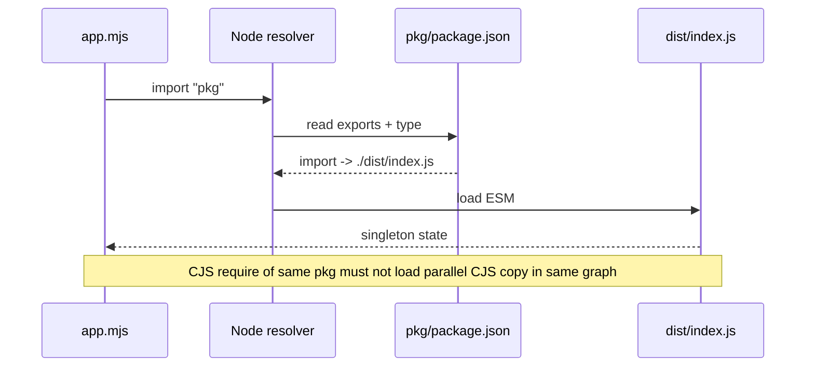

# package.json type exports and Dual Package Hazard

## Overview

The `"type"` field tells Node how to interpret `.js` files: `"module"` (ESM) or `"commonjs"` (default). The `"exports"` field defines **encapsulated entry points** with **conditional targets** (`import`, `require`, `node`, `types`). When a library ships **both** ESM and CJS builds, consumers can accidentally load **two copies** of the same package—breaking singletons, `instanceof`, and mutable state. That failure mode is the **dual package hazard**.

This note focuses on **Node runtime consequences** of `"type"` and dual publishing. Portable export map design lives in [[02-JavaScript/06-Modules-and-Tooling/Module Resolution and Package Exports|Module Resolution and Package Exports]].

## Learning Objectives

- Explain how `"type"` affects `.js`, `.mjs`, and `.cjs` in Node
- Configure `exports` so `import` and `require` resolve without duplicate instances
- Detect dual-package bugs: broken `instanceof`, duplicate DB pools, mis-sized caches
- Choose single-format, dual-build, or `"exports"`-only strategies for libraries
- Align TypeScript `moduleResolution` with Node's resolver

## Prerequisites

- [[02-JavaScript/06-Modules-and-Tooling/Module Resolution and Package Exports|Module Resolution and Package Exports]]
- [[06-NodeJS/03-Modules-and-Loading/CJS and ESM Execution in Node|CJS and ESM Execution in Node]]

## Difficulty

`advanced`

## Estimated Time

- Reading: 2 hours
- Exercises: 3 hours
- Mini project: 5 hours

## History

Before `"exports"`, `"main"` pointed to one file; bundlers and Node probed paths. ESM adoption forced libraries to publish **both** `dist/index.js` (ESM) and `dist/index.cjs` (CJS). Without careful `exports`, Node 12+ could load both graphs in one process—Jordan Harband and others documented the **dual package hazard**. Modern guidance favors explicit conditions, `import`/`require` separation, and sometimes **ESM-only** libraries with async `import()` for CJS apps.

## Problem It Solves

- **Format selection at package boundary**: one package name, correct file per consumer syntax
- **Encapsulation**: hide `dist/internal/*` from deep imports
- **Singleton safety**: ensure one module instance per process when shared state matters
- **Type alignment**: route `types` condition to matching implementation

## Internal Implementation

### `"type"` semantics in Node

| Extension | `"type": "commonjs"` | `"type": "module"` |
| --- | --- | --- |
| `.js` | CJS | ESM |
| `.mjs` | ESM | ESM |
| `.cjs` | CJS | CJS |
| `.json` | JSON module (assert/type) | JSON module |

Missing `"type"` defaults to CJS for `.js`.

### Dual package hazard mechanism



Two instances → two connection pools, two event emitters, `instanceof` fails across copies.

### Mitigation patterns

1. **ESM-only** — CJS consumers use dynamic `import()` (async)
2. **CJS-only** — ESM consumers use `createRequire` (limited)
3. **Dual with shared state externalized** — state in native addon or global registry (fragile)
4. **Proper `exports`** — ensure app and deps hit same condition when possible; document peer dependency on module format
5. **`"type": "module"` package** with `"exports": { ".": { "import": "...", "require": "..." } }` pointing to builds that **do not cross-import** duplicate internals

## Mermaid Diagrams

### Structure



### Sequence / Lifecycle



## Examples

### Minimal Example — safe dual export map

```json
{
  "name": "@acme/db-client",
  "type": "module",
  "exports": {
    ".": {
      "types": "./dist/index.d.ts",
      "import": "./dist/index.js",
      "require": "./dist/index.cjs",
      "default": "./dist/index.js"
    },
    "./package.json": "./package.json"
  }
}
```

Build pipeline must produce **both** artifacts from one source; never re-bundle nested copy of self.

### Production-Shaped Example — detecting duplicate instance

```typescript
// detect-dual.mjs
import pkg from "@acme/db-client";
import { createRequire } from "node:module";

const require = createRequire(import.meta.url);
const pkgCjs = require("@acme/db-client");

if (pkg.getPoolId() !== pkgCjs.getPoolId()) {
  throw new Error("Dual package hazard: two instances loaded");
}
```

Run in CI when library claims dual-format support. For application authors: prefer **one syntax** throughout dependency tree; use bundler or `overrides` to dedupe.

```typescript
// pool.mjs — library internal singleton (ESM build)
let pool: ConnectionPool | undefined;

export function getPool(): ConnectionPool {
  if (!pool) pool = new ConnectionPool();
  return pool;
}

export function getPoolId(): string {
  return getPool().id;
}
```

If CJS build duplicates this file separately, IDs diverge—tests must catch it.

## Trade-offs

| Dimension | Upside | Downside | When it matters |
| --- | --- | --- | --- |
| Dual publish | Max compatibility | Hazard, 2× build/test | Public libraries |
| ESM-only | Single instance, simpler | Breaks sync CJS require | New libraries |
| `"type": "module"` | Clear default | All `.js` must be ESM | Greenfield packages |
| CJS-only | Legacy interop | No top-level await in pkg | Internal tools |

### When to Use

- Dual publish when enterprise consumers still on CJS **and** you ship CI guard against duplicate load
- `"type": "module"` for ESM-first packages with explicit `.cjs` for any CJS shim
- Conditional `exports` for every public entry including subpaths

### When Not to Use

- Dual publish for stateful singletons (DB, cache, plugin registry) without hard guarantees
- `"main"` without `"exports"` for new public packages (leaks internals)
- Mixing `"module"` field (bundler era) with Node `exports` without documenting precedence

## Exercises

1. Create a package that increments a global counter; load via `import` and `require` from one process; observe count.
2. Fix the hazard using ESM-only + document dynamic import for CJS apps.
3. Configure TypeScript `moduleResolution: "NodeNext"` and verify `types` condition resolves.
4. List which dependencies in a sample app pull both builds of `lodash`-style dual packages.

## Mini Project

Publish (locally via `npm pack`) a dual-format toy package with `exports`, vitest matrix for `import`/`require`, and CI script that fails on dual instance detection.

## Portfolio Project

Extend [[06-NodeJS/projects/Module Resolution and Exports Clinic/README|Module Resolution and Exports Clinic]] with dual-package hazard scanner for lockfile graphs.

## Interview Questions

1. What is the dual package hazard and name one production symptom.
2. How does `"type": "module"` change resolution of `./lib/util.js`?
3. Why must `types` precede `default` in `exports`?
4. When is ESM-only the correct product decision for a library?
5. How do bundlers differ from Node in applying `exports`?

### Stretch / Staff-Level

1. Design export maps for a plugin system where plugins may be ESM or CJS.
2. Argue for/against shipping `"import"` and `"require"` pointing to the same physical file.

## Common Mistakes

- Pointing `import` and `require` at builds that each embed duplicate helpers
- Omitting `"./package.json"` export breaking tooling
- Using `"main"` that bypasses `exports` encapsulation on older tools
- Assuming bundler deduplication fixes Node native duplicate loads at runtime

## Best Practices

- Prefer single format when ecosystem allows
- Test both entry points; detect duplicate singletons in CI
- Use `NodeNext` / `Node16` TS settings aligned with Node resolver
- Document supported consumption syntax in README
- Avoid deep imports; expose official subpaths in `exports`

## Summary

`"type"` and `"exports"` control how Node interprets and exposes package entry points. Dual publishing serves both ESM and CJS consumers but risks loading two module instances in one process—the dual package hazard—breaking shared state and type checks. Node runtime ownership means validating not just export maps on paper but which physical files execute in your dependency graph.

## Further Reading

- [Node.js package `"type"` field](https://nodejs.org/api/packages.html#type)
- [Node.js `"exports"` field](https://nodejs.org/api/packages.html#exports)
- [Dual package hazard (GitHub discussion)](https://github.com/nodejs/node/issues/42042)

## Related Notes

- [[02-JavaScript/06-Modules-and-Tooling/Module Resolution and Package Exports|Module Resolution and Package Exports]]
- [[06-NodeJS/03-Modules-and-Loading/CJS and ESM Execution in Node|CJS and ESM Execution in Node]]
- [[06-NodeJS/03-Modules-and-Loading/node_modules Resolution in Practice|node_modules Resolution in Practice]]
- [[06-NodeJS/09-Security-and-Supply-Chain/Dependency Confusion Typosquatting and Install Scripts|Dependency Confusion Typosquatting and Install Scripts]]
- [[06-NodeJS/README|Node.js]]

## Progress Checklist

- [ ] Explained from first principles
- [ ] Drew at least one Mermaid diagram
- [ ] Implemented a minimal version
- [ ] Documented trade-offs and non-goals
- [ ] Completed exercises
- [ ] Practiced interview questions aloud
- [ ] Linked prerequisites and dependents
