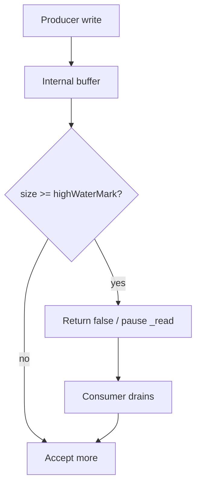
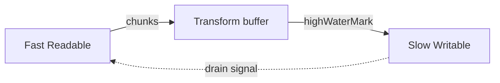
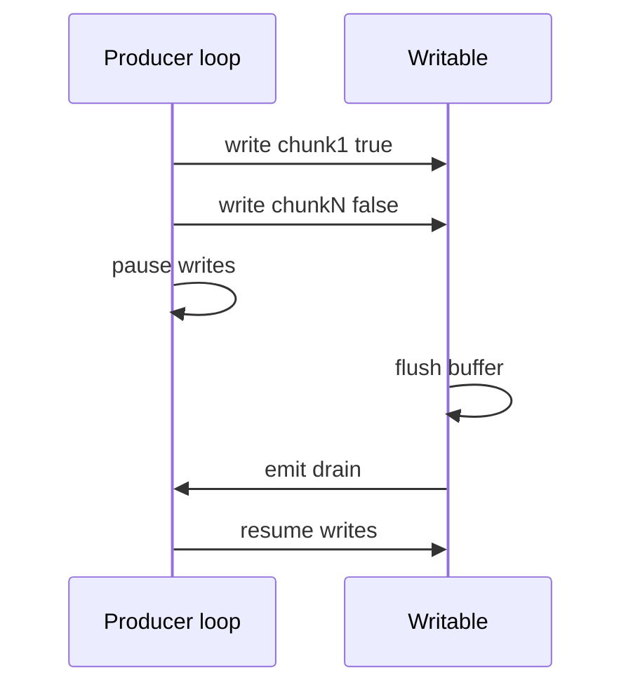

# Backpressure and HighWaterMark

## Overview

**Backpressure** is flow control: when a **consumer is slower than a producer**, the system must signal the producer to pause rather than buffer unbounded data. In Node streams, **`highWaterMark`** sets internal buffer thresholds (bytes or object count in object mode); **`write()` returning false** and **`drain`** events coordinate Writable backpressure; Readable pauses **`_read`** when buffered data exceeds the mark.

Ignoring backpressure causes memory spikes, GC thrashing, and OOM kills—common in log ingestion and proxy pipelines.

## Learning Objectives

- Explain push vs pull backpressure in Node streams
- Tune `highWaterMark` for latency vs throughput
- Implement manual write loops respecting `drain`
- Detect event-loop healthy vs stream buffer bloat
- Relate stream backpressure to TCP windowing and HTTP flow control

## Prerequisites

- [[06-NodeJS/04-Buffers-Streams-and-IO/Readable Writable and Duplex Streams|Readable Writable and Duplex Streams]]
- [[01-Computer-Science/05-Concurrency-Fundamentals/Backpressure and Resource Contention|Backpressure and Resource Contention]]

## Difficulty

`advanced`

## Estimated Time

- Reading: 2 hours
- Exercises: 3 hours
- Mini project: 4 hours

## History

Backpressure appears in TCP (receive window), HTTP/2 flow control, and reactive streams (`Reactive Streams` spec). Node streams adopted watermarks early but developers often used flowing mode without drain handling until production incidents. Web Streams later standardized `desiredSize`; Node bridges both models.

## Problem It Solves

- **Memory bounds** under skewed producer/consumer rates
- **Stable latency** by avoiding huge internal queues
- **Cascading pause** through transform pipelines
- **Fairness** when one slow client should not exhaust server RAM

## Internal Implementation

### Writable side

1. `write(chunk)` enqueues into internal buffer
2. If buffered amount ≥ `highWaterMark`, return `false`
3. Producer stops writing until `drain` event
4. `_write` completion drains buffer; may emit `drain`

### Readable side

When internal buffer hits `highWaterMark`, stop calling `_read` until consumer pulls via `read()` or data listener drains buffer.



### Object mode

`highWaterMark: 16` means **16 objects**, not bytes—a queue of 16 large JSON documents can still be megabytes.

## Mermaid Diagrams

### Structure



### Sequence / Lifecycle



## Examples

### Minimal Example — manual backpressure loop

```typescript
import { Writable } from "node:stream";

function writeWithBackpressure(w: Writable, chunks: Buffer[]): Promise<void> {
  return new Promise((resolve, reject) => {
    let i = 0;

    function writeNext() {
      while (i < chunks.length) {
        const ok = w.write(chunks[i++]);
        if (!ok) {
          w.once("drain", writeNext);
          return;
        }
      }
      w.end();
    }

    w.on("error", reject);
    w.on("finish", resolve);
    writeNext();
  });
}
```

### Production-Shaped Example — monitoring buffer depth

```typescript
import { PassThrough } from "node:stream";

export function createMonitoredPassThrough(highWaterMark = 64 * 1024) {
  const stream = new PassThrough({ highWaterMark });

  setInterval(() => {
    const writable = stream.writableLength; // bytes buffered
    if (writable > highWaterMark * 0.8) {
      console.warn(JSON.stringify({
        event: "stream_pressure",
        writableLength: writable,
        highWaterMark,
      }));
    }
  }, 1000).unref();

  return stream;
}
```

Pair with [[06-NodeJS/08-Diagnostics-and-Performance/perf_hooks and Event Loop Delay|perf_hooks]] and cap client upload rates at HTTP layer.

## Trade-offs

| Dimension | Upside | Downside | When it matters |
| --- | --- | --- | --- |
| Low HWM | Low latency, small RAM | More syscalls / wakeups | Real-time |
| High HWM | Throughput | Memory spikes | Batch ETL |
| Flowing mode | Simple consumption | Easy to ignore drain | Quick scripts |
| Manual loops | Explicit control | Verbose code | Critical paths |

### When to Use

- Any fast→slow pipeline (disk → network, socket → DB)
- Tunable HWM when profiling shows bottlenecks
- `pipeline()` so backpressure propagates end-to-end

### When Not to Use

- Unbounded `on('data')` without downstream drain
- Increasing HWM to "fix" slow consumer without fixing consumer
- Object mode without object size caps

## Exercises

1. Fast Readable + slow Writable: measure RSS with default vs tiny HWM.
2. Implement async iteration over Readable; compare internal buffer vs `for await` pull.
3. Observe TCP socket `pause()`/`resume()` interaction with Readable wrapping socket.
4. Chart `writableLength` during gzip pipeline under load.

## Mini Project

**Pressure dashboard**: expose Prometheus gauges for stream buffer depth in a file upload service.

## Portfolio Project

[[06-NodeJS/projects/Stream Pipeline Toolkit/README|Stream Pipeline Toolkit]] — backpressure metrics middleware.

## Interview Questions

1. What does `highWaterMark` measure in object mode?
2. How is backpressure different from TCP windowing conceptually?
3. Why does ignoring `drain` cause OOM?
4. Does `pipeline()` propagate backpressure automatically?
5. Flowing vs paused readable impact on pressure?

### Stretch / Staff-Level

1. Design multi-tenant ingestion where one tenant's slow sink must not expand global buffers.
2. Compare Node stream backpressure to Kafka consumer lag strategies.

## Common Mistakes

- Listening `data` on Readable without controlling downstream speed
- Setting enormous HWM "for performance" without measurement
- Assuming `.pipe()` applies backpressure end-to-end through broken Transform
- Confusing buffered bytes with kernel socket buffer bytes

## Best Practices

- Profile before tuning HWM
- Use `pipeline()`; monitor `writableLength`
- Cap record sizes at ingress
- Pause upstream on downstream errors immediately
- Load-test with slower consumer than producer

## Summary

Backpressure in Node streams is implemented through internal buffers bounded by `highWaterMark`, `write()` return values, and `drain`/`pause` semantics. It is the mechanism that keeps streaming I/O memory-stable when production rates diverge. Understanding byte vs object mode thresholds and monitoring buffer depth separates reliable pipelines from silent OOM failures.

## Further Reading

- [Node.js stream backpressure guide](https://nodejs.org/en/docs/guides/backpressuring-in-streams)
- [[02-JavaScript/05-Async-and-Concurrency/Concurrency Control and Backpressure|Concurrency Control and Backpressure]]

## Related Notes

- [[06-NodeJS/04-Buffers-Streams-and-IO/pipeline and Finished|pipeline and Finished]]
- [[06-NodeJS/04-Buffers-Streams-and-IO/Transform Streams and Object Mode|Transform Streams and Object Mode]]
- [[06-NodeJS/02-Event-Loop-and-libuv/Starvation Backpressure and Loop Health|Starvation Backpressure and Loop Health]]
- [[06-NodeJS/05-Networking/Keep-Alive Timeouts and Connection Limits|Keep-Alive Timeouts and Connection Limits]]
- [[06-NodeJS/README|Node.js]]

## Progress Checklist

- [ ] Explained from first principles
- [ ] Drew at least one Mermaid diagram
- [ ] Implemented a minimal version
- [ ] Documented trade-offs and non-goals
- [ ] Completed exercises
- [ ] Practiced interview questions aloud
- [ ] Linked prerequisites and dependents
