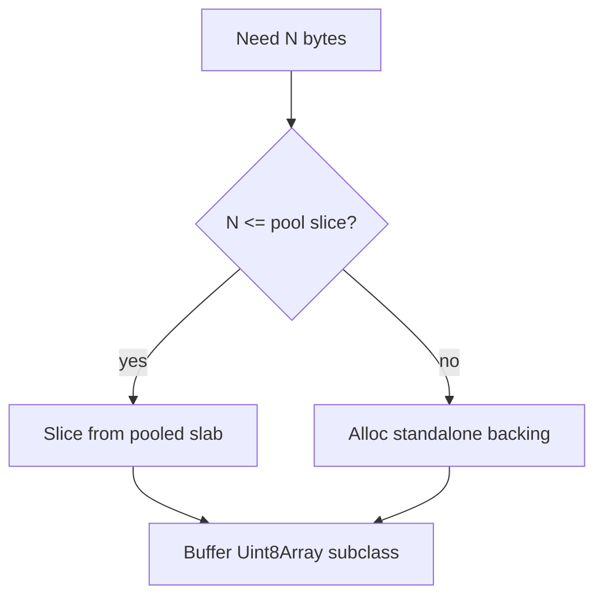
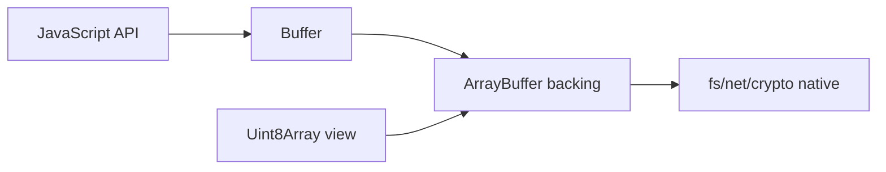
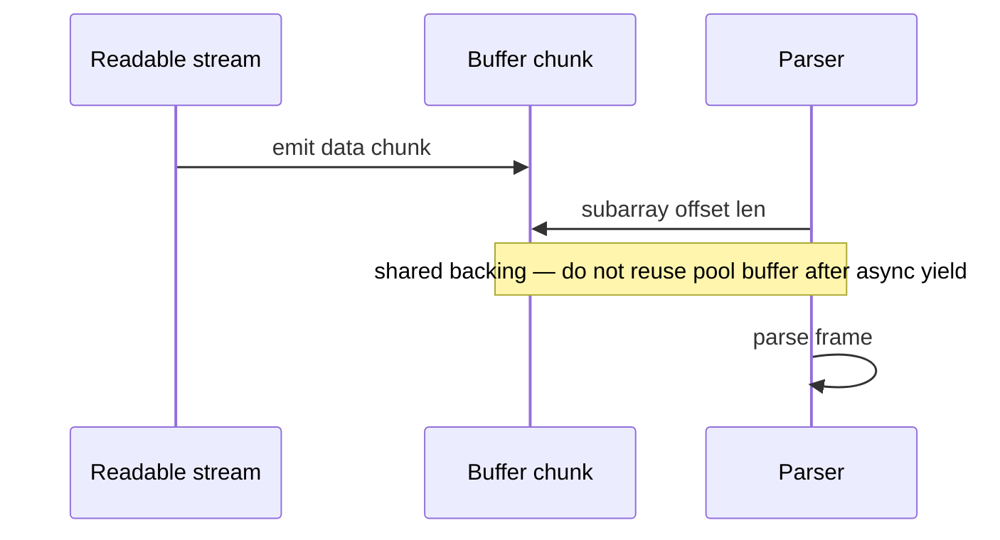

# Buffer and Typed Array Boundaries

## Overview

**`Buffer`** is Node's primary binary data type: a **Uint8Array subclass** backed by allocated memory outside the V8 heap (or wrapping pooled slabs). It bridges JavaScript and I/O—streams, `fs`, crypto, native addons—while **TypedArrays** (`Uint8Array`, `DataView`) are ECMAScript-standard views on `ArrayBuffer`. Understanding where they overlap, copy, alias, and encode is essential for correct networking and file work without subtle corruption or leaks.

## Learning Objectives

- Explain Buffer memory model: pool, `alloc`, `allocUnsafe`, `from`
- Distinguish Buffer from Uint8Array for APIs and performance
- Encode/decode safely with explicit encodings (`utf8`, `hex`, `base64url`)
- Avoid mutable shared buffer bugs across async boundaries
- Interop with Web Crypto, `fetch`, and native code via TypedArray views

## Prerequisites

- [[02-JavaScript/01-Values-and-Types/Primitive Values and Objects|Primitive Values and Objects]]
- [[06-NodeJS/02-Event-Loop-and-libuv/libuv Architecture Overview|libuv Architecture Overview]]

## Difficulty

`intermediate`

## Estimated Time

- Reading: 1.5 hours
- Exercises: 2 hours
- Mini project: 3 hours

## History

Node predated TypedArrays in widespread use; Buffer existed before uniform binary standards. Modern Node aligns Buffer with Uint8Array (subclass) for interoperability. `Buffer()` constructor was deprecated for security (`allocUnsafe` uninitialized memory leaks). WHATWG encoders (`TextEncoder`/`TextDecoder`) complement `buffer.toString()`.

## Problem It Solves

- **Binary I/O**: read/write bytes without UTF-16 string overhead
- **Protocol parsing**: length-prefixed frames, checksums, struct packing
- **Zero-copy goals**: slice buffers sharing backing memory with care
- **Cross-API compatibility**: pass same memory to crypto, streams, WASM

## Internal Implementation

### Memory allocation

- **`Buffer.alloc(n)`** — zero-filled, safe
- **`Buffer.allocUnsafe(n)`** — fast, may contain old data; overwrite before sharing
- **`Buffer.from(array|string|ArrayBuffer)`** — copy or view depending on input
- **Pool allocator**: small buffers (<4KB default) carved from reusable slabs to reduce malloc churn



### Buffer vs TypedArray

| Aspect | Buffer | Uint8Array |
| --- | --- | --- |
| Prototype | Node-specific methods (`readUIntBE`, `concat`) | Standard ECMAScript |
| `instanceof` | Both directions mostly interoperate | May fail across realms |
| JSON | `{ type: 'Buffer', data: [...] }` legacy | `[...]` or structured clone |
| Pool | Yes for small allocs | No |

`buf.subarray(start, end)` shares backing `ArrayBuffer`—mutations visible to all views.

## Mermaid Diagrams

### Structure



### Sequence / Lifecycle



## Examples

### Minimal Example — encoding and slicing

```typescript
import { Buffer } from "node:buffer";

const text = "hello 世界";
const utf8 = Buffer.from(text, "utf8");
const hex = utf8.toString("hex");
const roundtrip = Buffer.from(hex, "hex").toString("utf8");

const header = utf8.subarray(0, 5);
const body = utf8.subarray(5); // shares memory with utf8
```

### Production-Shaped Example — length-prefixed frame parser

```typescript
import { Buffer } from "node:buffer";

export class FrameParser {
  private buf = Buffer.alloc(0);

  push(chunk: Buffer): Buffer[] {
    this.buf = Buffer.concat([this.buf, chunk]);
    const frames: Buffer[] = [];

    while (this.buf.length >= 4) {
      const len = this.buf.readUInt32BE(0);
      if (this.buf.length < 4 + len) break;

      // copy frame out — safe across async handlers
      frames.push(this.buf.subarray(4, 4 + len));
      this.buf = this.buf.subarray(4 + len);
    }
    return frames;
  }
}
```

Constraints: copy if buffer may return to pool before async work completes; validate `len` max to prevent DoS; prefer `Buffer.alloc` for outbound frames.

## Trade-offs

| Dimension | Upside | Downside | When it matters |
| --- | --- | --- | --- |
| `allocUnsafe` | Speed | Data leaks | Hot paths only after overwrite |
| Shared subarray | Zero-copy | Race across async | Stream parsers |
| `Buffer.concat` | Simple | Extra copies | High throughput pipelines |
| UTF-8 strings | Ergonomics | Invalid surrogate edge cases | Text protocols |

### When to Use

- `Buffer` for Node I/O boundaries (`fs`, `net`, `crypto`)
- Explicit encodings; never assume default `utf8` for binary protocols
- Copy slices handed to long-lived async queues

### When Not to Use

- `allocUnsafe` for outward-facing network buffers without fill
- Mutating pooled buffers after passing to `setImmediate` callbacks
- Storing large binary data as hex strings (2× memory)

## Exercises

1. Demonstrate uninitialized `allocUnsafe` leak with strings from prior buffer.
2. Parse three concatenated frames from chunked stream input.
3. Convert Node Buffer to `Uint8Array` for `crypto.subtle.digest` without copy when safe.
4. Benchmark `Buffer.concat` vs pre-sized `alloc` write loop for 10k chunks.

## Mini Project

Implement a **binary protocol codec** (header + checksum + payload) with round-trip tests and max-length guards.

## Portfolio Project

[[06-NodeJS/projects/Stream Pipeline Toolkit/README|Stream Pipeline Toolkit]] — add frame parser stage using Buffer boundaries.

## Interview Questions

1. Difference between `slice`/`subarray` on Buffer regarding memory sharing?
2. Why was `new Buffer(n)` deprecated?
3. When is `Buffer` not a Uint8Array for API purposes?
4. How do encoding mistakes cause security bugs?
5. Explain pool allocator purpose.

### Stretch / Staff-Level

1. Design buffer pooling strategy for a proxy handling 100k req/s without use-after-free.
2. Compare structured clone of Buffer vs TypedArray across worker_threads.

## Common Mistakes

- Reusing stream chunk buffer after yielding to event loop
- Missing byte order (`BE` vs `LE`) in binary protocols
- Assuming `buffer.length` equals string character count for UTF-8
- JSON-serializing buffers unintentionally in logs

## Best Practices

- Default to `Buffer.alloc` / `Buffer.from`
- Bound frame sizes; fail closed on parse errors
- Document encoding at API boundaries
- Use `TextEncoder`/`TextDecoder` for Web API interop
- Copy when ownership crosses module/async boundaries

## Summary

Buffer is Node's Uint8Array-backed binary type tied to I/O and native code, with pooling and encoding helpers that TypedArrays lack. Production correctness hinges on allocation safety, explicit encodings, and knowing when subarrays share mutable backing store across async work—foundational for streams and networking in this track.

## Further Reading

- [Node.js Buffer documentation](https://nodejs.org/api/buffer.html)
- [[02-JavaScript/05-Async-and-Concurrency/Async Iteration and Streams|Async Iteration and Streams]]

## Related Notes

- [[06-NodeJS/04-Buffers-Streams-and-IO/Readable Writable and Duplex Streams|Readable Writable and Duplex Streams]]
- [[06-NodeJS/04-Buffers-Streams-and-IO/fs Promises Sync and Streaming|fs Promises Sync and Streaming]]
- [[06-NodeJS/03-Modules-and-Loading/Native Addons and N-API Concepts|Native Addons and N-API Concepts]]
- [[06-NodeJS/05-Networking/net Sockets and Servers|net Sockets and Servers]]
- [[06-NodeJS/README|Node.js]]

## Progress Checklist

- [ ] Explained from first principles
- [ ] Drew at least one Mermaid diagram
- [ ] Implemented a minimal version
- [ ] Documented trade-offs and non-goals
- [ ] Completed exercises
- [ ] Practiced interview questions aloud
- [ ] Linked prerequisites and dependents
