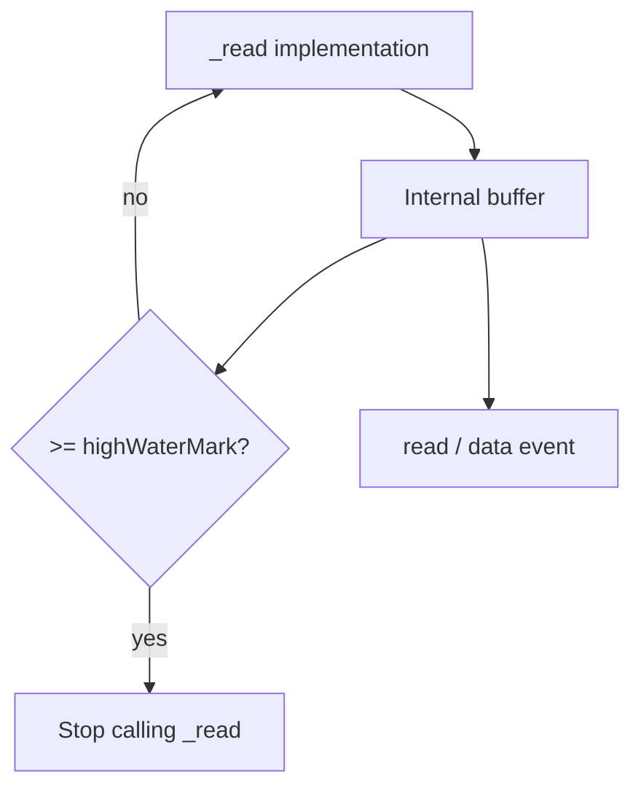
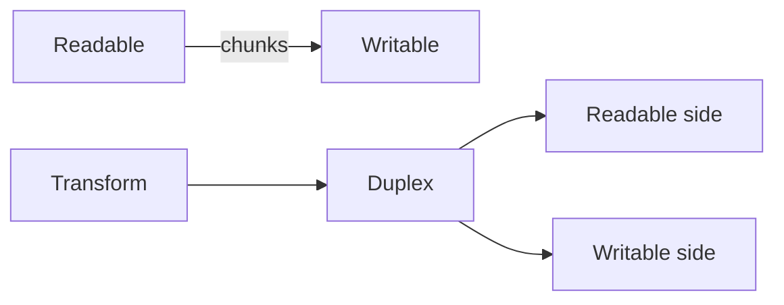
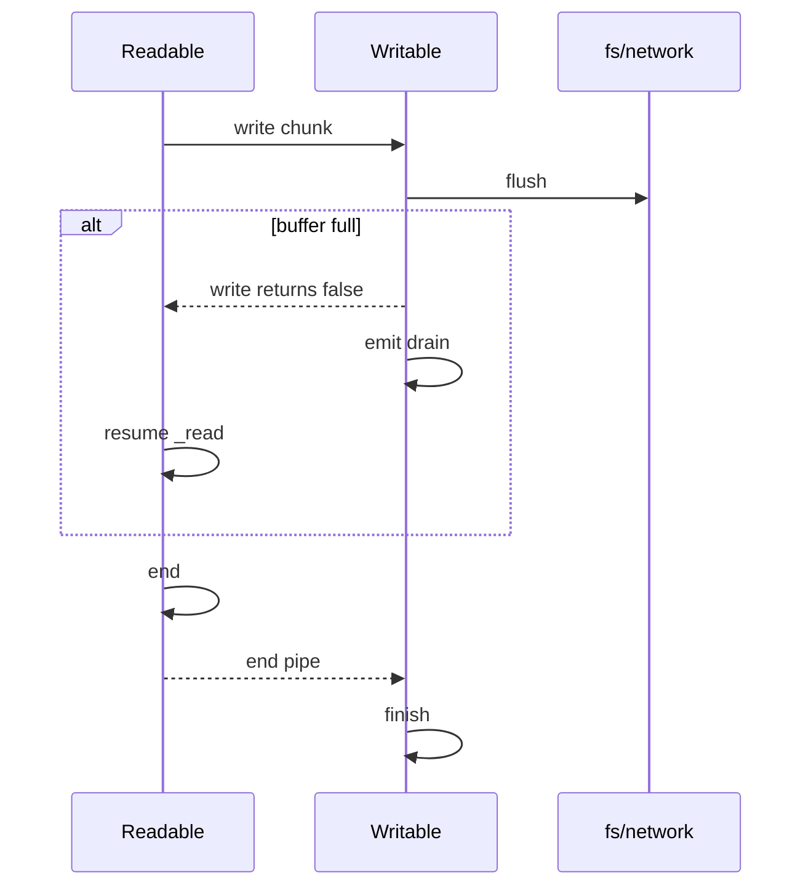

# Readable Writable and Duplex Streams

## Overview

Node **streams** are event-driven interfaces for processing data incrementally. **`Readable`** produces data (sources); **`Writable`** consumes data (sinks); **`Duplex`** implements both sides (TCP sockets); **`Transform`** is a Duplex with output tied to input (covered in a sibling note). Streams buffer chunks up to **`highWaterMark`**, emit lifecycle events (`data`, `end`, `finish`, `error`, `close`), and coordinate **backpressure** via `readable.read()` / `writable.write()` return values and `drain`.

This note owns Node's **event-based stream model**—not Express response helpers ([[07-Backend/README|Backend]]) or Web Streams protocol ([[06-NodeJS/04-Buffers-Streams-and-IO/Web Streams Interop with Node Streams|Web Streams Interop]]).

## Learning Objectives

- Implement Readable/Writable using `_read` / `_write` contracts
- Explain flowing vs paused mode and `data` vs `readable` events
- Wire Duplex streams (e.g., net.Socket) with independent internal buffers
- Handle errors without dangling listeners or memory leaks
- Choose `.pipe()` vs `pipeline()` (see dedicated note)

## Prerequisites

- [[06-NodeJS/04-Buffers-Streams-and-IO/Buffer and Typed Array Boundaries|Buffer and Typed Array Boundaries]]
- [[02-JavaScript/05-Async-and-Concurrency/Async Iteration and Streams|Async Iteration and Streams]]

## Difficulty

`advanced`

## Estimated Time

- Reading: 2.5 hours
- Exercises: 3 hours
- Mini project: 5 hours

## History

Streams entered Node ~v0.4 for uniform file/network I/O. Stream2 (v0.10) reworked APIs; Stream3 (v0.11+) unified `Readable`/`Writable`. Decades of `.pipe()` usage preceded `pipeline()` (v10) for proper error propagation. Web Streams arrived later; Node bridges both.

## Problem It Solves

- **Constant memory** over large files/sockets
- **Composable pipelines**: source → transform → sink
- **Time-aligned I/O**: process data as it arrives from libuv
- **Unified abstraction** for fs, net, http, zlib, crypto

## Internal Implementation

### Readable states

- **Flowing mode**: data auto-emitted on `data` event when listener attached
- **Paused mode**: consumer pulls via `read()` / `readable` event
- Internal buffer holds chunks until consumed or `highWaterMark` triggers pause of source `_read`



### Writable contract

`write(chunk, encoding, cb)` returns boolean:

- `true` — continue writing
- `false` — wait for `drain` before more writes

`_write` / `_writev` must call callback when chunk processed (not necessarily flushed to disk/network).

### Duplex

Two independent channels; `_read` and `_write` may run concurrently. `net.Socket` is Duplex: bytes in ≠ bytes out on same logical stream instance.

## Mermaid Diagrams

### Structure



### Sequence / Lifecycle



## Examples

### Minimal Example — custom Readable counter

```typescript
import { Readable } from "node:stream";

const counter = new Readable({
  read() {
    if (this.count === undefined) this.count = 0;
    if (this.count >= 5) {
      this.push(null); // EOF
      return;
    }
    this.push(`tick ${this.count++}\n`);
  },
});

counter.pipe(process.stdout);
```

### Production-Shaped Example — Writable with backpressure

```typescript
import { Writable } from "node:stream";
import type { Buffer } from "node:buffer";

export function createMetricsSink(onLine: (line: string) => void): Writable {
  return new Writable({
    highWaterMark: 16 * 1024,
    write(chunk: Buffer, _enc, cb) {
      try {
        onLine(chunk.toString("utf8").trim());
        cb();
      } catch (err) {
        cb(err as Error);
      }
    },
  });
}

// Consumer must respect drain when piping high-volume readable
export async function pump(source: NodeJS.ReadableStream, sink: Writable) {
  source.on("error", (e) => sink.destroy(e));
  sink.on("error", (e) => source.destroy(e));
  source.pipe(sink);
}
```

Prefer `pipeline()` from `node:stream/promises` for production (see [[06-NodeJS/04-Buffers-Streams-and-IO/pipeline and Finished|pipeline and Finished]]).

## Trade-offs

| Dimension | Upside | Downside | When it matters |
| --- | --- | --- | --- |
| Event API | Mature ecosystem | Callback/error footguns | Legacy code |
| `.pipe()` | One-liner | Weak error handling | Scripts |
| Object mode | Stream JS objects | Different HWM semantics | ORM batches |
| Duplex | Models sockets | Easy to confuse sides | TCP |

### When to Use

- File/network I/O in Node without buffering entire payload
- Custom transforms in process (line delimiters, framing)
- Integrating with `fs`, `net`, `http` native streams

### When Not to Use

- Small payloads fit in memory—streams add complexity
- Pure browser code—use Web Streams
- High-level HTTP routing—hand off to Backend frameworks

## Exercises

1. Implement Readable from async generator using `Readable.from`.
2. Write Writable that intentionally returns false; log `drain` timing.
3. Demonstrate `.pipe()` without error handler losing errors; fix with `pipeline`.
4. Compare flowing vs paused mode memory for fast producer.

## Mini Project

Build **line-delimited JSON logger**: Readable file → split lines → Writable to rotating files with backpressure metrics.

## Portfolio Project

[[06-NodeJS/projects/Stream Pipeline Toolkit/README|Stream Pipeline Toolkit]] core stages.

## Interview Questions

1. Difference between `end`, `finish`, and `close` on streams?
2. What does `write()` returning `false` mean?
3. Duplex vs Transform?
4. Why attach error handlers to both sides of a pipe?
5. Flowing vs paused readable?

### Stretch / Staff-Level

1. Implement `_writev` batching for syscall amortization.
2. Model socket half-close behavior with Duplex `allowHalfOpen`.

## Common Mistakes

- Missing `error` listeners → crash on `unhandled error`
- Pushing strings without encoding to binary protocols
- Assuming `.pipe()` propagates errors or destroys upstream
- Ignoring `highWaterMark` object mode difference (counts objects not bytes)

## Best Practices

- Use `pipeline()` / `finished()` for lifecycle
- Destroy streams on failure; remove listeners on shutdown
- Prefer `Readable.from` for iterables
- Set explicit `highWaterMark` for latency vs memory trade-off
- Log bytes/objects buffered under load

## Summary

Node Readable, Writable, and Duplex streams buffer chunked data, signal lifecycle through events, and enforce backpressure via `highWaterMark` and drain semantics. They are the core abstraction connecting libuv I/O to application logic; production quality requires correct error propagation, mode awareness, and pipeline helpers—not naive `.pipe()` alone.

## Further Reading

- [Node.js Stream documentation](https://nodejs.org/api/stream.html)
- [[01-Computer-Science/05-Concurrency-Fundamentals/Backpressure and Resource Contention|Backpressure and Resource Contention]]

## Related Notes

- [[06-NodeJS/04-Buffers-Streams-and-IO/Transform Streams and Object Mode|Transform Streams and Object Mode]]
- [[06-NodeJS/04-Buffers-Streams-and-IO/pipeline and Finished|pipeline and Finished]]
- [[06-NodeJS/04-Buffers-Streams-and-IO/Backpressure and HighWaterMark|Backpressure and HighWaterMark]]
- [[06-NodeJS/04-Buffers-Streams-and-IO/Web Streams Interop with Node Streams|Web Streams Interop with Node Streams]]
- [[06-NodeJS/README|Node.js]]

## Progress Checklist

- [ ] Explained from first principles
- [ ] Drew at least one Mermaid diagram
- [ ] Implemented a minimal version
- [ ] Documented trade-offs and non-goals
- [ ] Completed exercises
- [ ] Practiced interview questions aloud
- [ ] Linked prerequisites and dependents
