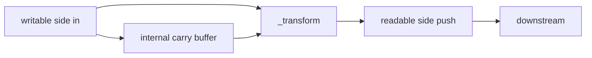
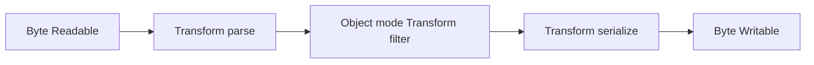
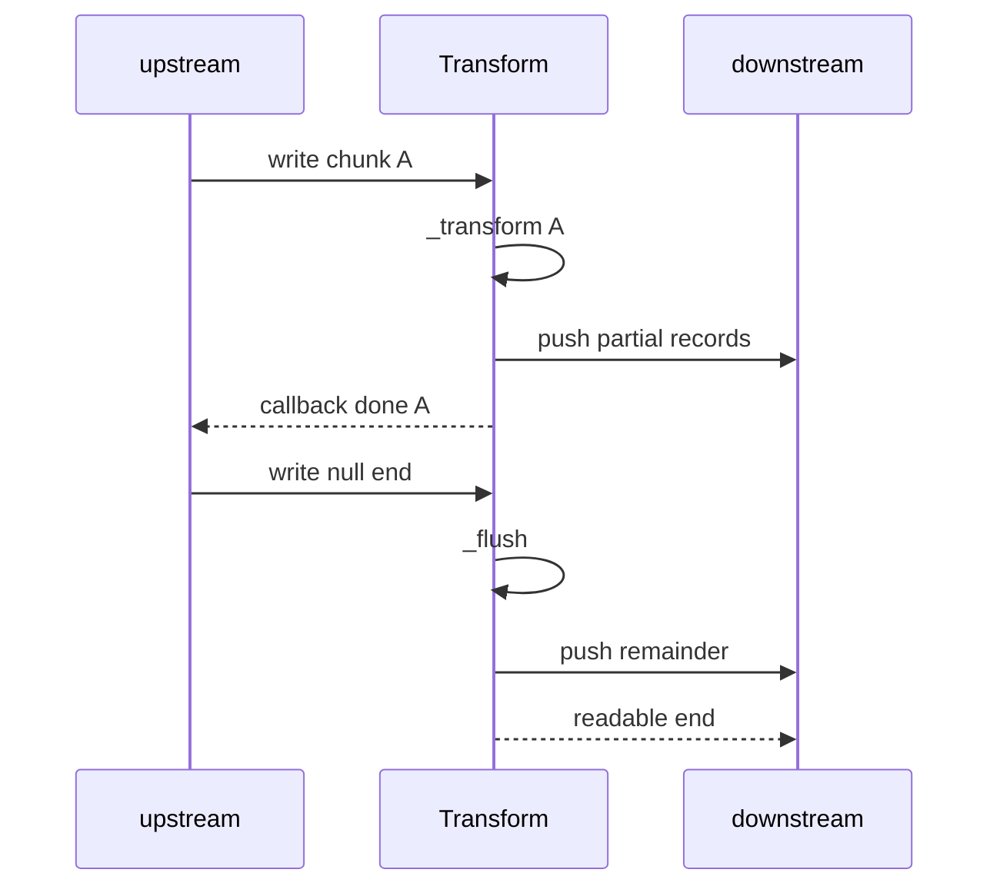

# Transform Streams and Object Mode

## Overview

A **`Transform`** stream is a **`Duplex`** where output is causally linked to input via **`_transform(chunk, encoding, callback)`** and optional **`_flush(callback)`** for trailing bytes. **`objectMode: true`** switches internal buffering from byte counts to **discrete JavaScript objects**—one chunk may be a row, JSON value, or domain event. Transforms are the workhorse for parsing, compression, encryption, and batching in Node pipelines.

## Learning Objectives

- Implement `_transform` and `_flush` with correct callback discipline
- Explain object mode `highWaterMark` (object count, not bytes)
- Handle partial input (line buffering, stateful parsers) in transforms
- Avoid transform-induced memory bombs and unbounded internal queues
- Compose multiple transforms with consistent error semantics

## Prerequisites

- [[06-NodeJS/04-Buffers-Streams-and-IO/Readable Writable and Duplex Streams|Readable Writable and Duplex Streams]]

## Difficulty

`advanced`

## Estimated Time

- Reading: 2 hours
- Exercises: 3 hours
- Mini project: 4 hours

## History

`Transform` formalized map/filter stages in Stream2. Object mode existed for streaming database cursors and log records where byte-oriented HWM was meaningless. zlib/crypto transforms wrap native code; custom transforms remain common in ETL and log pipelines.

## Problem It Solves

- **Incremental parsing**: bytes → records without loading full file
- **In-process adaptation**: CSV → objects → filtered objects → bytes
- **Backpressure through stages**: slow sink pauses upstream transforms
- **Stateful codecs**: compression dictionaries, JSON framing remainder buffers

## Internal Implementation

### Transform flow

For each written chunk, `_transform` may call `push(output)` zero or more times, then **must** invoke `callback()` (or `callback(err)`) to accept next chunk. `_flush` runs at end of input to emit trailing buffered data.



### Object mode

When `objectMode: true`:

- Chunks are any JS value (not only Buffer/string)
- Default `highWaterMark` is **16 objects** (vs 16KB bytes)
- Size calculations ignore byte length—misconfig causes OOM with large objects

## Mermaid Diagrams

### Structure



### Sequence / Lifecycle



## Examples

### Minimal Example — line splitter (byte mode)

```typescript
import { Transform } from "node:stream";

export class LineSplitter extends Transform {
  private carry = "";

  constructor() {
    super({ readableObjectMode: true });
  }

  _transform(chunk: Buffer, _enc: string, cb: (err?: Error | null) => void) {
    this.carry += chunk.toString("utf8");
    const lines = this.carry.split("\n");
    this.carry = lines.pop() ?? "";
    for (const line of lines) this.push(line);
    cb();
  }

  _flush(cb: (err?: Error | null) => void) {
    if (this.carry) this.push(this.carry);
    cb();
  }
}
```

### Production-Shaped Example — object mode filter with metrics

```typescript
import { Transform } from "node:stream";

type Event = { type: string; userId: string; ts: number };

export function createEventFilter(allowed: Set<string>) {
  let dropped = 0;

  const tr = new Transform({
    objectMode: true,
    highWaterMark: 256, // objects, not bytes
    transform(ev: Event, _enc, cb) {
      if (!ev?.type || !allowed.has(ev.type)) {
        dropped++;
        return cb();
      }
      cb(null, ev);
    },
    flush(cb) {
      if (dropped > 0) {
        console.warn(JSON.stringify({ event: "transform_dropped", count: dropped }));
      }
      cb();
    },
  });

  return tr;
}
```

Wire with `pipeline(source, filter, sink)`; cap object size at ingress; monitor dropped counts.

## Trade-offs

| Dimension | Upside | Downside | When it matters |
| --- | --- | --- | --- |
| Object mode | Natural domain chunks | Memory if objects huge | ETL, logs |
| Stateful transform | Correct framing | Complex test matrix | Protocols |
| Sync _transform | Simple | Blocks event loop | CPU-heavy maps |
| Multiple stages | Separation of concerns | Latency stacking | Pipelines |

### When to Use

- Parsing/framing bytes into records
- Filtering/mapping object streams from DB cursors
- zlib/gzip/crypto as transform stages

### When Not to Use

- One-shot small data—use array methods
- CPU-heavy work without worker offload—blocks loop
- Cross-realm streaming—consider structured clone costs

## Exercises

1. Transform CSV bytes to object rows; handle quoted commas incorrectly then fix.
2. Implement `_flush` emitting partial JSON when stream ends mid-object (expect failure; add validation).
3. Compare memory with objectMode HWM 16 vs 1024 under slow consumer.
4. Chain three transforms; inject error in middle; verify destruction with `pipeline`.

## Mini Project

**Log enricher**: parse NDJSON → filter by level → add hostname field → write to rotating files.

## Portfolio Project

Extend [[06-NodeJS/projects/Stream Pipeline Toolkit/README|Stream Pipeline Toolkit]] with reusable transform library.

## Interview Questions

1. When must `_transform` call `callback`?
2. Purpose of `_flush`?
3. How does object mode change backpressure?
4. Difference between `push(null)` and `callback()`?
5. Why can partial buffer state be a security issue?

### Stretch / Staff-Level

1. Design transform that batches objects by count and time window.
2. Compare Transform vs async generator + Readable.from for readability and backpressure.

## Common Mistakes

- Calling `push` after `callback` without understanding concurrency
- Forgetting `_flush` for buffered partial frames
- Treating object mode HWM as bytes
- Heavy sync work in `_transform` stalling HTTP servers

## Best Practices

- Keep `_transform` fast; offload CPU to worker pool
- Bound internal carry buffers; reject oversize lines/records
- Use `pipeline()` always
- Emit metrics: dropped records, buffer depth
- Test end-without-newline and empty input

## Summary

Transform streams connect readable and writable sides through `_transform`/`_flush`, enabling incremental byte-to-object and object-to-byte processing. Object mode shifts buffering semantics from bytes to discrete values—powerful for domain pipelines but dangerous without size bounds and backpressure awareness. Correct callback usage and flush handling separate robust production pipelines from silent data loss.

## Further Reading

- [Node.js stream.Transform](https://nodejs.org/api/stream.html#class-streamtransform)
- [[06-NodeJS/04-Buffers-Streams-and-IO/Backpressure and HighWaterMark|Backpressure and HighWaterMark]]

## Related Notes

- [[06-NodeJS/04-Buffers-Streams-and-IO/Readable Writable and Duplex Streams|Readable Writable and Duplex Streams]]
- [[06-NodeJS/04-Buffers-Streams-and-IO/pipeline and Finished|pipeline and Finished]]
- [[06-NodeJS/04-Buffers-Streams-and-IO/Backpressure and HighWaterMark|Backpressure and HighWaterMark]]
- [[02-JavaScript/05-Async-and-Concurrency/Async Iteration and Streams|Async Iteration and Streams]]
- [[06-NodeJS/README|Node.js]]

## Progress Checklist

- [ ] Explained from first principles
- [ ] Drew at least one Mermaid diagram
- [ ] Implemented a minimal version
- [ ] Documented trade-offs and non-goals
- [ ] Completed exercises
- [ ] Practiced interview questions aloud
- [ ] Linked prerequisites and dependents
