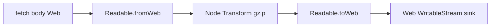
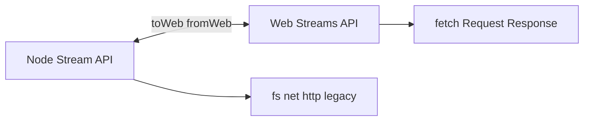
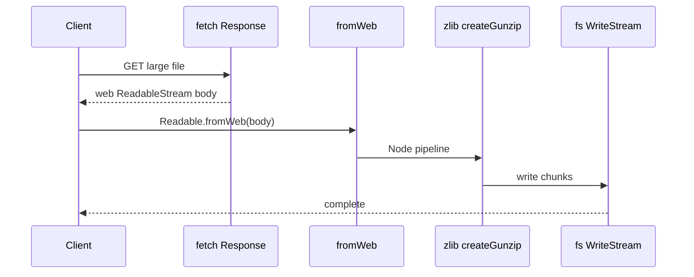

# Web Streams Interop with Node Streams

## Overview

Node implements the **WHATWG Web Streams API** (`ReadableStream`, `WritableStream`, `TransformStream`) alongside legacy **Node streams**. **`Readable.toWeb()`** / **`Readable.fromWeb()`** (and Writable counterparts) convert between models. **`fetch`** response bodies expose Web ReadableStream; **`fs`/`net`** expose Node streams. Interop is required when piping upload bodies to disk, bridging Undici/fetch to gzip transforms, or sharing code with WinterCG runtimes.

Language-level Web Streams theory: [[02-JavaScript/05-Async-and-Concurrency/Async Iteration and Streams|Async Iteration and Streams]].

## Learning Objectives

- Convert Node Readable ↔ Web ReadableStream with `toWeb`/`fromWeb`
- Pipe fetch bodies through Node transforms via conversion boundaries
- Understand backpressure differences between models at boundary
- Use `ReadableStream.from` (Node 20+) for async iterables
- Avoid double-conversion and listener leaks at adapters

## Prerequisites

- [[06-NodeJS/04-Buffers-Streams-and-IO/Readable Writable and Duplex Streams|Readable Writable and Duplex Streams]]
- [[02-JavaScript/05-Async-and-Concurrency/Async Iteration and Streams|Async Iteration and Streams]]

## Difficulty

`advanced`

## Estimated Time

- Reading: 2 hours
- Exercises: 2.5 hours
- Mini project: 4 hours

## History

Node streams (2010s) predated Web Streams standardization. Browser `fetch` and Service Workers drove WHATWG design. Node 16+ added global Web Streams; 18+ fetch/Undici made interop mandatory. Convergence continues under WinterCG portability goals ([[06-NodeJS/00-Orientation/Deno Bun and WinterCG Portability|Deno Bun and WinterCG Portability]]).

## Problem It Solves

- **Unified fetch pipelines** in Node without buffering entire body
- **Library interoperability** (Web API utilities vs Node zlib streams)
- **Portable code** between Node, Deno, Bun, browsers
- **Modern APIs** (`Request.body`, `Response`) with legacy Node tooling

## Internal Implementation

### Conversion adapters

`Readable.toWeb(nodeReadable)` wraps Node stream as Web ReadableStream with underlying source pulling from Node backpressure. `Readable.fromWeb(webStream)` creates Node Readable bridging enqueue/pull semantics.



Backpressure must propagate across boundary—adapter bugs historically caused unbounded buffering.

### Duplex and byte streams

Web **byte streams** (BYOB readers) optimize binary paths; Node conversion may copy more than zero-copy ideals. Prefer one model per pipeline segment; convert at single boundary.

## Mermaid Diagrams

### Structure



### Sequence / Lifecycle



## Examples

### Minimal Example — fetch to file

```typescript
import { Readable } from "node:stream";
import { pipeline } from "node:stream/promises";
import { createWriteStream } from "node:fs";

const res = await fetch("https://example.com/large.bin");
if (!res.ok || !res.body) throw new Error("bad response");

const nodeBody = Readable.fromWeb(res.body as import("node:stream/web").ReadableStream);
await pipeline(nodeBody, createWriteStream("large.bin"));
```

### Production-Shaped Example — boundary with abort

```typescript
import { Readable } from "node:stream";
import { pipeline } from "node:stream/promises";
import { createGunzip } from "node:zlib";
import { PassThrough } from "node:stream";

export async function decompressFetch(url: string, signal: AbortSignal): Promise<NodeJS.ReadableStream> {
  const res = await fetch(url, { signal });
  if (!res.ok || !res.body) throw new Error(`fetch failed ${res.status}`);

  const nodeIn = Readable.fromWeb(res.body as import("node:stream/web").ReadableStream);
  const out = new PassThrough();

  pipeline(nodeIn, createGunzip(), out).catch((err) => out.destroy(err));
  return out;
}

// Consumer on Web side
export function toWebReadable(nodeStream: NodeJS.ReadableStream) {
  return Readable.toWeb(nodeStream) as ReadableStream<Uint8Array>;
}
```

Destroy upstream on client abort; handle gzip errors via pipeline rejection.

## Trade-offs

| Dimension | Upside | Downside | When it matters |
| --- | --- | --- | --- |
| Web Streams | Portable, fetch-native | Fewer years of Node libs | New HTTP clients |
| Node streams | zlib/fs/net ecosystem | Event API | Legacy pipelines |
| Conversion | Bridge ecosystems | Extra layer, copies | Boundaries only |
| Single model | Simplest | Lock-in | Greenfield |

### When to Use

- fetch/Undici bodies into Node file or crypto pipelines
- Exposing Node-generated data to Web Stream consumers (SSE, Response)
- WinterCG-shared libraries

### When Not to Use

- Repeated toWeb/fromWeb in every middleware hop
- When entire body is tiny—`arrayBuffer()` simpler
- Deep Node-only pipelines with no Web exposure

## Exercises

1. Download via fetch; compare memory: `arrayBuffer()` vs streaming to disk.
2. Pipe Node Readable through Web TransformStream via double conversion; measure overhead.
3. Abort fetch mid-download; verify file partial state and open FD cleanup.
4. Use `for await` on Web ReadableStream vs Node Readable.from perspective.

## Mini Project

**Fetch proxy**: accept Web Request, stream body through Node virus-scan transform, return Web Response.

## Portfolio Project

[[06-NodeJS/projects/HTTP Server From Scratch/README|HTTP Server From Scratch]] — optional fetch upstream module.

## Interview Questions

1. Why two stream systems in Node?
2. What happens to backpressure at toWeb boundary?
3. How get fetch body into createGunzip pipeline?
4. Byte streams vs default streams?
5. When prefer Undici vs node:http client?

### Stretch / Staff-Level

1. Design middleware architecture minimizing stream model conversions.
2. Compare WinterCG compliance testing for stream interop across runtimes.

## Common Mistakes

- Converting twice in one pipeline
- Not destroying Node side when Web reader cancels
- Assuming `toWeb` zero-copy for all chunk types
- Mixing `.pipe()` with Web `pipeTo` without error linking

## Best Practices

- One conversion boundary per pipeline
- Use `pipeline()` on Node segments
- Wire AbortSignal through fetch and destroy Node streams
- Prefer Web Streams for HTTP client/server bodies in new code where APIs allow
- Test cancellation and mid-stream errors

## Summary

Node bridges legacy event streams and standard Web Streams via `toWeb`/`fromWeb`, enabling fetch-centric I/O without abandoning the Node zlib/fs ecosystem. Production paths should minimize conversions, propagate backpressure and abort signals across boundaries, and treat the adapter layer as a deliberate architectural seam—not an incidental cast.

## Further Reading

- [Node.js Web Streams API](https://nodejs.org/api/webstreams.html)
- [Node.js stream.Readable.fromWeb](https://nodejs.org/api/stream.html#readablefromwebreadablestream-options)

## Related Notes

- [[02-JavaScript/05-Async-and-Concurrency/Async Iteration and Streams|Async Iteration and Streams]]
- [[06-NodeJS/04-Buffers-Streams-and-IO/Readable Writable and Duplex Streams|Readable Writable and Duplex Streams]]
- [[06-NodeJS/04-Buffers-Streams-and-IO/pipeline and Finished|pipeline and Finished]]
- [[06-NodeJS/05-Networking/http and https Platform Servers|http and https Platform Servers]]
- [[06-NodeJS/README|Node.js]]

## Progress Checklist

- [ ] Explained from first principles
- [ ] Drew at least one Mermaid diagram
- [ ] Implemented a minimal version
- [ ] Documented trade-offs and non-goals
- [ ] Completed exercises
- [ ] Practiced interview questions aloud
- [ ] Linked prerequisites and dependents
