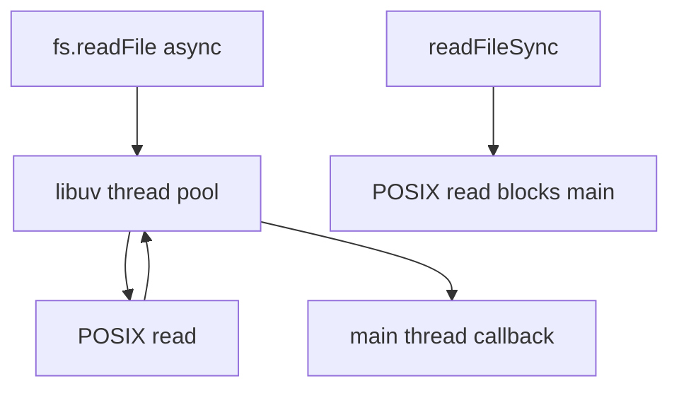
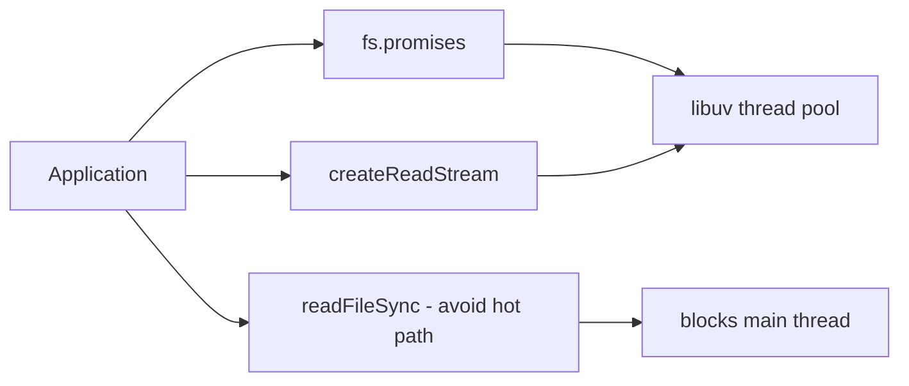
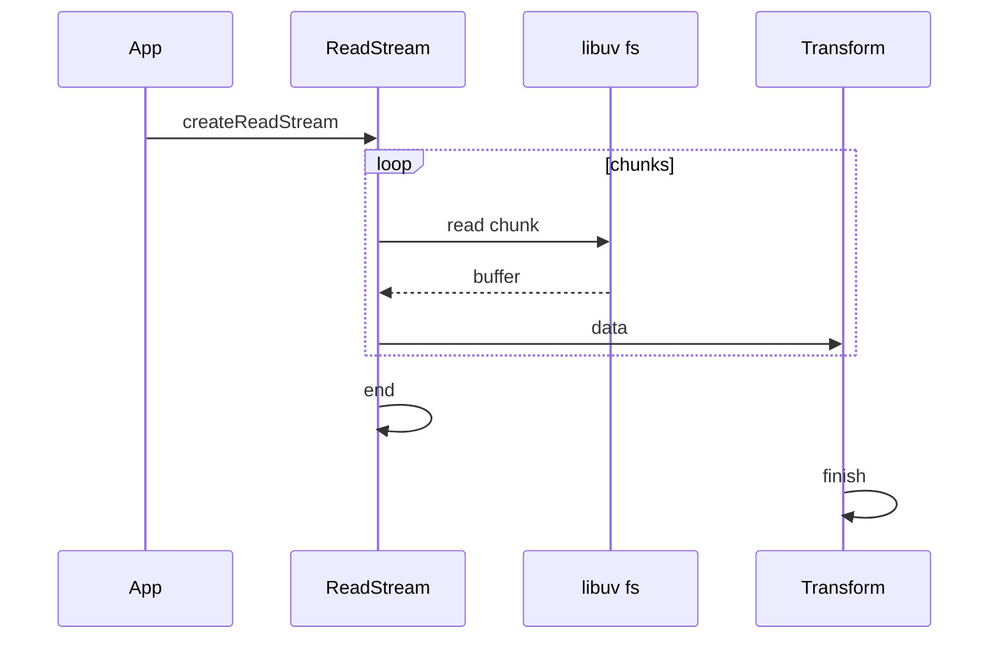

# fs Promises Sync and Streaming

## Overview

Node's **`fs` module** exposes three I/O styles: **callback** (legacy), **promises** (`fs/promises`), and **sync** (`readFileSync`, …). For large or unbounded files, **streaming** (`createReadStream` / `createWriteStream`) avoids loading entire contents into the V8 heap. Sync APIs block the **event loop** and libuv thread pool interactions—acceptable only at startup or CLI cold paths, never on request hot paths.

This note covers filesystem host behavior; path traversal safety lives in [[06-NodeJS/09-Security-and-Supply-Chain/Path Traversal and Safe Filesystem Access|Path Traversal and Safe Filesystem Access]].

## Learning Objectives

- Choose among readFile, promises API, and streams for a workload
- Use `pipeline` with fs streams and proper `flags`/`mode`
- Explain sync fs impact on event loop and thread pool
- Handle partial reads, `EMFILE`, and disk full errors
- Open files with explicit descriptors via `fs.promises.open` when needed

## Prerequisites

- [[06-NodeJS/04-Buffers-Streams-and-IO/Readable Writable and Duplex Streams|Readable Writable and Duplex Streams]]
- [[06-NodeJS/04-Buffers-Streams-and-IO/pipeline and Finished|pipeline and Finished]]
- [[06-NodeJS/01-Process-and-Runtime/Working Directory Paths and fileURLToPath|Working Directory Paths and fileURLToPath]]

## Difficulty

`intermediate`

## Estimated Time

- Reading: 2 hours
- Exercises: 2.5 hours
- Mini project: 4 hours

## History

Early Node mirrored POSIX async callbacks. Promises wrapper unified modern async code. Sync methods existed for scripting ergonomics but became anti-patterns in servers. Streaming fs APIs align with Unix pipeline philosophy; `fs.promises.readFile` still buffers whole file—convenient but dangerous at scale.

## Problem It Solves

- **Bounded memory** for logs, uploads, media
- **Incremental processing** during read (hash, parse, compress)
- **Simple config loads** at boot via small promise reads
- **Atomic writes** via temp file + rename patterns

## Internal Implementation

### libuv file operations

Async `fs.read`/`write` use thread pool for blocking syscalls; completion callbacks run on main thread. Sync variants block main thread entirely during syscall.



### Stream chunk size

`createReadStream(path, { highWaterMark, start, end })` reads in chunks (default 64KB). `autoClose: true` closes FD on `end`/`error`.

## Mermaid Diagrams

### Structure



### Sequence / Lifecycle



## Examples

### Minimal Example — promises vs stream

```typescript
import { readFile, stat } from "node:fs/promises";
import { createReadStream } from "node:fs";

// OK for small config (< few MB)
const config = JSON.parse(await readFile("config.json", "utf8"));

// Large file — stream
const stream = createReadStream("big.log", { encoding: "utf8" });
stream.on("data", (line) => {
  /* process chunk */
});
```

### Production-Shaped Example — atomic write with pipeline

```typescript
import { open, rename, unlink } from "node:fs/promises";
import { createWriteStream } from "node:fs";
import { pipeline } from "node:stream/promises";
import path from "node:path";
import { randomBytes } from "node:crypto";

export async function atomicWrite(finalPath: string, source: NodeJS.ReadableStream) {
  const tmp = `${finalPath}.${randomBytes(6).toString("hex")}.tmp`;
  const ws = createWriteStream(tmp, { mode: 0o600 });

  try {
    await pipeline(source, ws);
    await rename(tmp, finalPath);
  } catch (err) {
    await unlink(tmp).catch(() => {});
    throw err;
  }
}

export async function safeStat(resolved: string) {
  const s = await stat(resolved);
  if (!s.isFile()) throw new Error("not a file");
  return s.size;
}
```

Validate paths before access; enforce max size on uploads.

## Trade-offs

| Dimension | Upside | Downside | When it matters |
| --- | --- | --- | --- |
| readFile | Simple | RAM = file size | Config |
| Streams | Bounded RAM | Complexity | Logs/media |
| Sync | Scripting | Blocks loop | CLI startup only |
| Thread pool | Non-blocking JS | Pool exhaustion | Many parallel fs ops |

### When to Use

- Streams for unknown or large sizes
- `fs.promises` for directory ops, stat, rename
- Sync only in bootstrap before listening on ports

### When Not to Use

- `readFileSync` in HTTP handlers
- Unbounded concurrent `readFile` of huge assets
- Default streams without error handlers in production

## Exercises

1. Compare heap usage reading 500MB file via readFile vs pipeline to `/dev/null` equivalent.
2. Implement tail -f using `watchFile` or `fs.watch` + stream seek (handle rotation).
3. Trigger `EMFILE` with too many open streams; fix with concurrency limit.
4. Atomic write crash test: kill process mid-write; verify final file integrity.

## Mini Project

**Secure static file server** (thin http): range requests, stream pipeline, max size, content-type sniff limits.

## Portfolio Project

[[06-NodeJS/projects/HTTP Server From Scratch/README|HTTP Server From Scratch]] static asset path.

## Interview Questions

1. Why is readFileSync dangerous in servers?
2. Difference between fs callback and promises same operation?
3. How does createReadStream set chunk boundaries?
4. Pattern for atomic file replace on Windows vs POSIX?
5. When use fs.open + read vs stream?

### Stretch / Staff-Level

1. Design log rotation consumer without missing lines across rename.
2. Explain UV_FS_O_FILEMAP and direct IO when relevant.

## Common Mistakes

- Loading multi-GB uploads into Buffer
- Missing pipeline error handling on createWriteStream
- Assuming `utf8` encoding splits on line boundaries in chunks
- Forgetting to `await` promises before exit

## Best Practices

- Stat file size before readFile when feasible
- Use pipeline + atomic rename for outputs
- Limit concurrent open files
- Prefer `fs.promises` over callback promisify
- Integrate path hardening from security note

## Summary

Node fs offers promise, sync, and streaming interfaces over libuv-backed file I/O. Streams and pipeline belong on hot paths for large data; promise reads suit small bounded assets; sync calls block the event loop and belong only off critical paths. Production filesystem code pairs streaming with error propagation, atomic writes, and explicit size guards.

## Further Reading

- [Node.js fs documentation](https://nodejs.org/api/fs.html)
- [Node.js fs/promises](https://nodejs.org/api/fs.html#promises-api)

## Related Notes

- [[06-NodeJS/04-Buffers-Streams-and-IO/pipeline and Finished|pipeline and Finished]]
- [[06-NodeJS/04-Buffers-Streams-and-IO/Backpressure and HighWaterMark|Backpressure and HighWaterMark]]
- [[06-NodeJS/09-Security-and-Supply-Chain/Path Traversal and Safe Filesystem Access|Path Traversal and Safe Filesystem Access]]
- [[06-NodeJS/02-Event-Loop-and-libuv/Thread Pool and Blocking Work|Thread Pool and Blocking Work]]
- [[06-NodeJS/README|Node.js]]

## Progress Checklist

- [ ] Explained from first principles
- [ ] Drew at least one Mermaid diagram
- [ ] Implemented a minimal version
- [ ] Documented trade-offs and non-goals
- [ ] Completed exercises
- [ ] Practiced interview questions aloud
- [ ] Linked prerequisites and dependents
