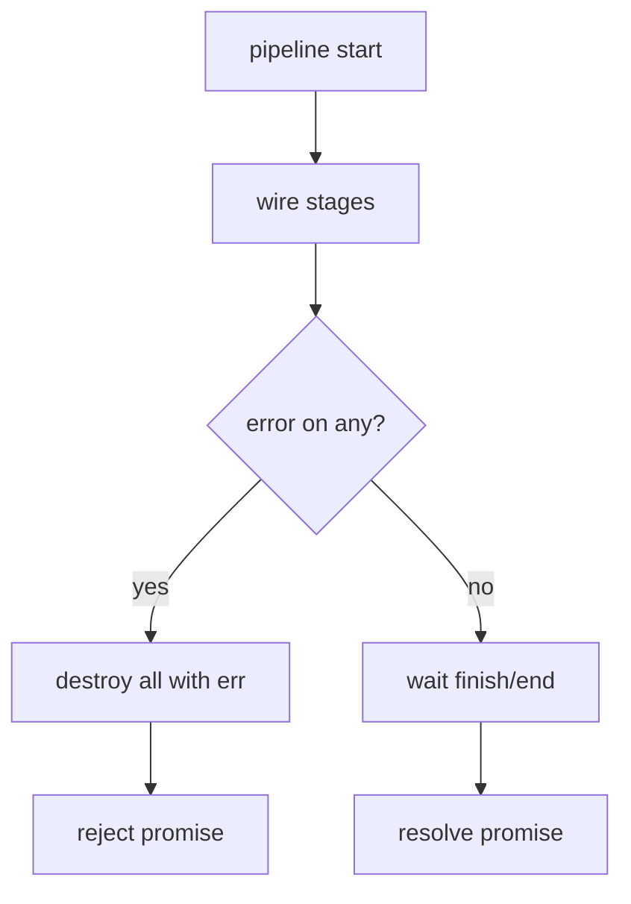
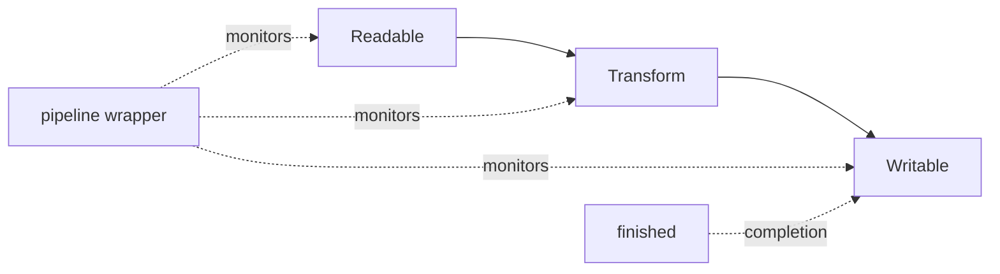
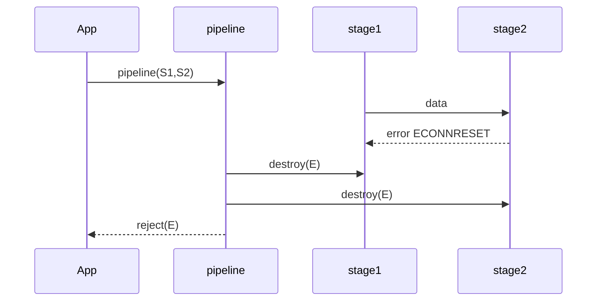

# pipeline and Finished

## Overview

**`stream.pipeline()`** connects Readable → Transform → Writable (multiple stages), forwards errors, destroys leaking streams, and returns a **Promise** (callback overload exists). **`stream.finished()`** signals when a stream is fully done—no more data, `finish`/`end` emitted, resources released—or failed. Together they replace fragile `.pipe()` chains that drop errors and leave half-open handles.

Production I/O pipelines should treat `pipeline` + `finished` as the default contract, not optional sugar.

## Learning Objectives

- Replace `.pipe()` with `pipeline()` for multi-stage error safety
- Use `finished()` to await stream completion in shutdown paths
- Propagate `AbortSignal` through pipeline (Node 16+)
- Destroy streams correctly on failure and during graceful shutdown
- Integrate pipeline with async/await control flow and logging

## Prerequisites

- [[06-NodeJS/04-Buffers-Streams-and-IO/Readable Writable and Duplex Streams|Readable Writable and Duplex Streams]]
- [[06-NodeJS/04-Buffers-Streams-and-IO/Transform Streams and Object Mode|Transform Streams and Object Mode]]

## Difficulty

`advanced`

## Estimated Time

- Reading: 1.5 hours
- Exercises: 2.5 hours
- Mini project: 4 hours

## History

Classic `.pipe()` did not automatically destroy peers on error—operators learned hard lessons in production logs. `pipeline()` landed in Node 10; promise API in v15+. `finished()` clarified completion detection vs `'end'`/`'finish'` alone (especially with Duplex and `autoDestroy` defaults in modern streams).

## Problem It Solves

- **Lost errors** in multi-hop pipes
- **Resource leaks** (open FDs, sockets) after partial failure
- **Shutdown ambiguity**: when is it safe to exit process?
- **Abort integration** for timeouts and cancellation

## Internal Implementation

### pipeline behavior (simplified)

1. Register error listeners on all streams
2. On error: destroy all streams in chain with cause
3. On success: wait for writable `finish` and readable `end`
4. Resolve promise or invoke callback once



### finished vs events

`finished(stream, opts, cb)` fires when:

- Readable: `end` emitted and no more data
- Writable: `finish` emitted
- Optional `error` already occurred
- Respects `readable`/`writable` false flags for half-closed Duplex

Modern streams default **`autoDestroy: true`**—pipeline relies on destruction to release handles.

## Mermaid Diagrams

### Structure



### Sequence / Lifecycle



## Examples

### Minimal Example — pipeline promise

```typescript
import { pipeline } from "node:stream/promises";
import { createReadStream, createWriteStream } from "node:fs";
import { createGzip } from "node:zlib";

await pipeline(
  createReadStream("access.log"),
  createGzip(),
  createWriteStream("access.log.gz"),
);
```

### Production-Shaped Example — abort + structured errors

```typescript
import { pipeline } from "node:stream/promises";
import { finished } from "node:stream/promises";
import { createReadStream } from "node:fs";
import { Transform } from "node:stream";

export async function ingest(path: string, signal: AbortSignal): Promise<number> {
  let rows = 0;

  const counter = new Transform({
    objectMode: true,
    transform(obj, _enc, cb) {
      rows++;
      cb(null, obj);
    },
  });

  const read = createReadStream(path);
  signal.addEventListener("abort", () => read.destroy(new Error("aborted")));

  try {
    await pipeline(read, counter, async function* (source) {
      for await (const _ of source) {
        if (signal.aborted) throw new Error("aborted");
      }
    });
    return rows;
  } catch (err) {
    console.error(JSON.stringify({ event: "ingest_failed", path, err: String(err) }));
    throw err;
  }
}

export async function waitForWritable(w: NodeJS.WritableStream) {
  await finished(w, { cleanup: true });
}
```

Use `finished` during graceful shutdown to drain HTTP response bodies (see [[06-NodeJS/10-Production-Node/Graceful Shutdown and Drain|Graceful Shutdown and Drain]]).

## Trade-offs

| Dimension | Upside | Downside | When it matters |
| --- | --- | --- | --- |
| pipeline | Centralized error destroy | Less explicit than manual | All multi-stage I/O |
| finished | Clear completion | Duplex edge cases | Shutdown |
| AbortSignal | Unified cancel | Not all streams respect | Long uploads |
| Generator sink | Ergonomic async | Hidden backpressure | Small tools |

### When to Use

- Any multi-stream connection in production
- Shutdown paths awaiting drain
- Tests asserting stream completion without races

### When Not to Use

- Single-stream trivial pass-through where errors are impossible (rare)
- When higher-level API already wraps pipeline (some HTTP helpers in Backend)

## Exercises

1. Reproduce `.pipe().pipe()` silent error; fix with `pipeline`.
2. Abort mid-copy; verify partial output file state and FD closure.
3. Use `finished` on Duplex socket after `end()` half-close.
4. Pipeline into async generator consumer; measure backpressure vs unbounded `for await`.

## Mini Project

**Resilient log archiver**: gzip + rotate + metrics; failure injects disk full; must destroy all FDs.

## Portfolio Project

[[06-NodeJS/projects/Stream Pipeline Toolkit/README|Stream Pipeline Toolkit]] — standardize on pipeline wrappers.

## Interview Questions

1. What does pipeline do on mid-chain error that pipe does not?
2. Difference between `end`, `finish`, and finished() resolution?
3. How to cancel a pipeline with AbortSignal?
4. When would you manually `destroy()` vs rely on pipeline?
5. Generator last stage backpressure caveats?

### Stretch / Staff-Level

1. Design shutdown sequence: stop accept → drain HTTP → pipeline flush → exit.
2. Compare pipeline to Web Streams `pipeThrough` error models.

## Common Mistakes

- Awaiting only readable `end` while writable still buffering
- Missing await on pipeline promise in async main
- Destroying streams without error cause chaining (`cause` property)
- Using `pipeline` without handling rejection at top level

## Best Practices

- Default to `import { pipeline, finished } from 'node:stream/promises'`
- Attach logging context at pipeline boundary
- Pass AbortSignal from request timeout through ingest pipelines
- In tests, use `finished` instead of arbitrary `setTimeout`
- Document expected destroy behavior for custom streams

## Summary

`pipeline` and `finished` are Node's production-grade stream lifecycle utilities: they unify error propagation, resource cleanup, and completion awaiting beyond raw `.pipe()`. Any serious buffer/stream I/O path should use them with explicit abort and shutdown integration—otherwise failures manifest as leaked sockets, truncated files, and hung processes.

## Further Reading

- [Node.js stream.pipeline](https://nodejs.org/api/stream.html#streampipelinesource-transforms-destination-callback)
- [Node.js stream.finished](https://nodejs.org/api/stream.html#streamfinishedstream-options-callback)

## Related Notes

- [[06-NodeJS/04-Buffers-Streams-and-IO/Backpressure and HighWaterMark|Backpressure and HighWaterMark]]
- [[06-NodeJS/04-Buffers-Streams-and-IO/fs Promises Sync and Streaming|fs Promises Sync and Streaming]]
- [[06-NodeJS/10-Production-Node/Graceful Shutdown and Drain|Graceful Shutdown and Drain]]
- [[06-NodeJS/07-Timers-Events-and-IPC/AbortSignal Propagation Across Node APIs|AbortSignal Propagation Across Node APIs]]
- [[06-NodeJS/README|Node.js]]

## Progress Checklist

- [ ] Explained from first principles
- [ ] Drew at least one Mermaid diagram
- [ ] Implemented a minimal version
- [ ] Documented trade-offs and non-goals
- [ ] Completed exercises
- [ ] Practiced interview questions aloud
- [ ] Linked prerequisites and dependents
