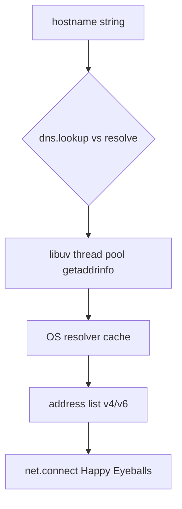
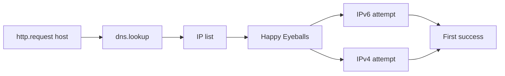
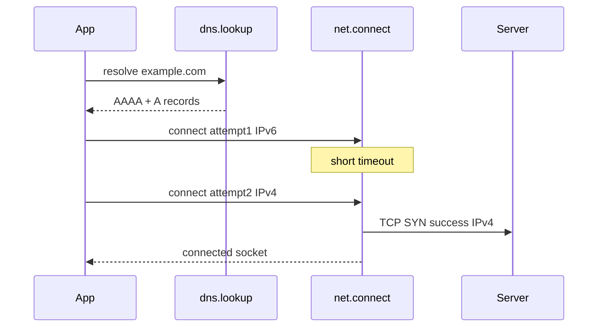

# DNS Lookup Caching and Happy Eyeballs Concepts

## Overview

Before TCP connects, hostnames must resolve to IP addresses. Node's **`dns` module** wraps **`getaddrinfo`** (and resolver APIs) often on the **libuv thread pool**—blocking from JavaScript's perspective but off the main poll loop. **`dns.lookup`** respects OS resolver behavior (including `/etc/hosts`); **`dns.resolve*`** talks to DNS servers directly. **Happy Eyeballs** (RFC 8305) races **IPv6 vs IPv4** connection attempts to reduce dual-stack latency penalties—implemented in **`net.createConnection`**, **`http.request`**, and modern **`fetch`**.

This note covers **Node host resolution behavior**, not CDN DNS product design ([[09-System-Design/05-Caching-at-Product-Scale/Cache Hierarchies CDN Edge Regional App|Cache Hierarchies CDN Edge Regional App]] / [[09-System-Design/02-Load-Balancing-and-Edge-Entry/Edge Admission Control and Global Traffic Steering|Edge Admission Control]]).

## Learning Objectives

- Choose between `dns.lookup`, `dns.resolve`, and `dns.promises` APIs
- Explain DNS caching layers: Node none by default vs OS cache vs app cache
- Describe Happy Eyeballs timing and fallback in Node connectors
- Avoid thread pool exhaustion from synchronous DNS storms
- Configure `dns.setDefaultResultOrder` for IPv4-first vs verbatim

## Prerequisites

- [[06-NodeJS/05-Networking/net Sockets and Servers|net Sockets and Servers]]
- [[06-NodeJS/02-Event-Loop-and-libuv/Thread Pool and Blocking Work|Thread Pool and Blocking Work]]

## Difficulty

`advanced`

## Estimated Time

- Reading: 2 hours
- Exercises: 2.5 hours
- Mini project: 3 hours

## History

Early Node used blocking `dns.lookup` on thread pool heavily—surprising latency under load. `dns.resolve` added pure DNS without hosts file semantics. IPv6 adoption exposed connection delays when IPv6 broken; Happy Eyeballs algorithms added to user agents and Node connectors (~v16+ refinements). Custom DNS over HTTPS lives outside core.

## Problem It Solves

- **Name → address** mapping before `net.connect`
- **Dual-stack reliability** without manual IPv4 fallback code
- **Service discovery hooks** via caching layers in app or sidecar
- **Predictable connect latency** under misconfigured IPv6

## Internal Implementation

### lookup vs resolve

| API | Behavior |
| --- | --- |
| `dns.lookup(hostname)` | OS resolver (`getaddrinfo`), honors hosts file, NSS |
| `dns.resolve4/6/Any` | DNS queries to configured servers |
| `dns.promises.*` | Promise wrappers |

Neither `lookup` nor `resolve` provides long-lived Node-level cache—**OS caches** per TTL; apps add **memoization** carefully with TTL.



### Happy Eyeballs (conceptual)

1. Resolve addresses (possibly both families)
2. Start connection attempt to first address (often IPv6 per policy)
3. After short delay, start parallel IPv4 attempt
4. Use whichever completes first; cancel/ignore loser

Node exposes policy via `autoSelectFamily`, `autoSelectFamilyAttemptTimeout` on `net.connect` / `http` agents.

## Mermaid Diagrams

### Structure



### Sequence / Lifecycle



## Examples

### Minimal Example — explicit lookup

```typescript
import dns from "node:dns/promises";
import net from "node:net";

const { address } = (await dns.lookup("example.com", { family: 0, all: false })) as { address: string; family: number };

await new Promise<void>((resolve, reject) => {
  const socket = net.connect(80, address, () => {
    console.log("connected", address);
    socket.end();
    resolve();
  });
  socket.on("error", reject);
});
```

### Production-Shaped Example — cached lookup with TTL

```typescript
import dns from "node:dns/promises";

type Entry = { addrs: dns.LookupAddress[]; expires: number };

const cache = new Map<string, Entry>();
const TTL_MS = 30_000;

export async function cachedLookup(host: string): Promise<string> {
  const now = Date.now();
  const hit = cache.get(host);
  if (hit && hit.expires > now) {
    return hit.addrs[0].address;
  }

  const addrs = await dns.lookup(host, { all: true, verbatim: true });
  if (!addrs.length) throw new Error(`no addresses for ${host}`);
  cache.set(host, { addrs, expires: now + TTL_MS });
  return addrs[0].address;
}

// Node 17+: control result order globally if needed
// dns.setDefaultResultOrder('ipv4first');
```

Respect DNS TTL from records in serious caches; this toy TTL illustrates app layer only. For HTTP clients, prefer built-in Happy Eyeballs via `fetch`/Undici rather than manual connect unless customizing.

```typescript
import http from "node:http";

http.request({
  hostname: "example.com", // connector runs lookup + happy eyeballs
  port: 80,
  path: "/",
  autoSelectFamily: true,
  autoSelectFamilyAttemptTimeout: 250,
}, (res) => {
  res.resume();
}).end();
```

## Trade-offs

| Dimension | Upside | Downside | When it matters |
| --- | --- | --- | --- |
| dns.lookup | OS-consistent | Thread pool, no Node cache | Most connectors |
| dns.resolve | Pure DNS | Ignores hosts file | Custom DNS logic |
| App cache | Lower latency | Stale records on failover | High QPS same hosts |
| ipv4first | Fixes bad IPv6 | Slower true v6 paths | Corporate networks |

### When to Use

- Built-in connectors for Happy Eyeballs (default modern Node)
- Short-lived app cache with TTL for internal service names
- `setDefaultResultOrder` when metrics show IPv6 timeout pattern

### When Not to Use

- Infinite DNS cache ignoring authoritative TTL
- `dns.lookup` in tight loop without connection pooling
- Manual IP bypass of TLS certificate hostname verification

## Exercises

1. Log addresses from `lookup(..., { all: true })` for dual-stack host.
2. Simulate slow IPv6 with `/etc/hosts` or testcontainers; measure connect time with/without autoSelectFamily.
3. Flood 10k concurrent lookups; watch thread pool queue delay.
4. Compare `resolve4` vs `lookup` when `/etc/hosts` overrides public DNS.

## Mini Project

**Connect profiler CLI**: given URL, report DNS ms, connect ms, chosen address family.

## Portfolio Project

[[06-NodeJS/projects/Node Runtime Toolkit/README|Node Runtime Toolkit]] — DNS/connect diagnostics.

## Interview Questions

1. lookup vs resolve4 difference?
2. Does Node cache DNS by default?
3. What is Happy Eyeballs solving?
4. How DNS queries relate to libuv thread pool?
5. Effect of `dns.setDefaultResultOrder('ipv4first')`?

### Stretch / Staff-Level

1. Design service mesh sidecar vs in-process DNS cache trade-offs.
2. Failover when authoritative DNS changes but OS cache stale—mitigations.

## Common Mistakes

- Confusing DNS latency with HTTP TTFB in metrics
- Custom connect without SNI/TLS host matching resolved IP
- Uncached repeated lookups per request in hot loop
- Disabling IPv6 without understanding Happy Eyeballs already mitigates

## Best Practices

- Reuse HTTP agents / connection pools
- Monitor lookup and connect phases separately
- Tune `autoSelectFamilyAttemptTimeout` from real dual-stack data
- Invalidate app DNS cache on failover events
- Document reliance on `/etc/hosts` in k8s (dnsPolicy, ndots)

## Summary

Node resolves hostnames through OS-backed lookup on the thread pool or explicit DNS queries, without a built-in application cache. Connect APIs implement Happy Eyeballs to reduce dual-stack connection delays. Production debugging separates DNS time from TCP/TLS time, respects TTL when caching, and relies on modern autoSelectFamily rather than hardcoding IPv4 everywhere.

## Further Reading

- [Node.js dns documentation](https://nodejs.org/api/dns.html)
- [RFC 8305 Happy Eyeballs](https://www.rfc-editor.org/rfc/rfc8305)
- [[06-NodeJS/02-Event-Loop-and-libuv/Thread Pool and Blocking Work|Thread Pool and Blocking Work]]

## Related Notes

- [[06-NodeJS/05-Networking/net Sockets and Servers|net Sockets and Servers]]
- [[06-NodeJS/05-Networking/http and https Platform Servers|http and https Platform Servers]]
- [[06-NodeJS/02-Event-Loop-and-libuv/Thread Pool and Blocking Work|Thread Pool and Blocking Work]]
- [[09-System-Design/README|System Design]]
- [[06-NodeJS/README|Node.js]]

## Progress Checklist

- [ ] Explained from first principles
- [ ] Drew at least one Mermaid diagram
- [ ] Implemented a minimal version
- [ ] Documented trade-offs and non-goals
- [ ] Completed exercises
- [ ] Practiced interview questions aloud
- [ ] Linked prerequisites and dependents
