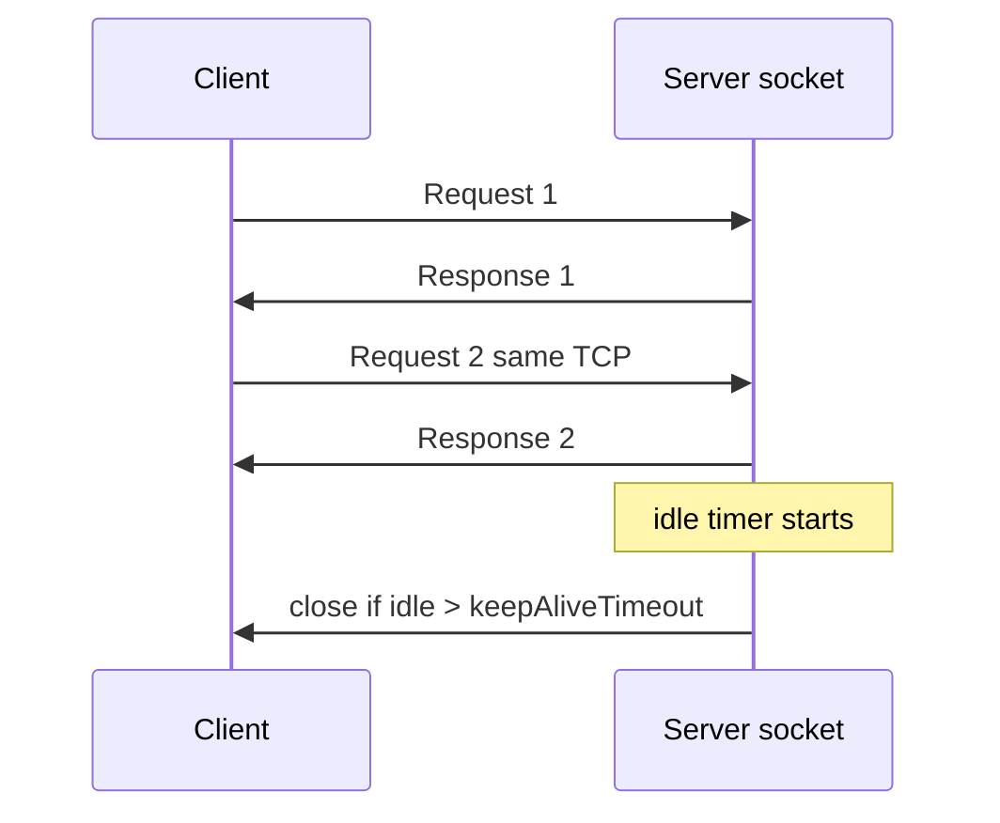
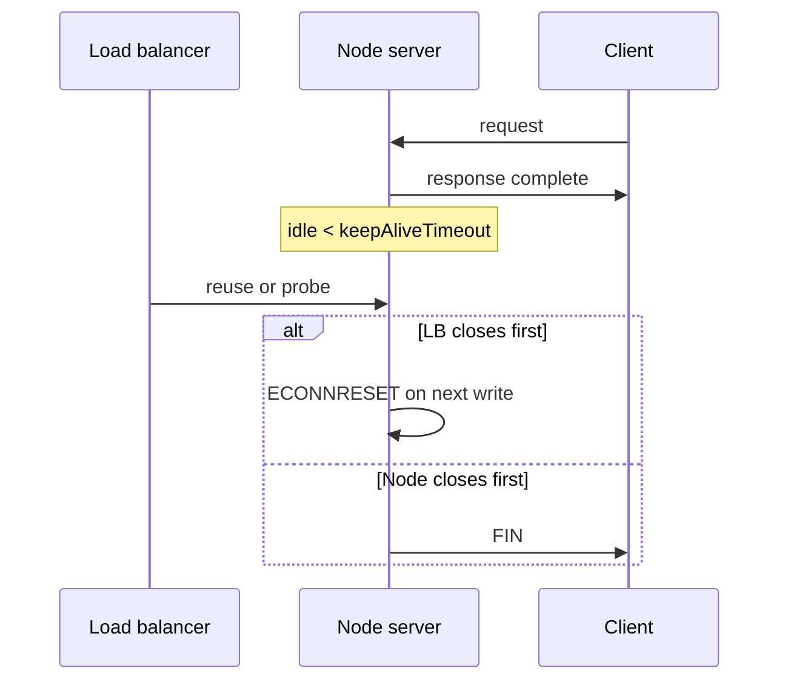

# Keep-Alive Timeouts and Connection Limits

## Overview

HTTP/1.1 **keep-alive** reuses TCP connections for multiple requests, amortizing handshake cost. Node **`http.Server`** exposes **`keepAliveTimeout`**, **`headersTimeout`**, **`requestTimeout`**, and socket-level timeouts. Misconfigured timeouts cause **502s behind load balancers**, **hung sockets**, or **RST surprises** when client and server disagree on idle duration.

Connection **limits** (`maxConnections`, OS `ulimit`, ephemeral ports on clients) bound concurrency and file descriptors.

## Learning Objectives

- Explain keep-alive request sequencing on one socket
- Configure server timeouts to match reverse proxy (ALB, nginx) values
- Implement client-side `Connection: keep-alive` vs `close` behavior
- Detect and close idle/stale connections during graceful shutdown
- Relate connection counts to `server.getConnections` and monitoring

## Prerequisites

- [[06-NodeJS/05-Networking/http and https Platform Servers|http and https Platform Servers]]
- [[06-NodeJS/05-Networking/Request Response Lifecycle and Headers|Request Response Lifecycle and Headers]]

## Difficulty

`advanced`

## Estimated Time

- Reading: 2 hours
- Exercises: 2.5 hours
- Mini project: 4 hours

## History

HTTP/1.0 defaulted to close; HTTP/1.1 persistent connections required careful proxy tuning. Node added modern timeout properties after production incidents (502 when ALB idle < Node idle). HTTP/2 multiplexes on one connection—different limits ([[06-NodeJS/05-Networking/http2 Concepts|http2 Concepts]]).

## Problem It Solves

- **Latency reduction** via connection reuse
- **Resource caps** preventing FD exhaustion
- **Predictable failure** when clients hang mid-request
- **Clean deploys** closing idle connections during drain

## Internal Implementation

### Keep-alive sequencing

After `res.end()`, same socket waits for next request unless `Connection: close`. Server must fully consume request body before reuse—even ignored POST bodies block pipeline.



### Timeout knobs (http.Server)

| Property | Purpose |
| --- | --- |
| `keepAliveTimeout` | Idle time after response before socket destroy |
| `headersTimeout` | Max wait for complete request headers |
| `requestTimeout` | Max time for entire request (incl. body) |
| `timeout` (socket) | General inactivity on underlying socket |

Align **`keepAliveTimeout`** slightly **below** load balancer idle timeout (common pattern: ALB 60s → Node 55s).

## Mermaid Diagrams

### Structure


### Sequence / Lifecycle



## Examples

### Minimal Example — explicit close

```typescript
import http from "node:http";

http.createServer((req, res) => {
  res.setHeader("Connection", "close"); // disable reuse for demo
  res.end("bye\n");
}).listen(8080);
```

### Production-Shaped Example — tuned server + tracking

```typescript
import http from "node:http";

const ACTIVE = new Set<http.ServerResponse>();

export function createProductionServer(handler: http.RequestListener) {
  const server = http.createServer((req, res) => {
    ACTIVE.add(res);
    res.on("finish", () => ACTIVE.delete(res));

    handler(req, res);
  });

  // ALB default idle 60s — sit below it
  server.keepAliveTimeout = 55_000;
  server.headersTimeout = 10_000;
  server.requestTimeout = 30_000;
  server.maxConnections = 10_000; // still bound by ulimit

  return server;
}

export async function drain(server: http.Server, graceMs = 30_000) {
  server.close(); // stop accept
  const deadline = Date.now() + graceMs;
  while (ACTIVE.size > 0 && Date.now() < deadline) {
    await new Promise((r) => setTimeout(r, 250));
  }
  for (const res of ACTIVE) res.destroy();
}
```

Integrate with [[06-NodeJS/10-Production-Node/Graceful Shutdown and Drain|Graceful Shutdown and Drain]].

## Trade-offs

| Dimension | Upside | Downside | When it matters |
| --- | --- | --- | --- |
| Long keep-alive | Fewer handshakes | More open FDs | High QPS APIs |
| Short keep-alive | Faster FD recycle | More TLS cost | Spiky traffic |
| Strict requestTimeout | Limits slowloris | May cut slow uploads | Public internet |
| Connection close | Simple lifecycle | Higher latency | Debugging |

### When to Use

- Always set timeouts explicitly in production
- Track active responses during shutdown
- Match infra documentation (LB, CDN) idle values

### When Not to Use

- Infinite timeouts "because our clients are slow"
- keep-alive without reading/discarding unwanted bodies

## Exercises

1. curl reuse (`curl -v http://localhost:8080/ twice`) vs Connection: close.
2. Simulate slowloris headers; observe headersTimeout.
3. Set Node keepAlive > ALB idle; reproduce intermittent 502 in lab nginx.
4. Graph open sockets vs RPS under keep-alive.

## Mini Project

**Connection observability**: `/metrics` exposing `getConnections`, active handler count, timeout config.

## Portfolio Project

[[06-NodeJS/projects/Graceful Shutdown Harness/README|Graceful Shutdown Harness]]

## Interview Questions

1. Why align keepAliveTimeout with load balancer?
2. Difference headersTimeout vs requestTimeout?
3. What happens if POST body not consumed on keep-alive socket?
4. How maxConnections interacts with ulimit?
5. HTTP/2 keep-alive differences?

### Stretch / Staff-Level

1. Design connection draining for blue/green without dropping in-flight idempotent GETs.
2. Model FD budget: workers × maxConnections × replicas.

## Common Mistakes

- Default infinite timeouts in old Node versions
- LB idle < server idle causing race on reuse
- Not calling `req.resume()` on unwanted bodies
- Ignoring client-side pool exhaustion (ephemeral ports)

## Best Practices

- Document timeout matrix: client, server, LB
- Monitor `ECONNRESET` rate after deploys
- Drain on SIGTERM before exit
- Set `server.maxHeadersCount` / `maxHeaderSize` defensively
- Load-test with keep-alive enabled realistically

## Summary

Keep-alive multiplexes HTTP/1.1 requests on persistent TCP connections; Node exposes timeouts governing idle and incomplete requests. Production stability requires aligning server idle closure with upstream load balancers, enforcing request/header limits, and tracking active responses through graceful shutdown—otherwise mysterious 502s and socket leaks dominate ops work.

## Further Reading

- [Node.js http.Server timeouts](https://nodejs.org/api/http.html#servertimeout)
- [[06-NodeJS/10-Production-Node/Graceful Shutdown and Drain|Graceful Shutdown and Drain]]

## Related Notes

- [[06-NodeJS/05-Networking/http and https Platform Servers|http and https Platform Servers]]
- [[06-NodeJS/05-Networking/Request Response Lifecycle and Headers|Request Response Lifecycle and Headers]]
- [[06-NodeJS/05-Networking/net Sockets and Servers|net Sockets and Servers]]
- [[06-NodeJS/10-Production-Node/Graceful Shutdown and Drain|Graceful Shutdown and Drain]]
- [[06-NodeJS/README|Node.js]]

## Progress Checklist

- [ ] Explained from first principles
- [ ] Drew at least one Mermaid diagram
- [ ] Implemented a minimal version
- [ ] Documented trade-offs and non-goals
- [ ] Completed exercises
- [ ] Practiced interview questions aloud
- [ ] Linked prerequisites and dependents
