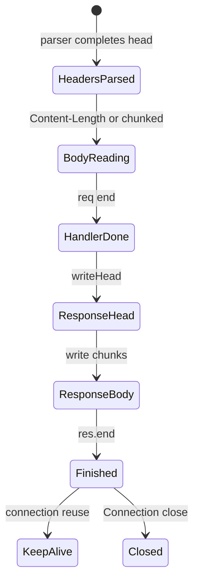
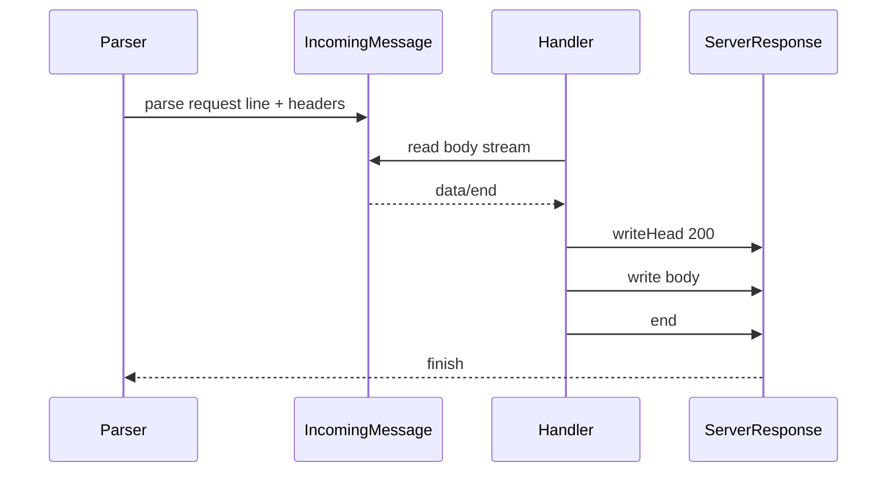

# Request Response Lifecycle and Headers

## Overview

An HTTP exchange on Node passes through distinct **lifecycle phases**: socket accept → request line + headers parsed → optional body streamed on **`IncomingMessage`** → handler produces **`ServerResponse`** → status + headers sent → body written → **`finish`** / connection reuse or close. **Headers** are case-insensitive maps with validation rules; duplicates for some fields (Set-Cookie) are allowed, others are combined.

This note covers **platform semantics**—cookie auth patterns and REST design belong in [[07-Backend/README|Backend]].

## Learning Objectives

- Trace req/res events from socket data to connection idle
- Read and set headers safely; avoid injection and duplicates bugs
- Handle Expect: 100-continue, trailers, and upgrade requests at concept level
- Consume request body with abort/early close handling
- Send responses with correct encoding and caching headers

## Prerequisites

- [[06-NodeJS/05-Networking/http and https Platform Servers|http and https Platform Servers]]

## Difficulty

`advanced`

## Estimated Time

- Reading: 2 hours
- Exercises: 2.5 hours
- Mini project: 4 hours

## History

HTTP/1.1 defined persistent connections and chunked transfer. Node exposes low-level header APIs (`headers` object lowercased keys since Node 14+). HTTP/2 compresses headers (HPACK)—different module. Fetch API standardizes Headers objects in clients; platform server retains traditional API.

## Problem It Solves

- **Correct parsing boundaries** before body read
- **Security**: header injection via `\r\n` in values
- **Caching and content negotiation** at transport layer
- **Observability**: when bytes actually flushed to wire

## Internal Implementation

### Request lifecycle events

`IncomingMessage`: `'aborted'`, `'close'`, `'data'`, `'end'`, `'error'`

`ServerResponse`: `'finish'` (sent), `'close'`, `'error'`

Must not write body after `end()`; `writeHead` sends status + headers once (mostly).



### Header storage

`req.headers` — incoming, keys lowercased. `req.rawHeaders` — alternating original case pairs.

`res.setHeader(name, value)` / `getHeader` / `writeHead(status, headers)`.

Forbidden **transfer-encoding** manipulation in some cases—Node manages chunked encoding when no Content-Length.

## Mermaid Diagrams

### Structure


### Sequence / Lifecycle



## Examples

### Minimal Example — header echo

```typescript
import http from "node:http";

http.createServer((req, res) => {
  const accept = req.headers["accept"] ?? "*/*";
  res.writeHead(200, { "content-type": "text/plain", "x-echo-accept": accept });
  res.end(`method=${req.method} url=${req.url}\n`);
}).listen(8080);
```

### Production-Shaped Example — safe header helper

```typescript
import http from "node:http";
import type { IncomingHttpHeaders } from "node:http";

const CRLF = /[\r\n]/;

export function safeHeaderValue(value: string): string {
  if (CRLF.test(value)) throw new Error("invalid header value");
  return value;
}

export function getRequestId(headers: IncomingHttpHeaders): string | undefined {
  const raw = headers["x-request-id"];
  return typeof raw === "string" ? safeHeaderValue(raw) : undefined;
}

export function createApiServer() {
  return http.createServer(async (req, res) => {
    const requestId = getRequestId(req.headers) ?? crypto.randomUUID();

    req.on("aborted", () => {
      console.warn(JSON.stringify({ event: "client_aborted", requestId }));
    });

    res.setHeader("x-request-id", requestId);
    res.setHeader("content-type", "application/json; charset=utf-8");

    if (req.method === "GET" && req.url === "/ready") {
      res.writeHead(200);
      return res.end(JSON.stringify({ ready: true }));
    }

    res.writeHead(404);
    res.end(JSON.stringify({ error: "not_found" }));
  });
}
```

Validate outbound header values; never reflect unvalidated client headers into Set-Cookie.

## Trade-offs

| Dimension | Upside | Downside | When it matters |
| --- | --- | --- | --- |
| writeHead once | Atomic status+headers | Less flexible late headers | Simple responses |
| setHeader before writeHead | Incremental | Order mistakes | Middleware-like chains |
| Streaming body | Memory | Harder error paths | Uploads |
| Many Set-Cookie | Spec compliant | Must use appendHeader | Auth in Backend |

### When to Use

- Explicit lifecycle logging (TTFB, body complete)
- Header allowlists for proxies
- Low-level caching (`ETag`, `Cache-Control`) in static servers

### When Not to Use

- Full cookie/session frameworks—Backend
- HPACK / HTTP/2 header compression details—http2 note

## Exercises

1. Log timestamps at headers parsed, first body chunk, response finish.
2. Client abort mid-upload; ensure handler stops reading and frees resources.
3. Send response without Content-Length; observe chunked encoding in wireshark/curl -v.
4. Attempt header injection with `\r\n` in query reflected to header; fix.

## Mini Project

HTTP echo/debug server printing rawHeaders, timing phases, and response wire metadata.

## Portfolio Project

[[06-NodeJS/projects/HTTP Server From Scratch/README|HTTP Server From Scratch]] — lifecycle instrumentation.

## Interview Questions

1. Difference between res finish and close?
2. Why are req.header keys lowercased?
3. When is chunked encoding used automatically?
4. How detect client aborted request?
5. Can you set headers after writeHead?

### Stretch / Staff-Level

1. Implement Expect: 100-continue flow for large uploads.
2. Design header allowlist for reverse proxy preventing hop-by-hop leaks.

## Common Mistakes

- Reading body before checking method/url/headers
- Double `writeHead` calls
- Assuming `req.url` is path only (includes query string)
- Not handling `100 Continue` interactions for large POSTs

## Best Practices

- Validate and sanitize header values
- Attach abort listeners on long uploads
- Set security headers at platform layer when no framework
- Use structured logging with requestId from incoming or generated
- Document which headers your server treats as trusted

## Summary

Platform HTTP on Node separates header parsing from streaming bodies on IncomingMessage and coordinates response commit via writeHead/setHeader before ServerResponse finishes. Lifecycle events—aborted, end, finish—define when resources release and connections reuse. Correct header handling prevents injection bugs and ambiguous responses; deeper product concerns defer to Backend layers.

## Further Reading

- [Node.js HTTP IncomingMessage](https://nodejs.org/api/http.html#class-httpincomingmessage)
- [Node.js HTTP ServerResponse](https://nodejs.org/api/http.html#class-httpserverresponse)

## Related Notes

- [[06-NodeJS/05-Networking/http and https Platform Servers|http and https Platform Servers]]
- [[06-NodeJS/05-Networking/Keep-Alive Timeouts and Connection Limits|Keep-Alive Timeouts and Connection Limits]]
- [[06-NodeJS/10-Production-Node/Structured Logging and Correlation IDs|Structured Logging and Correlation IDs]]
- [[07-Backend/README|Backend]]
- [[06-NodeJS/README|Node.js]]

## Progress Checklist

- [ ] Explained from first principles
- [ ] Drew at least one Mermaid diagram
- [ ] Implemented a minimal version
- [ ] Documented trade-offs and non-goals
- [ ] Completed exercises
- [ ] Practiced interview questions aloud
- [ ] Linked prerequisites and dependents
