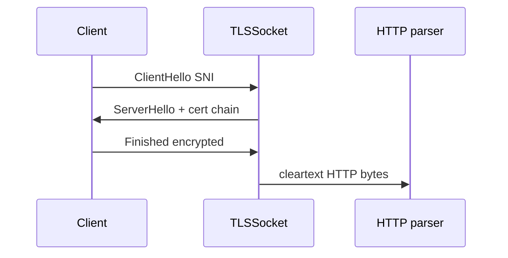
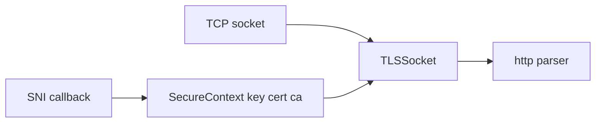
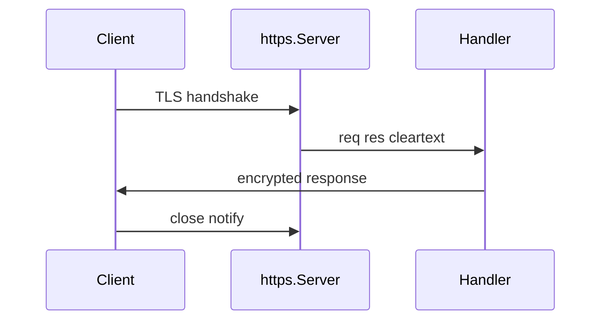

# TLS Certificates and Secure Servers Concepts

## Overview

**TLS** encrypts and authenticates traffic above TCP. Node's **`tls` module** wraps sockets into **`TLSSocket`**; **`https.createServer`** combines TLS termination with HTTP parsing. Operators supply **certificate chains** (leaf + intermediates), **private keys**, and optionally **SNI** for multi-host certs. Node handles handshake, cipher negotiation, and session reuse— but **trust, rotation, and mTLS policy** remain application/infra concerns ([[18-Security/README|Security]], [[16-DevOps/README|DevOps]]).

This note covers **host TLS mechanics**, not OAuth or API auth ([[07-Backend/README|Backend]]).

## Learning Objectives

- Create HTTPS server with key/cert and intermediate chain
- Explain TLS handshake phases at socket level
- Configure minimum TLS version, cipher suites, and SNI callback
- Use `tls.connect` for secure client sockets and certificate verification
- Recognize operational tasks: renewal, stapling, HSTS at proxy vs Node

## Prerequisites

- [[06-NodeJS/05-Networking/http and https Platform Servers|http and https Platform Servers]]
- [[06-NodeJS/05-Networking/net Sockets and Servers|net Sockets and Servers]]

## Difficulty

`advanced`

## Estimated Time

- Reading: 2.5 hours
- Exercises: 3 hours
- Mini project: 5 hours

## History

Node delegated crypto to OpenSSL (now often BoringSSL/quictls builds depending on distribution). Let's Encrypt democratized automation; most production TLS terminates at load balancers/CDNs, with Node TLS still vital for mTLS internal mesh, local dev, and sidecars.

## Problem It Solves

- **Confidentiality/integrity** on the wire
- **Server identity** via X.509 chain validation
- **Optional client certificates** (mTLS) for service identity
- **End-to-end encryption** when not offloaded at LB

## Internal Implementation

### Handshake (simplified)

1. ClientHello (versions, ciphers, SNI)
2. ServerHello + certificate chain
3. Key exchange → session keys
4. Encrypted application data (HTTP inside)



### Secure context

`tls.createSecureContext({ key, cert, ca, minVersion })` shared across connections for performance.

## Mermaid Diagrams

### Structure



### Sequence / Lifecycle



## Examples

### Minimal Example — local HTTPS

```typescript
import https from "node:https";
import fs from "node:fs";

const options = {
  key: fs.readFileSync("certs/key.pem"),
  cert: fs.readFileSync("certs/cert.pem"),
};

https.createServer(options, (req, res) => {
  res.end("secure\n");
}).listen(8443);
```

Generate dev certs: `openssl req -x509 -newkey rsa:2048 -nodes -keyout key.pem -out cert.pem -days 365`

### Production-Shaped Example — SNI multi-host

```typescript
import tls from "node:tls";
import fs from "node:fs";
import https from "node:https";

const contexts = {
  "api.example.com": tls.createSecureContext({
    key: fs.readFileSync("/secrets/api-key.pem"),
    cert: fs.readFileSync("/secrets/api-fullchain.pem"),
    minVersion: "TLSv1.2",
  }),
  "internal.example.com": tls.createSecureContext({
    key: fs.readFileSync("/secrets/internal-key.pem"),
    cert: fs.readFileSync("/secrets/internal-fullchain.pem"),
    ca: fs.readFileSync("/secrets/internal-ca.pem"),
    requestCert: true,
    rejectUnauthorized: true,
  }),
};

export function createSniServer(handler: https.RequestListener) {
  return https.createServer(
    {
      SNICallback(servername, cb) {
        const ctx = contexts[servername as keyof typeof contexts];
        cb(undefined, ctx ?? contexts["api.example.com"]);
      },
    },
    handler,
  );
}
```

Prefer terminating public TLS at LB; use Node TLS for internal mTLS with short-lived certs from PKI.

## Trade-offs

| Dimension | Upside | Downside | When it matters |
| --- | --- | --- | --- |
| Terminate at Node | E2E control | Cert ops on app | mTLS mesh |
| Terminate at LB | Central rotation | Node sees plain HTTP | Public web |
| mTLS | Strong service ID | Complexity | Zero-trust internal |
| Session reuse | Faster handshakes | State management | High connection churn |

### When to Use

- Internal service-to-service TLS
- Local HTTPS dev parity
- Sidecar or small deployments without LB

### When Not to Use

- Rolling your own crypto primitives
- Long-lived self-signed in production without PKI discipline
- Storing keys in repo—use secrets manager

## Exercises

1. curl with `--cacert` vs `-k`; explain verification failure modes.
2. Enable `requestCert` client cert; reject unauthorized clients.
3. Log negotiated cipher and protocol version on secureConnection.
4. Compare handshake latency with session reuse enabled.

## Mini Project

**mTLS hello service**: issue client certs from local CA; Node server accepts only signed clients.

## Portfolio Project

[[06-NodeJS/projects/HTTP Server From Scratch/README|HTTP Server From Scratch]] HTTPS variant.

## Interview Questions

1. Difference tls.createServer vs https.createServer?
2. What is SNI and when needed?
3. Why include intermediate certs in `cert` chain?
4. TLS termination at LB implications for security headers?
5. How verify cert on tls.connect client?

### Stretch / Staff-Level

1. Design cert rotation with zero downtime behind Kubernetes.
2. Compare Node TLS vs service mesh sidecar mTLS.

## Common Mistakes

- Omitting intermediate certs (Android/old clients fail)
- Disabling verification globally (`NODE_TLS_REJECT_UNAUTHORIZED=0`)
- Weak keys or TLS 1.0 enabled
- Not reloading certs on renewal without restart strategy

## Best Practices

- `minVersion: 'TLSv1.2'` or higher
- Full chain from secret store; automate renewal
- Prefer LB termination for public traffic; document trust boundaries
- Monitor cert expiry proactively
- Use `secureProtocol` defaults; avoid custom cipher soup

## Summary

Node TLS wraps TCP with handshake, encryption, and optional client authentication before HTTP or application protocols run. Platform operators must supply correct chains, version policy, and SNI routing; most public deployments terminate TLS upstream while Node TLS remains essential for internal mTLS and secure-by-default development. Certificate lifecycle belongs to ops; Node exposes the socket machinery to use certs correctly.

## Further Reading

- [Node.js tls documentation](https://nodejs.org/api/tls.html)
- [Node.js https documentation](https://nodejs.org/api/https.html)

## Related Notes

- [[06-NodeJS/05-Networking/http and https Platform Servers|http and https Platform Servers]]
- [[06-NodeJS/05-Networking/http2 Concepts|http2 Concepts]]
- [[06-NodeJS/09-Security-and-Supply-Chain/Secrets Env Injection and Least Privilege|Secrets Env Injection and Least Privilege]]
- [[18-Security/README|Security]]
- [[06-NodeJS/README|Node.js]]

## Progress Checklist

- [ ] Explained from first principles
- [ ] Drew at least one Mermaid diagram
- [ ] Implemented a minimal version
- [ ] Documented trade-offs and non-goals
- [ ] Completed exercises
- [ ] Practiced interview questions aloud
- [ ] Linked prerequisites and dependents
