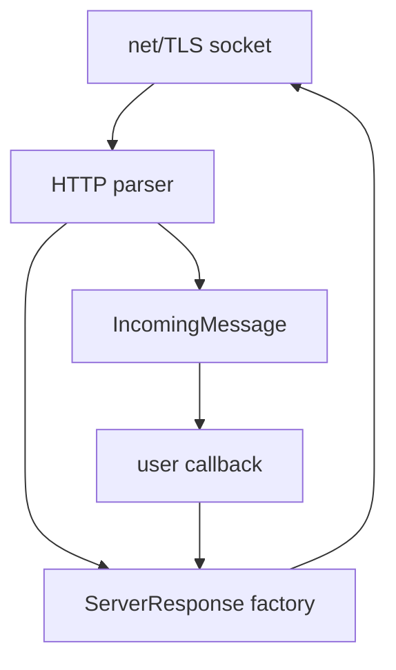
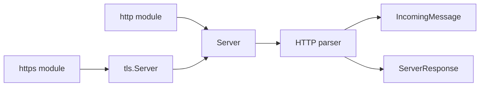
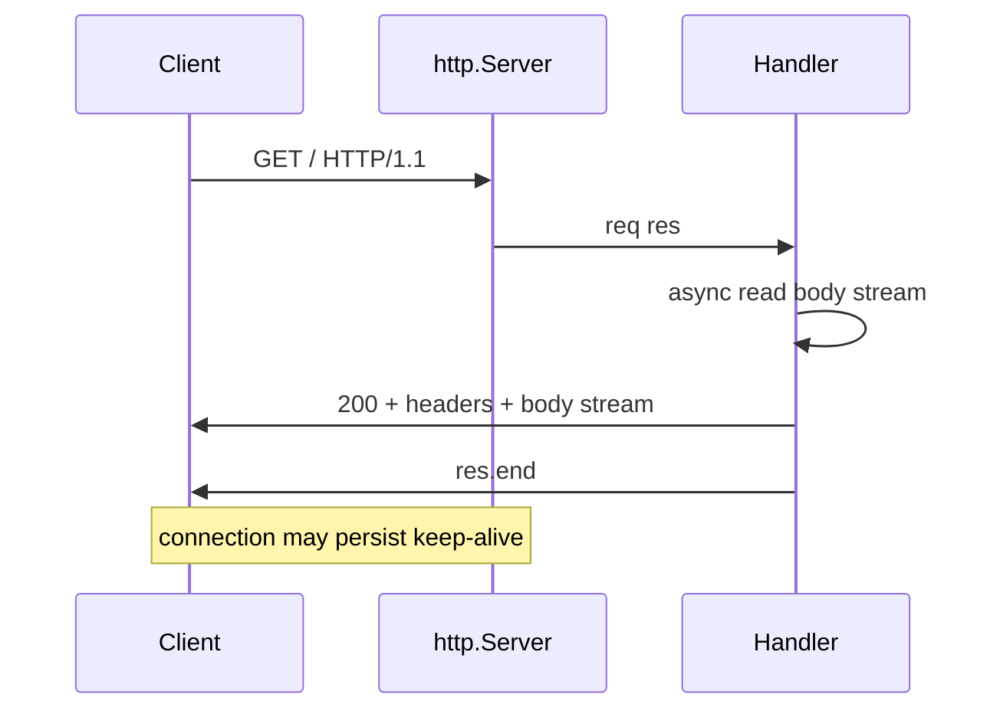

# http and https Platform Servers

## Overview

**`http.createServer`** and **`https.createServer`** are Node's **platform HTTP servers**: they parse requests on TCP (or TLS) sockets, emit **`IncomingMessage`** (Readable request body) and **`ServerResponse`** (Writable response), and manage connection reuse. They intentionally exclude routing, auth, and middleware—that is [[07-Backend/README|Backend]] territory.

Understanding platform servers means knowing parsing limits, header rules, streaming bodies, and server lifecycle—not reimplementing Express.

## Learning Objectives

- Create HTTP/HTTPS servers without frameworks
- Stream request bodies and responses with correct headers
- Set status, headers, and chunked encoding behavior
- Use `http.request` / `https.request` as thin clients
- Configure server timeouts and max header size

## Prerequisites

- [[06-NodeJS/05-Networking/net Sockets and Servers|net Sockets and Servers]]
- [[06-NodeJS/04-Buffers-Streams-and-IO/Readable Writable and Duplex Streams|Readable Writable and Duplex Streams]]

## Difficulty

`advanced`

## Estimated Time

- Reading: 2.5 hours
- Exercises: 3 hours
- Mini project: 6 hours

## History

Node's `http` module implemented HTTP/1.1 parsing in JS/C++ binding layers early on; `https` wraps TLS around same parser. HTTP/2 is separate module ([[06-NodeJS/05-Networking/http2 Concepts|http2 Concepts]]). Undici/fetch added client-side modern APIs but platform server remains foundational for proxies and learning.

## Problem It Solves

- **Minimal dependencies** for health checks, webhooks, sidecars
- **Full control** over bytes, headers, and connection behavior
- **Foundation** for understanding frameworks built atop `req`/`res`
- **Integration testing** HTTP without spinning full Backend stack

## Internal Implementation

### Request/response objects

- **`IncomingMessage`**: inherits Readable; headers parsed; `method`, `url`, `httpVersion`
- **`ServerResponse`**: inherits Writable; `writeHead`, `setHeader`, `statusCode`
- Parser runs on socket data; may pipeline multiple requests on keep-alive connection



### HTTPS

`https.createServer({ key, cert }, handler)` — TLS handshake before HTTP parser sees cleartext.

## Mermaid Diagrams

### Structure



### Sequence / Lifecycle



## Examples

### Minimal Example — hello server

```typescript
import http from "node:http";

const server = http.createServer((req, res) => {
  res.writeHead(200, { "content-type": "text/plain" });
  res.end("ok\n");
});

server.listen(8080);
```

### Production-Shaped Example — streaming JSON ingest

```typescript
import http from "node:http";
import { pipeline } from "node:stream/promises";
import { createGunzip } from "node:zlib";
import { Writable } from "node:stream";

const MAX_BYTES = 5 * 1024 * 1024;

export function createIngestServer(onRecord: (obj: unknown) => void) {
  return http.createServer(async (req, res) => {
    if (req.method !== "POST" || req.url !== "/ingest") {
      res.writeHead(404);
      return res.end();
    }

    let bytes = 0;
    const limiter = new Writable({
      write(chunk, _enc, cb) {
        bytes += chunk.length;
        if (bytes > MAX_BYTES) return cb(new Error("too large"));
        cb();
      },
    });

    const sink = new Writable({
      objectMode: false,
      write(chunk, _enc, cb) {
        try {
          onRecord(JSON.parse(chunk.toString()));
          cb();
        } catch (e) {
          cb(e as Error);
        }
      },
    });

    try {
      const streams = [req, limiter];
      if (req.headers["content-encoding"] === "gzip") streams.push(createGunzip());
      streams.push(sink);
      await pipeline(...streams as [NodeJS.ReadableStream, ...NodeJS.ReadWriteStream[]]);
      res.writeHead(202);
      res.end();
    } catch (err) {
      res.writeHead(413);
      res.end(String(err));
    }
  });
}
```

Set `server.requestTimeout`, `headersTimeout`, `keepAliveTimeout` per keep-alive note.

## Trade-offs

| Dimension | Upside | Downside | When it matters |
| --- | --- | --- | --- |
| Platform http | Zero framework deps | Manual everything | Sidecars |
| Streaming bodies | Memory safe | Handler complexity | Uploads |
| https built-in | Integrated TLS | Cert ops separate | Public endpoints |
| http client | Simple | No fetch ergonomics | Legacy scripts |

### When to Use

- Health/readiness endpoints in workers
- Webhook receivers with strict header/body control
- Learning and [[06-NodeJS/projects/HTTP Server From Scratch/README|HTTP Server From Scratch]]

### When Not to Use

- Complex routing, auth, ORM—Backend frameworks
- HTTP/2 push/multiplex needs—`http2` module
- High-level retry/client features—Undici/fetch

## Exercises

1. Implement GET `/health` and POST `/echo` streaming echo body.
2. Create HTTPS server with self-signed cert; curl -k test.
3. Client `http.request` with chunked upload; server counts bytes.
4. Trigger 431 by oversized headers; tune `maxHeaderSize`.

## Mini Project

Thin static file + API server: method routing map, stream files, global error handler.

## Portfolio Project

[[06-NodeJS/projects/HTTP Server From Scratch/README|HTTP Server From Scratch]]

## Interview Questions

1. IncomingMessage vs ServerResponse stream types?
2. How does platform server relate to net.Socket?
3. When must Content-Length vs chunked encoding be set?
4. Difference http.createServer vs https.createServer options?
5. What server timeouts exist in modern Node?

### Stretch / Staff-Level

1. Implement HTTP/1.1 keep-alive request queue on one socket.
2. Compare Undici server experimental vs http module trade-offs.

## Common Mistakes

- Calling `res.end()` before async body read finishes
- Not handling `req`/`res` errors on aborted clients
- Buffering entire body on upload endpoints
- Missing `Content-Type` on JSON responses

## Best Practices

- Stream bodies; enforce size limits
- Set timeouts explicitly
- Use `pipeline` for req transforms
- Centralize error → status mapping
- Log method, url, status, duration—structured

## Summary

Node's `http`/`https` modules implement HTTP/1.x parsing and response serialization over stream-based sockets. They are the platform layer for inbound web traffic: request Readable, response Writable, connection reuse, and TLS termination. Production use requires streaming discipline, timeouts, and clear handoff to Backend frameworks when product complexity grows.

## Further Reading

- [Node.js http documentation](https://nodejs.org/api/http.html)
- [Node.js https documentation](https://nodejs.org/api/https.html)

## Related Notes

- [[06-NodeJS/05-Networking/Request Response Lifecycle and Headers|Request Response Lifecycle and Headers]]
- [[06-NodeJS/05-Networking/Keep-Alive Timeouts and Connection Limits|Keep-Alive Timeouts and Connection Limits]]
- [[06-NodeJS/05-Networking/TLS Certificates and Secure Servers Concepts|TLS Certificates and Secure Servers Concepts]]
- [[06-NodeJS/05-Networking/http2 Concepts|http2 Concepts]]
- [[07-Backend/README|Backend]]

## Progress Checklist

- [ ] Explained from first principles
- [ ] Drew at least one Mermaid diagram
- [ ] Implemented a minimal version
- [ ] Documented trade-offs and non-goals
- [ ] Completed exercises
- [ ] Practiced interview questions aloud
- [ ] Linked prerequisites and dependents
