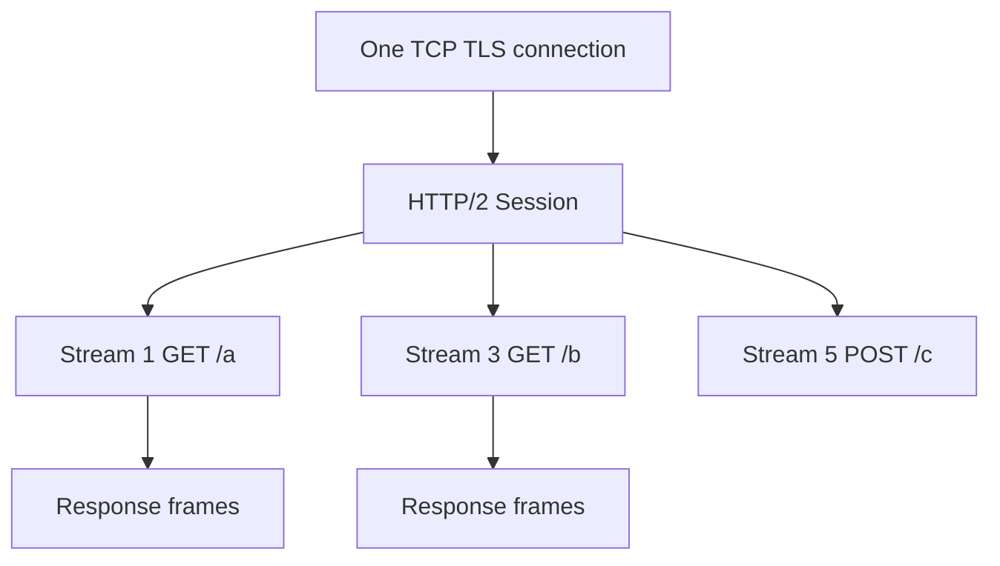
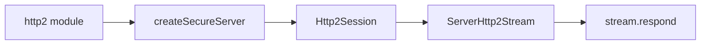
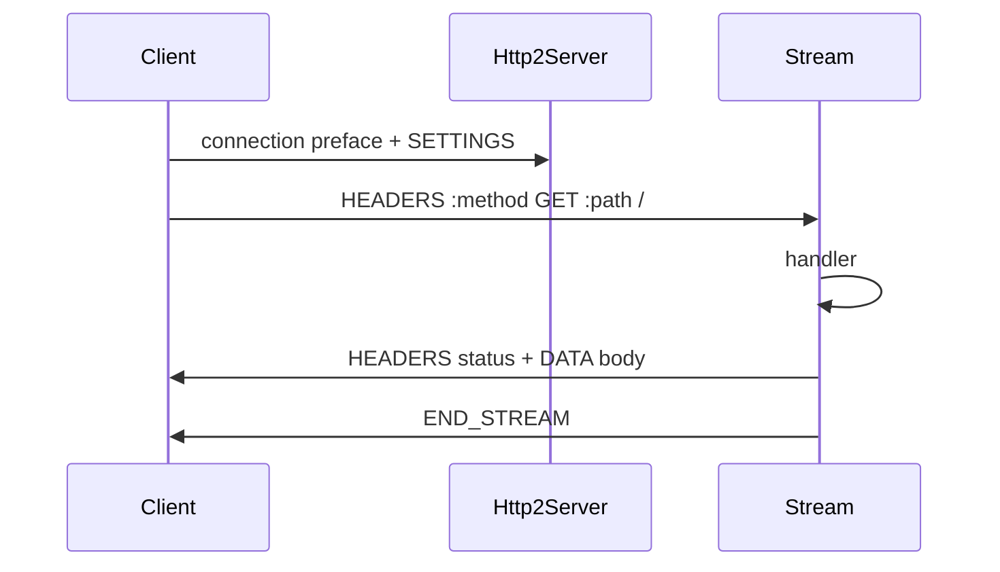

# http2 Concepts

## Overview

**HTTP/2** multiplexes many request/response **streams** over **one TCP (or TLS) connection**, compresses headers with **HPACK**, and supports binary framing instead of textual HTTP/1.1. Node's **`http2` module** provides **`Http2Server`**, **`ServerHttp2Stream`**, and client sessions. ALPN negotiates `h2` during TLS handshake for HTTPS.

This note covers **platform h2 concepts**—HTTP/2 product APIs and gRPC live in [[07-Backend/README|Backend]] / [[09-System-Design/README|System Design]].

## Learning Objectives

- Contrast HTTP/1.1 keep-alive with HTTP/2 multiplexing
- Create HTTP/2 secure server with `http2.createSecureServer`
- Explain streams, flow control windows, and HEADERS/DATA frames at high level
- Use `:method`, `:path`, `:authority` pseudo-headers correctly
- Know when to prefer h2 vs HTTP/1.1 or HTTP/3 elsewhere

## Prerequisites

- [[06-NodeJS/05-Networking/http and https Platform Servers|http and https Platform Servers]]
- [[06-NodeJS/05-Networking/TLS Certificates and Secure Servers Concepts|TLS Certificates and Secure Servers Concepts]]

## Difficulty

`advanced`

## Estimated Time

- Reading: 2 hours
- Exercises: 2.5 hours
- Mini project: 4 hours

## History

SPDY at Google evolved into HTTP/2 (RFC 7540, 2015). Node added `http2` module in v8.4; mature by v10+. Browsers require h2 over TLS (h2c cleartext rare). HTTP/3 (QUIC) is separate stack—not Node core `http2`.

## Problem It Solves

- **Head-of-line blocking reduction** vs single HTTP/1.1 pipeline
- **Header compression** on repetitive API calls
- **Server push** (largely deprecated in practice) for assets
- **Single connection efficiency** for many parallel API requests from browser

## Internal Implementation

### Session and streams

- **Session**: one connection context
- **Stream**: bidirectional byte flow with ID; request/response pair maps to stream
- **Flow control**: per-stream and connection windows (similar spirit to TCP backpressure)



### HPACK

Static + dynamic table compresses header names/values; sensitive headers (`Cookie`) may be encoded literally per security guidance.

## Mermaid Diagrams

### Structure



### Sequence / Lifecycle



## Examples

### Minimal Example — h2 server

```typescript
import http2 from "node:http2";
import fs from "node:fs";

const server = http2.createSecureServer({
  key: fs.readFileSync("certs/key.pem"),
  cert: fs.readFileSync("certs/cert.pem"),
});

server.on("stream", (stream, headers) => {
  stream.respond({
    ":status": 200,
    "content-type": "text/plain",
  });
  stream.end("hello h2\n");
});

server.listen(8443);
```

### Production-Shaped Example — JSON API with error handling

```typescript
import http2 from "node:http2";
import fs from "node:fs";

export function createH2Api() {
  const server = http2.createSecureServer({
    key: fs.readFileSync(process.env.TLS_KEY!),
    cert: fs.readFileSync(process.env.TLS_CERT!),
    allowHTTP1: true, // ALPN fallback for old clients
  });

  server.on("stream", (stream, headers) => {
    const method = headers[":method"];
    const path = headers[":path"];

    stream.on("error", (err) => {
      console.error(JSON.stringify({ event: "h2_stream_error", err: String(err) }));
    });

    if (method !== "GET" || path !== "/health") {
      stream.respond({ ":status": 404 });
      return stream.end();
    }

    const body = JSON.stringify({ ok: true, protocol: "h2" });
    stream.respond({
      ":status": 200,
      "content-type": "application/json",
      "content-length": Buffer.byteLength(body),
    });
    stream.end(body);
  });

  return server;
}
```

Set session timeouts; monitor concurrent streams; most public traffic still terminates h2 at CDN/LB.

## Trade-offs

| Dimension | Upside | Downside | When it matters |
| --- | --- | --- | --- |
| Multiplexing | Fewer connections | Complex debugging | Browser APIs |
| HPACK | Smaller headers | CPU, security care | Cookie-heavy |
| h2c | No TLS overhead | Rarely deployed | Internal lab |
| HTTP/1.1 fallback | Compatibility | Two code paths | Transitional |

### When to Use

- Browser-facing APIs behind TLS with ALPN h2
- Many parallel small requests on one connection
- gRPC builds on h2 elsewhere (not raw Node http2 in app code usually)

### When Not to Use

- Simple internal JSON over HTTP/1.1 suffices
- When LB already handles h2 to clients and speaks HTTP/1.1 to origin
- Server push new features—largely abandoned

## Exercises

1. curl --http2 https://localhost:8443/health vs HTTP/1.1 verbose compare headers.
2. Open two parallel streams; measure interleaving on wire (optional wireshark).
3. Trigger stream reset (`RST_STREAM`); observe client error.
4. Enable `allowHTTP1`; test ALPN negotiation with openssl s_client.

## Mini Project

Mirror HTTP/1 server routes on http2 `:path` router with shared handler logic.

## Portfolio Project

[[06-NodeJS/projects/HTTP Server From Scratch/README|HTTP Server From Scratch]] optional h2 branch.

## Interview Questions

1. How does h2 multiplex differ from HTTP/1.1 keep-alive?
2. What are pseudo-headers?
3. Why is HPACK related to security?
4. Node module for h2 vs https relationship?
5. When does TCP HOL blocking still exist with h2?

### Stretch / Staff-Level

1. Design origin strategy when CDN speaks h2 and origin HTTP/1.1.
2. Compare http2 module vs HTTP/3 future in Node ecosystem.

## Common Mistakes

- Treating h2 stream like HTTP/1 req/res objects without stream events
- Missing `:status` in respond headers
- Ignoring stream flow control → stall under load
- Assuming server push benefits without measurement

## Best Practices

- Terminate h2 at edge unless strong reason not to
- Handle per-stream errors; don't crash session
- Set max concurrent streams if needed
- Log `:authority` and stream id for trace correlation
- Load-test multiplexed workloads, not only single stream

## Summary

HTTP/2 frames many streams over one connection with compressed headers, implemented in Node via the `http2` module atop TLS ALPN. It improves connection efficiency versus HTTP/1.1 pipelining but adds framing, flow control, and operational complexity. Platform knowledge—pseudo-headers, stream lifecycle, secure server setup—clarifies what proxies and Backend frameworks abstract away.

## Further Reading

- [Node.js http2 documentation](https://nodejs.org/api/http2.html)
- [RFC 7540 HTTP/2](https://www.rfc-editor.org/rfc/rfc7540)

## Related Notes

- [[06-NodeJS/05-Networking/http and https Platform Servers|http and https Platform Servers]]
- [[06-NodeJS/05-Networking/TLS Certificates and Secure Servers Concepts|TLS Certificates and Secure Servers Concepts]]
- [[06-NodeJS/05-Networking/Keep-Alive Timeouts and Connection Limits|Keep-Alive Timeouts and Connection Limits]]
- [[09-System-Design/README|System Design]]
- [[06-NodeJS/README|Node.js]]

## Progress Checklist

- [ ] Explained from first principles
- [ ] Drew at least one Mermaid diagram
- [ ] Implemented a minimal version
- [ ] Documented trade-offs and non-goals
- [ ] Completed exercises
- [ ] Practiced interview questions aloud
- [ ] Linked prerequisites and dependents
