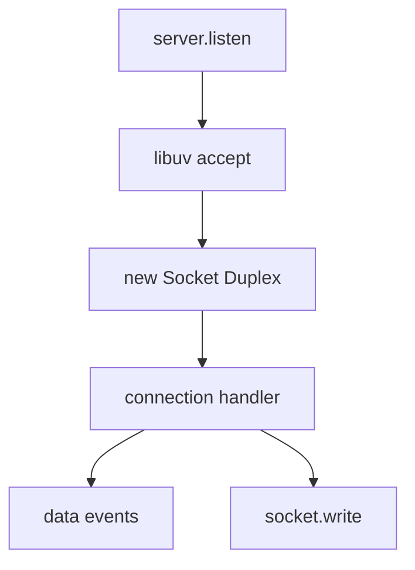
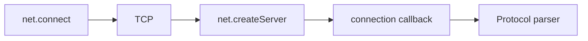
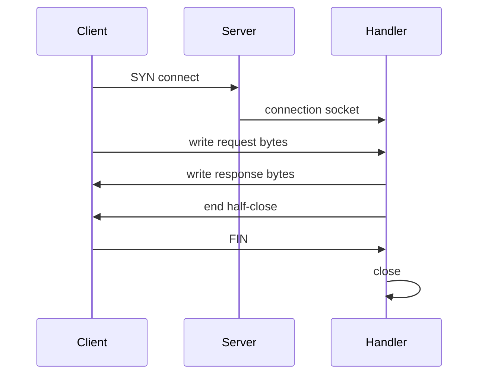

# net Sockets and Servers

## Overview

The **`net` module** exposes TCP (and local IPC) **sockets** and **servers**. A **`net.Socket`** is a **`Duplex` stream** of bytes; **`net.createServer`** accepts connections and emits `'connection'` with a socket per client. This is the foundation beneath **`http`** (HTTP parses bytes on top of sockets) and custom protocols (Redis, Postgres wire format, game servers).

This note stays **thin transport**—no Express routing ([[07-Backend/README|Backend]]).

## Learning Objectives

- Create TCP server and client with explicit encoding/binary handling
- Configure socket options: `noDelay`, `keepAlive`, timeout, `allowHalfOpen`
- Handle backpressure on socket writes and half-close semantics
- Build length-prefixed or delimiter-framed protocol on raw TCP
- Gracefully close server and drain existing connections

## Prerequisites

- [[06-NodeJS/04-Buffers-Streams-and-IO/Readable Writable and Duplex Streams|Readable Writable and Duplex Streams]]
- [[06-NodeJS/04-Buffers-Streams-and-IO/Buffer and Typed Array Boundaries|Buffer and Typed Array Boundaries]]

## Difficulty

`advanced`

## Estimated Time

- Reading: 2 hours
- Exercises: 3 hours
- Mini project: 5 hours

## History

Node's earliest networking was `net` + manual HTTP parsing before `http` module matured. libuv wraps non-blocking BSD sockets / IOCP / epoll. Modern services often use HTTP/gRPC, but TCP remains essential for proxies, databases, message brokers, and debugging with `nc`.

## Problem It Solves

- **Custom binary protocols** lower overhead than HTTP
- **Persistent connections** with application-level framing
- **Teaching transport layer** before HTTP abstraction
- **Integration tests** with ephemeral ports (`listen(0)`)

## Internal Implementation

### Server accept loop

libuv listens on bound handle; on readable connection event, Node creates Socket, emits `'connection'`.



### Socket as Duplex stream

- Readable side: inbound bytes from kernel buffer
- Writable side: outbound bytes queued until drained to kernel
- `socket.end()` half-closes write side; peer may still send
- `destroy()` forcefully closes

## Mermaid Diagrams

### Structure



### Sequence / Lifecycle



## Examples

### Minimal Example — echo server

```typescript
import net from "node:net";

const server = net.createServer((socket) => {
  socket.pipe(socket); // echo
});

server.listen(9000, () => console.log("listening 9000"));
```

### Production-Shaped Example — framed RPC handler

```typescript
import net from "node:net";
import { FrameParser } from "./frame-parser.js"; // see Buffer note

export function createRpcServer(
  onFrame: (payload: Buffer, socket: net.Socket) => void,
) {
  const parser = new FrameParser();

  return net.createServer((socket) => {
    socket.setNoDelay(true);
    socket.setTimeout(30_000, () => socket.destroy(new Error("timeout")));

    socket.on("data", (chunk) => {
      for (const frame of parser.push(chunk)) {
        try {
          onFrame(frame, socket);
        } catch (err) {
          socket.destroy(err as Error);
        }
      }
    });

    socket.on("error", (err) => {
      console.error(JSON.stringify({ event: "socket_error", err: String(err) }));
    });
  });
}

export function start(server: net.Server, port = 0): Promise<number> {
  return new Promise((resolve, reject) => {
    server.once("error", reject);
    server.listen(port, () => {
      const addr = server.address();
      if (addr && typeof addr === "object") resolve(addr.port);
      else reject(new Error("no address"));
    });
  });
}
```

Set max connections, logging, and graceful shutdown (see [[06-NodeJS/10-Production-Node/Graceful Shutdown and Drain|Graceful Shutdown and Drain]]).

## Trade-offs

| Dimension | Upside | Downside | When it matters |
| --- | --- | --- | --- |
| Raw TCP | Low overhead, full control | No standard framing | Custom protocols |
| HTTP on net | Manual | Reinventing wheels | Learning only |
| keepAlive | Reuse connections | State complexity | High QPS clients |
| noDelay | Lower latency | More packets | Interactive RPC |

### When to Use

- Speaking non-HTTP wire protocols
- Building teaching HTTP from scratch
- Low-latency internal services with custom framing

### When Not to Use

- Public REST APIs—use `http`/`https` or Backend frameworks
- When TLS needed without extra layer—prefer `tls` module (see TLS note)

## Exercises

1. Implement length-prefixed client/server with max frame size.
2. Demonstrate half-close: server ends write while reading trailing client data.
3. Load-test echo server; observe `ECONNRESET` when write buffer exceeded without drain.
4. Bind port 0; print ephemeral port; connect client in test.

## Mini Project

**Mini Redis-subset protocol**: RESP-like parser on `net`, PING/PONG, integration tests.

## Portfolio Project

[[06-NodeJS/projects/HTTP Server From Scratch/README|HTTP Server From Scratch]] — TCP layer beneath HTTP parser.

## Interview Questions

1. How is net.Socket related to streams?
2. Effect of `setNoDelay(true)`?
3. Difference between `end`, `destroy`, and `unref`?
4. How HTTP relates to net?
5. What happens if handler never consumes incoming data?

### Stretch / Staff-Level

1. Design connection pool over raw TCP with health checks and backpressure.
2. Compare net server scaling with cluster vs SO_REUSEPORT platforms.

## Common Mistakes

- Assuming `socket.write` always succeeds (ignore backpressure)
- String encoding binary protocols
- No timeout on idle connections
- Framing bugs allowing memory DoS (unbounded length)

## Best Practices

- Frame messages explicitly; cap sizes
- Set timeouts; log remoteAddress/remotePort
- Handle errors on both server and socket
- Use `server.close` + track active sockets for shutdown
- Disable Nagle only when profiling shows benefit

## Summary

`net` provides Duplex TCP sockets and a connection acceptor—the byte transport beneath higher-level protocols. Correct use demands stream backpressure awareness, explicit framing, timeouts, and graceful lifecycle management. Mastering raw sockets clarifies what HTTP and TLS add on top without magic.

## Further Reading

- [Node.js net documentation](https://nodejs.org/api/net.html)

## Related Notes

- [[06-NodeJS/05-Networking/http and https Platform Servers|http and https Platform Servers]]
- [[06-NodeJS/05-Networking/TLS Certificates and Secure Servers Concepts|TLS Certificates and Secure Servers Concepts]]
- [[06-NodeJS/05-Networking/Keep-Alive Timeouts and Connection Limits|Keep-Alive Timeouts and Connection Limits]]
- [[06-NodeJS/04-Buffers-Streams-and-IO/Backpressure and HighWaterMark|Backpressure and HighWaterMark]]
- [[06-NodeJS/README|Node.js]]

## Progress Checklist

- [ ] Explained from first principles
- [ ] Drew at least one Mermaid diagram
- [ ] Implemented a minimal version
- [ ] Documented trade-offs and non-goals
- [ ] Completed exercises
- [ ] Practiced interview questions aloud
- [ ] Linked prerequisites and dependents
