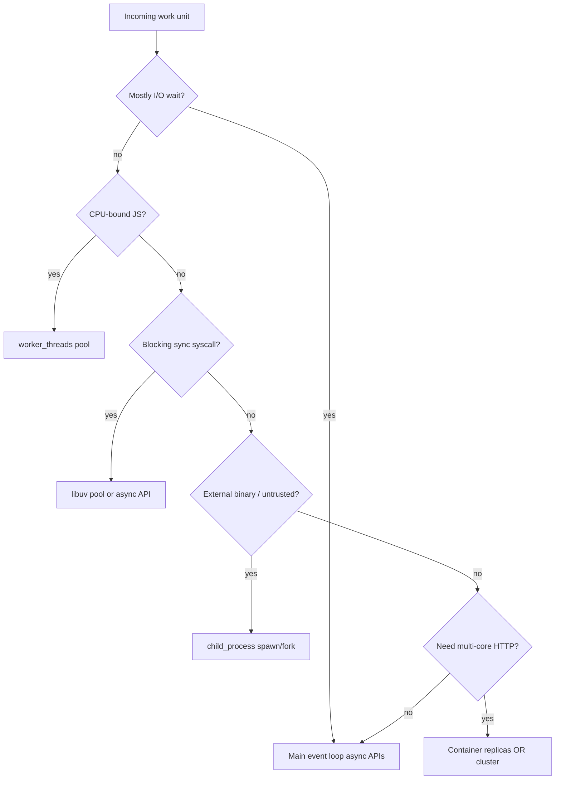
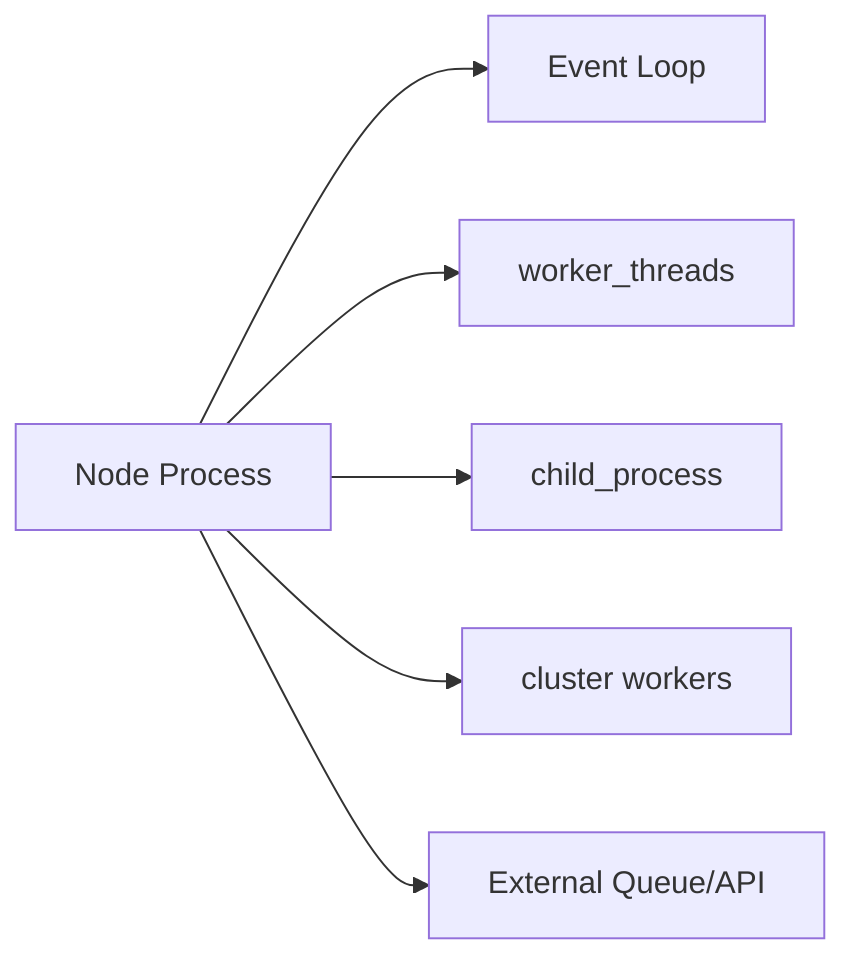
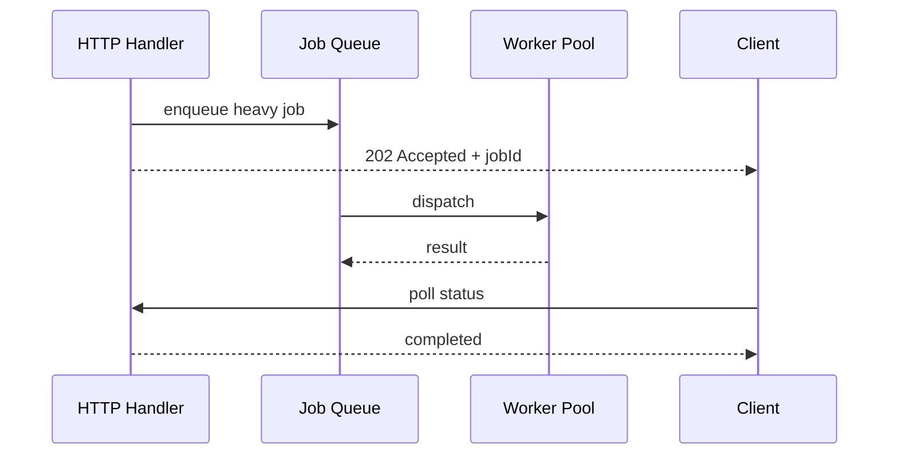

# Choosing Threads Processes and Offload

## Overview

Node offers **four** distinct parallelism/isolation layers: the **event loop** (async I/O), the **libuv thread pool** (blocking syscalls), **`worker_threads`** (in-process JS threads), and **separate processes** (`child_process`, `cluster`, containers). **Offload** means moving work to another tier entirely—native addons, WASM, external services, serverless functions, or GPU. Production decisions hinge on **workload shape** (I/O vs CPU), **state sharing**, **failure blast radius**, **startup cost**, and **operational model** (VM vs Kubernetes). This note is a decision framework, not a dogma chart.

## Learning Objectives

- Classify workloads as I/O-bound, CPU-bound JS, blocking syscall, or foreign binary
- Select among event loop, thread pool, workers, processes, and external offload
- Articulate trade-offs for stateful vs stateless services
- Map Node choices to platform scaling in [[16-DevOps/README|DevOps]] and API design in [[07-Backend/README|Backend]]
- Avoid anti-patterns (cluster for CPU, workers for DB pools, etc.)

## Prerequisites

- [[06-NodeJS/06-Concurrency-and-Scaling/worker_threads Model|worker_threads Model]]
- [[06-NodeJS/06-Concurrency-and-Scaling/cluster and Multi-Process Scaling|cluster and Multi-Process Scaling]]
- [[06-NodeJS/06-Concurrency-and-Scaling/child_process IPC Patterns|child_process IPC Patterns]]
- [[06-NodeJS/02-Event-Loop-and-libuv/Thread Pool and Blocking Work|Thread Pool and Blocking Work]]

## Difficulty

`expert`

## Estimated Time

- Reading: 2 hours
- Exercises: 2 hours
- Mini project: 4 hours (decision ADR for a sample service)

## History

Early Node scaled via **reverse proxy + many processes** (nginx → cluster). CPU work moved to **C++ addons** (libuv pool or custom threads). `worker_threads` reduced need to fork for parallel JS. Cloud era shifted scale-out to **stateless replicas** and **async job queues** (SQS, BullMQ)—offload as a service boundary, not a runtime API.

## Problem It Solves

- **Wrong tool incidents**: 32 cluster workers each running bcrypt on the event loop
- **Over-engineering**: worker pool for `fs.promises.readFile`
- **Under-engineering**: 10-minute PDF generation blocking HTTP latency
- **Architecture thrash**: rewriting to Go when worker pool + queue would suffice

## Internal Implementation

### Decision flow



### Layer comparison

| Layer | Isolation | Shared memory | Startup | Best for |
| --- | --- | --- | --- | --- |
| Event loop | None | Full heap | 0 | Network I/O, async `fs` |
| libuv pool | Thread | None (C side) | Warm | sync crypto, dns, some fs |
| worker_threads | Thread | Optional SAB | Medium | Parallel JS CPU |
| child_process | Process | None | Slow | CLI, untrusted, isolation |
| cluster | Process | None | Slow | Multi-core HTTP same VM |
| External service | Network | None | Variable | Heavy ML, batch, legacy |

## Mermaid Diagrams

### Structure



### Sequence / Lifecycle



## Examples

### Minimal Example

Workload classification helper:

```typescript
export type WorkloadKind =
  | 'io-async'
  | 'cpu-js'
  | 'blocking-sync'
  | 'foreign-binary'
  | 'untrusted';

export interface WorkUnit {
  kind: WorkloadKind;
  estimatedMs: number;
  payloadBytes: number;
  requiresSharedState: boolean;
}

export function recommendStrategy(w: WorkUnit): string {
  if (w.kind === 'io-async') return 'main event loop + async APIs';
  if (w.kind === 'cpu-js') return 'worker_threads pool';
  if (w.kind === 'blocking-sync') return 'async API or libuv pool; never sync on loop';
  if (w.kind === 'foreign-binary') return 'child_process spawn';
  if (w.requiresSharedState) return 'external store (Redis) + stateless workers';
  return 'reevaluate requirements';
}
```

### Production-Shaped Example

Hybrid HTTP + CPU offload with queue:

```typescript
import http from 'node:http';
import { BoundedWorkerPool } from './bounded-pool.js'; // from Worker Pools note

const pool = new BoundedWorkerPool({ workerPath: './hash-worker.js', maxQueue: 500 });

const server = http.createServer(async (req, res) => {
  if (req.method === 'POST' && req.url === '/hash') {
    const body = await readBody(req, 1_048_576);
    if (pool.isSaturated()) {
      res.writeHead(503, { 'Retry-After': '5' });
      res.end('overloaded');
      return;
    }
    try {
      const digest = await pool.run(JSON.parse(body));
      res.writeHead(200, { 'Content-Type': 'application/json' });
      res.end(JSON.stringify({ digest }));
    } catch (e) {
      res.writeHead(500).end(String(e));
    }
    return;
  }
  res.writeHead(404).end();
});
```

For **multi-hour** jobs → external queue ([[07-Backend/README|Backend]]), not in-process workers.

## Trade-offs

| Dimension | worker_threads | cluster / processes | External offload |
| --- | --- | --- | --- |
| Latency | Low IPC | Higher spawn/fork | Network hop |
| State | Isolated heaps | Isolated heaps | Centralized store |
| Failure | Can crash process | Contained per child | Retry at queue level |
| Ops | In-app metrics | Process supervisor | Platform scaling |

### When to Use

- Decision matrix during design review for any CPU or isolation requirement
- Refactoring blocked event-loop incidents into durable architecture

### When Not to Use

- Premature optimization before measuring event-loop delay ([[06-NodeJS/08-Diagnostics-and-Performance/perf_hooks and Event Loop Delay|perf_hooks and Event Loop Delay]])

## Exercises

1. Given bcrypt password hashing on login, defend worker vs external auth service ([[07-Backend/README|Backend]]).
2. Profile sync `zlib.gzipSync` on loop vs async vs worker; tabulate p99 HTTP latency.
3. Write a one-page ADR for "PDF generation" choosing queue + worker vs Lambda.

## Mini Project

Implement the same **thumbnail generator** three ways: inline (bad), worker pool, subprocess ImageMagick. Compare latency, memory, failure modes.

## Portfolio Project

Document concurrency strategy in [[06-NodeJS/projects/Node Runtime Toolkit/README|Node Runtime Toolkit]] Architecture ADR with measured benchmarks.

## Interview Questions

1. When would you use cluster instead of Kubernetes replicas?
2. Why not run a database connection pool inside each worker thread?
3. How do you offload without blocking HTTP—sync vs async vs 202 Accepted?
4. What work belongs in libuv's pool vs your worker pool?

### Stretch / Staff-Level

1. Design a system that processes 10k PDFs/minute—draw boundaries between Node, queue, and worker fleet.

## Common Mistakes

- `cluster` to fix CPU blocking (workers needed **inside** each process)
- Worker pool for tiny tasks (message overhead > compute)
- Shared mutable singletons with worker_threads
- No backpressure when pool saturated
- Offloading to microservices before measuring in-process options

## Best Practices

- Measure first: `monitorEventLoopDelay`, flamegraphs ([[06-NodeJS/08-Diagnostics-and-Performance/Flamegraphs Bottlenecks and Production Profiling Discipline|Flamegraphs Bottlenecks and Production Profiling Discipline]])
- Keep HTTP handlers stateless; externalize sessions
- Return 503 with `Retry-After` when overloaded
- Match isolation to trust boundary (subprocess for untrusted)
- Prefer platform scale-out for HTTP; workers for CPU pockets

## Summary

Use the **event loop** for async I/O, **worker_threads** for CPU-bound JS, **child_process** for foreign/untrusted binaries, **cluster or container replicas** for multi-core HTTP, and **external queues/services** for heavy or slow work. Shared application state belongs in **external stores**, not threads or processes. Choose based on measured loop health, isolation needs, and ops model—not folklore.

## Further Reading

- [[09-System-Design/README|System Design]] — scaling and queue patterns
- [[06-NodeJS/02-Event-Loop-and-libuv/Starvation Backpressure and Loop Health|Starvation Backpressure and Loop Health]]

## Related Notes

- [[06-NodeJS/06-Concurrency-and-Scaling/worker_threads Model|worker_threads Model]]
- [[06-NodeJS/06-Concurrency-and-Scaling/Worker Pools and Message Passing|Worker Pools and Message Passing]]
- [[06-NodeJS/06-Concurrency-and-Scaling/cluster and Multi-Process Scaling|cluster and Multi-Process Scaling]]
- [[06-NodeJS/06-Concurrency-and-Scaling/child_process IPC Patterns|child_process IPC Patterns]]
- [[16-DevOps/README|DevOps]]
- [[07-Backend/README|Backend]]
- [[09-System-Design/README|System Design]]

## Progress Checklist

- [ ] Explained from first principles
- [ ] Drew at least one Mermaid diagram
- [ ] Implemented a minimal version
- [ ] Documented trade-offs and non-goals
- [ ] Completed exercises
- [ ] Practiced interview questions aloud
- [ ] Linked prerequisites and dependents
