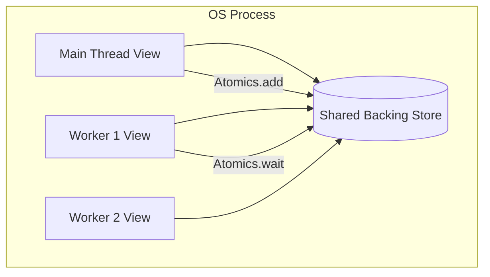
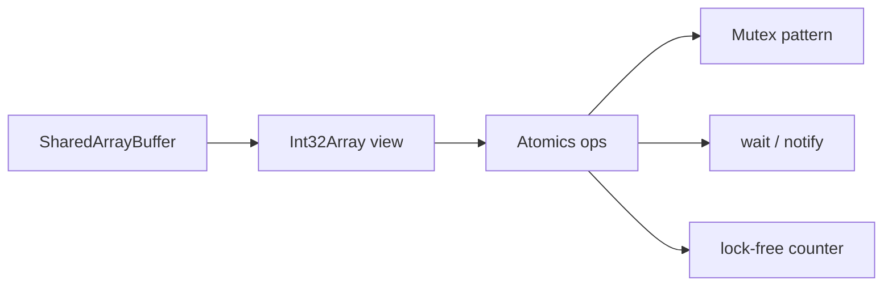
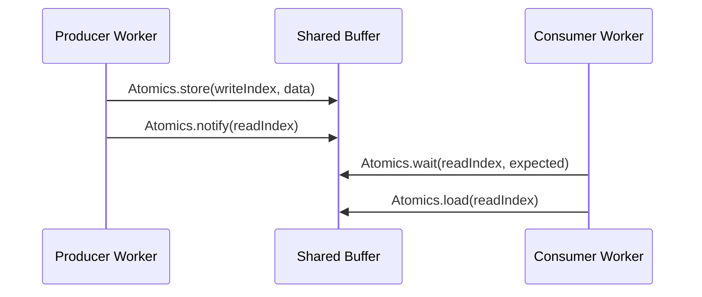

# SharedArrayBuffer Atomics on Node

## Overview

On Node.js, **`SharedArrayBuffer` (SAB)** and **`Atomics`** enable multiple `worker_threads` (or the main thread and workers) to observe the **same raw memory** without copying via `postMessage`. Unlike message passing's race immunity, shared memory reintroduces **data races**, **torn reads**, and **memory ordering** concerns. Node exposes the same ECMAScript primitives as browsers but **without** cross-origin isolation headers—SAB is available whenever workers are. This note covers Node-specific constraints, coordination patterns, and when shared memory beats transferables.

## Learning Objectives

- Create and share `SharedArrayBuffer` between main thread and workers on Node
- Use `Atomics` for counters, locks, and `wait`/`notify` coordination
- Explain why plain typed-array reads/writes are unsafe across threads
- Decide when SAB is justified vs message passing or transferables
- Connect to the portable model in [[02-JavaScript/05-Async-and-Concurrency/Web Workers Shared Memory and Atomics|Web Workers Shared Memory and Atomics]]

## Prerequisites

- [[06-NodeJS/06-Concurrency-and-Scaling/worker_threads Model|worker_threads Model]]
- [[02-JavaScript/05-Async-and-Concurrency/Web Workers Shared Memory and Atomics|Web Workers Shared Memory and Atomics]]
- [[01-Computer-Science/05-Concurrency-Fundamentals/Race Conditions|Race Conditions]]

## Difficulty

`expert`

## Estimated Time

- Reading: 2.5 hours
- Exercises: 3 hours
- Mini project: 6 hours

## History

`SharedArrayBuffer` and `Atomics` entered ECMAScript 2017 for shared-memory parallelism. Browsers restricted SAB after Spectre (2018); Node adopted **`worker_threads`** with full SAB support because server processes lack the same cross-site attack surface. Node 20+ documents `--experimental-sea-config` and WASM threads separately; SAB remains the native JS path for in-process shared bytes.

## Problem It Solves

- **Copy overhead**: passing 100 MB buffers per message duplicates memory and CPU
- **High-frequency coordination**: atomic counters and ring buffers without serializing messages
- **Low-latency handoff**: producer/consumer patterns with in-place mutation
- **Porting pthread-style algorithms**: locks and condition variables via `Atomics.wait`/`notify`

## Internal Implementation

Each worker has an isolated V8 heap, but a **SharedArrayBuffer** object in multiple isolates maps to **one** backing store in the process address space. Views (`Int32Array`, etc.) are typed lenses on those bytes.



Non-atomic `view[i]++` is a load-add-store sequence—interleaving loses updates. `Atomics` operations are indivisible and establish ordering (see [[01-Computer-Science/05-Concurrency-Fundamentals/Atomics and Memory Ordering|Atomics and Memory Ordering]]).

**`Atomics.wait`** blocks the calling thread until **`Atomics.notify`**—usable on worker threads; on the main thread use **`Atomics.waitAsync`** to avoid freezing the event loop.

## Mermaid Diagrams

### Structure



### Sequence / Lifecycle



## Examples

### Minimal Example

```typescript
import { Worker, isMainThread, workerData, parentPort } from 'node:worker_threads';

if (isMainThread) {
  const sab = new SharedArrayBuffer(Int32Array.BYTES_PER_ELEMENT * 2);
  const view = new Int32Array(sab);
  view[0] = 0; // counter

  const worker = new Worker(new URL(import.meta.url), { workerData: { sab } });
  worker.on('message', () => {
    console.log('Counter:', Atomics.load(view, 0)); // 1_000_000
  });
} else {
  const view = new Int32Array(workerData.sab as SharedArrayBuffer);
  for (let i = 0; i < 1_000_000; i++) {
    Atomics.add(view, 0, 1);
  }
  parentPort!.postMessage('done');
}
```

### Production-Shaped Example

Simple spin-free mutex using `Atomics.compareExchange`:

```typescript
const LOCK_INDEX = 0;
const UNLOCKED = 0;
const LOCKED = 1;

export function acquire(view: Int32Array): void {
  while (Atomics.compareExchange(view, LOCK_INDEX, UNLOCKED, LOCKED) !== UNLOCKED) {
    Atomics.wait(view, LOCK_INDEX, LOCKED, 100); // timed wait, retry
  }
}

export function release(view: Int32Array): void {
  Atomics.store(view, LOCK_INDEX, UNLOCKED);
  Atomics.notify(view, LOCK_INDEX, 1);
}

export function withLock<T>(view: Int32Array, fn: () => T): T {
  acquire(view);
  try {
    return fn();
  } finally {
    release(view);
  }
}
```

Ring buffer producer sketch (worker passes SAB at creation):

```typescript
// Shared layout: [head, tail, ...data slots]
export class SharedRingBuffer {
  readonly control: Int32Array;
  readonly data: Uint8Array;

  constructor(public readonly sab: SharedArrayBuffer, slotCount: number, slotSize: number) {
    const controlBytes = Int32Array.BYTES_PER_ELEMENT * 2;
    this.control = new Int32Array(sab, 0, 2);
    this.data = new Uint8Array(sab, controlBytes, slotCount * slotSize);
  }
}
```

## Trade-offs

| Dimension | Upside | Downside | When it matters |
| --- | --- | --- | --- |
| Performance | Zero-copy, low latency | Correctness is hard | High-frequency updates |
| Complexity | Avoids message serialization | Locks, ABA, deadlocks | Many writers |
| Operability | Harder to debug races | No structured audit trail per op | Incidents from subtle bugs |
| Security | Same process trust model | Spectre-class concerns in browsers; less on server | Untrusted workers |

### When to Use

- Large buffers mutated in place by multiple workers
- Lock-free counters, semaphores, ring buffers with proven invariants
- WASM or native code expecting shared linear memory

### When Not to Use

- Default coordination—**message passing first**
- Complex object graphs (SAB is bytes, not objects)
- Cross-process sharing (use IPC or mmap in native addons)

## Exercises

1. Demonstrate lost updates with non-atomic increment vs `Atomics.add` across 4 workers.
2. Implement a bounded queue with `head`/`tail` atomics; property-test under concurrent producers/consumers.
3. Compare throughput: 10 MB buffer transferred vs shared for 10,000 round trips.

## Mini Project

Build a **shared work-stealing deque** (single producer, multiple consumers) using SAB + Atomics; benchmark vs message-passing pool.

## Portfolio Project

Document SAB usage boundaries in [[06-NodeJS/projects/Node Runtime Toolkit/README|Node Runtime Toolkit]]—explicitly forbid SAB for untrusted plugin code.

## Interview Questions

1. Why is `view[0] = view[0] + 1` unsafe across threads?
2. What does `Atomics.wait` do, and why is it dangerous on the main thread?
3. When would you choose transferables over SharedArrayBuffer?
4. How does Node's SAB availability differ from modern browsers?

### Stretch / Staff-Level

1. Explain sequential consistency guarantees for `Atomics` vs plain loads/stores in the JS memory model.

## Common Mistakes

- Using plain reads/writes on shared views
- Deadlocks from `wait` without matching `notify`
- Sharing object references (only bytes are shared)
- Assuming SAB works across `child_process` boundaries
- Busy-spinning forever without backoff or `wait`

## Best Practices

- Default to message passing; adopt SAB with measured need
- Encapsulate memory layout in one module; document byte offsets
- Use `Atomics.wait` with timeouts in loops
- Fuzz concurrent access in tests
- Limit writers; prefer SPMC or MPSC patterns over general MPMC unless expert

## Summary

Node's `SharedArrayBuffer` and `Atomics` let worker threads share raw memory within a process. They eliminate copy costs but demand **lock-aware or lock-free** design. Treat message passing as the safe default; reach for SAB when profiling proves clone/transfer is the bottleneck and invariants are testable.

## Further Reading

- [ECMAScript Shared Memory and Atomics](https://tc39.es/ecma262/#sec-memory-model)
- [[02-JavaScript/05-Async-and-Concurrency/Web Workers Shared Memory and Atomics|Web Workers Shared Memory and Atomics]]

## Related Notes

- [[06-NodeJS/06-Concurrency-and-Scaling/worker_threads Model|worker_threads Model]]
- [[06-NodeJS/06-Concurrency-and-Scaling/Worker Pools and Message Passing|Worker Pools and Message Passing]]
- [[06-NodeJS/07-Timers-Events-and-IPC/MessagePort BroadcastChannel and Structured Clone|MessagePort BroadcastChannel and Structured Clone]]
- [[01-Computer-Science/05-Concurrency-Fundamentals/Atomics and Memory Ordering|Atomics and Memory Ordering]]
- [[02-JavaScript/05-Async-and-Concurrency/Web Workers Shared Memory and Atomics|Web Workers Shared Memory and Atomics]]

## Progress Checklist

- [ ] Explained from first principles
- [ ] Drew at least one Mermaid diagram
- [ ] Implemented a minimal version
- [ ] Documented trade-offs and non-goals
- [ ] Completed exercises
- [ ] Practiced interview questions aloud
- [ ] Linked prerequisites and dependents
