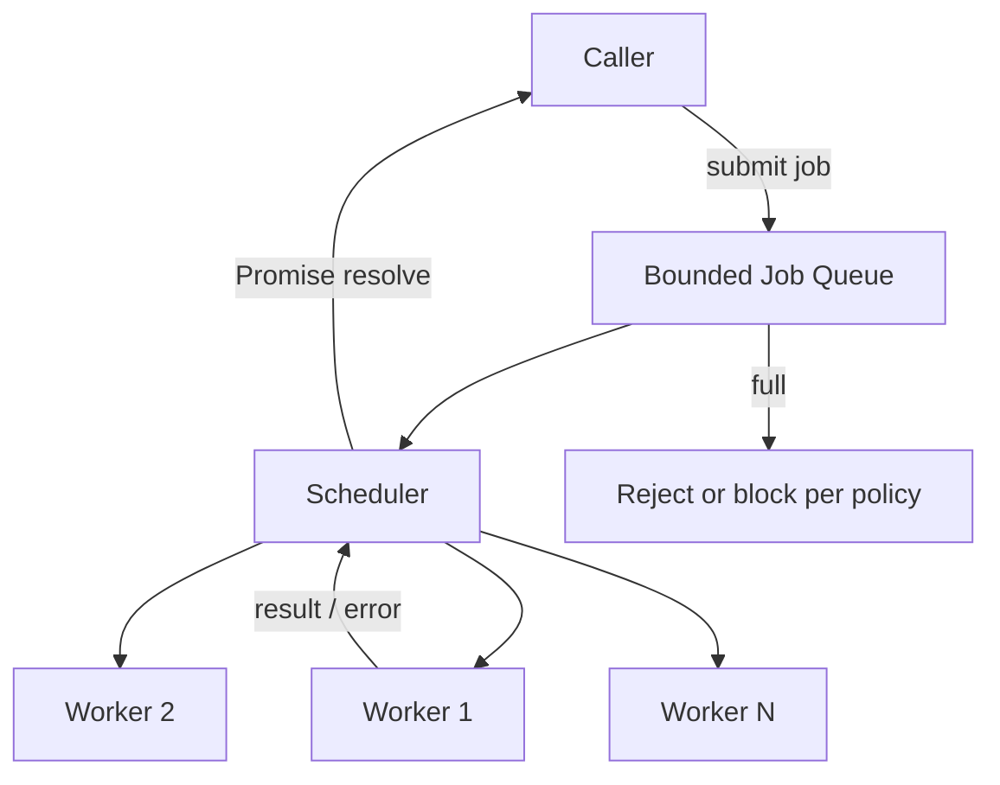
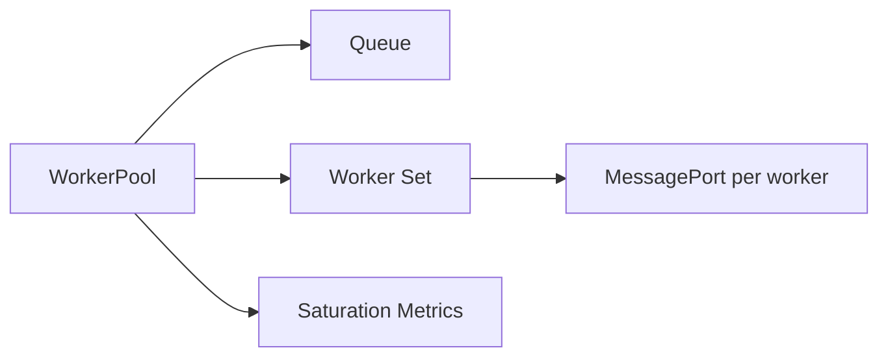
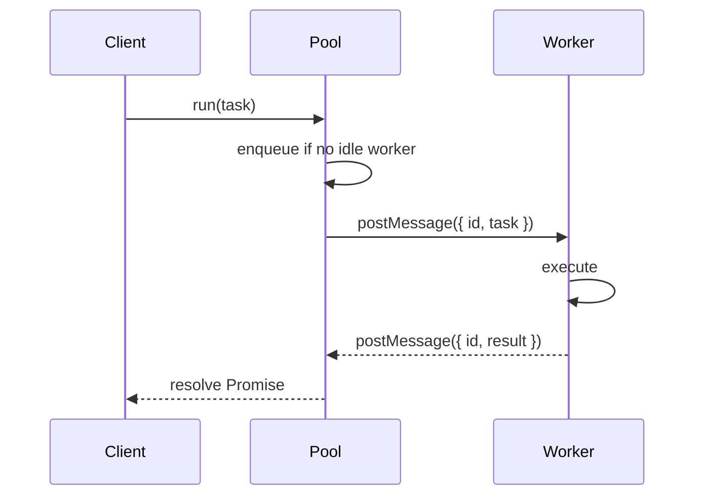

# Worker Pools and Message Passing

## Overview

A **worker pool** maintains a fixed set of long-lived `Worker` instances and schedules jobs across them via **message passing**. Creating a worker per request is expensive (V8 isolate startup, module load); pools **amortize** that cost. Message passing—structured clone, transferables, and optional shared memory—is the primary coordination mechanism. Production pools add **queue bounds**, **backpressure**, **timeouts**, **error propagation**, and **graceful drain** on shutdown. This note covers pool architecture and message contracts, not third-party library APIs verbatim.

## Learning Objectives

- Design a bounded worker pool with queue depth and rejection policy
- Choose structured clone vs transferable vs shared memory for payload shapes
- Propagate errors, cancellation, and correlation IDs across thread boundaries
- Measure pool saturation and tune worker count to CPU cores and workload type
- Relate pool backpressure to stream backpressure ([[06-NodeJS/04-Buffers-Streams-and-IO/Backpressure and HighWaterMark|Backpressure and HighWaterMark]])

## Prerequisites

- [[06-NodeJS/06-Concurrency-and-Scaling/worker_threads Model|worker_threads Model]]
- [[02-JavaScript/03-Objects-and-Metaprogramming/JSON Structured Clone and Serialization|JSON Structured Clone and Serialization]]
- [[02-JavaScript/05-Async-and-Concurrency/Concurrency Control and Backpressure|Concurrency Control and Backpressure]]

## Difficulty

`advanced`

## Estimated Time

- Reading: 2.5 hours
- Exercises: 3 hours
- Mini project: 8 hours ([[06-NodeJS/projects/Worker Pool Lab/README|Worker Pool Lab]])

## History

Browser Web Workers encouraged **pool patterns** early (e.g., parallel image decoding). Node's `worker_threads` enabled the same; libraries like **Piscina** (Nearform, 2019) standardized pool ergonomics for Node services. The pattern mirrors **thread pools** in Java and **goroutine worker pools** in Go, adapted to JS's copy/transfer message model instead of shared mutable objects.

## Problem It Solves

- **Worker startup latency**: cold-start per job adds 10–100+ ms; pools keep workers warm.
- **Unbounded parallelism**: spawning `os.cpus().length × N` workers per burst exhausts memory.
- **Ad-hoc message protocols**: pools enforce typed job/result schemas and centralized error handling.
- **Shutdown chaos**: without drain, in-flight jobs abort mid-flight during deploys.

## Internal Implementation

### Pool components



1. **Job queue**: FIFO (or priority) buffer of pending work
2. **Worker set**: fixed size, typically `os.cpus().length` or `length - 1` for I/O-heavy hosts
3. **Scheduler**: assigns idle workers; tracks in-flight job IDs
4. **Message protocol**: `{ id, type, payload }` request / `{ id, ok, value | error }` response

### Message passing mechanics

- **Structured clone**: deep copy; safe default for small JSON-like payloads
- **Transfer list**: zero-copy move of `ArrayBuffer`, `MessagePort`
- **SharedArrayBuffer**: shared bytes; requires `Atomics` ([[06-NodeJS/06-Concurrency-and-Scaling/SharedArrayBuffer Atomics on Node|SharedArrayBuffer Atomics on Node]])

Workers should treat incoming messages as **immutable** after receipt; reply on same channel or dedicated response port.

## Mermaid Diagrams

### Structure



### Sequence / Lifecycle



## Examples

### Minimal Example

```typescript
// pool-worker.ts
import { parentPort } from 'node:worker_threads';

parentPort!.on('message', (msg: { id: number; n: number }) => {
  const { id, n } = msg;
  let sum = 0;
  for (let i = 0; i < n; i++) sum += i;
  parentPort!.postMessage({ id, result: sum });
});
```

```typescript
// tiny-pool.ts
import { Worker } from 'node:worker_threads';
import { availableParallelism } from 'node:os';
import { fileURLToPath } from 'node:url';

type Pending = { resolve: (v: number) => void; reject: (e: Error) => void };

export class TinyPool {
  private readonly workers: Worker[] = [];
  private readonly idle = new Set<Worker>();
  private readonly queue: Array<{ id: number; n: number }> = [];
  private readonly pending = new Map<number, Pending>();
  private nextId = 1;

  constructor(private readonly workerPath: string, size = availableParallelism()) {
    for (let i = 0; i < size; i++) {
      const w = new Worker(workerPath);
      w.on('message', (msg: { id: number; result: number }) => {
        const p = this.pending.get(msg.id);
        if (p) {
          this.pending.delete(msg.id);
          p.resolve(msg.result);
        }
        this.idle.add(w);
        this.pump();
      });
      w.on('error', (err) => this.rejectAll(err));
      this.workers.push(w);
      this.idle.add(w);
    }
  }

  run(n: number): Promise<number> {
    const id = this.nextId++;
    return new Promise((resolve, reject) => {
      this.pending.set(id, { resolve, reject });
      this.queue.push({ id, n });
      this.pump();
    });
  }

  private pump(): void {
    while (this.queue.length > 0 && this.idle.size > 0) {
      const job = this.queue.shift()!;
      const worker = this.idle.values().next().value as Worker;
      this.idle.delete(worker);
      worker.postMessage(job);
    }
  }

  private rejectAll(err: Error): void {
    for (const [, p] of this.pending) p.reject(err);
    this.pending.clear();
  }

  async close(): Promise<void> {
    await Promise.all(this.workers.map((w) => w.terminate()));
  }
}

const workerPath = fileURLToPath(new URL('./pool-worker.ts', import.meta.url));
```

### Production-Shaped Example

Bounded queue with `AbortSignal`, transferable buffers, and drain:

```typescript
import { Worker } from 'node:worker_threads';
import { availableParallelism } from 'node:os';

interface PoolOptions {
  workerPath: string;
  size?: number;
  maxQueue?: number;
}

interface Job<TIn, TOut> {
  payload: TIn;
  transfer?: Transferable[];
  signal?: AbortSignal;
}

export class BoundedWorkerPool<TIn, TOut> {
  private readonly workers: Worker[] = [];
  private idle = new Set<Worker>();
  private queue: Array<{
    job: Job<TIn, TOut>;
    resolve: (v: TOut) => void;
    reject: (e: Error) => void;
  }> = [];
  private draining = false;

  constructor(private readonly opts: PoolOptions) {
    const size = opts.size ?? availableParallelism();
    for (let i = 0; i < size; i++) this.spawn();
  }

  run(job: Job<TIn, TOut>): Promise<TOut> {
    if (this.draining) return Promise.reject(new Error('Pool draining'));
    if (this.queue.length >= (this.opts.maxQueue ?? 1000)) {
      return Promise.reject(new Error('Pool queue full'));
    }
    return new Promise((resolve, reject) => {
      job.signal?.addEventListener('abort', () => reject(job.signal!.reason));
      this.queue.push({ job, resolve, reject });
      this.dispatch();
    });
  }

  async drain(timeoutMs = 30_000): Promise<void> {
    this.draining = true;
    const deadline = Date.now() + timeoutMs;
    while (this.queue.length > 0 && Date.now() < deadline) {
      await new Promise((r) => setTimeout(r, 50));
    }
    await Promise.all(this.workers.map((w) => w.terminate()));
  }

  private spawn(): void {
    const w = new Worker(this.opts.workerPath);
    w.on('message', (msg: { ok: boolean; value?: TOut; error?: string }) => {
      const next = this.queue.shift(); // simplified: use in-flight map in real impl
      if (msg.ok) next?.resolve(msg.value as TOut);
      else next?.reject(new Error(msg.error ?? 'Worker error'));
      this.idle.add(w);
      this.dispatch();
    });
    this.workers.push(w);
    this.idle.add(w);
  }

  private dispatch(): void {
    /* assign idle workers to queued jobs, postMessage with transfer list */
  }
}
```

## Trade-offs

| Dimension | Upside | Downside | When it matters |
| --- | --- | --- | --- |
| Performance | Warm workers, parallel CPU | Queue + clone overhead | High QPS small jobs |
| Complexity | Centralized scheduling | Custom protocol maintenance | Many job types |
| Operability | Metrics on queue depth | Harder debugging across threads | Need correlation IDs in messages |
| Memory | Fixed worker count | Each worker loads full module graph | Heavy dependencies |

### When to Use

- Steady stream of CPU-bound jobs with similar duration
- Need backpressure when workers saturated
- Want in-process parallelism without `cluster` duplication

### When Not to Use

- Rare, huge batch jobs (one-off worker may suffice)
- Jobs require shared DB connection pool on main thread only
- Sub-millisecond tasks where message overhead dominates

## Exercises

1. Add `maxQueue` rejection vs blocking policy; compare behavior under overload.
2. Implement in-flight job map keyed by `id` so worker responses match correct Promise (fix the minimal pool bug).
3. Pass a 16 MB buffer via transfer; log `byteLength` on sender before/after.

## Mini Project

Complete [[06-NodeJS/projects/Worker Pool Lab/README|Worker Pool Lab]]: pool with metrics (`queueDepth`, `activeWorkers`, `completedJobs`), graceful drain hook, and load generator.

## Portfolio Project

Add a CPU stage to [[06-NodeJS/projects/Node Runtime Toolkit/README|Node Runtime Toolkit]] pipeline using your pool; expose `/metrics` queue depth for operators.

## Interview Questions

1. Why is worker-per-request usually a bad idea in production?
2. How do you implement backpressure when the pool queue is full?
3. Structured clone vs transfer: when does each win?
4. How do you drain a worker pool during graceful shutdown?

### Stretch / Staff-Level

1. Design a pool that supports **task priorities** without starving low-priority work indefinitely.

## Common Mistakes

- Unbounded queue → memory exhaustion under load spikes
- Losing job/response correlation without stable IDs
- Cloning multi-MB payloads every job
- Not handling worker `error` / non-zero `exit` → hung Promises
- Omitting pool drain from shutdown sequence

## Best Practices

- Size pool to `availableParallelism()` unless jobs are mixed I/O+CPU
- Keep worker scripts thin; load heavy deps once at worker startup
- Version your message schema (`{ v: 1, ... }`)
- Log `workerId`, `jobId`, `correlationId` on both sides
- Integrate with [[06-NodeJS/10-Production-Node/Graceful Shutdown and Drain|Graceful Shutdown and Drain]]

## Summary

Worker pools reuse long-lived threads and route jobs through a **bounded queue** and **message protocol**. Prefer **transferables** for large binary data, enforce **queue limits** for backpressure, and **drain** in-flight work on shutdown. The design mirrors thread pools in other runtimes but respects JS's default **copy-isolate** safety model.

## Further Reading

- [Piscina — Node worker pool](https://github.com/piscinajs/piscina)
- [Structured clone algorithm (WHATWG)](https://html.spec.whatwg.org/multipage/structured-data.html)

## Related Notes

- [[06-NodeJS/06-Concurrency-and-Scaling/worker_threads Model|worker_threads Model]]
- [[06-NodeJS/06-Concurrency-and-Scaling/SharedArrayBuffer Atomics on Node|SharedArrayBuffer Atomics on Node]]
- [[06-NodeJS/07-Timers-Events-and-IPC/MessagePort BroadcastChannel and Structured Clone|MessagePort BroadcastChannel and Structured Clone]]
- [[06-NodeJS/06-Concurrency-and-Scaling/Choosing Threads Processes and Offload|Choosing Threads Processes and Offload]]
- [[02-JavaScript/05-Async-and-Concurrency/Concurrency Control and Backpressure|Concurrency Control and Backpressure]]
- [[06-NodeJS/projects/Worker Pool Lab/README|Worker Pool Lab]]

## Progress Checklist

- [ ] Explained from first principles
- [ ] Drew at least one Mermaid diagram
- [ ] Implemented a minimal version
- [ ] Documented trade-offs and non-goals
- [ ] Completed exercises
- [ ] Practiced interview questions aloud
- [ ] Linked prerequisites and dependents
