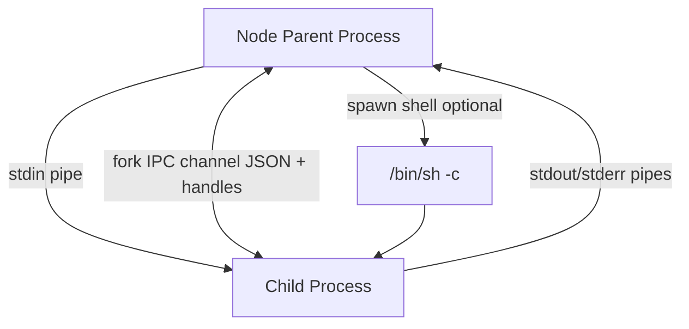
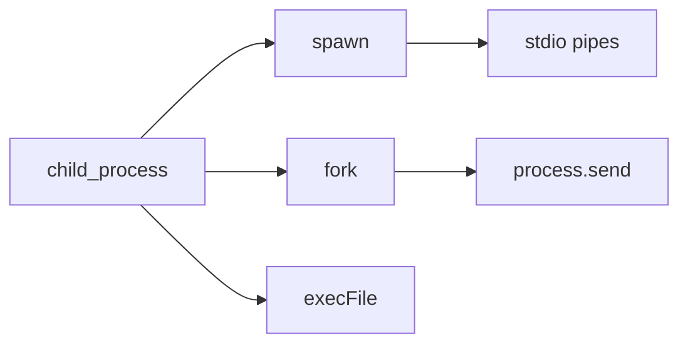
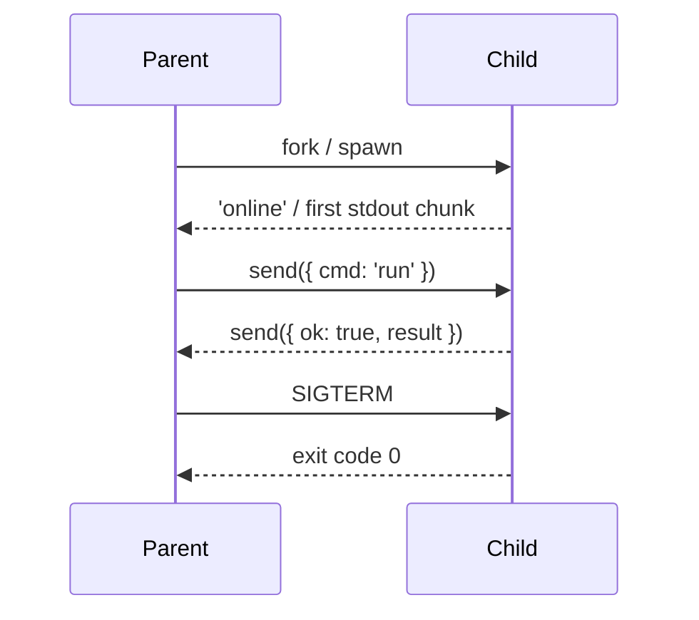

# child_process IPC Patterns

## Overview

**`child_process`** spawns separate OS processes from Node: **`spawn`** (streaming stdio), **`exec`/`execFile`** (buffered output), and **`fork`** (Node-specific IPC channel). Child processes have **separate address spaces**—stronger isolation than `worker_threads`, heavier than in-process workers. IPC flows over **stdio pipes**, **Unix sockets** (fork channel), or **explicit message ports**. This note covers production patterns: backpressure on pipes, JSON-line protocols, handle passing, timeouts, and cleanup on parent exit.

## Learning Objectives

- Choose `spawn` vs `execFile` vs `fork` for a given subprocess task
- Implement bidirectional IPC with structured messages and error boundaries
- Handle stdio backpressure, exit codes, signals, and zombie prevention
- Pass sockets/handles when needed (cluster-style) safely
- Relate subprocess isolation to security boundaries ([[06-NodeJS/09-Security-and-Supply-Chain/Secrets Env Injection and Least Privilege|Secrets Env Injection and Least Privilege]])

## Prerequisites

- [[06-NodeJS/01-Process-and-Runtime/Child Process Spawning Basics|Child Process Spawning Basics]]
- [[06-NodeJS/01-Process-and-Runtime/Process argv env and stdio|Process argv env and stdio]]
- [[06-NodeJS/01-Process-and-Runtime/Signals Exit Codes and Lifecycle Hooks|Signals Exit Codes and Lifecycle Hooks]]

## Difficulty

`advanced`

## Estimated Time

- Reading: 2.5 hours
- Exercises: 3 hours
- Mini project: 6 hours

## History

Node inherited Unix process semantics from libuv. Early Node used `exec` for shell commands; **`fork`** (2010) added a dedicated IPC pipe for `cluster`. Modern services spawn CLI tools (ffmpeg, git), language runtimes, and sandboxed workers via `spawn` with explicit stdio configuration.

## Problem It Solves

- **Isolation**: crash or memory leak in child doesn't kill parent (unlike shared-process workers)
- **Foreign binaries**: invoke non-Node programs with controlled env and cwd
- **Privilege separation**: drop capabilities in child (with OS support)
- **Legacy integration**: wrap existing shell/Python tools without reimplementing

## Internal Implementation



- **`spawn`**: `uv_spawn`, streams by default
- **`fork`**: `spawn` + `process.send` / `message` on built-in channel
- **`exec`**: buffers stdout/stderr—unsafe for large output
- **`detached`**: child can outlive parent (new process group)

Message serialization uses **JSON** (not structured clone) on the fork channel—no functions, cycles, or `undefined`.

## Mermaid Diagrams

### Structure



### Sequence / Lifecycle



## Examples

### Minimal Example

```typescript
import { fork } from 'node:child_process';
import { fileURLToPath } from 'node:url';

const childPath = fileURLToPath(new URL('./child-task.js', import.meta.url));
const child = fork(childPath, [], { env: { ...process.env, TASK: 'hash' } });

child.on('message', (msg: { digest: string }) => {
  console.log(msg.digest);
});
child.send({ input: 'data' });
```

```javascript
// child-task.js
process.on('message', (msg) => {
  const digest = require('crypto').createHash('sha256').update(msg.input).digest('hex');
  process.send({ digest });
});
```

### Production-Shaped Example

JSON-lines over `spawn` with timeout, size limits, and cleanup:

```typescript
import { spawn } from 'node:child_process';
import { once } from 'node:events';
import { setTimeout as delay } from 'node:timers/promises';
import readline from 'node:readline';

export interface SubprocessResult<T> {
  code: number | null;
  stdout: T;
  stderr: string;
}

export async function runJsonLines<T>(
  command: string,
  args: string[],
  input: unknown,
  opts: { timeoutMs?: number; maxLineBytes?: number } = {},
): Promise<SubprocessResult<T>> {
  const { timeoutMs = 60_000, maxLineBytes = 1_048_576 } = opts;
  const child = spawn(command, args, {
    stdio: ['pipe', 'pipe', 'pipe'],
    env: process.env,
  });

  const ac = new AbortController();
  const timer = setTimeout(() => {
    child.kill('SIGKILL');
    ac.abort(new Error('Subprocess timeout'));
  }, timeoutMs);

  try {
    child.stdin.write(JSON.stringify(input) + '\n');
    child.stdin.end();

    const rl = readline.createInterface({ input: child.stdout! });
    let lastLine = '';
    for await (const line of rl) {
      if (Buffer.byteLength(line) > maxLineBytes) {
        throw new Error('Stdout line exceeds limit');
      }
      lastLine = line;
    }

    const [code] = await once(child, 'exit');
    const stderr = await streamToString(child.stderr!);
    if (code !== 0) throw new Error(`Exit ${code}: ${stderr}`);

    return { code, stdout: JSON.parse(lastLine) as T, stderr };
  } finally {
    clearTimeout(timer);
    child.kill('SIGKILL'); // ensure no orphan on error paths
  }
}

async function streamToString(stream: NodeJS.ReadableStream): Promise<string> {
  const chunks: Buffer[] = [];
  for await (const c of stream) chunks.push(Buffer.from(c));
  return Buffer.concat(chunks).toString('utf8');
}
```

## Trade-offs

| Dimension | Upside | Downside | When it matters |
| --- | --- | --- | --- |
| Performance | Strong isolation | Process spawn ms–100s ms | High churn |
| Complexity | Shell integration | Encoding, shells, quoting | `exec` with user input |
| Operability | Separate OOM killer target | Harder distributed tracing | Need correlation in logs |
| Security | Boundary for untrusted code | Shell injection if careless | User-supplied args |

### When to Use

- Running CLI tools, compilers, or non-Node runtimes
- Isolation stronger than threads (untrusted plugins)
- `cluster` workers (fork-based)

### When Not to Use

- High-frequency micro-tasks (use worker pool)
- Large structured object IPC (JSON fork channel is limited)
- When containers provide isolation instead ([[16-DevOps/README|DevOps]])

## Exercises

1. Implement `runJsonLines` client/server with a Python child script.
2. Demonstrate shell injection with `exec('user input')` vs safe `spawn` with argument array.
3. Propagate parent `SIGTERM` to child; verify child exits before parent.

## Mini Project

Build a **ffmpeg wrapper** subprocess: stream progress on stderr, cancel with `SIGTERM`, enforce max runtime.

## Portfolio Project

Add optional **plugin runner** to [[06-NodeJS/projects/Node Runtime Toolkit/README|Node Runtime Toolkit]] using forked sandbox processes.

## Interview Questions

1. Difference between `spawn`, `exec`, and `fork`?
2. Why is `exec(userInput)` dangerous?
3. How does IPC work in `fork` vs piping JSON over stdio?
4. What happens to a child if the parent exits without cleanup?

### Stretch / Staff-Level

1. Design IPC that supports **backpressure** when child stdout is slower than parent writes stdin.

## Common Mistakes

- Using `exec` for large output → buffer max exceeded
- Shell interpolation with untrusted strings
- Ignoring stderr until deadlock (full pipe buffer)
- Not killing children on parent shutdown
- Assuming `process.send` supports all structured-clone types

## Best Practices

- Prefer `spawn`/`execFile` with argument arrays—no shell
- Set `stdio: 'pipe'` explicitly; drain all streams
- Timeouts + kill on hang
- Use line-delimited JSON for streaming protocols
- Log `{ parentPid, childPid, correlationId }` on both sides

## Summary

`child_process` runs **separate OS processes** with stdio pipes or fork IPC. Use **`spawn`** for streaming CLI integration, **`fork`** for Node-to-Node messages, avoid **`exec`** with untrusted input. Treat subprocesses as isolation boundaries: enforce timeouts, drain pipes, and kill on shutdown.

## Further Reading

- [Node.js child_process documentation](https://nodejs.org/api/child_process.html)

## Related Notes

- [[06-NodeJS/06-Concurrency-and-Scaling/cluster and Multi-Process Scaling|cluster and Multi-Process Scaling]]
- [[06-NodeJS/06-Concurrency-and-Scaling/Choosing Threads Processes and Offload|Choosing Threads Processes and Offload]]
- [[06-NodeJS/01-Process-and-Runtime/Child Process Spawning Basics|Child Process Spawning Basics]]
- [[06-NodeJS/09-Security-and-Supply-Chain/Secrets Env Injection and Least Privilege|Secrets Env Injection and Least Privilege]]
- [[16-DevOps/README|DevOps]]

## Progress Checklist

- [ ] Explained from first principles
- [ ] Drew at least one Mermaid diagram
- [ ] Implemented a minimal version
- [ ] Documented trade-offs and non-goals
- [ ] Completed exercises
- [ ] Practiced interview questions aloud
- [ ] Linked prerequisites and dependents
