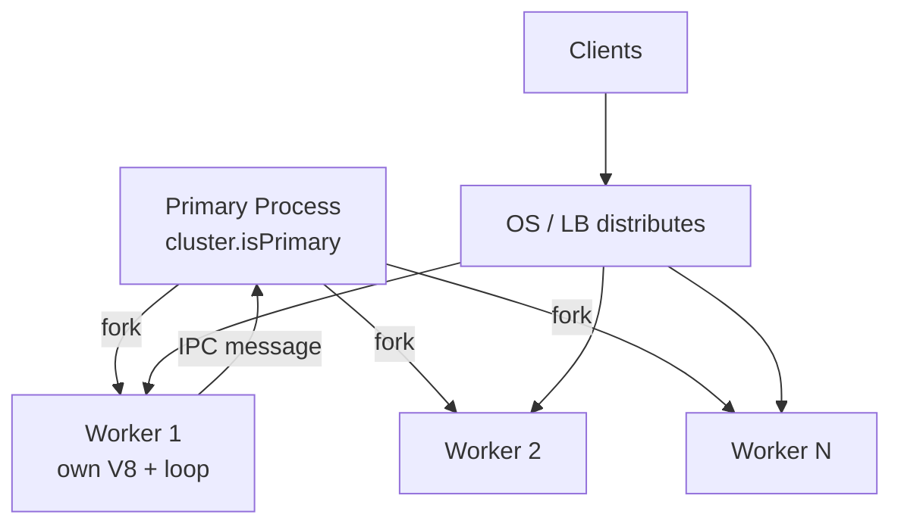
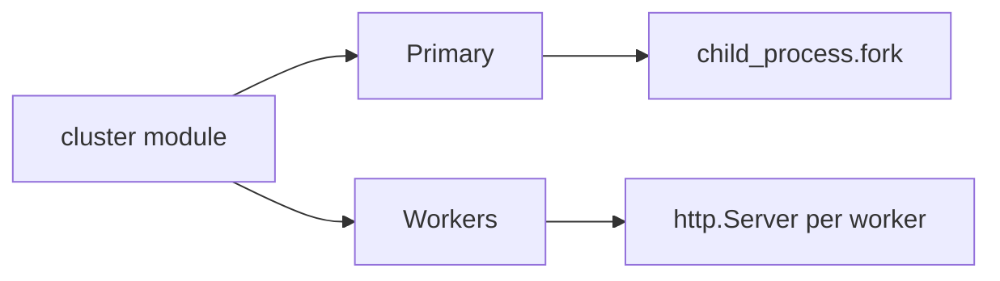
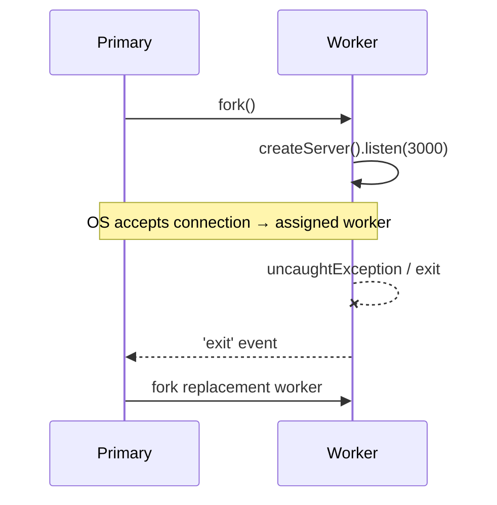

# cluster and Multi-Process Scaling

## Overview

The **`cluster`** module lets a **primary** Node process fork **worker processes** that share server ports via OS-level scheduling (round-robin on most platforms). Each worker is a **full Node process** with its own V8 heap, event loop, and garbage collector—true **multi-core utilization** for I/O-heavy HTTP servers without blocking each other's event loops. Unlike `worker_threads`, cluster workers do **not** share memory; coordination uses IPC messages. Modern deployments often prefer **container replicas** ([[16-DevOps/README|DevOps]]) over in-process cluster, but understanding `cluster` clarifies process isolation, sticky sessions, and graceful reload patterns.

## Learning Objectives

- Explain primary vs worker roles and how workers share listening sockets
- Fork workers equal to CPU count and handle worker crash/restart
- Implement zero-downtime-ish reload by replacing workers gradually
- Compare `cluster` vs `worker_threads` vs external orchestration
- Wire cluster lifecycle to graceful shutdown ([[06-NodeJS/10-Production-Node/Graceful Shutdown and Drain|Graceful Shutdown and Drain]])

## Prerequisites

- [[06-NodeJS/01-Process-and-Runtime/Child Process Spawning Basics|Child Process Spawning Basics]]
- [[06-NodeJS/05-Networking/http and https Platform Servers|http and https Platform Servers]]
- [[06-NodeJS/02-Event-Loop-and-libuv/Event Loop Phases|Event Loop Phases]]

## Difficulty

`advanced`

## Estimated Time

- Reading: 2 hours
- Exercises: 2–3 hours
- Mini project: 6 hours

## History

Node 0.6 introduced `cluster` (then `multi`) to address the single-core JS limitation without requiring nginx-only scaling. It uses `child_process.fork` with special IPC to hand off accepted sockets. As containers and PaaS load balancers became standard, **multi-process in one container** declined—but `cluster` remains relevant for bare-metal Node, PM2-style process managers, and understanding fork semantics.

## Problem It Solves

- **Single-core bottleneck**: one Node process uses one core for JavaScript execution
- **Fault isolation**: a worker crash doesn't necessarily kill siblings (if primary restarts)
- **Memory isolation**: leaky worker can be killed without poisoning entire server state
- **Legacy deployment**: single VM running Node without Kubernetes still needs multi-core

## Internal Implementation



On Linux, the primary may use **`SO_REUSEPORT`** or pass handles to workers depending on Node version and `cluster.schedulingPolicy`. Workers call `server.listen()` on the same port; the kernel distributes connections.

Workers **do not share**:

- JavaScript objects, module cache state, or in-memory sessions
- Open handles unless explicitly passed via IPC

Workers **do share**:

- Environment variables (copy-on-write at fork)
- Same machine filesystem

## Mermaid Diagrams

### Structure



### Sequence / Lifecycle



## Examples

### Minimal Example

```typescript
import cluster from 'node:cluster';
import http from 'node:http';
import { availableParallelism } from 'node:os';

if (cluster.isPrimary) {
  const count = availableParallelism();
  console.log(`Primary ${process.pid} forking ${count} workers`);
  for (let i = 0; i < count; i++) cluster.fork();

  cluster.on('exit', (worker, code) => {
    console.warn(`Worker ${worker.process.pid} exited ${code}; reforking`);
    cluster.fork();
  });
} else {
  http.createServer((_req, res) => {
    res.end(`Worker ${process.pid}\n`);
  }).listen(3000);
}
```

### Production-Shaped Example

Graceful worker replacement on `SIGUSR2`:

```typescript
import cluster from 'node:cluster';
import http from 'node:http';
import type { IncomingMessage, ServerResponse } from 'node:http';

const workers = new Set<number>();

function createServer(): http.Server {
  return http.createServer(async (req: IncomingMessage, res: ServerResponse) => {
    if (req.url === '/health') {
      res.writeHead(200).end('ok');
      return;
    }
    // ... business logic
    res.end('ok');
  });
}

if (cluster.isPrimary) {
  const forkWorker = (): void => {
    const w = cluster.fork();
    workers.add(w.id);
    w.on('exit', () => {
      workers.delete(w.id);
      if (!shuttingDown) forkWorker();
    });
  };

  let shuttingDown = false;
  for (let i = 0; i < 4; i++) forkWorker();

  process.on('SIGUSR2', () => {
    // Rolling restart: fork new, then disconnect old
    const oldWorkers = Object.values(cluster.workers ?? {}).filter(Boolean);
    const newWorker = cluster.fork();
    newWorker.on('listening', () => {
      for (const ow of oldWorkers) ow?.disconnect();
    });
  });

  process.on('SIGTERM', () => {
    shuttingDown = true;
    for (const w of Object.values(cluster.workers ?? {})) w?.disconnect();
  });
} else {
  const server = createServer();
  server.listen(3000);
  process.on('SIGTERM', () => {
    server.close(() => process.exit(0));
  });
}
```

## Trade-offs

| Dimension | Upside | Downside | When it matters |
| --- | --- | --- | --- |
| Performance | Multi-core I/O servers | No shared in-memory state | Session affinity required |
| Complexity | Built into Node | Primary crash kills all | Need robust primary |
| Operability | Single deploy artifact | Harder than K8s replicas | VM/bare metal |
| Memory | Isolation between workers | N × heap for N workers | Large dependency trees |

### When to Use

- Bare-metal or single-VM Node HTTP servers
- Need process isolation without container overhead
- Teaching fork/socket sharing semantics

### When Not to Use

- Kubernetes/Docker with horizontal pod autoscaling ([[16-DevOps/README|DevOps]])
- Heavy in-memory shared caches (use Redis—[[08-Databases/README|Databases]])
- CPU-bound parallel JS (`worker_threads` inside one worker is often simpler)

## Exercises

1. Hit `/` repeatedly with `curl`; verify different PIDs from workers.
2. Kill a worker with `kill -9`; confirm primary reforks and server stays up.
3. Implement sticky-session **avoidance**: store session in Redis, verify any worker serves request.

## Mini Project

Build a **cluster supervisor** that exposes primary metrics: worker count, restart count, last exit code. Integrate with [[06-NodeJS/10-Production-Node/Health Readiness and Liveness Hooks|Health Readiness and Liveness Hooks]].

## Portfolio Project

Compare cluster vs single-process + worker pool in [[06-NodeJS/projects/Node Runtime Toolkit/README|Node Runtime Toolkit]] load tests; document when each wins.

## Interview Questions

1. How do cluster workers share the same TCP port?
2. Why doesn't in-memory session storage work across cluster workers?
3. `cluster` vs multiple container replicas—trade-offs?
4. What happens when the primary process dies?

### Stretch / Staff-Level

1. Design zero-downtime deploy for cluster on a single VM without dropping in-flight HTTP connections.

## Common Mistakes

- Storing sessions in `Map` per worker without sticky LB
- Reforking infinitely on boot error (crash loop)
- Forgetting `disconnect()` vs `kill()` semantics during shutdown
- Using cluster for CPU-bound work without worker_threads inside each worker
- Running cluster **inside** Kubernetes (double scheduling)

## Best Practices

- Prefer external orchestration when available
- Keep workers stateless; externalize sessions and caches
- Handle `exit` with backoff if crash looping
- Coordinate shutdown: primary stops forking, workers drain ([[06-NodeJS/10-Production-Node/Graceful Shutdown and Drain|Graceful Shutdown and Drain]])
- One listen port per container in K8s—don't nest cluster unless intentional

## Summary

`cluster` forks multiple Node **processes** to use multiple cores for I/O-bound servers, sharing ports via OS mechanics. Workers are isolated heaps—design for **stateless** request handling or external session stores. In containerized production, replicas often replace cluster, but fork semantics remain essential for process supervision and IPC patterns.

## Further Reading

- [Node.js cluster documentation](https://nodejs.org/api/cluster.html)
- [[09-System-Design/02-Load-Balancing-and-Edge-Entry/Load Balancer Roles L4 vs L7|Load Balancer Roles L4 vs L7]] — horizontal scaling patterns

## Related Notes

- [[06-NodeJS/06-Concurrency-and-Scaling/child_process IPC Patterns|child_process IPC Patterns]]
- [[06-NodeJS/06-Concurrency-and-Scaling/worker_threads Model|worker_threads Model]]
- [[06-NodeJS/06-Concurrency-and-Scaling/Choosing Threads Processes and Offload|Choosing Threads Processes and Offload]]
- [[06-NodeJS/10-Production-Node/Graceful Shutdown and Drain|Graceful Shutdown and Drain]]
- [[16-DevOps/README|DevOps]]
- [[07-Backend/README|Backend]]

## Progress Checklist

- [ ] Explained from first principles
- [ ] Drew at least one Mermaid diagram
- [ ] Implemented a minimal version
- [ ] Documented trade-offs and non-goals
- [ ] Completed exercises
- [ ] Practiced interview questions aloud
- [ ] Linked prerequisites and dependents
