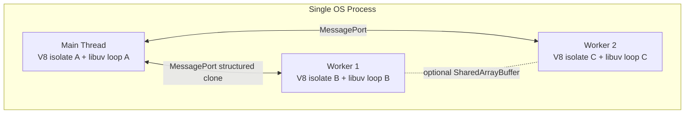
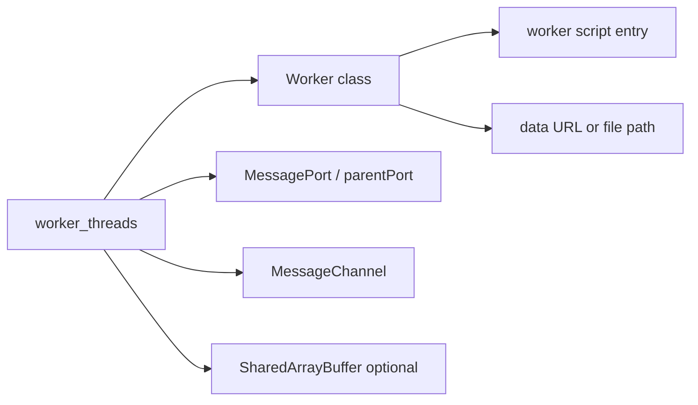
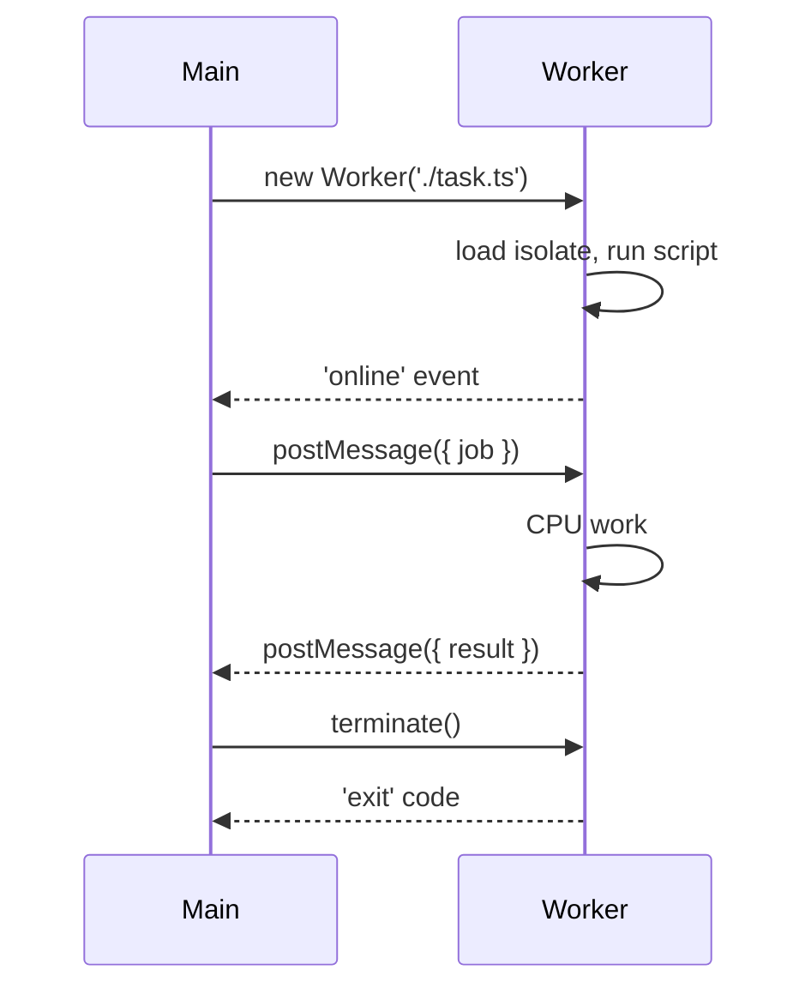

# worker_threads Model

## Overview

**`worker_threads`** is Node's built-in API for running JavaScript on **separate OS threads**, each with its own V8 isolate, event loop, and libuv instance. Unlike the libuv **thread pool** (used internally for blocking syscalls like `fs.readFile`), workers are **program-controlled** threads you spawn to offload CPU-bound work without blocking the main thread's event loop. Workers communicate by **message passing** (`postMessage`) or, when justified, **shared memory** (`SharedArrayBuffer` + `Atomics`). This note explains the host model—what is isolated, what is shared, and how workers relate to the main process—not framework-level job queues.

## Learning Objectives

- Explain how a Worker differs from the libuv thread pool and from `child_process`
- Create workers from ESM/CJS and pass data via structured clone and transferables
- Predict lifecycle costs: startup, heap duplication, and message serialization
- Identify CPU-bound workloads that belong in workers vs I/O that stays on the main loop
- Connect Node worker semantics to the portable JS model in [[02-JavaScript/05-Async-and-Concurrency/Web Workers Shared Memory and Atomics|Web Workers Shared Memory and Atomics]]

## Prerequisites

- [[06-NodeJS/02-Event-Loop-and-libuv/Event Loop Phases|Event Loop Phases]]
- [[06-NodeJS/02-Event-Loop-and-libuv/Thread Pool and Blocking Work|Thread Pool and Blocking Work]]
- [[02-JavaScript/05-Async-and-Concurrency/Run to Completion and Event Loop|Run to Completion and Event Loop]]
- [[02-JavaScript/05-Async-and-Concurrency/Web Workers Shared Memory and Atomics|Web Workers Shared Memory and Atomics]]

## Difficulty

`advanced`

## Estimated Time

- Reading: 2 hours
- Exercises: 2–3 hours
- Mini project: 6 hours (see [[06-NodeJS/projects/Worker Pool Lab/README|Worker Pool Lab]])

## History

Node launched in 2009 as **single-threaded by design**: one event loop, non-blocking I/O via libuv. CPU-heavy JS blocked all concurrent requests—a famous scaling myth ("Node doesn't use multiple cores") that `cluster` (2010) partially addressed by forking processes. **`worker_threads`** landed in Node 10.5 (2018, stable in 12) to offer **in-process parallelism** without the memory overhead of separate processes, mirroring browser Web Workers. It shares the same structured-clone and `SharedArrayBuffer`/`Atomics` primitives standardized for the web.

## Problem It Solves

- **Event-loop blocking**: a tight JS loop (JSON parse of 100 MB, image resize in pure JS, bcrypt in JS) stalls timers, sockets, and HTTP responses on the main thread.
- **Underutilized cores**: a single Node process uses one core for JS; workers spread CPU work across cores within one process.
- **Process fork overhead**: `cluster` duplicates entire V8 heaps; workers start lighter for parallel chunks of work.
- **Isolation without IPC complexity**: workers share the same OS process (same PID, env, file descriptors) but separate JS heaps—safer than shared mutable state, simpler than raw `child_process` for parallel JS.

## Internal Implementation

Each Worker runs in a **new V8 isolate** with its own:

- JavaScript heap and garbage collector
- libuv event loop (can perform its own async I/O)
- `MessagePort` for parent↔worker communication

The **main thread** remains the default entry; spawning a worker loads the worker script in a new thread. Node uses **structured clone** for `postMessage` payloads and supports **transferable** `ArrayBuffer`/`MessagePort` for zero-copy handoff.



Workers **cannot** access the main thread's variables, `require` cache state, or singletons. They **can** read the same filesystem, env vars, and (with care) open their own network connections.

## Mermaid Diagrams

### Structure



### Sequence / Lifecycle



## Examples

### Minimal Example

```typescript
// hash-worker.ts — run as worker entry
import { parentPort, workerData } from 'node:worker_threads';
import { createHash } from 'node:crypto';

const input = workerData as string;
const digest = createHash('sha256').update(input).digest('hex');
parentPort!.postMessage({ digest });
```

```typescript
// main.ts
import { Worker } from 'node:worker_threads';
import { fileURLToPath } from 'node:url';

const workerPath = fileURLToPath(new URL('./hash-worker.ts', import.meta.url));

const result = await new Promise<string>((resolve, reject) => {
  const worker = new Worker(workerPath, {
    workerData: 'payload-to-hash',
    // execArgv: ['--experimental-strip-types'] // Node 22+ TS strip
  });
  worker.once('message', (msg: { digest: string }) => resolve(msg.digest));
  worker.once('error', reject);
  worker.once('exit', (code) => {
    if (code !== 0) reject(new Error(`Worker exited ${code}`));
  });
});

console.log(result);
```

### Production-Shaped Example

Worker with transferable buffer, timeout, and explicit cleanup:

```typescript
import { Worker } from 'node:worker_threads';
import { setTimeout as delay } from 'node:timers/promises';

interface JobResult {
  checksum: number;
  bytesProcessed: number;
}

export async function runChecksumJob(
  buffer: ArrayBuffer,
  workerScript: string,
  timeoutMs = 30_000,
): Promise<JobResult> {
  const worker = new Worker(workerScript, {
    workerData: { byteLength: buffer.byteLength },
  });

  const abort = AbortSignal.timeout(timeoutMs);

  try {
    const resultPromise = new Promise<JobResult>((resolve, reject) => {
      worker.once('message', resolve);
      worker.once('error', reject);
      worker.once('exit', (code) => {
        if (code !== 0) reject(new Error(`Worker exit ${code}`));
      });
      abort.addEventListener('abort', () => {
        void worker.terminate();
        reject(abort.reason);
      });
    });

    // Transfer ownership — main thread buffer becomes detached
    worker.postMessage({ buffer }, [buffer]);
    return await resultPromise;
  } finally {
    await worker.terminate().catch(() => undefined);
  }
}
```

## Trade-offs

| Dimension | Upside | Downside | When it matters |
| --- | --- | --- | --- |
| Performance | True parallel CPU on multiple cores | Startup + clone/transfer overhead per job | Small jobs may be slower than inline |
| Complexity | Same language/runtime as main thread | Separate heaps; no shared singletons | DI containers, DB pools don't cross threads |
| Operability | Same PID, easier than multi-process | Crashes in native addons can take down process | Native module bugs, segfaults |
| Memory | Lighter than `cluster` fork | Each worker duplicates loaded modules | Many workers × large dependency tree |

### When to Use

- CPU-bound pure JS or WASM (compression, parsing, crypto in worker)
- Parallelizable batch work with clear message boundaries
- Need in-process parallelism without duplicating entire server state

### When Not to Use

- I/O-bound work (use async APIs on main loop—see [[06-NodeJS/02-Event-Loop-and-libuv/Thread Pool and Blocking Work|Thread Pool and Blocking Work]])
- Work that needs shared in-memory caches or ORM connection pools
- Untrusted code isolation (use `child_process` sandbox or containers—[[16-DevOps/README|DevOps]])

## Exercises

1. Measure event-loop lag on the main thread while running a 5-second tight loop inline vs in a worker using `perf_hooks.monitorEventLoopDelay`.
2. Implement a worker that receives a `Uint8Array` via transfer, processes it, and posts back a summary—verify the sender's buffer is detached.
3. Spawn 8 workers concurrently hashing 1 MB chunks; compare wall time vs single-threaded baseline on your machine.

## Mini Project

Build a minimal **image metadata extractor** worker: main thread reads file stream, transfers buffer to worker, worker parses EXIF in isolation. Document p99 latency with and without workers. Extend into [[06-NodeJS/projects/Worker Pool Lab/README|Worker Pool Lab]].

## Portfolio Project

Integrate a worker pool into [[06-NodeJS/projects/Node Runtime Toolkit/README|Node Runtime Toolkit]] for CPU-bound pipeline stages while HTTP serving stays on the main loop.

## Interview Questions

1. How does `worker_threads` differ from libuv's thread pool? When does each run?
2. Why can't workers access variables from the main thread's closure?
3. What happens to an `ArrayBuffer` after you pass it in the transfer list of `postMessage`?
4. Would you use workers or `cluster` for a stateless HTTP API? What changes if you hold in-memory session state?

### Stretch / Staff-Level

1. Design a worker pool that bounds queue depth, propagates `AbortSignal`, and reports queue saturation metrics without blocking the event loop.

## Common Mistakes

- Putting I/O-heavy work in workers when async main-thread I/O would suffice
- Forgetting to `terminate()` workers on shutdown, leaving zombie threads
- Passing huge objects by structured clone instead of transferables
- Assuming `require` cache or module singletons are shared across workers
- Running blocking sync `fs` on the main thread "because it's fast" while workers idle

## Best Practices

- Reuse workers via a pool ([[06-NodeJS/06-Concurrency-and-Scaling/Worker Pools and Message Passing|Worker Pools and Message Passing]]) to amortize startup
- Prefer transferables for binary payloads; keep messages small and schema-stable
- Wire worker errors to centralized logging with correlation IDs
- Set resource limits (`resourceLimits`) for untrusted or variable workloads
- Terminate workers during graceful shutdown ([[06-NodeJS/10-Production-Node/Graceful Shutdown and Drain|Graceful Shutdown and Drain]])

## Summary

`worker_threads` gives Node **program-controlled OS threads**, each with an isolated V8 isolate and event loop, communicating via structured clone or transferable buffers. Use workers for **CPU-bound JavaScript** that would otherwise block the main event loop; keep I/O on async main-thread APIs. Workers share a process with the main thread but not JS heap state—design message boundaries explicitly and prefer pools over per-request worker creation in production.

## Further Reading

- [Node.js worker_threads documentation](https://nodejs.org/api/worker_threads.html)
- [V8 isolates and threading model](https://v8.dev/docs/embed)

## Related Notes

- [[06-NodeJS/06-Concurrency-and-Scaling/Worker Pools and Message Passing|Worker Pools and Message Passing]]
- [[06-NodeJS/06-Concurrency-and-Scaling/SharedArrayBuffer Atomics on Node|SharedArrayBuffer Atomics on Node]]
- [[06-NodeJS/06-Concurrency-and-Scaling/cluster and Multi-Process Scaling|cluster and Multi-Process Scaling]]
- [[06-NodeJS/06-Concurrency-and-Scaling/Choosing Threads Processes and Offload|Choosing Threads Processes and Offload]]
- [[02-JavaScript/05-Async-and-Concurrency/Web Workers Shared Memory and Atomics|Web Workers Shared Memory and Atomics]]
- [[06-NodeJS/02-Event-Loop-and-libuv/Starvation Backpressure and Loop Health|Starvation Backpressure and Loop Health]]

## Progress Checklist

- [ ] Explained from first principles
- [ ] Drew at least one Mermaid diagram
- [ ] Implemented a minimal version
- [ ] Documented trade-offs and non-goals
- [ ] Completed exercises
- [ ] Practiced interview questions aloud
- [ ] Linked prerequisites and dependents
