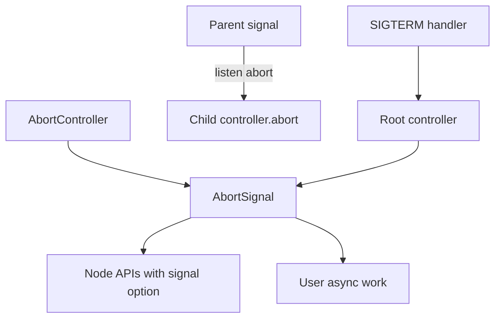
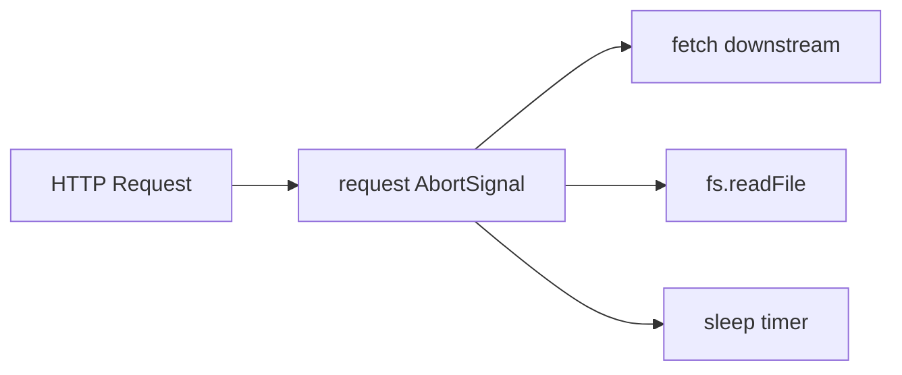
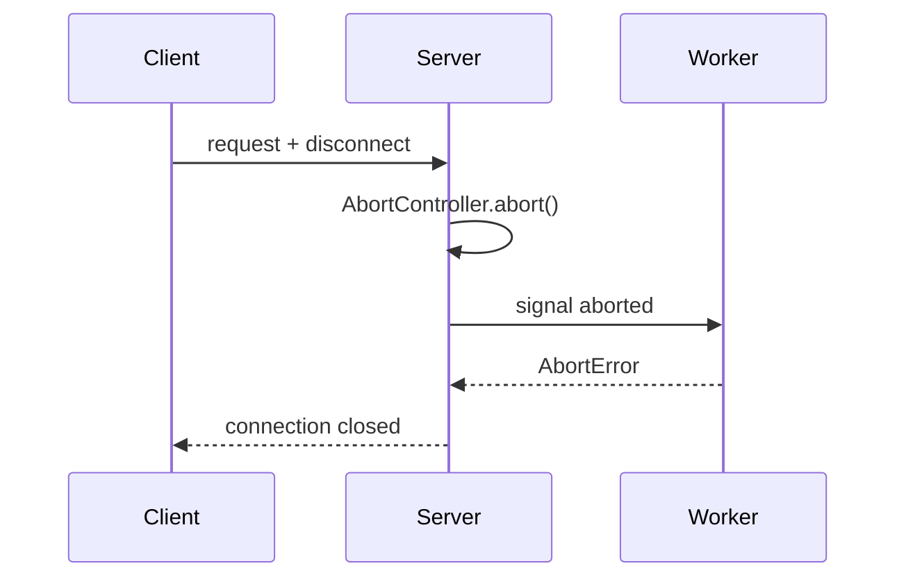

# AbortSignal Propagation Across Node APIs

## Overview

**`AbortController`** / **`AbortSignal`** provide a standard cancellation contract: an controller's **`abort()`** flips its **`signal.aborted`** flag and fires **`abort`** events, allowing fetch, timers, fs, HTTP, streams, and custom code to **stop cooperatively**. Node adopted web **`AbortSignal`** across core APIs (streams, `timers/promises`, `fs.promises`, `http`, `worker_threads`). Production systems compose signals with **`AbortSignal.timeout`**, **`AbortSignal.any`**, and request-scoped propagation from HTTP middleware through to database calls ([[07-Backend/README|Backend]]).

## Learning Objectives

- Create, abort, and listen to `AbortSignal` in Node servers
- Pass signals into Node core APIs that support `{ signal }`
- Compose parent/child cancellation with linked controllers
- Use `AbortSignal.timeout` and `AbortSignal.any` for deadlines and racing limits
- Avoid resource leaks when aborting streams, timers, and in-flight workers

## Prerequisites

- [[02-JavaScript/05-Async-and-Concurrency/Cancellation Timeouts and AbortController|Cancellation Timeouts and AbortController]]
- [[06-NodeJS/07-Timers-Events-and-IPC/EventEmitter Host Semantics and MaxListeners|EventEmitter Host Semantics and MaxListeners]]
- [[06-NodeJS/05-Networking/http and https Platform Servers|http and https Platform Servers]]

## Difficulty

`advanced`

## Estimated Time

- Reading: 2 hours
- Exercises: 2–3 hours
- Mini project: 5 hours

## History

Browsers standardized **`AbortController`** for fetch cancellation. Node 15+ integrated signals into **`stream.finished`**, **`timers/promises`**, and **`fs`**. Node 18+ aligned **`fetch`** with undici. **`AbortSignal.timeout`** / **`any`** (Node 18.17+) reduced boilerplate for server timeouts.

## Problem It Solves

- **Hung requests**: client disconnects but server keeps working
- **Cascading work**: one deadline should cancel timers, DB, and subprocesses
- **Uniform API**: `{ signal }` option vs ad-hoc `cancelled` booleans
- **Graceful shutdown**: abort in-flight work when process receives SIGTERM

## Internal Implementation



Cooperative cancellation: APIs check `signal.aborted` at await points; they must **release handles** (destroy stream, clear timer) on abort.

**`AbortSignal.any(signals)`**: aborts when **any** input aborts—useful combining client disconnect + server timeout.

## Mermaid Diagrams

### Structure



### Sequence / Lifecycle



## Examples

### Minimal Example

```typescript
import { setTimeout } from 'node:timers/promises';

const ac = new AbortController();
setTimeout(() => ac.abort(), 100);

try {
  await setTimeout(5000, undefined, { signal: ac.signal });
} catch (e) {
  console.log((e as Error).name); // AbortError
}
```

### Production-Shaped Example

HTTP handler with combined client + deadline signals:

```typescript
import http from 'node:http';
import { readFile } from 'node:fs/promises';
import { once } from 'node:events';

export function createServer(): http.Server {
  return http.createServer(async (req, res) => {
    const requestAc = new AbortController();
    const timeoutSignal = AbortSignal.timeout(30_000);
    const signal = AbortSignal.any([requestAc.signal, timeoutSignal]);

    req.on('aborted', () => requestAc.abort(new Error('client disconnected')));
    res.on('close', () => {
      if (!res.writableFinished) requestAc.abort(new Error('response closed'));
    });

    try {
      const data = await readFile('./data.json', { signal });
      res.writeHead(200, { 'Content-Type': 'application/json' });
      res.end(data);
    } catch (err) {
      if (signal.aborted) {
        if (!res.headersSent) res.writeHead(499).end(); // client closed
        return;
      }
      res.writeHead(500).end(String(err));
    }
  });
}
```

Worker pool job with signal ([[06-NodeJS/06-Concurrency-and-Scaling/Worker Pools and Message Passing|Worker Pools and Message Passing]]):

```typescript
export async function runWithAbort<T>(
  work: (signal: AbortSignal) => Promise<T>,
  signal: AbortSignal,
): Promise<T> {
  if (signal.aborted) throw signal.reason ?? new DOMException('Aborted', 'AbortError');
  return new Promise((resolve, reject) => {
    const onAbort = (): void => reject(signal.reason);
    signal.addEventListener('abort', onAbort, { once: true });
    work(signal)
      .then(resolve, reject)
      .finally(() => signal.removeEventListener('abort', onAbort));
  });
}
```

Graceful shutdown wiring:

```typescript
const shutdownAc = new AbortController();
process.on('SIGTERM', () => shutdownAc.abort(new Error('shutdown')));

// Pass shutdownAc.signal to all long-lived loops
```

## Trade-offs

| Dimension | Upside | Downside | When it matters |
| --- | --- | --- | --- |
| Performance | Stops wasted work early | Requires cooperative checks | High churn APIs |
| Complexity | Standard pattern | Easy to forget propagation | Deep call stacks |
| Operability | Clear AbortError | Distinguish timeout vs disconnect | Logging/metrics |
| Compatibility | Growing core support | Legacy callbacks lack signal | Mixed codebases |

### When to Use

- Any awaitable server work tied to request lifetime
- Shutdown of background pollers and workers
- Composed deadlines (client + server + upstream)

### When Not to Use

- Non-cancellable syscall (must kill process/thread instead)
- One-shot sync code with no await points

## Exercises

1. Abort `fs.readFile` mid-read of large file; confirm handle release.
2. Combine `AbortSignal.timeout(1000)` with manual abort; observe `AbortSignal.any`.
3. Wire HTTP client disconnect to cancel downstream `fetch`.

## Mini Project

Build **request-scoped context** holding `AbortSignal` using `AsyncLocalStorage` ([[06-NodeJS/08-Diagnostics-and-Performance/Diagnostics Channel and Async Context Tracking|Diagnostics Channel and Async Context Tracking]]).

## Portfolio Project

Integrate shutdown + request signals in [[06-NodeJS/projects/Graceful Shutdown Harness/README|Graceful Shutdown Harness]].

## Interview Questions

1. Is cancellation preemptive or cooperative in Node?
2. How do you cancel work when the HTTP client disconnects?
3. Difference between `AbortSignal.timeout` and manual `setTimeout+abort`?
4. What error type do aborted Node APIs throw?

### Stretch / Staff-Level

1. Design propagation through a job queue where producer abort must reach consumer worker.

## Common Mistakes

- Creating new controller per call without linking to request signal
- Swallowing `AbortError` as 500 instead of quiet cancel
- Not aborting on `res.close` when client resets connection
- Assuming aborted promise always rejects immediately without listener
- Missing `{ signal }` on only some APIs in a chain

## Best Practices

- Root signal per request + `AbortSignal.any` for timeouts
- Treat `AbortError` as expected, not exceptional, in logs
- Abort worker pools on shutdown ([[06-NodeJS/10-Production-Node/Graceful Shutdown and Drain|Graceful Shutdown and Drain]])
- Document which ORM/HTTP clients honor signals ([[07-Backend/README|Backend]])
- Test client disconnect paths explicitly

## Summary

**AbortSignal** is Node's standard **cooperative cancellation** wire. Thread signals through `{ signal }` options, compose with **`timeout`** and **`any`**, and bind to HTTP **`aborted`** / shutdown hooks. Abort stops wasted work and prevents leaks when clients disappear or deploys drain.

## Further Reading

- [Node.js AbortController documentation](https://nodejs.org/api/globals.html#class-abortcontroller)
- [[02-JavaScript/05-Async-and-Concurrency/Cancellation Timeouts and AbortController|Cancellation Timeouts and AbortController]]

## Related Notes

- [[06-NodeJS/07-Timers-Events-and-IPC/Timers Immediate and Scheduling Nuance|Timers Immediate and Scheduling Nuance]]
- [[06-NodeJS/10-Production-Node/Graceful Shutdown and Drain|Graceful Shutdown and Drain]]
- [[06-NodeJS/08-Diagnostics-and-Performance/Diagnostics Channel and Async Context Tracking|Diagnostics Channel and Async Context Tracking]]
- [[07-Backend/README|Backend]]
- [[02-JavaScript/05-Async-and-Concurrency/Cancellation Timeouts and AbortController|Cancellation Timeouts and AbortController]]

## Progress Checklist

- [ ] Explained from first principles
- [ ] Drew at least one Mermaid diagram
- [ ] Implemented a minimal version
- [ ] Documented trade-offs and non-goals
- [ ] Completed exercises
- [ ] Practiced interview questions aloud
- [ ] Linked prerequisites and dependents
