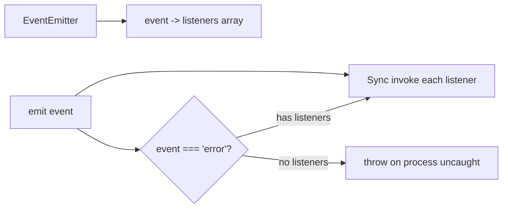
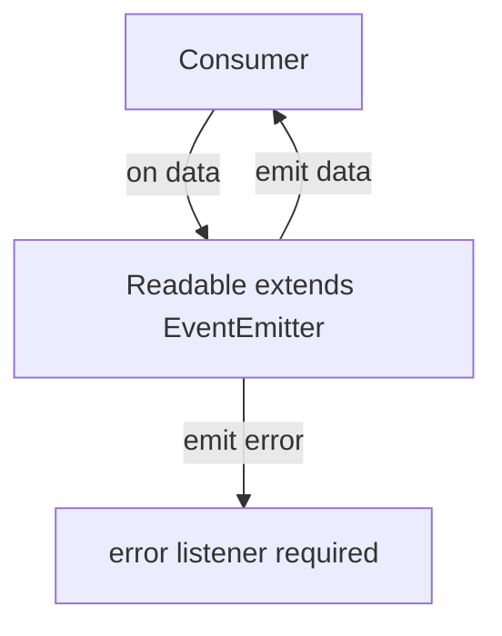
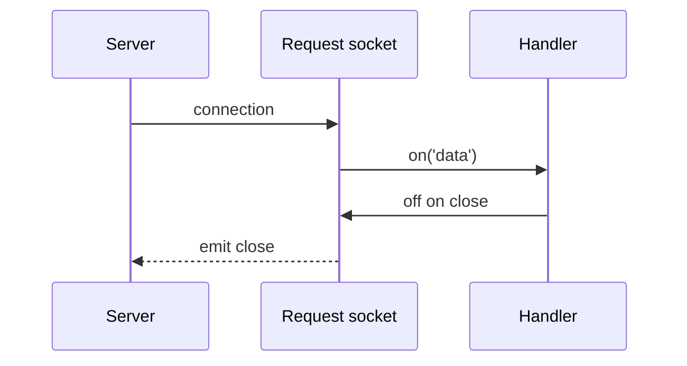

# EventEmitter Host Semantics and MaxListeners

## Overview

**`EventEmitter`** is Node's pub/sub primitive: objects emit named **events**; listeners register with `on`/`once`/`off`. Streams, HTTP servers, sockets, and process objects inherit this pattern. Node's implementation adds **host semantics** beyond a minimal JS EventEmitter: special handling for the **`error`** event, **`MaxListenersExceededWarning`**, **`captureRejections`** for async listeners, and integration with **`AbortSignal`**. Compare with the language-level lab in [[02-JavaScript/projects/EventEmitter From Scratch/README|EventEmitter From Scratch]], which deliberately omits Node's `error` process-level behavior.

## Learning Objectives

- Use `on`, `once`, `off`, `emit`, and `prependListener` correctly
- Explain Node's special `error` event semantics and avoid process crashes
- Configure and interpret `setMaxListeners` / memory leak warnings
- Handle async listener rejections with `captureRejections`
- Compose EventEmitters with streams and graceful shutdown

## Prerequisites

- [[02-JavaScript/projects/EventEmitter From Scratch/README|EventEmitter From Scratch]]
- [[06-NodeJS/02-Event-Loop-and-libuv/Handles and Requests|Handles and Requests]]
- [[02-JavaScript/05-Async-and-Concurrency/Errors Across Async Boundaries|Errors Across Async Boundaries]]

## Difficulty

`intermediate`

## Estimated Time

- Reading: 1.5 hours
- Exercises: 2 hours
- Mini project: 4 hours (extend EventEmitter lab with Node semantics)

## History

Node 0.1 modeled I/O after Ruby's EventMachine via **`EventEmitter`** (Joyent, Ryan Dahl). The **`error`** special case prevents silent failure on critical stream errors. **`defaultMaxListeners = 10`** was added to catch listener leaks—common when registering per-request handlers without cleanup.

## Problem It Solves

- **Decoupled notifications**: internal state changes without callback pyramids
- **Uniform I/O API**: streams and sockets share listener patterns
- **Leak detection**: max listener warning surfaces forgotten `on('data')` handlers
- **Operational safety**: unhandled `error` events crash process—forces explicit handling

## Internal Implementation

Listeners stored per event name in arrays. **`emit`** synchronously invokes listeners in registration order (unless `prependListener`).



**`error` event**: if `'error'` is emitted with **zero** listeners, Node throws synchronously → often **`uncaughtException`**. Always attach `emitter.on('error', handler)` or use `emitter.once('error')` patterns.

**`MaxListenersExceededWarning`**: when listener count for one event exceeds `getMaxListeners()` (default 10), Node emits **`process.emitWarning`**. Legitimate high fan-out requires `setMaxListeners(n)` with documented rationale.

**`captureRejections: true`**: async listener returning rejected Promise routes to `'error'` event instead of **`unhandledRejection`**.

## Mermaid Diagrams

### Structure



### Sequence / Lifecycle



## Examples

### Minimal Example

```typescript
import { EventEmitter } from 'node:events';

interface JobEvents {
  progress: [percent: number];
  done: [result: string];
  error: [err: Error];
}

class JobEmitter extends EventEmitter<JobEvents> {
  run(): void {
    try {
      this.emit('progress', 50);
      this.emit('done', 'ok');
    } catch (e) {
      this.emit('error', e as Error);
    }
  }
}

const job = new JobEmitter();
job.on('error', (err) => console.error('handled', err.message));
job.on('done', ([result]) => console.log(result));
job.run();
```

### Production-Shaped Example

Per-request listener cleanup on HTTP server:

```typescript
import http from 'node:http';
import { EventEmitter } from 'node:events';

EventEmitter.defaultMaxListeners = 15; // global default — prefer per-emitter

const server = http.createServer((req, res) => {
  const onAborted = (): void => {
    req.destroy();
  };
  req.on('aborted', onAborted);

  res.on('close', () => {
    req.off('aborted', onAborted); // prevent MaxListeners leak on keep-alive
  });

  req.on('error', (err) => {
    console.error({ err, url: req.url });
    if (!res.headersSent) res.writeHead(500).end();
  });

  res.end('ok');
});
```

Async listener with captureRejections:

```typescript
import { EventEmitter } from 'node:events';

const ee = new EventEmitter({ captureRejections: true });
ee.on('error', (err) => console.error('async listener failed', err));
ee.on('run', async () => {
  throw new Error('async fail');
});
void ee.emit('run');
```

## Trade-offs

| Dimension | Upside | Downside | When it matters |
| --- | --- | --- | --- |
| Performance | Sync dispatch, fast | Slow listener blocks emit | Hot paths |
| Complexity | Simple API | Listener leak footguns | Long-lived servers |
| Operability | `error` forces handling | Crashes if omitted | Streams/production |
| Typing | Generic `EventEmitter<T>` | Stringly events in legacy code | TS services |

### When to Use

- Wrapping streams, sockets, process lifecycle
- Internal module pub/sub with bounded listener sets
- Extending Node core patterns in libraries

### When Not to Use

- Cross-service messaging (use message bus—[[07-Backend/README|Backend]])
- High-frequency events without backpressure ([[06-NodeJS/04-Buffers-Streams-and-IO/Backpressure and HighWaterMark|Backpressure and HighWaterMark]])
- Global application event bus antipattern at scale

## Exercises

1. Emit `'error'` with no listener; observe process behavior. Add listener and repeat.
2. Register 11 `on('data')` handlers; trigger warning; fix with cleanup or `setMaxListeners`.
3. Compare [[02-JavaScript/projects/EventEmitter From Scratch/README|EventEmitter From Scratch]] behavior for `'error'` vs Node core.

## Mini Project

Extend the **EventEmitter From Scratch** lab to optionally emulate Node's `error` throw semantics behind a flag; document differences in README.

## Portfolio Project

Use typed EventEmitters in [[06-NodeJS/projects/Node Runtime Toolkit/README|Node Runtime Toolkit]] shutdown coordinator.

## Interview Questions

1. What happens when you `emit('error')` with no listeners?
2. Why does Node warn about max listeners?
3. How do you safely add per-request socket listeners with keep-alive?
4. What does `captureRejections` change for async listeners?

### Stretch / Staff-Level

1. Design a wrapper that auto-removes listeners when `AbortSignal` aborts.

## Common Mistakes

- Missing `error` handler on streams/sockets
- Adding listeners inside request handler without removal
- Using `emit('error')` for non-fatal control flow
- Assuming browser `EventTarget` semantics match Node
- `once` inside loop closing over wrong variable

## Best Practices

- Always handle `error` on stream-like emitters
- Remove listeners on `close`/`abort`/`destroy`
- Use typed `EventEmitter<Events>` in TypeScript
- Document raised `setMaxListeners` with reason
- Prefer `once` for one-shot lifecycle hooks

## Summary

Node's **EventEmitter** powers streams and I/O with synchronous listener dispatch. The **`error`** event crashes the process if unhandled—treat it as exceptional. **`MaxListenersExceededWarning`** catches leaks; fix with cleanup, not silent limit raises. Relate portable emitter mechanics to [[02-JavaScript/projects/EventEmitter From Scratch/README|EventEmitter From Scratch]], then layer Node host rules in production code.

## Further Reading

- [Node.js events documentation](https://nodejs.org/api/events.html)
- [[02-JavaScript/projects/EventEmitter From Scratch/Architecture|EventEmitter From Scratch Architecture]]

## Related Notes

- [[02-JavaScript/projects/EventEmitter From Scratch/README|EventEmitter From Scratch]]
- [[06-NodeJS/04-Buffers-Streams-and-IO/Readable Writable and Duplex Streams|Readable Writable and Duplex Streams]]
- [[06-NodeJS/07-Timers-Events-and-IPC/AbortSignal Propagation Across Node APIs|AbortSignal Propagation Across Node APIs]]
- [[06-NodeJS/01-Process-and-Runtime/unhandledRejection uncaughtException and Fatal Errors|unhandledRejection uncaughtException and Fatal Errors]]
- [[06-NodeJS/10-Production-Node/Graceful Shutdown and Drain|Graceful Shutdown and Drain]]

## Progress Checklist

- [ ] Explained from first principles
- [ ] Drew at least one Mermaid diagram
- [ ] Implemented a minimal version
- [ ] Documented trade-offs and non-goals
- [ ] Completed exercises
- [ ] Practiced interview questions aloud
- [ ] Linked prerequisites and dependents
