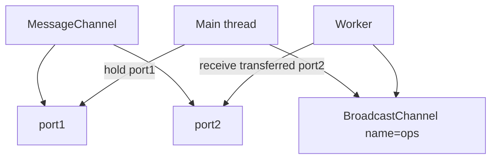
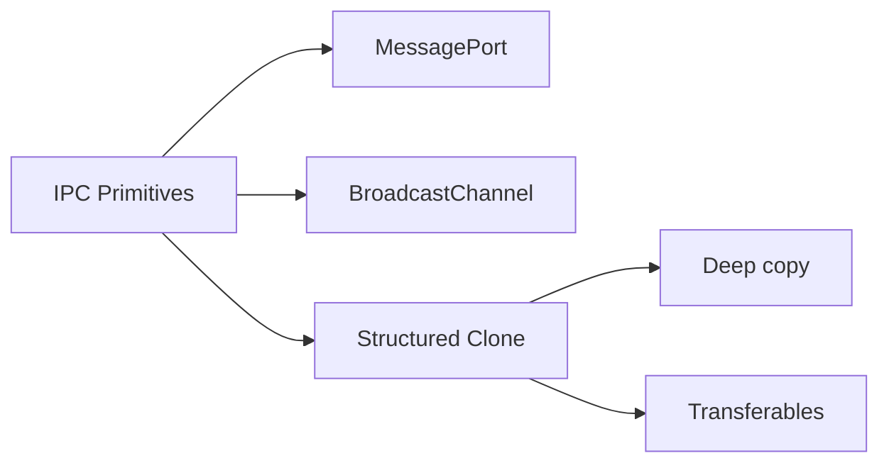
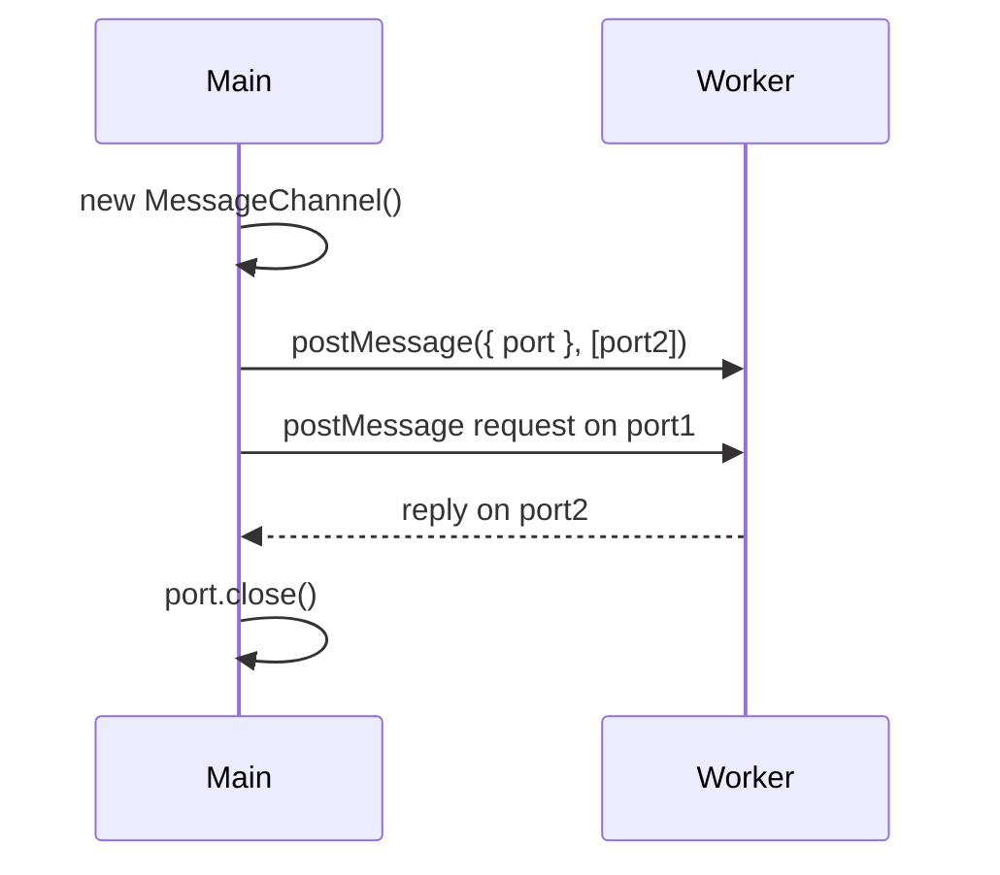

# MessagePort BroadcastChannel and Structured Clone

## Overview

**`MessageChannel`** creates paired **`MessagePort`** endpoints for bidirectional communication. **`worker_threads`** exposes **`parentPort`**; ports can be **transferred** between threads. **`BroadcastChannel`** (Node 18+) provides same-process **pub/sub** by channel name across workers and main. All use the **structured clone algorithm** to copy payloads (or **transfer** buffers/`MessagePort`). This note covers Node IPC primitives beyond simple `postMessage` strings—essential for worker pools, service workers patterns, and cross-thread event buses.

## Learning Objectives

- Create `MessageChannel` and transfer ports to workers
- Explain structured clone vs JSON vs transfer list semantics
- Use `BroadcastChannel` for fan-out notifications within a process
- Handle `messageerror` and port closing lifecycle
- Relate to browser APIs and [[02-JavaScript/03-Objects-and-Metaprogramming/JSON Structured Clone and Serialization|JSON Structured Clone and Serialization]]

## Prerequisites

- [[06-NodeJS/06-Concurrency-and-Scaling/worker_threads Model|worker_threads Model]]
- [[02-JavaScript/03-Objects-and-Metaprogramming/JSON Structured Clone and Serialization|JSON Structured Clone and Serialization]]
- [[06-NodeJS/06-Concurrency-and-Scaling/Worker Pools and Message Passing|Worker Pools and Message Passing]]

## Difficulty

`advanced`

## Estimated Time

- Reading: 2 hours
- Exercises: 2–3 hours
- Mini project: 5 hours

## History

HTML5 **`postMessage`** introduced structured cloning in browsers. Node **`worker_threads`** adopted **`MessagePort`** from the same spec. **`BroadcastChannel`** landed in Node 18 for WinterCG alignment ([[06-NodeJS/00-Orientation/Deno Bun and WinterCG Portability|Deno Bun and WinterCG Portability]]). **`child_process`** IPC remains JSON-limited—don't confuse the two.

## Problem It Solves

- **Duplex IPC**: request/response channels without shared state
- **Port fan-out**: transfer dedicated port per worker in a pool
- **In-process pub/sub**: config change notifications to all workers
- **Zero-copy**: transfer `ArrayBuffer`/`MessagePort` instead of cloning megabytes

## Internal Implementation



**Structured clone** supports: primitives, objects, arrays, `Date`, `Map`, `Set`, typed arrays, `ArrayBuffer`, circular refs. **Unsupported**: functions, symbols (mostly), DOM nodes, certain host objects.

**Transfer list**: ownership moves; sender loses access. **`MessagePort`** itself is transferable—pattern for passing reply channel.

**BroadcastChannel**: messages delivered to all subscribers in **same process**; not cross-process (use Redis/pub-sub—[[07-Backend/README|Backend]]).

## Mermaid Diagrams

### Structure



### Sequence / Lifecycle



## Examples

### Minimal Example

```typescript
import { MessageChannel } from 'node:worker_threads';

const { port1, port2 } = new MessageChannel();

port1.on('message', (msg: { answer: number }) => {
  console.log(msg.answer);
  port1.close();
});

port2.postMessage({ answer: 42 });
port2.close();
```

Worker with transferred reply port:

```typescript
import { Worker, MessageChannel } from 'node:worker_threads';

const { port1, port2 } = new MessageChannel();
const worker = new Worker('./echo-worker.js');

worker.postMessage({ port: port2 }, [port2]);

port1.on('message', (msg) => console.log('reply', msg));
port1.postMessage({ ping: 1 });
```

### Production-Shaped Example

BroadcastChannel for config reload across workers:

```typescript
import { BroadcastChannel } from 'node:worker_threads';
import { isMainThread } from 'node:worker_threads';

const CONFIG_CHANNEL = 'app-config-v1';

export function subscribeConfig(onConfig: (cfg: AppConfig) => void): () => void {
  const bc = new BroadcastChannel(CONFIG_CHANNEL);
  bc.onmessage = (event: MessageEvent<AppConfig>) => onConfig(event.data);

  return () => bc.close();
}

export function publishConfig(cfg: AppConfig): void {
  const bc = new BroadcastChannel(CONFIG_CHANNEL);
  bc.postMessage(cfg);
  bc.close();
}

interface AppConfig {
  featureFlags: Record<string, boolean>;
  version: number;
}
```

Transfer large buffer without copy:

```typescript
function sendBuffer(port: MessagePort, buf: ArrayBuffer): void {
  port.postMessage({ buf }, [buf]);
  // buf is detached here — do not use
}
```

## Trade-offs

| Dimension | MessagePort | BroadcastChannel | child_process IPC |
| --- | --- | --- | --- |
| Scope | Point-to-point | Process-wide pub/sub | Cross-process |
| Clone | Structured | Structured | JSON only |
| Ordering | Per-port FIFO | No global order guarantee | Varies |

### When to Use

- Dedicated duplex channels per worker job
- Broadcast config/feature flag changes in-process
- Transferring buffers between threads

### When Not to Use

- Cross-machine messaging ([[07-Backend/README|Backend]] / message queue)
- High-volume streaming (use streams—[[06-NodeJS/04-Buffers-Streams-and-IO/Readable Writable and Duplex Streams|Readable Writable and Duplex Streams]])
- Replacing `EventEmitter` for same-thread sync events

## Exercises

1. Transfer `MessagePort` to worker; implement RPC request/response with correlation IDs.
2. Post object with circular reference via structured clone; fail with plain `JSON.stringify` for comparison.
3. Open two workers + `BroadcastChannel`; publish from main, verify both receive.

## Mini Project

Implement **in-process event bus** using `BroadcastChannel` with typed events and unsubscribe cleanup.

## Portfolio Project

Use transferred ports in [[06-NodeJS/projects/Worker Pool Lab/README|Worker Pool Lab]] for duplex job status streaming.

## Interview Questions

1. Structured clone vs JSON.stringify for IPC?
2. What happens if you transfer an `ArrayBuffer` and then read it on the sender?
3. Can `BroadcastChannel` reach another Node process?
4. How is `MessagePort` different from `worker_threads` `parentPort`?

### Stretch / Staff-Level

1. Design RPC over MessagePort with timeout, abort, and backpressure.

## Common Mistakes

- Using cloned object after transfer detached its buffers
- Not closing ports → memory leak / open handle warnings
- Expecting global ordering across multiple BroadcastChannel subscribers
- Sending functions or class instances with methods (lost in clone)
- Confusing `child_process` JSON messages with structured clone

## Best Practices

- Close ports when conversation completes
- Version message schemas `{ v: 1, ... }`
- Prefer transfer for binary; clone for small metadata
- Handle `messageerror` for deserialization failures
- Use BroadcastChannel sparingly—explicit channels for critical paths

## Summary

**MessagePort** enables structured-clone IPC with optional **transferables**; **BroadcastChannel** fan-outs within a process. They underpin worker communication and WinterCG portability. Choose clone vs transfer based on payload size; close ports; don't use for cross-process (use [[06-NodeJS/06-Concurrency-and-Scaling/child_process IPC Patterns|child_process IPC Patterns]] or external bus).

## Further Reading

- [Node worker_threads MessageChannel](https://nodejs.org/api/worker_threads.html#class-messagechannel)
- [Structured clone specification](https://html.spec.whatwg.org/multipage/structured-data.html)

## Related Notes

- [[06-NodeJS/06-Concurrency-and-Scaling/worker_threads Model|worker_threads Model]]
- [[06-NodeJS/06-Concurrency-and-Scaling/Worker Pools and Message Passing|Worker Pools and Message Passing]]
- [[06-NodeJS/06-Concurrency-and-Scaling/SharedArrayBuffer Atomics on Node|SharedArrayBuffer Atomics on Node]]
- [[02-JavaScript/03-Objects-and-Metaprogramming/JSON Structured Clone and Serialization|JSON Structured Clone and Serialization]]
- [[06-NodeJS/00-Orientation/Deno Bun and WinterCG Portability|Deno Bun and WinterCG Portability]]

## Progress Checklist

- [ ] Explained from first principles
- [ ] Drew at least one Mermaid diagram
- [ ] Implemented a minimal version
- [ ] Documented trade-offs and non-goals
- [ ] Completed exercises
- [ ] Practiced interview questions aloud
- [ ] Linked prerequisites and dependents
