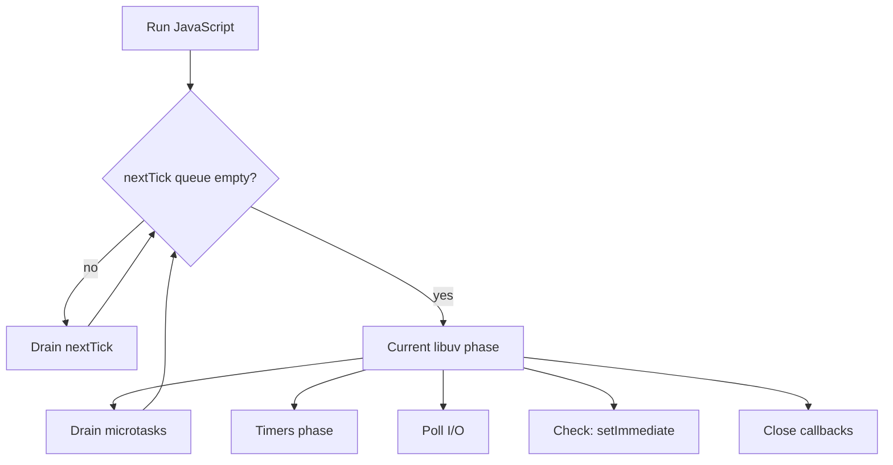
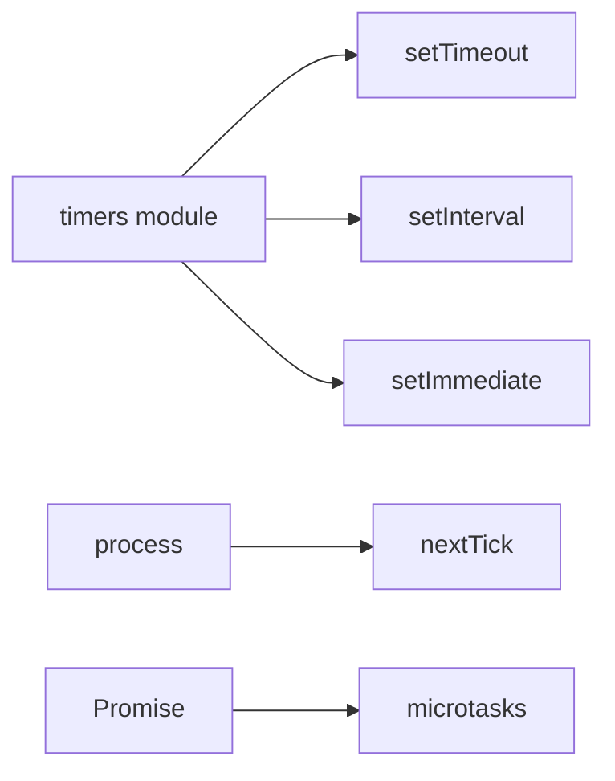

# Timers Immediate and Scheduling Nuance

## Overview

Node schedules deferred work through **libuv timer phase** (`setTimeout`/`setInterval`), **check phase** (`setImmediate`), **`process.nextTick` queue** (pre-phase, highest priority), and **microtasks** (Promises, `queueMicrotask`). Ordering between these is **not** interchangeable—misuse causes starvation, surprising I/O latency, and "works in browser" bugs. This note is the Node-host scheduling reference; portable microtask semantics live in [[02-JavaScript/05-Async-and-Concurrency/Tasks Microtasks and Rendering|Tasks Microtasks and Rendering]].

## Learning Objectives

- Map `setTimeout`, `setInterval`, `setImmediate`, and `nextTick` to libuv phases
- Predict execution order in nested timer/microtask scenarios
- Choose the correct deferral primitive for I/O continuation vs user-visible yield
- Detect timer starvation from recursive `nextTick` or long microtask chains
- Relate scheduling to HTTP server responsiveness under load

## Prerequisites

- [[06-NodeJS/02-Event-Loop-and-libuv/Event Loop Phases|Event Loop Phases]]
- [[06-NodeJS/02-Event-Loop-and-libuv/process.nextTick vs Microtasks vs Timers|process.nextTick vs Microtasks vs Timers]]
- [[02-JavaScript/05-Async-and-Concurrency/Event Loop and Task Queues|Event Loop and Task Queues]]

## Difficulty

`advanced`

## Estimated Time

- Reading: 2 hours
- Exercises: 2–3 hours
- Mini project: 4 hours (scheduling tracer lab)

## History

libuv inherited timer heaps from Unix event libraries. `setImmediate` was Node-specific (2010s) to run callbacks **after I/O**, avoiding the 1 ms `setTimeout(0)` hack. `process.nextTick` predates standardized microtasks and remains **stronger than Promise jobs** in Node— a recurring footgun as developers expect browser ordering.

## Problem It Solves

- **Defer without blocking**: run code after current stack, before or after I/O phases
- **Batch I/O callbacks**: `setImmediate` yields to poll phase between heavy chunks
- **API compatibility**: timers mirror browser APIs with host-specific ordering
- **Debugging "random" order**: explains test flakes and logging interleaving

## Internal Implementation



**Timer minimum delay**: `setTimeout(fn, 0)` is clamped (historically 1 ms; subject to browser/Node alignment). Timers fire **after** their phase when deadline elapsed—they do not preempt running JS.

**`setImmediate` vs `setTimeout(0)`**: inside I/O callback, `setImmediate` usually runs before timer 0; from main script top-level, order can invert—classic interview trap.

**Ref/unref**: `timeout.unref()` excludes handle from keeping process alive ([[06-NodeJS/01-Process-and-Runtime/Signals Exit Codes and Lifecycle Hooks|Signals Exit Codes and Lifecycle Hooks]]).

## Mermaid Diagrams

### Structure



### Sequence / Lifecycle

```mermaid
sequenceDiagram
    participant Script
    participant nextTick
    participant Loop as libuv phases
    participant Micro as microtasks
    Script->>nextTick: nextTick(A)
    Script->>Loop: setTimeout(B,0)
    Script->>Loop: setImmediate(C)
    Script->>Micro: Promise.resolve().then(D)
    Note over Script,Micro: Stack clears → drain nextTick → phase work → microtasks
```

## Examples

### Minimal Example

```typescript
import { setTimeout as st, setImmediate as si } from 'node:timers';
import { nextTick } from 'node:process';

const order: string[] = [];

st(() => order.push('timeout'), 0);
si(() => order.push('immediate'));
nextTick(() => order.push('nextTick'));
queueMicrotask(() => order.push('microtask'));

Promise.resolve().then(() => {
  order.push('promise');
  // Log after full turn completes
  setImmediate(() => console.log(order));
});
// Typical: nextTick, microtask, promise, immediate, timeout (context-dependent)
```

### Production-Shaped Example

Chunk CPU work without starving I/O:

```typescript
export async function processInChunks<T>(
  items: T[],
  chunkSize: number,
  fn: (item: T) => void,
): Promise<void> {
  let i = 0;
  await new Promise<void>((resolve) => {
    const step = (): void => {
      const end = Math.min(i + chunkSize, items.length);
      for (; i < end; i++) fn(items[i]!);
      if (i < items.length) {
        setImmediate(step); // yield to poll phase
      } else {
        resolve();
      }
    };
    setImmediate(step);
  });
}
```

Timer with `AbortSignal` ([[06-NodeJS/07-Timers-Events-and-IPC/AbortSignal Propagation Across Node APIs|AbortSignal Propagation Across Node APIs]]):

```typescript
import { setTimeout } from 'node:timers/promises';

export async function waitWithAbort(ms: number, signal?: AbortSignal): Promise<void> {
  if (signal?.aborted) throw signal.reason;
  await setTimeout(ms, undefined, { signal });
}
```

## Trade-offs

| Primitive | Runs | Risk | Use when |
| --- | --- | --- | --- |
| `nextTick` | Before next phase | Starves I/O | Fix z-order before continue |
| microtask | After sync, per spec | Long chains delay I/O | Promise continuations |
| `setImmediate` | Check phase | Less precise delay | Break up CPU on server |
| `setTimeout` | Timers phase | Minimum delay clamp | User-facing delays |

### When to Use

- `setImmediate`: cooperative multitasking on server event loop
- `setTimeout`: debounce, rate limits, backoff
- `nextTick`: defer until after current operation completes (library internals)

### When Not to Use

- `nextTick` for "async API" public surfaces (use `queueMicrotask` or Promises)
- `setTimeout(0)` for precise post-I/O ordering (prefer `setImmediate`)

## Exercises

1. Write a script that prints order for nested `nextTick` + Promise + `setImmediate`; explain results.
2. Build recursive `nextTick` loop; observe I/O stall with `monitorEventLoopDelay`.
3. Refactor CPU loop to `setImmediate` chunks; compare loop delay histogram.

## Mini Project

Implement an **event-loop phase tracer** logging `nextTick`, microtask, timer, and immediate ordering under synthetic load.

## Portfolio Project

Add scheduling benchmarks to [[06-NodeJS/projects/Node Runtime Toolkit/README|Node Runtime Toolkit]] diagnostics module.

## Interview Questions

1. Order: `nextTick`, Promise, `setImmediate`, `setTimeout(0)` from main?
2. Why can recursive `nextTick` starve I/O?
3. Difference between `setImmediate` and `setTimeout(fn, 0)` in an I/O callback?
4. What does `timeout.unref()` do?

### Stretch / Staff-Level

1. Explain how libuv timer phase interacts with `poll` timeout when no I/O is pending.

## Common Mistakes

- Public APIs deferring with `nextTick` (surprising ordering vs Promises)
- Assuming browser timer semantics on Node under load
- Forgetting to `clearTimeout` on shutdown paths
- Using timers for high-precision scheduling (use perf hooks or external clock)
- `setInterval` drift without catch-up logic for periodic jobs

## Best Practices

- Prefer `setImmediate` for yielding CPU on servers
- Expose async APIs as Promises, not `nextTick` callbacks
- Clear timers on shutdown ([[06-NodeJS/10-Production-Node/Graceful Shutdown and Drain|Graceful Shutdown and Drain]])
- Use `timers/promises` + `AbortSignal` for cancellable waits
- Monitor loop delay, not just wall time

## Summary

Node scheduling layers **nextTick** (strongest), **microtasks**, **timers**, and **setImmediate** across libuv phases. Server code should yield CPU with **`setImmediate`**, avoid recursive **`nextTick`**, and treat timer ordering as **context-dependent**. Master phase mapping to debug latency and test flakes.

## Further Reading

- [[06-NodeJS/02-Event-Loop-and-libuv/Event Loop Phases|Event Loop Phases]]
- [Node.js timers documentation](https://nodejs.org/api/timers.html)

## Related Notes

- [[06-NodeJS/02-Event-Loop-and-libuv/process.nextTick vs Microtasks vs Timers|process.nextTick vs Microtasks vs Timers]]
- [[06-NodeJS/02-Event-Loop-and-libuv/Starvation Backpressure and Loop Health|Starvation Backpressure and Loop Health]]
- [[06-NodeJS/07-Timers-Events-and-IPC/AbortSignal Propagation Across Node APIs|AbortSignal Propagation Across Node APIs]]
- [[02-JavaScript/05-Async-and-Concurrency/Event Loop and Task Queues|Event Loop and Task Queues]]

## Progress Checklist

- [ ] Explained from first principles
- [ ] Drew at least one Mermaid diagram
- [ ] Implemented a minimal version
- [ ] Documented trade-offs and non-goals
- [ ] Completed exercises
- [ ] Practiced interview questions aloud
- [ ] Linked prerequisites and dependents
