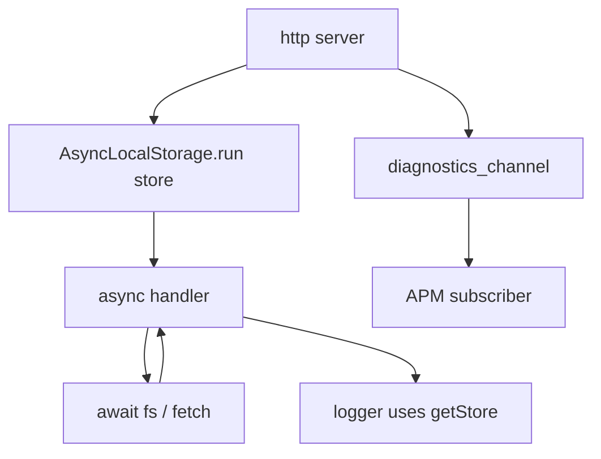
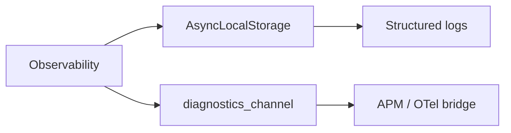
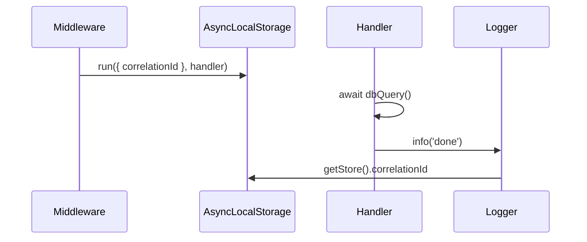

# Diagnostics Channel and Async Context Tracking

## Overview

**`diagnostics_channel`** exposes low-overhead publish/subscribe hooks inside Node core and user code—used by OpenTelemetry and APM agents to instrument `http`, `fetch`, and `fs` without monkey-patching. **`AsyncLocalStorage` (ALS)** stores per-async-chain context (correlation IDs, auth principals) across `await` boundaries. Together they enable **request-scoped observability** in callback-heavy and promise-heavy Node servers. Platform aggregation lives in [[16-DevOps/README|DevOps]]; this note covers runtime instrumentation mechanics.

## Learning Objectives

- Subscribe and publish on named `diagnostics_channel` channels
- Propagate correlation IDs with `AsyncLocalStorage.run` and `getStore`
- Integrate ALS with HTTP middleware and worker boundaries
- Compare ALS to `cls-hooked` legacy and manual `req.id` threading
- Connect to structured logging ([[06-NodeJS/10-Production-Node/Structured Logging and Correlation IDs|Structured Logging and Correlation IDs]])

## Prerequisites

- [[06-NodeJS/02-Event-Loop-and-libuv/Event Loop Phases|Event Loop Phases]]
- [[02-JavaScript/07-Production-JavaScript/Observability and Operational Readiness|Observability and Operational Readiness]]
- [[06-NodeJS/05-Networking/http and https Platform Servers|http and https Platform Servers]]

## Difficulty

`advanced`

## Estimated Time

- Reading: 2.5 hours
- Exercises: 3 hours
- Mini project: 6 hours

## History

**`async_hooks`** (Node 8) enabled tracing but was easy to misuse (performance). **`AsyncLocalStorage`** (Node 16 stable) simplified context storage. **`diagnostics_channel`** (Node 15+) replaced ad-hoc internal tracing hooks with stable channel names documented for APM vendors.

## Problem It Solves

- **Lost request context** after `await` without explicit parameter threading
- **Fragile monkey-patching** of `http.createServer` for tracing
- **Cross-cutting instrumentation** in libraries without coupling to OTel
- **Worker/thread context break** when jobs need parent correlation ID

## Internal Implementation



**ALS** uses **`async_hooks`** internally to track async resources; **`run(store, fn)`** sets context for `fn` and descendants until the async chain completes.

**diagnostics_channel**: `channel.subscribe((message, name) => ...)`; `channel.publish(data)`—synchronous, in-process only.

## Mermaid Diagrams

### Structure



### Sequence / Lifecycle



## Examples

### Minimal Example

```typescript
import { AsyncLocalStorage } from 'node:async_hooks';

interface RequestContext {
  correlationId: string;
}

export const requestContext = new AsyncLocalStorage<RequestContext>();

export function getCorrelationId(): string | undefined {
  return requestContext.getStore()?.correlationId;
}
```

```typescript
import diagnostics_channel from 'node:diagnostics_channel';

const channel = diagnostics_channel.channel('myapp:order:created');

channel.subscribe((message: { orderId: string }) => {
  console.log('metric increment', message.orderId);
});

channel.publish({ orderId: 'ord_123' });
```

### Production-Shaped Example

HTTP middleware + logging:

```typescript
import http from 'node:http';
import { randomUUID } from 'node:crypto';
import { requestContext, getCorrelationId } from './context.js';

function log(level: string, msg: string, extra: Record<string, unknown> = {}): void {
  console.log(JSON.stringify({
    level,
    msg,
    correlationId: getCorrelationId(),
    ...extra,
    ts: new Date().toISOString(),
  }));
}

const server = http.createServer((req, res) => {
  const correlationId = (req.headers['x-correlation-id'] as string) ?? randomUUID();
  requestContext.run({ correlationId }, async () => {
    log('info', 'request start', { method: req.method, url: req.url });
    try {
      await handleBusinessLogic();
      res.writeHead(200).end('ok');
      log('info', 'request end', { status: 200 });
    } catch (err) {
      log('error', 'request failed', { err: String(err) });
      res.writeHead(500).end();
    }
  });
});

async function handleBusinessLogic(): Promise<void> {
  await new Promise((r) => setTimeout(r, 10));
  log('info', 'mid-flight'); // correlationId present
}
```

Worker propagation:

```typescript
worker.postMessage({ job, correlationId: getCorrelationId() });
// Worker re-establishes ALS.run({ correlationId }, ...) at job entry
```

## Trade-offs

| Dimension | Upside | Downside | When it matters |
| --- | --- | --- | --- |
| Performance | ALS faster than cls-hooked | async_hooks overhead if abused | Hot paths |
| Complexity | No manual id threading | Breaks if `run` omitted | Deep middleware |
| Operability | Standard OTel integration | Context lost across processes | Need header propagation |
| Debuggability | Implicit magic context | Harder for newcomers | Onboarding docs |

### When to Use

- HTTP/gRPC request scoped logging and tracing
- Library hooks via diagnostics_channel
- Passing implicit auth/tenant context in async handlers

### When Not to Use

- Cross-process tracing without injecting headers ([[07-Backend/README|Backend]])
- Global mutable singleton instead of ALS (race conditions)
- Storing large objects in ALS store (memory retention)

## Exercises

1. Prove context loss without ALS: log before/after `await` with manual vs ALS id.
2. Subscribe to `tracing:http:server:request:start` channel (if enabled) and log message shape.
3. Pass correlation ID into worker job and restore ALS in worker script.

## Mini Project

Build middleware package: **`withRequestContext`**, **`getLogger()`**, OTel span attribute from ALS.

## Portfolio Project

Wire ALS + diagnostics_channel in [[06-NodeJS/projects/Node Runtime Toolkit/README|Node Runtime Toolkit]].

## Interview Questions

1. Why does parameter threading break down in deep async call stacks?
2. How does AsyncLocalStorage relate to async_hooks?
3. What is diagnostics_channel vs OpenTelemetry?
4. How do you propagate context into worker_threads?

### Stretch / Staff-Level

1. Explain ALS behavior when mixing `queueMicrotask`, `setImmediate`, and `worker_threads`.

## Common Mistakes

- Calling async code outside `ALS.run` wrapper
- Storing request-specific data on global object
- Large ALS stores preventing GC of request artifacts
- Expecting ALS to cross process boundaries automatically
- Subscribing to diagnostics_channel without unsubscribe on hot reload

## Best Practices

- Enter ALS at HTTP/middleware boundary once
- Keep store small: ids, tenant slug—not full user objects
- Forward `x-correlation-id` to outbound fetch ([[07-Backend/README|Backend]])
- Document channel names if publishing custom diagnostics
- Test context after internal `await` and thread hops

## Summary

**AsyncLocalStorage** carries request context through async Node work; **diagnostics_channel** exposes stable instrumentation hooks. Use ALS at boundaries, keep stores lean, and propagate IDs across workers/processes explicitly. Ship logs/traces to platforms via [[16-DevOps/README|DevOps]] tooling.

## Further Reading

- [Node.js AsyncLocalStorage](https://nodejs.org/api/async_context.html)
- [diagnostics_channel API](https://nodejs.org/api/diagnostics_channel.html)

## Related Notes

- [[06-NodeJS/10-Production-Node/Structured Logging and Correlation IDs|Structured Logging and Correlation IDs]]
- [[02-JavaScript/07-Production-JavaScript/Observability and Operational Readiness|Observability and Operational Readiness]]
- [[06-NodeJS/08-Diagnostics-and-Performance/Inspector CPU Profiling and Heap Snapshots|Inspector CPU Profiling and Heap Snapshots]]
- [[16-DevOps/README|DevOps]]
- [[07-Backend/README|Backend]]

## Progress Checklist

- [ ] Explained from first principles
- [ ] Drew at least one Mermaid diagram
- [ ] Implemented a minimal version
- [ ] Documented trade-offs and non-goals
- [ ] Completed exercises
- [ ] Practiced interview questions aloud
- [ ] Linked prerequisites and dependents
