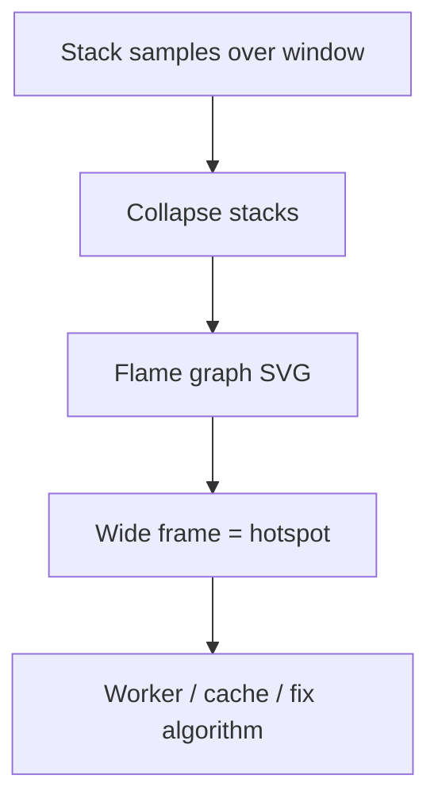
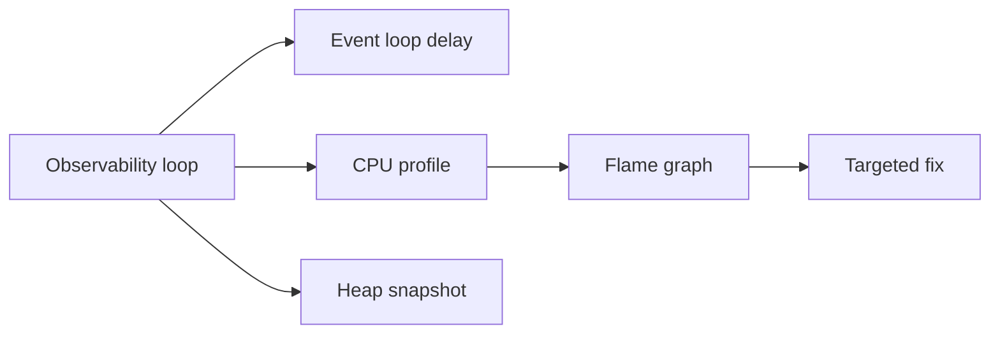
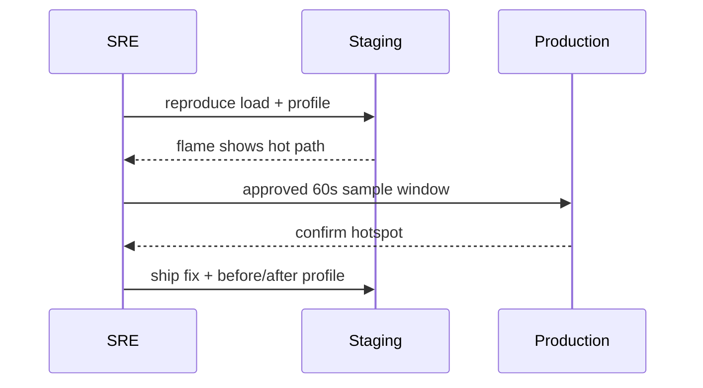

# Flamegraphs Bottlenecks and Production Profiling Discipline

## Overview

A **flame graph** visualizes stacked CPU samples: width = time spent, y-axis = call stack depth. It turns profiles into actionable **bottleneck** identification—wide plateaus are hot paths. **Production profiling discipline** governs *when*, *how long*, and *with what approval* to sample live traffic without PII leaks or debug-port exposure. Node profiles come from **Chrome DevTools**, **`clinic flame`**, **`0x`**, or **`inspector` Session**—this note ties interpretation to loop delay and heap work.

## Learning Objectives

- Read flame graphs: self time, total time, library vs app frames
- Distinguish CPU-bound, GC, and event-loop-blocked bottlenecks
- Run controlled production profiles with budgets and rollback
- Map hotspots to remediation: workers, caching, algorithm change
- Integrate profiling into incident response without guesswork

## Prerequisites

- [[06-NodeJS/08-Diagnostics-and-Performance/Inspector CPU Profiling and Heap Snapshots|Inspector CPU Profiling and Heap Snapshots]]
- [[06-NodeJS/08-Diagnostics-and-Performance/perf_hooks and Event Loop Delay|perf_hooks and Event Loop Delay]]
- [[06-NodeJS/06-Concurrency-and-Scaling/Choosing Threads Processes and Offload|Choosing Threads Processes and Offload]]

## Difficulty

`expert`

## Estimated Time

- Reading: 2.5 hours
- Exercises: 3–4 hours
- Mini project: 6 hours

## History

Brendan Gregg popularized **flame graphs** (2011) for kernel profiling. Node community tools (**`0x`**, **Clinic.js** from Nearform) adapted them for V8 stacks. Cloud APMs now offer continuous profiling ([[16-DevOps/README|DevOps]])—same interpretation skills apply.

## Problem It Solves

- **"Optimize random code"** without evidence
- **Misattributed slowness**: blaming DB when JSON.stringify dominates
- **Production-only bugs** absent in dev profiles (data shape, concurrency)
- **Repeat incidents** without post-profile runbooks

## Internal Implementation



Profile types:

- **CPU sample**: where JS/native executed
- **Wall time trace**: includes idle/wait (different story)
- **Allocation timeline**: GC pressure drivers

Combine with **`monitorEventLoopDelay`**: if lag high but CPU profile flat, suspect sync work outside samples or I/O wait.

## Mermaid Diagrams

### Structure



### Sequence / Lifecycle



## Examples

### Minimal Example

```bash
npx 0x app.js
# load test while running → opens flamegraph.html
```

Clinic:

```bash
npx clinic flame -- node server.js
# Ctrl+C → generates HTML report
```

### Production-Shaped Example

Runbook snippet (staging first):

```typescript
import { Session } from 'node:inspector/promises';
import { writeFileSync } from 'node:fs';

export async function captureProfileRunbook(opts: {
  durationSec: number;
  outPath: string;
  approver: string;
}): Promise<void> {
  console.log(JSON.stringify({ event: 'profile_start', ...opts, pid: process.pid }));
  const session = new Session();
  session.connect();
  await session.post('Profiler.enable');
  await session.post('Profiler.start');
  await new Promise((r) => setTimeout(r, opts.durationSec * 1000));
  const { profile } = await session.post('Profiler.stop');
  writeFileSync(opts.outPath, JSON.stringify(profile));
  await session.post('Profiler.disable');
  session.disconnect();
  console.log(JSON.stringify({ event: 'profile_end', path: opts.outPath }));
}
```

Interpretation checklist:

```typescript
// After loading profile in DevTools or speedscope:
// 1. Sort by Self Time — top frames are candidates
// 2. Check if time is in node_modules vs app code
// 3. If bcrypt/json/crypto wide → offload ([[06-NodeJS/06-Concurrency-and-Scaling/worker_threads Model|worker_threads]])
// 4. If GC wide → allocation/leak path ([[06-NodeJS/08-Diagnostics-and-Performance/Memory Limits and Heap Flags|Memory Limits]])
// 5. Compare p99 loop delay before/after fix
```

## Trade-offs

| Approach | Upside | Downside |
| --- | --- | --- |
| Local/staging profile | Safe, repeatable | May miss prod data shapes |
| Short prod sample | Real traffic | Risk + noise |
| Continuous profiler | Always on | Cost + PII policy |

### When to Use

- Before major optimization sprints
- Incidents with high CPU or loop lag
- Release validation for perf-sensitive paths

### When Not to Use

- Without representative load
- As substitute for algorithmic Big-O analysis
- Permanent `--inspect` on public ports

## Exercises

1. Profile server doing sync `JSON.parse` of 10 MB vs worker offload; compare flame width.
2. Identify top 3 frames in a Clinic report; propose one fix each.
3. Write runbook: staging reproduce → 30s prod sample → redaction → ticket attach.

## Mini Project

Create **before/after profile artifact** in repo for intentional hotspot fix (document % self time delta).

## Portfolio Project

Add profiling commands to [[06-NodeJS/projects/Node Runtime Toolkit/README|Node Runtime Toolkit]] README with discipline checklist.

## Interview Questions

1. How do you read width vs height in a flame graph?
2. CPU profile hot but loop delay low—what next?
3. Why profile in staging before production?
4. Self time vs total time in DevTools?

### Stretch / Staff-Level

1. Design continuous profiling rollout with PII scrubbing for [[16-DevOps/README|DevOps]] platform.

## Common Mistakes

- Profiling "hello world" idle process
- Optimizing framework internals you can't change
- Single short sample during atypical traffic
- Ignoring GC frames as "noise"
- No baseline profile before comparing releases

## Best Practices

- Always pair flame graph with **load scenario** description
- Store profiles as release artifacts (internal)
- Fix widest **application** frame first
- Re-profile after change; expect regression tests for perf
- Follow [[06-NodeJS/10-Production-Node/Operational Readiness Checklist for Node Processes|Operational Readiness Checklist]] for prod profiling gates

## Summary

**Flame graphs** make CPU bottlenecks visible as wide stack frames. Use **disciplined profiling**: reproduce in staging, short approved production samples, interpret alongside **loop delay** and **heap** signals, then fix with targeted offload—not speculative micro-opts. Operational platforms in [[16-DevOps/README|DevOps]] host the long-term profile store.

## Further Reading

- [Brendan Gregg — Flame Graphs](https://www.brendangregg.com/flamegraphs.html)
- [Clinic.js Flame documentation](https://clinicjs.org/flame/)

## Related Notes

- [[06-NodeJS/08-Diagnostics-and-Performance/Inspector CPU Profiling and Heap Snapshots|Inspector CPU Profiling and Heap Snapshots]]
- [[06-NodeJS/08-Diagnostics-and-Performance/perf_hooks and Event Loop Delay|perf_hooks and Event Loop Delay]]
- [[06-NodeJS/06-Concurrency-and-Scaling/Choosing Threads Processes and Offload|Choosing Threads Processes and Offload]]
- [[16-DevOps/README|DevOps]]
- [[02-JavaScript/07-Production-JavaScript/Measuring and Optimizing Performance|Measuring and Optimizing Performance]]

## Progress Checklist

- [ ] Explained from first principles
- [ ] Drew at least one Mermaid diagram
- [ ] Implemented a minimal version
- [ ] Documented trade-offs and non-goals
- [ ] Completed exercises
- [ ] Practiced interview questions aloud
- [ ] Linked prerequisites and dependents
