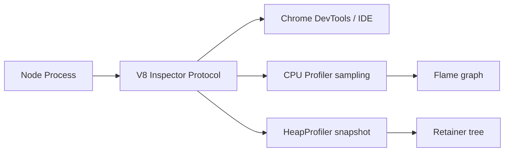
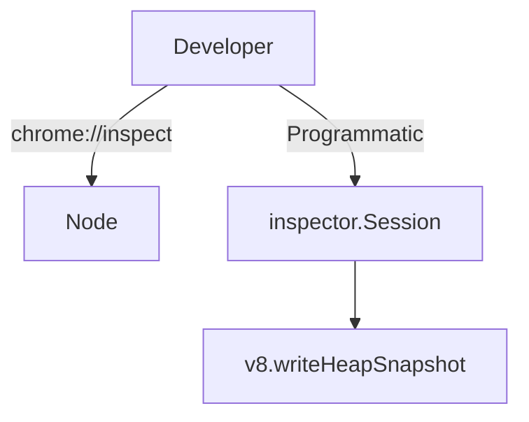
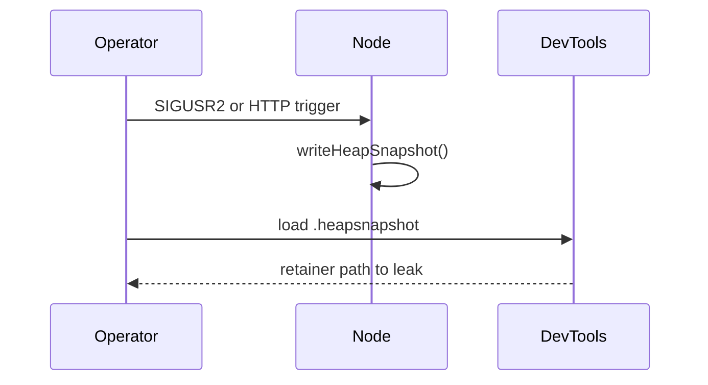

# Inspector CPU Profiling and Heap Snapshots

## Overview

The **V8 Inspector** protocol powers Chrome DevTools debugging for Node via **`node --inspect`**. **CPU profiles** sample the call stack to find hot functions; **heap snapshots** capture object graph retention for leak hunts. Node exposes programmatic hooks via **`inspector` module** and **`v8.writeHeapSnapshot`**. Production profiling requires discipline—sampling overhead, PII in heaps, and security of open debug ports ([[16-DevOps/README|DevOps]]). This note covers local and controlled production capture workflows.

## Learning Objectives

- Start inspector with `--inspect`, `--inspect-brk`, and secure bind addresses
- Capture CPU profiles and interpret self vs total time
- Take and diff heap snapshots to find retainers
- Use `v8.writeHeapSnapshot()` and `inspector.Session` programmatically
- Apply production guardrails: auth, short windows, staging reproduction

## Prerequisites

- [[02-JavaScript/04-Engines-and-Memory/Garbage Collection in JavaScript|Garbage Collection in JavaScript]]
- [[02-JavaScript/04-Engines-and-Memory/Memory Leaks and Retention|Memory Leaks and Retention]]
- [[06-NodeJS/08-Diagnostics-and-Performance/Flamegraphs Bottlenecks and Production Profiling Discipline|Flamegraphs Bottlenecks and Production Profiling Discipline]]

## Difficulty

`advanced`

## Estimated Time

- Reading: 2.5 hours
- Exercises: 3–4 hours
- Mini project: 6 hours

## History

Node debugging evolved from **`node debug`** CLI to V8 Inspector (Node 6+). **`heapdump`** npm module predated core **`v8.writeHeapSnapshot`**. Chrome DevTools unified browser and Node profiling UX.

## Problem It Solves

- **"Node is slow"** without knowing whether CPU, GC, or I/O is guilty
- **Memory growth** until OOM—need retainer paths, not guesswork
- **Production incidents** requiring evidence before rewriting hot paths
- **Regression detection** comparing profiles across releases

## Internal Implementation



**CPU profiling**: periodic stack samples → statistical hotspots (safe-ish overhead at low sample rates).

**Heap snapshot**: walks reachable objects; **shallow** vs **retained** size; compare snapshots delta for leaks.

Debug port default **9229**—must not bind `0.0.0.0` in production without tunnel/auth.

## Mermaid Diagrams

### Structure



### Sequence / Lifecycle



## Examples

### Minimal Example

```bash
node --inspect=127.0.0.1:9229 app.js
# Open chrome://inspect → Open dedicated DevTools → Performance / Memory tabs
```

Programmatic heap snapshot:

```typescript
import v8 from 'node:v8';
import { writeFileSync } from 'node:fs';

const snapshotPath = v8.writeHeapSnapshot();
console.log('Heap snapshot written:', snapshotPath);
```

### Production-Shaped Example

Guarded diagnostic endpoint (staging only):

```typescript
import http from 'node:http';
import v8 from 'node:v8';
import { Session } from 'node:inspector/promises';

const DIAG_TOKEN = process.env.DIAG_TOKEN;

export function mountDiagnostics(server: http.Server): void {
  server.on('request', async (req, res) => {
    if (req.url !== '/__diag/snapshot') return;
    if (req.headers.authorization !== `Bearer ${DIAG_TOKEN}`) {
      res.writeHead(403).end();
      return;
    }
    if (process.env.NODE_ENV === 'production') {
      res.writeHead(403).end('use staging');
      return;
    }
    const path = v8.writeHeapSnapshot();
    res.writeHead(200, { 'Content-Type': 'text/plain' });
    res.end(path);
  });
}

export async function captureCpuProfileMs(durationMs: number): Promise<string> {
  const session = new Session();
  session.connect();
  await session.post('Profiler.enable');
  await session.post('Profiler.start');
  await new Promise((r) => setTimeout(r, durationMs));
  const { profile } = await session.post('Profiler.stop');
  await session.post('Profiler.disable');
  session.disconnect();
  return JSON.stringify(profile);
}
```

## Trade-offs

| Dimension | CPU profile | Heap snapshot |
| --- | --- | --- |
| Overhead | Low–medium sampling | High pause + disk |
| Risk | Misleading if short | Contains secrets/PII |
| Value | Hot path code | Retainer leaks |

### When to Use

- Local/staging performance tuning
- Leak reproduction with load test
- Brief production sample via approved runbook

### When Not to Use

- Always-on heap snapshots in prod
- Publicly exposed `--inspect` on 0.0.0.0
- Profiling without load representative of traffic

## Exercises

1. Profile a tight CPU loop vs async I/O server; compare flame shapes.
2. Create intentional leak (`global.cache.push`); diff two heap snapshots.
3. Run with `--inspect-brk`; verify startup pause before first line.

## Mini Project

Add **SIGUSR2 heap snapshot** handler with rate limit and secure path prefix; document runbook.

## Portfolio Project

Integrate diagnostic hooks in [[06-NodeJS/projects/Node Runtime Toolkit/README|Node Runtime Toolkit]] behind feature flag.

## Interview Questions

1. CPU profile vs wall-clock timing—when do they diverge?
2. How do you find what retains a leaked object in DevTools?
3. Why is `--inspect=0.0.0.0` dangerous?
4. Difference between shallow and retained size?

### Stretch / Staff-Level

1. Design safe production profiling for Kubernetes pods ([[16-DevOps/README|DevOps]]) without SSH.

## Common Mistakes

- Profiling idle process (no representative stacks)
- Single snapshot without baseline comparison
- Leaving inspector port open on public interfaces
- Shipping heap files with customer data to tickets
- Optimizing cold paths flagged by noisy samples

## Best Practices

- Bind inspector to loopback; use SSH/kubectl port-forward
- Reproduce leaks under load in staging
- Pair CPU profiles with event-loop delay metrics ([[06-NodeJS/08-Diagnostics-and-Performance/perf_hooks and Event Loop Delay|perf_hooks and Event Loop Delay]])
- Automate snapshot redaction policy
- Document triggers in operational checklist ([[06-NodeJS/10-Production-Node/Operational Readiness Checklist for Node Processes|Operational Readiness Checklist for Node Processes]])

## Summary

**Inspector** exposes V8 CPU and heap profiling to DevTools and programmatic APIs. Use **CPU profiles** for hot JS paths, **heap snapshots** for retention leaks—with staging-first discipline and locked-down debug ports. Production profiling is a governed operation, not a default endpoint.

## Further Reading

- [Node.js inspector documentation](https://nodejs.org/api/inspector.html)
- [[06-NodeJS/08-Diagnostics-and-Performance/Flamegraphs Bottlenecks and Production Profiling Discipline|Flamegraphs Bottlenecks and Production Profiling Discipline]]

## Related Notes

- [[06-NodeJS/08-Diagnostics-and-Performance/Flamegraphs Bottlenecks and Production Profiling Discipline|Flamegraphs Bottlenecks and Production Profiling Discipline]]
- [[06-NodeJS/08-Diagnostics-and-Performance/Memory Limits and Heap Flags|Memory Limits and Heap Flags]]
- [[02-JavaScript/04-Engines-and-Memory/Memory Leaks and Retention|Memory Leaks and Retention]]
- [[16-DevOps/README|DevOps]]

## Progress Checklist

- [ ] Explained from first principles
- [ ] Drew at least one Mermaid diagram
- [ ] Implemented a minimal version
- [ ] Documented trade-offs and non-goals
- [ ] Completed exercises
- [ ] Practiced interview questions aloud
- [ ] Linked prerequisites and dependents
