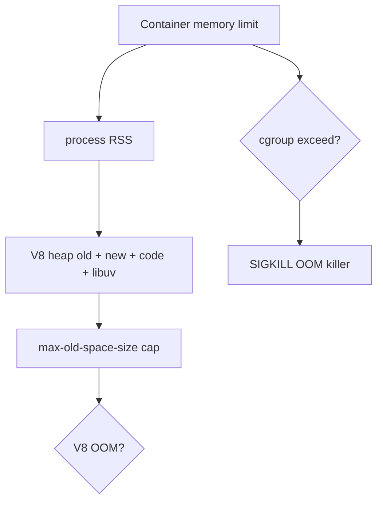
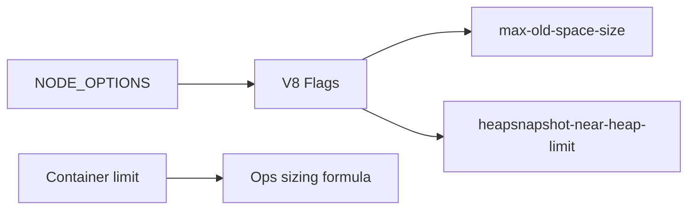
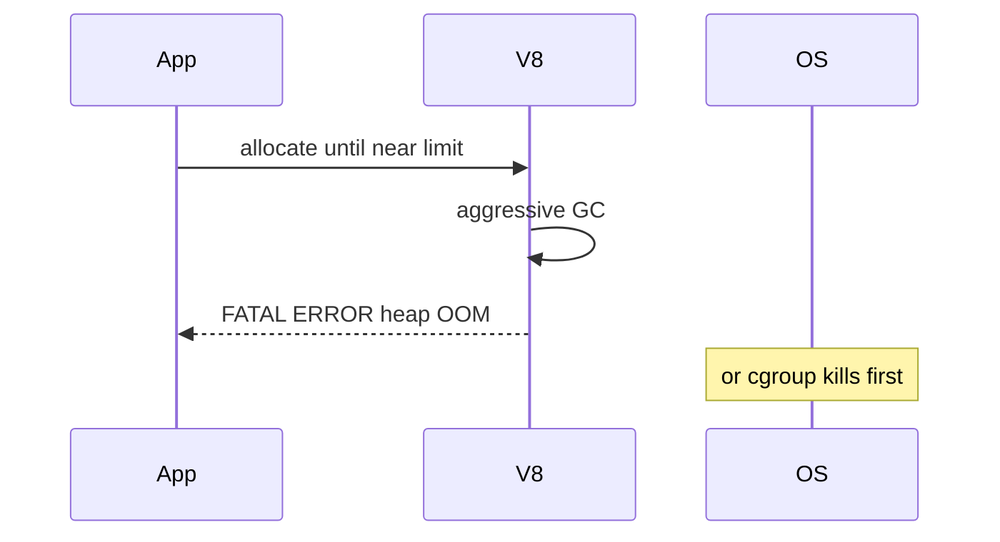

# Memory Limits and Heap Flags

## Overview

Node processes run on **V8's heap**, bounded by **`--max-old-space-size`** and related flags. Exceeding limits triggers **GC thrashing** then **fatal OOM** (`FATAL ERROR: Reached heap limit`). Container ** cgroup memory limits** ([[16-DevOps/README|DevOps]]) can kill the process before V8 OOM via OOM killer. Operators must align **Node heap flags**, **container memory**, and **application retention patterns** ([[02-JavaScript/04-Engines-and-Memory/Memory Leaks and Retention|Memory Leaks and Retention]]).

## Learning Objectives

- Explain young vs old generation heaps at operational level
- Set `--max-old-space-size` via CLI and `NODE_OPTIONS`
- Relate container memory limit to safe heap sizing (~75% rule of thumb)
- Use `v8.getHeapStatistics()` and `process.memoryUsage()` for monitoring
- Interpret OOM crashes and configure flags for diagnostics

## Prerequisites

- [[02-JavaScript/04-Engines-and-Memory/Garbage Collection in JavaScript|Garbage Collection in JavaScript]]
- [[06-NodeJS/01-Process-and-Runtime/NODE_OPTIONS and Runtime Flags|NODE_OPTIONS and Runtime Flags]]
- [[02-JavaScript/04-Engines-and-Memory/Memory Leaks and Retention|Memory Leaks and Retention]]

## Difficulty

`advanced`

## Estimated Time

- Reading: 2 hours
- Exercises: 2 hours
- Mini project: 4 hours

## History

Default old-space limits grew with 64-bit V8 (often ~2–4 GB range depending on version/arch). Cloud deployments exposed mismatch: **512 MB Kubernetes limit** + default Node heap → SIGKILL without clear V8 message. **`NODE_OPTIONS`** (Node 8+) centralized flag injection in containers.

## Problem It Solves

- **Mysterious pod restarts** from cgroup OOM vs V8 heap OOM
- **Underutilized RAM** on large VMs running default caps
- **GC pauses** from heap too large vs too small trade-off
- **Multi-process memory** (`cluster` × heap limit exceeds host)

## Internal Implementation



Key metrics:

- **`heapUsed` / `heapTotal`**: V8 JS heap (from `process.memoryUsage()`)
- **`rss`**: resident set—includes native, buffers, code
- **`external`**: C++ objects bound to JS (e.g., Buffer backing stores)

**`--max-old-space-size=MB`**: caps old generation; primary tuning knob.

Other flags: `--max-semi-space-size`, `--initial-old-space-size`, `--heapsnapshot-near-heap-limit=N` (capture on approach to limit).

## Mermaid Diagrams

### Structure



### Sequence / Lifecycle



## Examples

### Minimal Example

```bash
NODE_OPTIONS="--max-old-space-size=512" node app.js
```

```typescript
import v8 from 'node:v8';

const stats = v8.getHeapStatistics();
console.log({
  heapLimitMb: stats.heap_size_limit / 1024 / 1024,
  usedMb: stats.used_heap_size / 1024 / 1024,
});
```

### Production-Shaped Example

Kubernetes-aware sizing helper:

```typescript
import v8 from 'node:v8';

export function logMemorySnapshot(): void {
  const mu = process.memoryUsage();
  const hs = v8.getHeapStatistics();
  console.log(JSON.stringify({
    rssMb: mu.rss / 1024 / 1024,
    heapUsedMb: mu.heapUsed / 1024 / 1024,
    externalMb: mu.external / 1024 / 1024,
    heapLimitMb: hs.heap_size_limit / 1024 / 1024,
    pctOfLimit: (hs.used_heap_size / hs.heap_size_limit) * 100,
  }));
}

// Container 1024 MiB → set max-old-space-size ≈ 768 or lower leaving room for native
```

Startup validation:

```typescript
function assertHeapConfigured(): void {
  const limitMb = v8.getHeapStatistics().heap_size_limit / 1024 / 1024;
  const containerMb = Number(process.env.CONTAINER_MEMORY_MB ?? 0);
  if (containerMb > 0 && limitMb > containerMb * 0.85) {
    console.warn(`Heap limit ${limitMb}MB may exceed container ${containerMb}MB`);
  }
}
```

Recommended **`NODE_OPTIONS`** for near-OOM capture (staging):

```text
--heapsnapshot-near-heap-limit=3 --diagnostic-dir=/tmp/diag
```

## Trade-offs

| Dimension | Larger heap | Smaller heap |
| --- | --- | --- |
| Throughput | Fewer GC cycles | More frequent GC |
| Latency | Longer GC pauses | Shorter pauses |
| Risk | cgroup kill if misaligned | V8 OOM earlier |

### When to Use

- Explicit sizing in containers ([[16-DevOps/README|DevOps]])
- Batch jobs processing large in-memory datasets
- Near-OOM snapshots in staging reproduction

### When Not to Use

- Raising heap to "fix" leaks without fixing retention
- Same limit on every service regardless of workload

## Exercises

1. Trigger V8 OOM in dev; compare message with cgroup limit kill (Docker `--memory`).
2. Run `cluster` with 4 workers; calculate total heap vs host RAM.
3. Graph `heapUsed` during leak vs after fix ([[06-NodeJS/08-Diagnostics-and-Performance/Inspector CPU Profiling and Heap Snapshots|Heap Snapshots]]).

## Mini Project

Add **memory metrics exporter** + startup warning when heap limit > 75% container memory env var.

## Portfolio Project

Document memory budget in [[06-NodeJS/projects/Node Runtime Toolkit/README|Node Runtime Toolkit]] Deployment notes ([[16-DevOps/README|DevOps]]).

## Interview Questions

1. Difference between `rss` and `heapUsed`?
2. How do you size `--max-old-space-size` for 1 GiB Kubernetes limit?
3. What happens when V8 OOM vs Linux OOM killer?
4. Why doesn't raising heap always improve performance?

### Stretch / Staff-Level

1. Explain external memory growth from Buffers and when it bypasses heap limit concerns.

## Common Mistakes

- Ignoring `external` and Buffer memory in budgets
- `cluster` workers each maxing heap on small VM
- Fixing leaks by `--max-old-space-size=8192` in prod
- No headroom for native addons / TLS buffers
- Confusing `heapTotal` with physical memory limit

## Best Practices

- Set container limit first; heap ~70–75% of limit ([[16-DevOps/README|DevOps]])
- Monitor `pctOfLimit` and GC pause metrics
- Fix retention before raising caps
- Use heap snapshots for leak proof ([[06-NodeJS/08-Diagnostics-and-Performance/Inspector CPU Profiling and Heap Snapshots|Inspector CPU Profiling and Heap Snapshots]])
- Document `NODE_OPTIONS` in deployment manifest

## Summary

Node memory is **V8 heap + native/external**, capped by **`--max-old-space-size`** and **container limits**. Size heap below cgroup budget, monitor `heapUsed`/`rss`, and treat OOM as either leak or misconfiguration—not a knob to infinite RAM.

## Further Reading

- [[06-NodeJS/01-Process-and-Runtime/NODE_OPTIONS and Runtime Flags|NODE_OPTIONS and Runtime Flags]]
- [V8 heap statistics](https://nodejs.org/api/v8.html#v8getheapstatistics)

## Related Notes

- [[06-NodeJS/08-Diagnostics-and-Performance/Inspector CPU Profiling and Heap Snapshots|Inspector CPU Profiling and Heap Snapshots]]
- [[06-NodeJS/06-Concurrency-and-Scaling/cluster and Multi-Process Scaling|cluster and Multi-Process Scaling]]
- [[02-JavaScript/04-Engines-and-Memory/Memory Leaks and Retention|Memory Leaks and Retention]]
- [[16-DevOps/README|DevOps]]

## Progress Checklist

- [ ] Explained from first principles
- [ ] Drew at least one Mermaid diagram
- [ ] Implemented a minimal version
- [ ] Documented trade-offs and non-goals
- [ ] Completed exercises
- [ ] Practiced interview questions aloud
- [ ] Linked prerequisites and dependents
