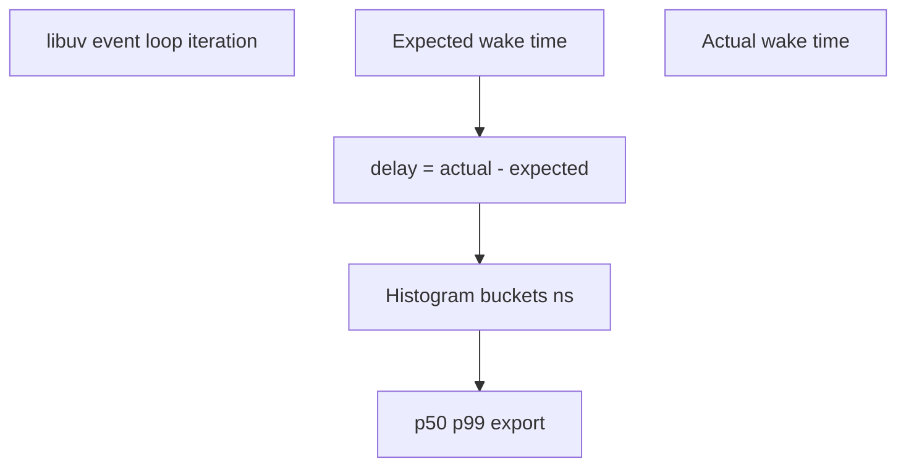
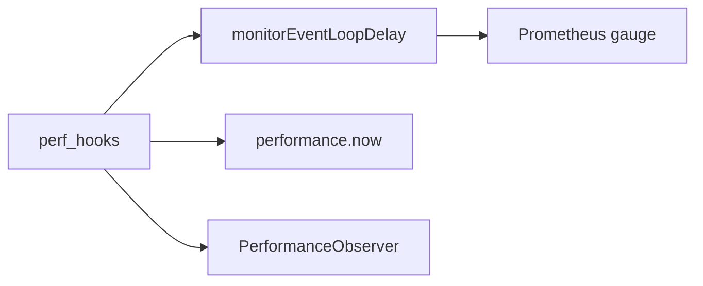

# perf_hooks and Event Loop Delay

## Overview

**`perf_hooks`** exposes high-resolution time, performance marks/measures, and **`monitorEventLoopDelay`**—a histogram of how late libuv's event loop iterations run versus scheduled time. **Event loop delay (lag)** is the canonical signal that JavaScript or synchronous work is **blocking** the loop, even when CPU utilization looks low. Pair with `performance.now()`, `PerformanceObserver`, and platform metrics export ([[16-DevOps/README|DevOps]]) for production SLO monitoring.

## Learning Objectives

- Enable and read `monitorEventLoopDelay` histogram percentiles
- Distinguish event loop delay from wall time and CPU profiling
- Emit loop lag metrics suitable for alerting
- Use `performance.mark/measure` for internal span timing
- Correlate delay spikes with GC, sync fs, or CPU-bound handlers

## Prerequisites

- [[06-NodeJS/02-Event-Loop-and-libuv/Event Loop Phases|Event Loop Phases]]
- [[06-NodeJS/02-Event-Loop-and-libuv/Starvation Backpressure and Loop Health|Starvation Backpressure and Loop Health]]
- [[02-JavaScript/07-Production-JavaScript/Measuring and Optimizing Performance|Measuring and Optimizing Performance]]

## Difficulty

`advanced`

## Estimated Time

- Reading: 2 hours
- Exercises: 2 hours
- Mini project: 4 hours

## History

**`perf_hooks`** stabilized in Node 12–16 as Performance Timeline API alignment. **`monitorEventLoopDelay`** (Node 11+) became essential as services moved to Kubernetes liveness probes that miss loop stalls if only HTTP 200 is checked.

## Problem It Solves

- **Silent latency**: requests slow down because loop can't poll I/O timely
- **Misdiagnosis**: scaling replicas when one sync `gzipSync` blocks loop
- **Missing SLO signal**: average response time hides tail from loop stalls
- **Pre-production guard**: quantify impact before/after offload to workers

## Internal Implementation



`monitorEventLoopDelay({ resolution })` samples delay in nanoseconds; **`enable()`** starts collection; **`percentiles`** map reads p50/p99; **`reset()`** clears between windows.

Resolution trades accuracy vs overhead—default often 10 ms resolution is enough for ops alerts.

## Mermaid Diagrams

### Structure



### Sequence / Lifecycle

```mermaid
sequenceDiagram
    participant S as Server
    participant Loop as Event Loop
    participant M as monitorEventLoopDelay
    S->>Loop: sync CPU 200ms
    Loop->>M: record delay spike
    M-->>S: p99 > threshold alert
```

## Examples

### Minimal Example

```typescript
import { monitorEventLoopDelay } from 'node:perf_hooks';

const h = monitorEventLoopDelay({ resolution: 10 });
h.enable();

setTimeout(() => {
  console.log('p99 delay ms:', h.percentile(99) / 1e6);
  h.disable();
}, 5000);

// Block loop briefly
const start = Date.now();
while (Date.now() - start < 100) { /* spin */ }
```

### Production-Shaped Example

Periodic export for metrics scraper:

```typescript
import { monitorEventLoopDelay } from 'node:perf_hooks';

const histogram = monitorEventLoopDelay({ resolution: 20 });
histogram.enable();

export function getEventLoopLagMetrics(): Record<string, number> {
  return {
    'nodejs_event_loop_delay_p50_ms': histogram.percentile(50) / 1e6,
    'nodejs_event_loop_delay_p99_ms': histogram.percentile(99) / 1e6,
    'nodejs_event_loop_delay_max_ms': histogram.max / 1e6,
  };
}

export function resetEventLoopLagWindow(): void {
  histogram.reset();
}

// Call from setInterval(60_000) and push to statsd/prometheus
setInterval(() => {
  const metrics = getEventLoopLagMetrics();
  resetEventLoopLagWindow();
  exportMetrics(metrics);
}, 60_000);

function exportMetrics(_m: Record<string, number>): void {
  /* platform-specific */
}
```

Internal span timing:

```typescript
import { performance } from 'node:perf_hooks';

export async function timed<T>(name: string, fn: () => Promise<T>): Promise<T> {
  const start = `${name}-start`;
  const end = `${name}-end`;
  performance.mark(start);
  try {
    return await fn();
  } finally {
    performance.mark(end);
    performance.measure(name, start, end);
    const [entry] = performance.getEntriesByName(name);
    if (entry) console.log(JSON.stringify({ span: name, durationMs: entry.duration }));
    performance.clearMeasures(name);
    performance.clearMarks(start);
    performance.clearMarks(end);
  }
}
```

## Trade-offs

| Dimension | Upside | Downside | When it matters |
| --- | --- | --- | --- |
| Sensitivity | Catches sync block | Not root cause alone | Need profiles next |
| Overhead | Low at coarse resolution | Finer resolution costs | High-frequency sampling |
| Operability | Simple percentile alerts | False positives on GC pauses | Tune thresholds |

### When to Use

- Every production Node service baseline metric
- Before/after moving CPU work to workers
- Load tests validating loop health under peak RPS

### When Not to Use

- As sole diagnostic without CPU/heap follow-up
- Sub-millisecond precision requirements (use `performance.now` spans)

## Exercises

1. Plot p99 loop delay while adding sync `fs.readFileSync` vs async variant under load.
2. Correlate delay spike with `PerformanceObserver` `gc` entries (if enabled).
3. Wire metrics to stdout JSON for fake scraper every 10s.

## Mini Project

Build **loop health dashboard** module: delay histogram + active handles count + export API.

## Portfolio Project

Add to [[06-NodeJS/projects/Node Runtime Toolkit/README|Node Runtime Toolkit]] `/metrics` endpoint with loop lag gauges.

## Interview Questions

1. What does event loop delay measure that CPU usage doesn't?
2. How would you alert on unhealthy loop without alert fatigue?
3. Difference between `perf_hooks` and `process.hrtime`?
4. Can loop lag be high while CPU is idle?

### Stretch / Staff-Level

1. Explain interaction between GC pause and `monitorEventLoopDelay` readings.

## Common Mistakes

- Only monitoring HTTP 200 liveness ([[06-NodeJS/10-Production-Node/Health Readiness and Liveness Hooks|Health Readiness and Liveness Hooks]])
- Ignoring p99 in favor of mean response time
- Never resetting histogram windows (stale aggregates)
- Confusing timer delay with loop delay
- Optimizing microtasks before measuring loop lag

## Best Practices

- Export p50/p99 loop delay per process ([[16-DevOps/README|DevOps]])
- Alert on sustained p99 > 100–200 ms (tune per SLO)
- Pair spikes with CPU profiles ([[06-NodeJS/08-Diagnostics-and-Performance/Inspector CPU Profiling and Heap Snapshots|Inspector CPU Profiling and Heap Snapshots]])
- Reset histogram on scrape interval
- Document known GC-related spikes after deploy

## Summary

**`monitorEventLoopDelay`** quantifies **event loop lag**—the early warning for blocked JavaScript. Export p99 lag with other RED metrics; investigate spikes with profiles and offload patterns ([[06-NodeJS/06-Concurrency-and-Scaling/Choosing Threads Processes and Offload|Choosing Threads Processes and Offload]]). Healthy servers keep loop delay low even at high utilization.

## Further Reading

- [Node.js perf_hooks documentation](https://nodejs.org/api/perf_hooks.html)
- [[06-NodeJS/02-Event-Loop-and-libuv/Starvation Backpressure and Loop Health|Starvation Backpressure and Loop Health]]

## Related Notes

- [[06-NodeJS/08-Diagnostics-and-Performance/Flamegraphs Bottlenecks and Production Profiling Discipline|Flamegraphs Bottlenecks and Production Profiling Discipline]]
- [[06-NodeJS/08-Diagnostics-and-Performance/Inspector CPU Profiling and Heap Snapshots|Inspector CPU Profiling and Heap Snapshots]]
- [[06-NodeJS/10-Production-Node/Health Readiness and Liveness Hooks|Health Readiness and Liveness Hooks]]
- [[16-DevOps/README|DevOps]]

## Progress Checklist

- [ ] Explained from first principles
- [ ] Drew at least one Mermaid diagram
- [ ] Implemented a minimal version
- [ ] Documented trade-offs and non-goals
- [ ] Completed exercises
- [ ] Practiced interview questions aloud
- [ ] Linked prerequisites and dependents
