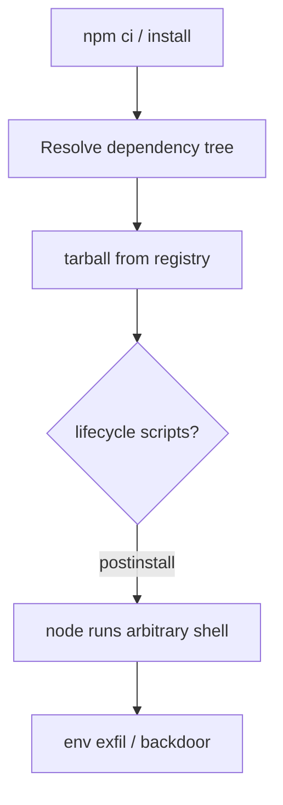
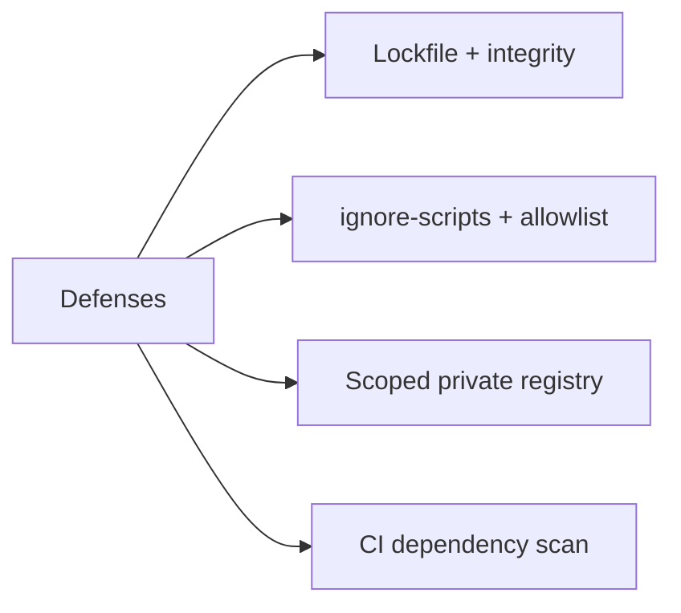
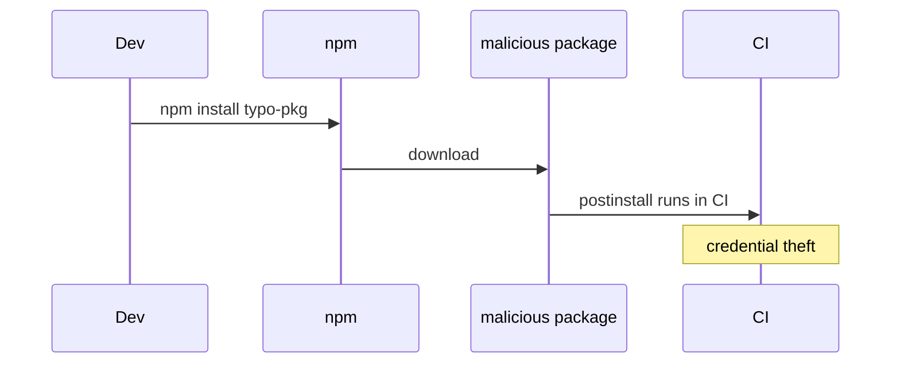

# Dependency Confusion Typosquatting and Install Scripts

## Overview

**Supply-chain attacks** target Node's open registry ecosystem: **typosquatting** (`lodash` vs `lodahs`), **dependency confusion** (private package name squatted on public npm), and malicious **`preinstall`/`postinstall`** scripts executing on every `npm ci`. Node runs install scripts with the **developer's or CI agent's privileges**—often full laptop or deployment credentials. Defense combines lockfiles ([[06-NodeJS/09-Security-and-Supply-Chain/npm Lockfiles Integrity and Audit|npm Lockfiles Integrity and Audit]]), scope/registry policy, script allowlists, and organizational controls in [[16-DevOps/README|DevOps]].

## Learning Objectives

- Explain typosquatting, dependency confusion, and protestware vectors
- Audit `package.json` scripts and lifecycle hooks in dependencies
- Use `.npmrc` scoped registries, `--ignore-scripts`, and Socket/Snyk-style scanning
- Design private package naming and registry mirrors safely
- Respond to incident: rotate creds, quarantine version

## Prerequisites

- [[06-NodeJS/09-Security-and-Supply-Chain/npm Lockfiles Integrity and Audit|npm Lockfiles Integrity and Audit]]
- [[06-NodeJS/03-Modules-and-Loading/node_modules Resolution in Practice|node_modules Resolution in Practice]]

## Difficulty

`advanced`

## Estimated Time

- Reading: 2 hours
- Exercises: 2–3 hours
- Mini project: 4 hours

## History

**dependency confusion** (Alex Birsan, 2021) exploited npm preferring public packages over private when names collided—RCE in major tech cos. **event-stream** (2018) hid malicious code in transitive dep. **ua-parser-js** (2021) hijack ran crypto miners in postinstall. npm responded with **`ignore-scripts`**, **`npm audit`**, provenance efforts, and org 2FA pushes.

## Problem It Solves

- **Trusting registry names** without verification
- **Install-time RCE** in CI/CD with cloud credentials
- **Transitive deps** too deep to human-review
- **Private name collisions** with public squatters

## Internal Implementation



Attack surfaces:

- **`postinstall`**: most common malicious hook
- **Typo package name** in PR dependency add
- **Confusion**: `@corp/payments` private vs public unscoped `payments`
- **Maintainer account takeover**

## Mermaid Diagrams

### Structure



### Sequence / Lifecycle



## Examples

### Minimal Example

`.npmrc` for scoped private packages:

```ini
@myorg:registry=https://npm.myorg.example/
//npm.myorg.example/:_authToken=${NPM_TOKEN}
ignore-scripts=true
```

Allow scripts only for vetted native modules in CI:

```bash
npm ci --ignore-scripts
npm rebuild bcrypt --build-from-source  # explicit if needed
```

### Production-Shaped Example

Pre-install review script in CI:

```typescript
import { readFileSync } from 'node:fs';

interface LockPackage {
  version: string;
  resolved?: string;
  hasInstallScript?: boolean;
}

export function listInstallScripts(lockPath: string): string[] {
  const lock = JSON.parse(readFileSync(lockPath, 'utf8')) as {
    packages?: Record<string, LockPackage>;
  };
  const flagged: string[] = [];
  for (const [name, meta] of Object.entries(lock.packages ?? {})) {
    if (meta.hasInstallScript) flagged.push(`${name}@${meta.version}`);
  }
  return flagged;
}
```

Dependency PR checklist (document in repo):

```markdown
- [ ] Lockfile updated, integrity present
- [ ] Publisher scope matches (@myorg)
- [ ] No unexpected lifecycle scripts (or approved)
- [ ] npm audit delta reviewed
- [ ] Typosquat grep on package name
```

Safe internal naming policy:

```text
Private packages MUST use @corp scope on private registry.
Never publish unscoped names matching internal monorepo packages.
```

## Trade-offs

| Control | Upside | Downside |
| --- | --- | --- |
| ignore-scripts | Blocks most install RCE | Breaks native builds |
| Private registry | Confusion resistance | Ops cost |
| Manual review | High signal | Slow |

### When to Use

- CI pipelines with secrets access
- Organizations with private package names
- High-risk environments (finance, prod deploy agents)

### When Not to Use

- Blind ignore-scripts without rebuild plan for bcrypt/sharp etc.

## Exercises

1. Add fake local package with `postinstall: echo pwned`; observe when it runs.
2. Run `npm ci --ignore-scripts`; document which deps fail without rebuild.
3. Research one historical supply-chain incident; map to controls in this note.

## Mini Project

CI job listing **`hasInstallScript`** packages diff on PR lockfile changes.

## Portfolio Project

Supply-chain section in [[06-NodeJS/projects/Node Runtime Toolkit/README|Node Runtime Toolkit]] Security.md.

## Interview Questions

1. What is dependency confusion?
2. How do install scripts get CI credentials?
3. Mitigations beyond `npm audit`?
4. When is `--ignore-scripts` unsafe to operations?

### Stretch / Staff-Level

1. Design org-wide npm provenance + Sigstore verification pipeline ([[16-DevOps/README|DevOps]]).

## Common Mistakes

- Adding dependency from README without verifying publisher
- Unscoped internal names on public npm
- CI running `npm install` as root with cloud metadata creds
- Ignoring lockfile script flag diffs in review
- Trusting "popular" download count alone

## Best Practices

- Scoped private registry for all internal packages
- Lockfile committed; review install script changes
- CI: least privilege, OIDC not long-lived keys ([[16-DevOps/README|DevOps]])
- Pin critical deps; delay auto-merge on supply-chain PRs
- Incident runbook: revoke tokens, yank cache, rotate secrets

## Summary

Node supply-chain risk concentrates at **`npm install`**—typos, name confusion, and **lifecycle scripts** execute with installer privileges. Combine **lockfiles**, **scoped registries**, **script policy**, and **CI scanning**; assume any new dependency is hostile until verified.

## Further Reading

- [Alex Birsan — Dependency Confusion](https://medium.com/@alex.birsan/dependency-confusion-4a5d60fec610)
- [[06-NodeJS/09-Security-and-Supply-Chain/npm Lockfiles Integrity and Audit|npm Lockfiles Integrity and Audit]]

## Related Notes

- [[06-NodeJS/09-Security-and-Supply-Chain/npm Lockfiles Integrity and Audit|npm Lockfiles Integrity and Audit]]
- [[06-NodeJS/09-Security-and-Supply-Chain/Secrets Env Injection and Least Privilege|Secrets Env Injection and Least Privilege]]
- [[16-DevOps/README|DevOps]]
- [[18-Security/README|Security]]

## Progress Checklist

- [ ] Explained from first principles
- [ ] Drew at least one Mermaid diagram
- [ ] Implemented a minimal version
- [ ] Documented trade-offs and non-goals
- [ ] Completed exercises
- [ ] Practiced interview questions aloud
- [ ] Linked prerequisites and dependents
