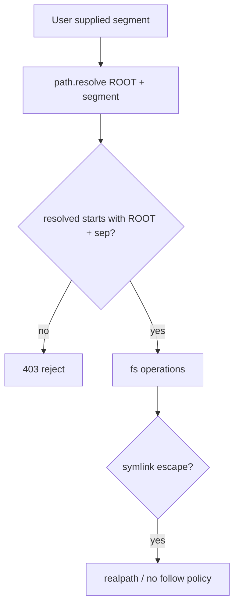
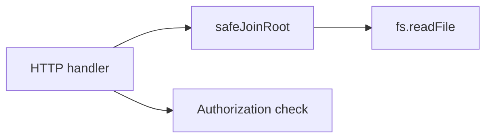
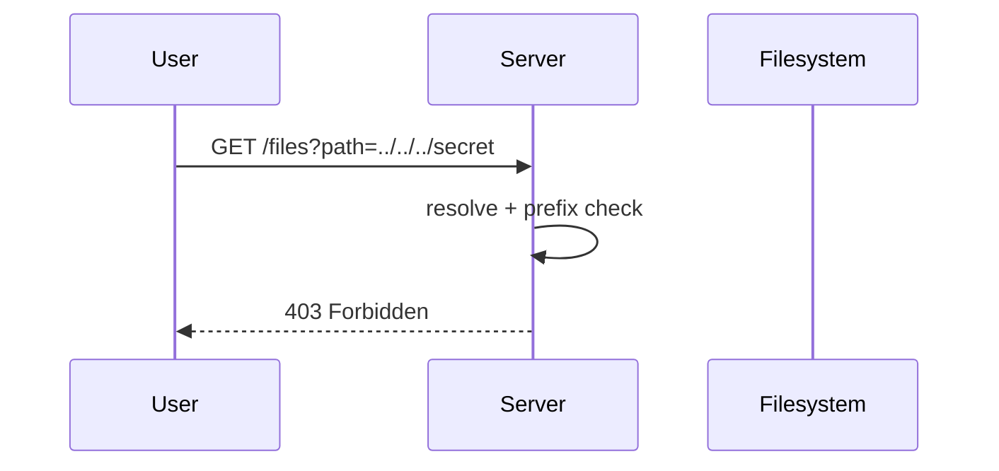

# Path Traversal and Safe Filesystem Access

## Overview

**Path traversal** exploits insufficient validation when user input influences filesystem paths—`../../../etc/passwd` escapes intended directories. Node's **`path.join`**, **`path.resolve`**, and **`fs`** APIs do not enforce security boundaries; **`..`**, symlinks, Unicode normalization, and **`file://`** URLs create bypasses. Safe access requires a **fixed root**, **`path.resolve` + prefix check**, symlink awareness, and least-privilege OS users ([[06-NodeJS/09-Security-and-Supply-Chain/Secrets Env Injection and Least Privilege|Secrets Env Injection and Least Privilege]]). Product file APIs belong in [[07-Backend/README|Backend]] with defense in depth.

## Learning Objectives

- Explain path traversal with `..`, absolute paths, and encoded segments
- Implement root-jailed path resolution with prefix validation
- Handle symlinks, null bytes (legacy), and Unicode normalization edges
- Use `fs.open` with flags and avoid serving user paths directly
- Map Node fs patterns to static file servers and upload handlers

## Prerequisites

- [[06-NodeJS/01-Process-and-Runtime/Working Directory Paths and fileURLToPath|Working Directory Paths and fileURLToPath]]
- [[06-NodeJS/04-Buffers-Streams-and-IO/fs Promises Sync and Streaming|fs Promises Sync and Streaming]]
- [[18-Security/README|Security]] track concepts (authorization)

## Difficulty

`advanced`

## Estimated Time

- Reading: 2 hours
- Exercises: 2–3 hours
- Mini project: 5 hours

## History

Classic web vulns (CVE-class **directory traversal**) predated Node; PHP/CGI examples morphed into **Express static** misconfigurations and **`sendfile`** bugs. Node's path module is a string utility—not a sandbox.

## Problem It Solves

- **Arbitrary file read/write** via crafted filenames
- **Source/template disclosure** in dev static servers exposed to prod
- **Zip slip** during archive extraction (path in entry name)
- **False confidence** from `path.join('public', userInput)` alone

## Internal Implementation



Attack vectors:

- **`..` segments** after join
- **Absolute path** `/etc/passwd` ignoring prefix
- **Symlink** `public/link → /secret`
- **URL decoding** `%2e%2e%2f`
- **Unicode** homoglyphs (platform dependent)

## Mermaid Diagrams

### Structure



### Sequence / Lifecycle



## Examples

### Minimal Example

```typescript
import path from 'node:path';

const PUBLIC_ROOT = path.resolve('/var/app/public');

export function resolvePublicPath(userSegment: string): string {
  const decoded = decodeURIComponent(userSegment);
  const resolved = path.resolve(PUBLIC_ROOT, decoded);
  const rootWithSep = PUBLIC_ROOT + path.sep;
  if (resolved !== PUBLIC_ROOT && !resolved.startsWith(rootWithSep)) {
    throw new Error('Path traversal blocked');
  }
  return resolved;
}
```

### Production-Shaped Example

```typescript
import fs from 'node:fs/promises';
import path from 'node:path';

export class JailedFilesystem {
  constructor(private readonly root: string) {
    this.root = path.resolve(root);
  }

  async readText(relativePath: string): Promise<string> {
    const safe = this.resolve(relativePath);
    // Optional: fs.realpath to detect symlink escape — may differ from logical path policy
    const real = await fs.realpath(safe);
    this.assertUnderRoot(real);
    return fs.readFile(real, 'utf8');
  }

  private resolve(relativePath: string): string {
    if (relativePath.includes('\0')) throw new Error('Invalid path');
    const resolved = path.resolve(this.root, relativePath);
    this.assertUnderRoot(resolved);
    return resolved;
  }

  private assertUnderRoot(resolved: string): void {
    const rel = path.relative(this.root, resolved);
    if (rel.startsWith('..') || path.isAbsolute(rel)) {
      throw new Error('Path outside jail');
    }
  }
}
```

HTTP static handler sketch:

```typescript
import http from 'node:http';
import { createReadStream } from 'node:fs';
import { resolvePublicPath } from './paths.js';

http.createServer((req, res) => {
  try {
    const url = new URL(req.url!, 'http://localhost');
    const filePath = resolvePublicPath(url.pathname.replace(/^\/files\//, ''));
    res.writeHead(200, { 'Content-Type': 'application/octet-stream' });
    createReadStream(filePath).pipe(res);
  } catch {
    res.writeHead(403).end();
  }
});
```

## Trade-offs

| Dimension | Prefix check | realpath follow |
| --- | --- | --- |
| Safety | Blocks `..` logic | Catches symlinks |
| UX | Predictable paths | May surprise if symlinks intentional |
| Performance | Cheap | Extra syscall |

### When to Use

- Any user-influenced path for read/write/extract
- Static file servers and document download APIs ([[07-Backend/README|Backend]])

### When Not to Use

- Relying on obscurity or hidden folders without checks
- `path.join` alone as "sanitization"

## Exercises

1. Bypass naive `path.join('public', input)` with absolute path input.
2. Create symlink escape in test dir; verify `realpath` detection.
3. Implement zip extract with per-entry path validation.

## Mini Project

Build **path-safe static server** lab for [[06-NodeJS/projects/Node Runtime Toolkit/README|Node Runtime Toolkit]] with automated traversal tests.

## Portfolio Project

Document fs security module in portfolio; cross-link [[18-Security/README|Security]].

## Interview Questions

1. Why isn't `path.join(base, user)` sufficient?
2. How can symlinks defeat prefix checks?
3. What is zip slip?
4. Where should authorization vs path validation happen?

### Stretch / Staff-Level

1. Design multi-tenant file storage with per-tenant root and object storage backend.

## Common Mistakes

- Checking `includes('..')` instead of resolved prefix
- Forgetting URL decoding before validation
- Serving from process.cwd() in prod
- Writable uploads into executable directories
- No separate authZ for sensitive files

## Best Practices

- Fixed absolute root; never user-controlled base
- Reject absolute segments and null bytes
- Use allowlist extensions for uploads
- Run app user with minimal fs permissions
- Prefer object storage (S3) for user files ([[07-Backend/README|Backend]])

## Summary

Node **does not sandbox paths**—you must **resolve, normalize, and verify** every user-influenced segment stays under a trusted root, accounting for symlinks and encoding tricks. Combine with authorization and OS least privilege; never expose raw `fs` to untrusted input.

## Further Reading

- [OWASP Path Traversal](https://owasp.org/www-community/attacks/Path_Traversal)
- [[06-NodeJS/04-Buffers-Streams-and-IO/fs Promises Sync and Streaming|fs Promises Sync and Streaming]]

## Related Notes

- [[06-NodeJS/01-Process-and-Runtime/Working Directory Paths and fileURLToPath|Working Directory Paths and fileURLToPath]]
- [[06-NodeJS/09-Security-and-Supply-Chain/Prototype Pollution at the Host Boundary|Prototype Pollution at the Host Boundary]]
- [[06-NodeJS/09-Security-and-Supply-Chain/Secrets Env Injection and Least Privilege|Secrets Env Injection and Least Privilege]]
- [[07-Backend/README|Backend]]
- [[18-Security/README|Security]]

## Progress Checklist

- [ ] Explained from first principles
- [ ] Drew at least one Mermaid diagram
- [ ] Implemented a minimal version
- [ ] Documented trade-offs and non-goals
- [ ] Completed exercises
- [ ] Practiced interview questions aloud
- [ ] Linked prerequisites and dependents
