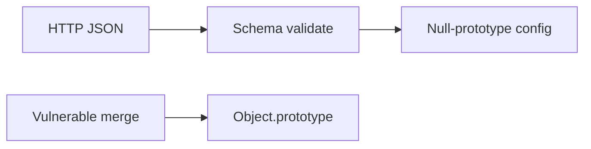
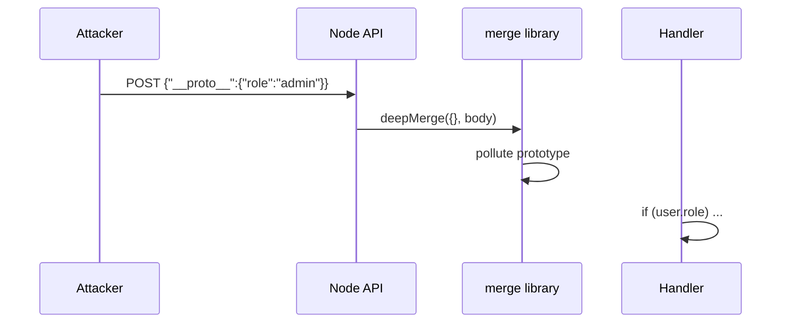

# Prototype Pollution at the Host Boundary

## Overview

**Prototype pollution** mutates **`Object.prototype`** (or other builtins) via unsafe **merge**, **clone**, or **deserialize** of attacker-controlled JSON—adding properties like `isAdmin` inherited by all objects. On Node, pollution crosses the **host boundary** when config parsers, template engines, `child_process` env merges, or `require()` hook chains consume untrusted objects—leading to RCE (via polluted `shell` options), auth bypass, or DoS. ECMAScript semantics are in [[02-JavaScript/03-Objects-and-Metaprogramming/Prototype Chain and Delegation|Prototype Chain and Delegation]]; this note focuses Node ingestion points and mitigations.

## Learning Objectives

- Trace pollution via `__proto__`, `constructor.prototype`, and nested merges
- Identify vulnerable patterns: deep merge, `Object.assign` loops, `JSON.parse` + assign
- Apply mitigations: null-prototype objects, schema validation, frozen prototypes
- Audit dependencies with known pollution CVEs
- Connect to auth/config handling in [[07-Backend/README|Backend]]

## Prerequisites

- [[02-JavaScript/03-Objects-and-Metaprogramming/Prototype Chain and Delegation|Prototype Chain and Delegation]]
- [[02-JavaScript/03-Objects-and-Metaprogramming/Objects and Property Keys|Objects and Property Keys]]
- [[06-NodeJS/05-Networking/http and https Platform Servers|http and https Platform Servers]]

## Difficulty

`advanced`

## Estimated Time

- Reading: 2 hours
- Exercises: 2–3 hours
- Mini project: 4 hours

## History

Prototype pollution gained prominence ~2018–2020 as researchers found chains in lodash, hoek, and Express middleware. Node services amplified impact when polluted properties influenced **`child_process.spawn` options** or template rendering.

## Problem It Solves

- **Silent global behavior change** without touching app source
- **Auth bypass** when code checks `user.isAdmin` on plain objects
- **Gadget chains** in npm deps turning pollution into RCE
- **Config override** when env/JSON configs deep-merge unsafely

## Internal Implementation

```mermaid
flowchart TD
    Input[Untrusted JSON body] --> Parse[JSON.parse]
    Parse --> Merge[deepMerge target]
    Merge --> PP[sets Object.prototype.isAdmin]
    PP --> Later[user = {}]
    Later --> Check[user.isAdmin === true]
```

Pollution keys:

- `"__proto__": { "polluted": true }`
- `"constructor": { "prototype": { ... } }`

Safe patterns:

- **`Object.create(null)`** bags for maps
- **Schema validation** (zod/ajv) stripping unknown keys
- **`structuredClone`** doesn't pollute when used correctly—but merge libs might

## Mermaid Diagrams

### Structure



### Sequence / Lifecycle



## Examples

### Minimal Example

Vulnerable merge:

```typescript
function unsafeMerge(target: Record<string, unknown>, source: Record<string, unknown>): void {
  for (const key of Object.keys(source)) {
    const val = source[key];
    if (val && typeof val === 'object' && !Array.isArray(val)) {
      if (!target[key]) target[key] = {};
      unsafeMerge(target[key] as Record<string, unknown>, val as Record<string, unknown>);
    } else {
      target[key] = val;
    }
  }
}

const payload = JSON.parse('{"__proto__":{"polluted":true}}');
unsafeMerge({}, payload);
const o = {} as Record<string, unknown>;
console.log(o.polluted); // true — inherited
```

Safer config bag:

```typescript
function createConfig(): Record<string, string> {
  return Object.create(null) as Record<string, string>;
}
```

### Production-Shaped Example

```typescript
import { z } from 'zod';

const SettingsSchema = z.object({
  featureFlags: z.record(z.boolean()).strict(),
  logLevel: z.enum(['debug', 'info', 'warn', 'error']),
}).strict();

export function parseSettings(json: unknown): z.infer<typeof SettingsSchema> {
  const parsed = SettingsSchema.parse(json);
  // Return frozen copy — no merge into global templates
  return Object.freeze({ ...parsed, featureFlags: Object.freeze({ ...parsed.featureFlags }) });
}

// HTTP handler
export async function updateSettings(body: unknown): Promise<void> {
  const settings = parseSettings(body);
  applySettings(settings); // never deepMerge into existing object in place from raw body
}
```

Defensive check in security-sensitive paths:

```typescript
if (Object.prototype.hasOwnProperty.call(user, 'isAdmin') && user.isAdmin) {
  // prefer explicit own property checks for auth flags
}
```

## Trade-offs

| Mitigation | Upside | Downside |
| --- | --- | --- |
| Schema validation | Strong boundary | Maintenance |
| null prototype | No inherited pollution | No prototype methods |
| Object.freeze(prototype) | Hard block | Breaks some libs |

### When to Use

- Every untrusted JSON → object path
- Config loaders, webhook parsers, CLI JSON flags

### When Not to Use

- Trusting "internal" network without validation ([[18-Security/README|Security]] zero trust)

## Exercises

1. Pollute `Object.prototype` via vulnerable merge; demonstrate auth bypass mock.
2. Fix with `Object.create(null)` map for user sessions keyed by id.
3. Run `npm audit` and trace one historical prototype pollution advisory.

## Mini Project

Add **safe config loader** to [[06-NodeJS/projects/Node Runtime Toolkit/README|Node Runtime Toolkit]] with fuzz tests for `__proto__` keys.

## Portfolio Project

Security section documenting merge policy; link [[18-Security/README|Security]].

## Interview Questions

1. How does `__proto__` pollution differ from setting own properties?
2. Why is deep merge dangerous on request bodies?
3. How would pollution lead to RCE via `child_process`?
4. What does `Object.create(null)` buy you?

### Stretch / Staff-Level

1. Explain `Symbol.unscopables` and modern hardening in Node/V8—not a full mitigation alone.

## Common Mistakes

- `if (obj.isAdmin)` without own-property check
- In-place deep merge of request body into defaults
- Assuming `JSON.parse` alone sanitizes
- Ignoring transitive deps with merge utilities
- Polluting `Array.prototype` causing DoS in iteration

## Best Practices

- Parse → validate schema → assign to fresh objects
- Use `Map` for dynamic keys instead of `{}`
- Pin and audit merge libraries ([[06-NodeJS/09-Security-and-Supply-Chain/npm Lockfiles Integrity and Audit|npm Lockfiles Integrity and Audit]])
- Separate config from user content objects
- Code review any recursive merge function

## Summary

**Prototype pollution** at the Node boundary comes from merging or trusting attacker JSON into object graphs. Mitigate with **schemas**, **null-prototype** stores, and **own-property** checks in security paths—never deep-merge raw request bodies into defaults.

## Further Reading

- [GitHub security lab — prototype pollution](https://securitylab.github.com/research/prototype-pollution/)
- [[02-JavaScript/03-Objects-and-Metaprogramming/Prototype Chain and Delegation|Prototype Chain and Delegation]]

## Related Notes

- [[06-NodeJS/09-Security-and-Supply-Chain/Path Traversal and Safe Filesystem Access|Path Traversal and Safe Filesystem Access]]
- [[06-NodeJS/09-Security-and-Supply-Chain/npm Lockfiles Integrity and Audit|npm Lockfiles Integrity and Audit]]
- [[07-Backend/README|Backend]]
- [[18-Security/README|Security]]

## Progress Checklist

- [ ] Explained from first principles
- [ ] Drew at least one Mermaid diagram
- [ ] Implemented a minimal version
- [ ] Documented trade-offs and non-goals
- [ ] Completed exercises
- [ ] Practiced interview questions aloud
- [ ] Linked prerequisites and dependents
