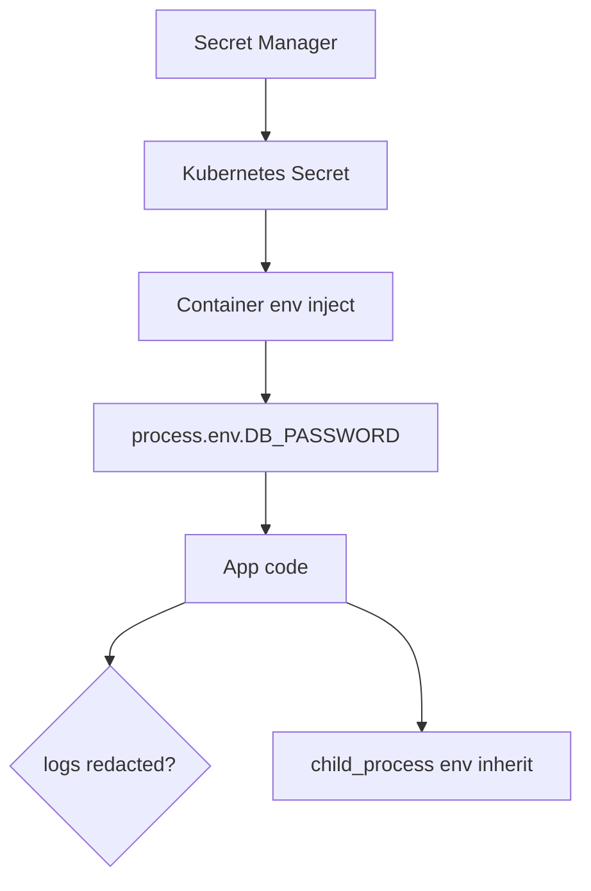
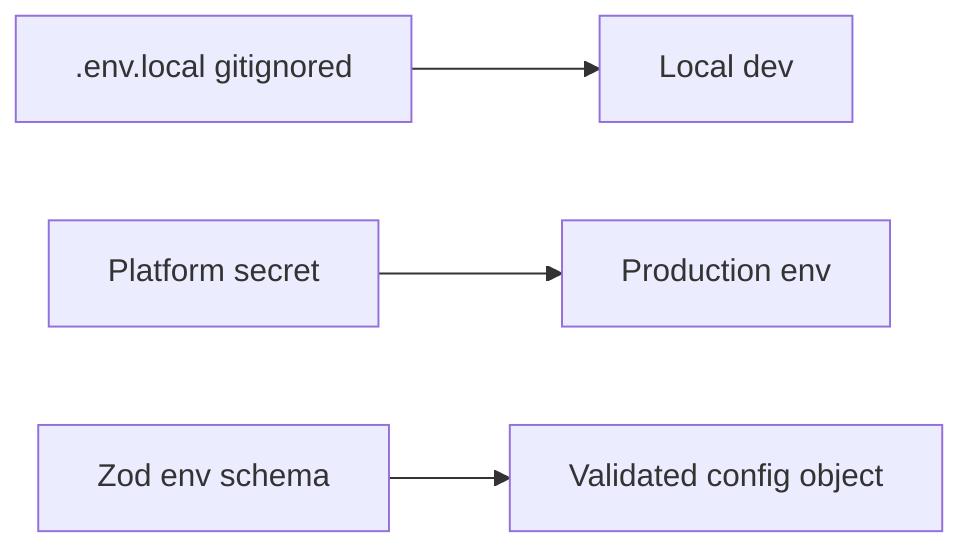
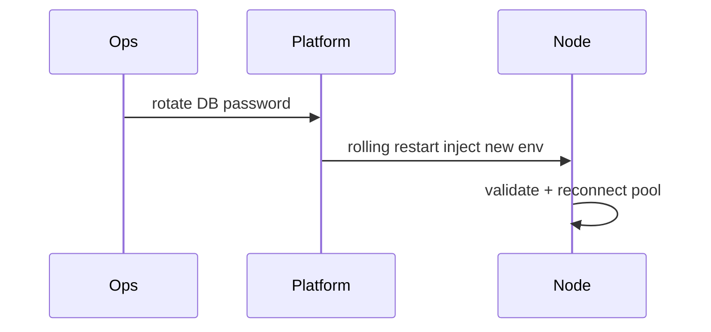

# Secrets Env Injection and Least Privilege

## Overview

Node reads **secrets** from **`process.env`**, dotenv files (dev only), and platform injectors (Kubernetes secrets, AWS SSM, Vault—[[16-DevOps/README|DevOps]]). **`process.env` is a string map visible to all code and child processes** in the same container—leaks via logs, crash dumps, and `child_process` inherit `env`. **Least privilege** means minimal OS user permissions, scoped IAM, short-lived credentials, and never committing secrets to git. Product auth patterns (JWT, OAuth) live in [[07-Backend/README|Backend]]; this note covers **host/runtime secret hygiene**.

## Learning Objectives

- Load config vs secrets with clear separation and validation
- Inject secrets at runtime via platform mechanisms, not baked images
- Prevent secret leakage in logs, errors, and `exec` environments
- Run Node as non-root with dropped capabilities in containers
- Rotate secrets without code deploy when possible

## Prerequisites

- [[06-NodeJS/01-Process-and-Runtime/Process argv env and stdio|Process argv env and stdio]]
- [[06-NodeJS/10-Production-Node/Configuration Twelve-Factor on Node|Configuration Twelve-Factor on Node]]

## Difficulty

`advanced`

## Estimated Time

- Reading: 2 hours
- Exercises: 2 hours
- Mini project: 4 hours

## History

Twelve-factor (2011) mandated **config in environment**. `.env` files simplified dev but caused production leaks when committed. Cloud platforms moved to **secret managers** with rotation; Node apps remained env-centric via injection at pod start.

## Problem It Solves

- **Credential theft** from repos, logs, heap dumps
- **Over-privileged containers** running as root with full env
- **Long-lived API keys** never rotated
- **Accidental echo** of `DATABASE_URL` in error middleware

## Internal Implementation



Rules:

- **Config** (port, feature flags): env OK, non-secret
- **Secrets** (DB password, signing keys): env inject or file mount with 0600 perms
- Never `console.log(process.env)` in debug left enabled

## Mermaid Diagrams

### Structure



### Sequence / Lifecycle



## Examples

### Minimal Example

```typescript
// config.ts — never import dotenv in production entry
import 'dotenv/config'; // dev only — guard with NODE_ENV

const { DATABASE_URL, JWT_SECRET } = process.env;
if (!DATABASE_URL || !JWT_SECRET) {
  throw new Error('Missing required secrets');
}
```

### Production-Shaped Example

Typed env with redaction:

```typescript
import { z } from 'zod';

const EnvSchema = z.object({
  NODE_ENV: z.enum(['development', 'test', 'production']),
  PORT: z.coerce.number().default(3000),
  DATABASE_URL: z.string().url(),
  JWT_SECRET: z.string().min(32),
  LOG_LEVEL: z.enum(['debug', 'info', 'warn', 'error']).default('info'),
});

export type Env = z.infer<typeof EnvSchema>;

let cached: Env | undefined;

export function loadEnv(): Env {
  if (!cached) cached = EnvSchema.parse(process.env);
  return cached;
}

export function publicEnvSnapshot(): Record<string, string | number> {
  const e = loadEnv();
  return { NODE_ENV: e.NODE_ENV, PORT: e.PORT, LOG_LEVEL: e.LOG_LEVEL };
  // deliberately omit DATABASE_URL, JWT_SECRET
}
```

Safe subprocess spawn:

```typescript
import { spawn } from 'node:child_process';

spawn('git', ['status'], {
  env: {
    PATH: process.env.PATH,
    HOME: process.env.HOME,
    // do NOT pass entire process.env with secrets to untrusted tools
  },
});
```

Dockerfile non-root:

```dockerfile
USER node
ENV NODE_ENV=production
# secrets via orchestrator, not ARG/ENV in image layers
```

## Trade-offs

| Method | Upside | Downside |
| --- | --- | --- |
| Env inject | Simple, 12-factor | Visible to all modules |
| File mount | Slightly better isolation | Path management |
| Runtime fetch | Short-lived tokens | Complexity, startup deps |

### When to Use

- Platform-managed secret injection ([[16-DevOps/README|DevOps]])
- Validated env schema at boot (fail fast)
- Non-root container user

### When Not to Use

- Secrets in `package.json`, Dockerfile `ENV`, or git
- Passing full env to user-controlled shell commands

## Exercises

1. Add zod schema; fail boot when `JWT_SECRET` too short.
2. Grep codebase for `process.env` logging; fix redaction.
3. List env keys visible to `child_process.fork()`; trim for one spawn call.

## Mini Project

Implement **config module** for [[06-NodeJS/projects/Node Runtime Toolkit/README|Node Runtime Toolkit]] with public vs secret split and test fixtures.

## Portfolio Project

Security.md documenting secret rotation runbook; link [[18-Security/README|Security]].

## Interview Questions

1. Why shouldn't secrets live in Docker image layers?
2. How does `process.env` leak to child processes?
3. dotenv in production—risks?
4. Difference between config and secrets in twelve-factor?

### Stretch / Staff-Level

1. Design zero-downtime DB password rotation for Node connection pools ([[08-Databases/README|Databases]]).

## Common Mistakes

- Committing `.env.production`
- Logging full `err` objects containing connection strings
- Running as root in container
- Eternal API keys in env without rotation plan
- Using `ENV SECRET=...` in Dockerfile

## Best Practices

- Validate env at startup; crash if missing secrets in prod
- Redact secrets in structured logs ([[06-NodeJS/10-Production-Node/Structured Logging and Correlation IDs|Structured Logging and Correlation IDs]])
- Use secret manager + inject at deploy ([[16-DevOps/README|DevOps]])
- Separate read-only DB creds where possible
- Audit `process.env` usage in PRs

## Summary

Node secrets belong in **runtime injection**, validated once, never logged, and scoped by **least privilege** OS and cloud IAM. Treat **`process.env` as globally readable within the process**—minimize exposure to child processes and error paths; delegate product auth to [[07-Backend/README|Backend]] patterns.

## Further Reading

- [[06-NodeJS/10-Production-Node/Configuration Twelve-Factor on Node|Configuration Twelve-Factor on Node]]
- [OWASP Secrets Management Cheat Sheet](https://cheatsheetseries.owasp.org/cheatsheets/Secrets_Management_Cheat_Sheet.html)

## Related Notes

- [[06-NodeJS/10-Production-Node/Configuration Twelve-Factor on Node|Configuration Twelve-Factor on Node]]
- [[06-NodeJS/06-Concurrency-and-Scaling/child_process IPC Patterns|child_process IPC Patterns]]
- [[16-DevOps/README|DevOps]]
- [[07-Backend/README|Backend]]
- [[18-Security/README|Security]]

## Progress Checklist

- [ ] Explained from first principles
- [ ] Drew at least one Mermaid diagram
- [ ] Implemented a minimal version
- [ ] Documented trade-offs and non-goals
- [ ] Completed exercises
- [ ] Practiced interview questions aloud
- [ ] Linked prerequisites and dependents
