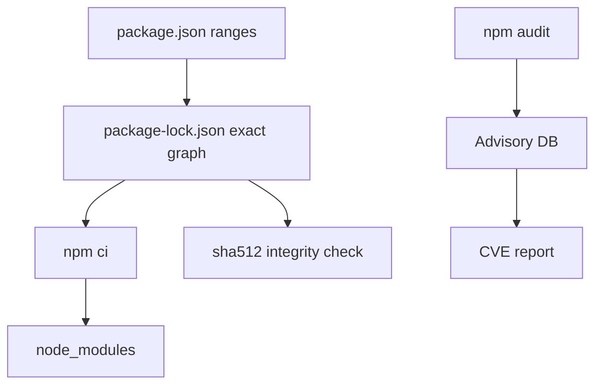
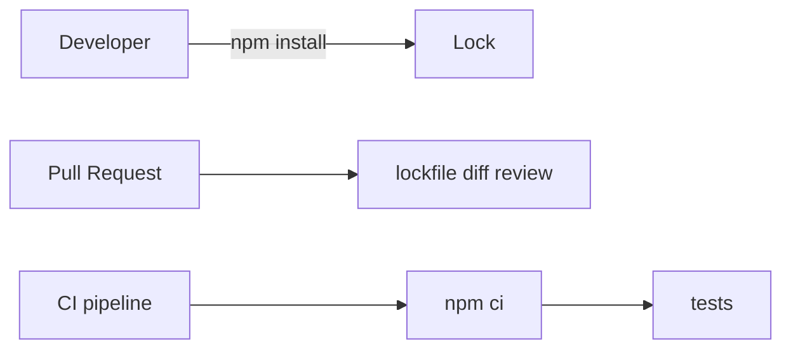
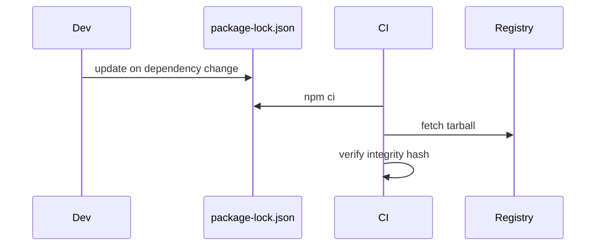

# npm Lockfiles Integrity and Audit

## Overview

**Lockfiles** (`package-lock.json`, `npm-shrinkwrap.json`, or `pnpm-lock.yaml`) pin exact dependency versions and **integrity hashes** (`subresource integrity` in lock metadata) so CI and production installs reproduce the same **`node_modules` graph**. **`npm ci`** installs strictly from lockfile; **`npm audit`** reports known CVEs in the tree. Node hosts execute arbitrary install scripts—lockfile discipline is the first supply-chain gate before runtime hardening ([[06-NodeJS/09-Security-and-Supply-Chain/Dependency Confusion Typosquatting and Install Scripts|Dependency Confusion Typosquatting and Install Scripts]]). CI/CD enforcement lives in [[16-DevOps/README|DevOps]].

## Learning Objectives

- Explain what lockfiles record: versions, resolved URLs, integrity, nested deps
- Use `npm ci` vs `npm install` in dev vs CI correctly
- Interpret `npm audit` severity, fixable vs transitive gaps
- Verify integrity fields and detect unexpected lockfile drift in PRs
- Integrate audit gates without blind `--force` upgrades

## Prerequisites

- [[06-NodeJS/03-Modules-and-Loading/node_modules Resolution in Practice|node_modules Resolution in Practice]]
- [[02-JavaScript/06-Modules-and-Tooling/Module Resolution and Package Exports|Module Resolution and Package Exports]]

## Difficulty

`intermediate`

## Estimated Time

- Reading: 1.5 hours
- Exercises: 2 hours
- Mini project: 3 hours

## History

npm 5 (2017) introduced **`package-lock.json`**. **`npm ci`** (2018) optimized deterministic CI installs. **`audit`** integrated npm advisory DB after Equifax-era awareness of transitive CVEs. npm 7+ added **`overrides`** for forced transitive pins.

## Problem It Solves

- **"Works on my machine"** dependency drift between dev/CI/prod
- **Silent minor upgrades** breaking semver assumptions
- **Undetected CVEs** in deep transitive deps
- **Tampered tarballs** without integrity verification

## Internal Implementation



Lockfile v3 fields (conceptual):

- **`resolved`**: registry URL
- **`integrity`**: `sha512-...` of tarball
- **`dependencies`**: nested tree

`npm ci` deletes existing `node_modules` and installs exactly—fails if lock out of sync with `package.json`.

## Mermaid Diagrams

### Structure



### Sequence / Lifecycle



## Examples

### Minimal Example

```bash
# CI — always
npm ci

# Local new dependency
npm install left-pad --save-exact
git add package.json package-lock.json
```

Inspect integrity:

```json
"node_modules/express": {
  "version": "4.19.2",
  "resolved": "https://registry.npmjs.org/express/-/express-4.19.2.tgz",
  "integrity": "sha512-..."
}
```

### Production-Shaped Example

CI script fragment:

```bash
#!/bin/sh
set -e
npm ci --ignore-scripts   # optional hardening — may break legit native builds
npm audit --audit-level=high
npm test
```

Package.json overrides for transitive CVE (use sparingly, document):

```json
{
  "overrides": {
    "lodash": "4.17.21"
  }
}
```

Lockfile drift check in PR:

```bash
npm ci
git diff --exit-code package-lock.json || (echo "Lockfile out of sync" && exit 1)
```

Programmatic audit summary in Node tooling:

```typescript
import { execSync } from 'node:child_process';

export function auditHighPlus(): void {
  try {
    execSync('npm audit --json --audit-level=high', { stdio: 'pipe' });
  } catch (e) {
    const out = (e as { stdout?: Buffer }).stdout?.toString() ?? '{}';
    const report = JSON.parse(out) as { metadata?: { vulnerabilities?: Record<string, number> } };
    console.error(JSON.stringify(report.metadata?.vulnerabilities));
    throw e;
  }
}
```

## Trade-offs

| Choice | Upside | Downside |
| --- | --- | --- |
| Commit lockfile | Reproducible builds | Large diffs |
| `npm ci --ignore-scripts` | Blocks install scripts | Breaks native postinstall |
| `overrides` | Forces transitive fix | Upgrade risk |

### When to Use

- Every application repo (commit lockfile)
- CI: `npm ci` + audit gate
- Review lockfile changes in dependency PRs

### When Not to Use

- Publishing libraries without lock (consumers resolve)—document policy
- Blind `npm audit fix --force` in production release week

## Exercises

1. Change `package.json` version without lock; observe `npm ci` failure.
2. Run `npm audit`; fix one advisory with minimal bump; re-audit.
3. Compare install time `npm install` vs `npm ci` on clean tree.

## Mini Project

Add **CI workflow** snippet to [[06-NodeJS/projects/Module Resolution and Exports Clinic/README|Module Resolution and Exports Clinic]] with lockfile drift check.

## Portfolio Project

Document dependency update runbook in [[06-NodeJS/projects/Node Runtime Toolkit/README|Node Runtime Toolkit]] Security.md.

## Interview Questions

1. `npm install` vs `npm ci`?
2. What does the integrity field prevent?
3. How do you handle unfixable transitive CVEs?
4. Should libraries commit lockfiles?

### Stretch / Staff-Level

1. Compare npm lock v2 vs v3 and pnpm content-addressable store trade-offs.

## Common Mistakes

- `.gitignore` on lockfile for applications
- Running `npm install` in CI (non-deterministic)
- Ignoring audit because "it's devDependency only" in deployed artifacts
- Mass `audit fix --force` breaking semver
- Not reviewing postinstall script changes in lock diff

## Best Practices

- Pin with lockfile; use exact versions for critical deps when needed
- CI: `npm ci`, audit threshold, optional `--ignore-scripts` + allowlist
- Dependabot/Renovate with test suite ([[16-DevOps/README|DevOps]])
- Document overrides with CVE links and removal criteria
- Separate prod vs dev deps; scan what ships in container image

## Summary

**Lockfiles + integrity** make Node installs **reproducible and tamper-evident**; **`npm ci`** enforces them in CI. **`npm audit`** is a advisory signal—pair with review, tests, and install-script policy—not a substitute for architecture-level supply-chain controls.

## Further Reading

- [npm ci documentation](https://docs.npmjs.com/cli/v10/commands/npm-ci)
- [[06-NodeJS/09-Security-and-Supply-Chain/Dependency Confusion Typosquatting and Install Scripts|Dependency Confusion Typosquatting and Install Scripts]]

## Related Notes

- [[06-NodeJS/09-Security-and-Supply-Chain/Dependency Confusion Typosquatting and Install Scripts|Dependency Confusion Typosquatting and Install Scripts]]
- [[06-NodeJS/03-Modules-and-Loading/node_modules Resolution in Practice|node_modules Resolution in Practice]]
- [[16-DevOps/README|DevOps]]
- [[18-Security/README|Security]]

## Progress Checklist

- [ ] Explained from first principles
- [ ] Drew at least one Mermaid diagram
- [ ] Implemented a minimal version
- [ ] Documented trade-offs and non-goals
- [ ] Completed exercises
- [ ] Practiced interview questions aloud
- [ ] Linked prerequisites and dependents
