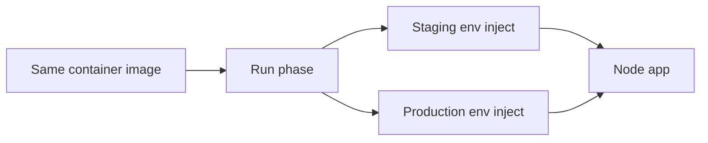
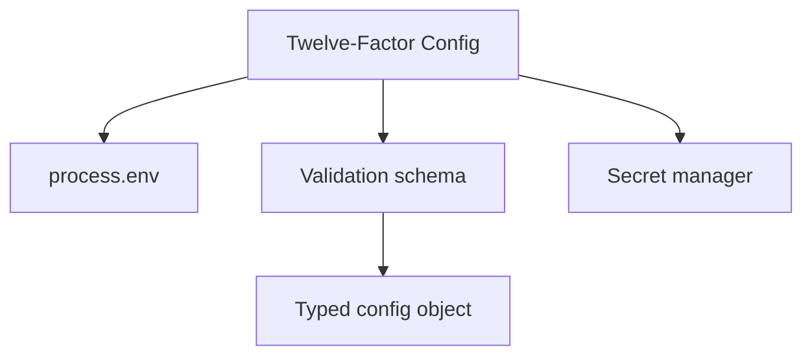
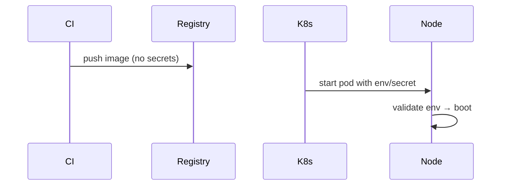

# Configuration Twelve-Factor on Node

## Overview

The **twelve-factor app** (2011) config principle: store **config in the environment**, strict separation from code, with **identical deployable artifacts** across stages. On Node, that means **`process.env`** (injected by [[16-DevOps/README|DevOps]]), validated schemas, no stage-specific branches in git, and distinguishing **config** from **secrets**. Build-time `import.meta.env` patterns from frontends don't apply—Node reads env at **process start**. Product feature config at scale may use remote flags ([[07-Backend/README|Backend]]); this note covers process-level configuration discipline.

## Learning Objectives

- Apply twelve-factor config rules to Node services
- Validate and type environment variables at boot
- Separate build, release, and run phases in Node deployments
- Avoid anti-patterns: committed `.env.production`, config files per stage in repo
- Map env vars to Kubernetes ConfigMap/Secret ([[16-DevOps/README|DevOps]])

## Prerequisites

- [[06-NodeJS/01-Process-and-Runtime/Process argv env and stdio|Process argv env and stdio]]
- [[06-NodeJS/09-Security-and-Supply-Chain/Secrets Env Injection and Least Privilege|Secrets Env Injection and Least Privilege]]

## Difficulty

`intermediate`

## Estimated Time

- Reading: 1.5 hours
- Exercises: 2 hours
- Mini project: 4 hours

## History

Heroku's twelve-factor guide shaped PaaS Node deployments. Before that, apps used checked-in `config/production.json`—error-prone and secret-leaking. Cloud-native moved injection to orchestrators while Node code stayed env-centric.

## Problem It Solves

- **Config drift** between staging and production code paths
- **Secrets in repo** disguised as config files
- **Late failures** from missing env discovered mid-traffic
- **Non-portable artifacts** requiring rebuild per environment

## Internal Implementation



Build → release → run:

1. **Build**: compile/bundle, no secrets, no `NODE_ENV=production`-baked URLs
2. **Release**: image + config snapshot (immutable release id)
3. **Run**: `node dist/main.js` with env from platform

## Mermaid Diagrams

### Structure



### Sequence / Lifecycle



## Examples

### Minimal Example

```typescript
// boot.ts — validate before listening
import { loadEnv } from './env.js';

const config = loadEnv();
console.log(`Starting on port ${config.PORT} in ${config.NODE_ENV}`);
```

```typescript
// env.ts
import { z } from 'zod';

const schema = z.object({
  NODE_ENV: z.enum(['development', 'test', 'production']),
  PORT: z.coerce.number().int().positive(),
  API_BASE_URL: z.string().url(),
});

export function loadEnv() {
  return schema.parse(process.env);
}
```

### Production-Shaped Example

```typescript
import { z } from 'zod';

const ConfigSchema = z.object({
  NODE_ENV: z.enum(['development', 'test', 'production']),
  PORT: z.coerce.number().default(3000),
  LOG_LEVEL: z.enum(['debug', 'info', 'warn', 'error']),
  DATABASE_URL: z.string().url(),
  FEATURE_NEW_BILLING: z
    .enum(['true', 'false'])
    .transform((v) => v === 'true')
    .default('false'),
});

export type AppConfig = z.infer<typeof ConfigSchema>;

let config: AppConfig;

export function initConfig(): AppConfig {
  config = ConfigSchema.parse(process.env);
  return config;
}

export function getConfig(): AppConfig {
  if (!config) throw new Error('Config not initialized');
  return config;
}

// dev-only dotenv — never in production entry
export function loadDevDotenv(): void {
  if (process.env.NODE_ENV !== 'production') {
    void import('dotenv/config');
  }
}
```

Feature flags note: env flags OK for coarse toggles; dynamic flags → [[07-Backend/10-Production-Services/Configuration Feature Flags and Secrets for Services|Configuration Feature Flags and Secrets for Services]].

## Trade-offs

| Approach | Upside | Downside |
| --- | --- | --- |
| Env vars | 12-factor portable | Flat namespace |
| Config files in image | Grouped structure | Violates III if stage-specific |
| Remote config service | Dynamic | Runtime dependency |

### When to Use

- All stage-specific URLs, ports, pool sizes in env
- Fail-fast validation at startup
- Identical Docker image across environments

### When Not to Use

- Baking secrets into JS bundles
- `if (NODE_ENV)` scattered business logic forks without tests

## Exercises

1. Boot app with missing `DATABASE_URL`; confirm crash before listen.
2. List all env vars your app reads; classify config vs secret.
3. Write K8s Deployment snippet: ConfigMap + Secret refs ([[16-DevOps/README|DevOps]]).

## Mini Project

Central **config module** with `.env.example` (no secrets) for [[06-NodeJS/projects/Node Runtime Toolkit/README|Node Runtime Toolkit]].

## Portfolio Project

Deployment.md documenting env contract per environment.

## Interview Questions

1. What twelve-factor says about config in code?
2. Where do secrets vs config belong?
3. Why validate env at startup?
4. dotenv in production—acceptable?

### Stretch / Staff-Level

1. Design config rotation without rebuild when only secrets change.

## Common Mistakes

- `config/production.json` in git with secrets
- Parsing env on every access without validation
- Different Docker tags per env instead of env inject
- Using `NODE_ENV` alone for feature logic
- Committed `.env` files

## Best Practices

- Single `loadEnv()` at boot; inject config object
- `.env.example` documents keys; gitignore `.env*`
- Platform injects secrets ([[06-NodeJS/09-Security-and-Supply-Chain/Secrets Env Injection and Least Privilege|Secrets Env Injection and Least Privilege]])
- Test with env fixtures in CI
- Version config schema changes in changelog

## Summary

Node twelve-factor config means **one artifact**, **environment-injected settings**, **validated at boot**, and **secrets outside code**. Use typed schemas, dev-only dotenv, and orchestrator ConfigMaps/Secrets—defer dynamic product config to [[07-Backend/10-Production-Services/Configuration Feature Flags and Secrets for Services|Configuration Feature Flags and Secrets for Services]] when needed.

## Further Reading

- [The Twelve-Factor App — Config](https://12factor.net/config)
- [[16-DevOps/README|DevOps]]

## Related Notes

- [[06-NodeJS/09-Security-and-Supply-Chain/Secrets Env Injection and Least Privilege|Secrets Env Injection and Least Privilege]]
- [[06-NodeJS/10-Production-Node/Structured Logging and Correlation IDs|Structured Logging and Correlation IDs]]
- [[06-NodeJS/01-Process-and-Runtime/NODE_OPTIONS and Runtime Flags|NODE_OPTIONS and Runtime Flags]]
- [[16-DevOps/README|DevOps]]
- [[07-Backend/README|Backend]]

## Progress Checklist

- [ ] Explained from first principles
- [ ] Drew at least one Mermaid diagram
- [ ] Implemented a minimal version
- [ ] Documented trade-offs and non-goals
- [ ] Completed exercises
- [ ] Practiced interview questions aloud
- [ ] Linked prerequisites and dependents
