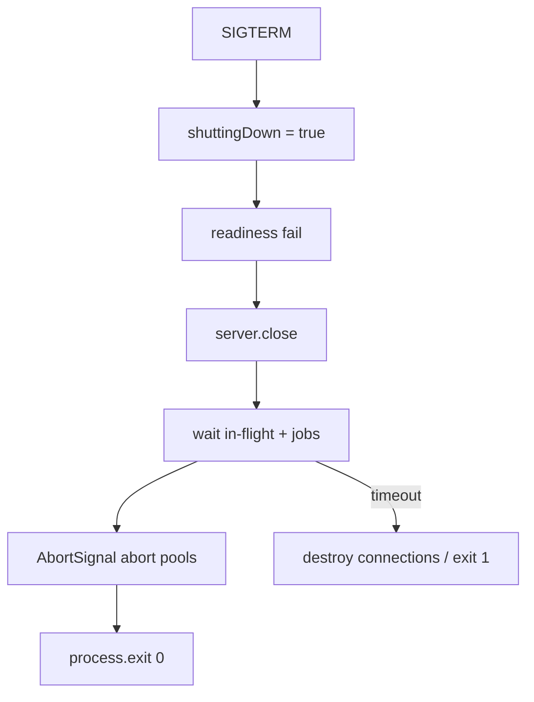
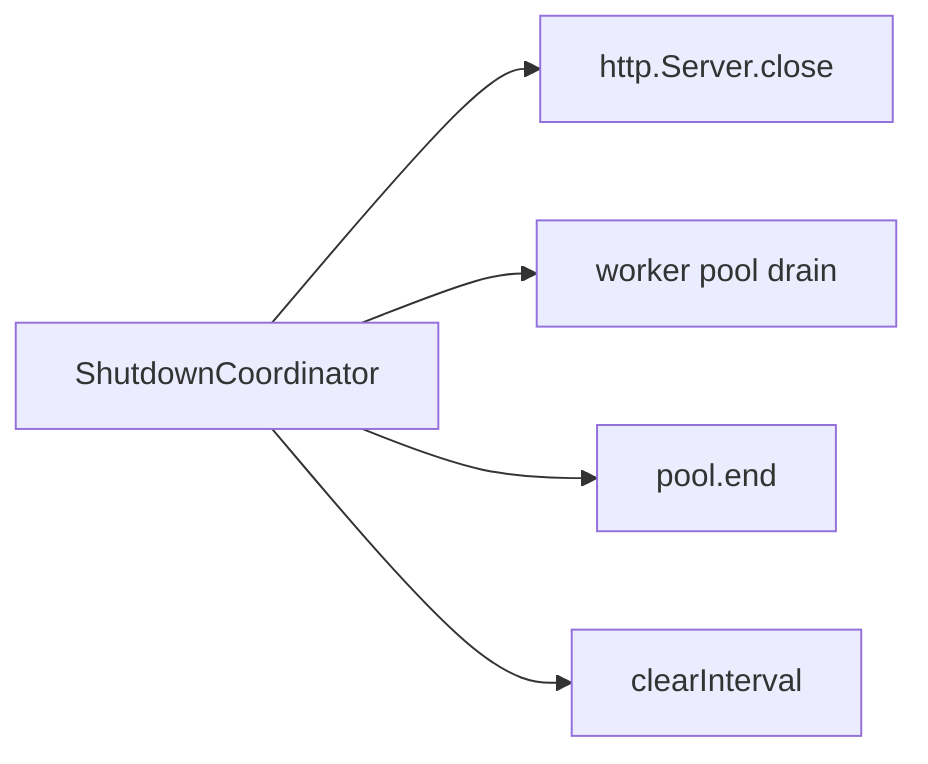
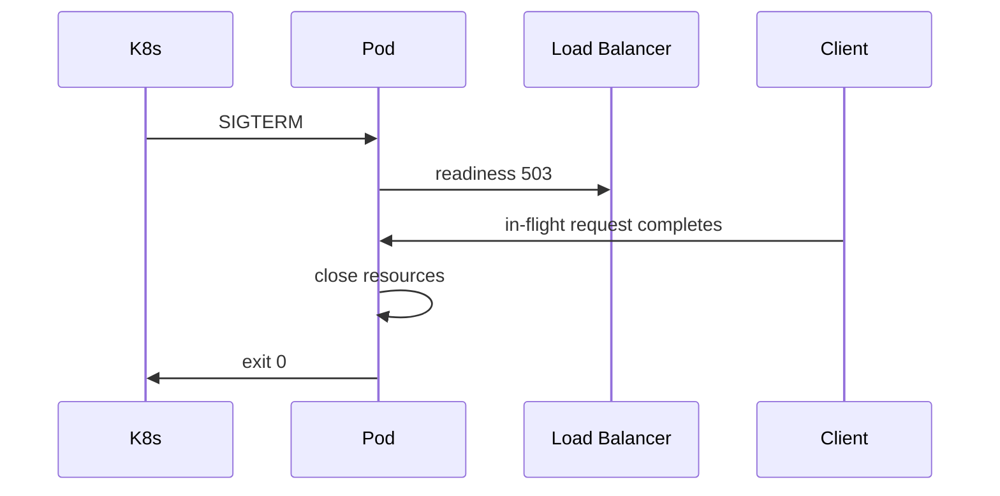

# Graceful Shutdown and Drain

## Overview

**Graceful shutdown** stops accepting new work, **drains** in-flight HTTP connections and background jobs, closes resources (DB pools, timers, workers), then exits with a clean code. Orchestrators ([[16-DevOps/README|DevOps]] Kubernetes) send **SIGTERM** before SIGKILL; Node must hook signals, call **`server.close()`**, abort long tasks via **`AbortSignal`**, and respect **`terminationGracePeriodSeconds`**. Abrupt exit drops requests mid-flight and corrupts async side effects—production Node must treat shutdown as a first-class lifecycle.

## Learning Objectives

- Implement SIGTERM/SIGINT handlers that idempotently start shutdown
- Drain HTTP servers with `close()` and track active connections
- Abort in-flight async work and worker pools on shutdown
- Coordinate with load balancer health checks (readiness flip)
- Set exit codes and timeouts aligned with platform grace period

## Prerequisites

- [[06-NodeJS/01-Process-and-Runtime/Signals Exit Codes and Lifecycle Hooks|Signals Exit Codes and Lifecycle Hooks]]
- [[06-NodeJS/05-Networking/http and https Platform Servers|http and https Platform Servers]]
- [[06-NodeJS/07-Timers-Events-and-IPC/AbortSignal Propagation Across Node APIs|AbortSignal Propagation Across Node APIs]]

## Difficulty

`advanced`

## Estimated Time

- Reading: 2 hours
- Exercises: 3 hours
- Mini project: 6 hours ([[06-NodeJS/projects/Graceful Shutdown Harness/README|Graceful Shutdown Harness]])

## History

Pre-container era, **`nodemon`** restarts ignored in-flight requests. Kubernetes popularized **rolling updates** requiring **`preStop`** hooks and **`server.close()`** patterns. Node 18+ improved **`closeAllConnections`** on HTTP server for forced drain deadlines.

## Problem It Solves

- **502 storms** during deploy when pods killed mid-request
- **Lost queue jobs** when workers terminate without nack
- **Hung shutdown** from open handles keeping event loop alive
- **Double shutdown** handlers causing race exits

## Internal Implementation



`server.close()` stops accepting new connections; existing keep-alive requests complete unless forced.

Track **`connections`** set on `connection` event; destroy after deadline.

## Mermaid Diagrams

### Structure



### Sequence / Lifecycle



## Examples

### Minimal Example

```typescript
import http from 'node:http';

const server = http.createServer((_req, res) => {
  setTimeout(() => res.end('ok'), 2000);
});

server.listen(3000);

process.on('SIGTERM', () => {
  console.log('SIGTERM received');
  server.close(() => {
    console.log('closed');
    process.exit(0);
  });
});
```

### Production-Shaped Example

```typescript
import http from 'node:http';
import type { Socket } from 'node:net';

export function createGracefulServer(
  handler: http.RequestListener,
  opts: { graceMs: number },
): { server: http.Server; shutdown: () => Promise<void> } {
  const connections = new Set<Socket>();
  let shuttingDown = false;

  const server = http.createServer((req, res) => {
    if (shuttingDown) {
      res.writeHead(503, { Connection: 'close' });
      res.end('shutting down');
      return;
    }
    handler(req, res);
  });

  server.on('connection', (socket) => {
    connections.add(socket);
    socket.on('close', () => connections.delete(socket));
  });

  const shutdownAc = new AbortController();

  async function shutdown(): Promise<void> {
    if (shuttingDown) return;
    shuttingDown = true;
    shutdownAc.abort(new Error('shutdown'));

    await new Promise<void>((resolve) => server.close(() => resolve()));

    const deadline = Date.now() + opts.graceMs;
    while (connections.size > 0 && Date.now() < deadline) {
      await new Promise((r) => setTimeout(r, 100));
    }
    for (const s of connections) s.destroy();
  }

  process.once('SIGTERM', () => void shutdown().then(() => process.exit(0)));
  process.once('SIGINT', () => void shutdown().then(() => process.exit(0)));

  return { server, shutdown };
}
```

Integrate worker pool drain ([[06-NodeJS/06-Concurrency-and-Scaling/Worker Pools and Message Passing|Worker Pools and Message Passing]]) and readiness ([[06-NodeJS/10-Production-Node/Health Readiness and Liveness Hooks|Health Readiness and Liveness Hooks]]).

## Trade-offs

| Dimension | Graceful | Fast kill |
| --- | --- | --- |
| User impact | Completes requests | Drops connections |
| Deploy time | Longer rollouts | Quick but noisy |
| Complexity | Connection tracking | Simple |

### When to Use

- Any HTTP service behind LB/orchestrator
- Workers with jobs exceeding few seconds
- Database write paths needing transaction completion

### When Not to Use

- Stateless batch CLI (immediate exit OK)
- After grace exceeded—force kill better than hang

## Exercises

1. Send SIGTERM during 5s request; verify completion before exit.
2. Fail readiness immediately on SIGTERM; simulate LB behavior.
3. Log open handles with `why-is-node-running` or `--trace-exit` on hang.

## Mini Project

Complete [[06-NodeJS/projects/Graceful Shutdown Harness/README|Graceful Shutdown Harness]] with K8s manifest `terminationGracePeriodSeconds` documentation.

## Portfolio Project

Shutdown coordinator in [[06-NodeJS/projects/Node Runtime Toolkit/README|Node Runtime Toolkit]].

## Interview Questions

1. What does `server.close()` do vs `server.closeAllConnections()`?
2. Why flip readiness before drain in Kubernetes?
3. How do you abort background pollers on shutdown?
4. What keeps Node alive after `server.close()`?

### Stretch / Staff-Level

1. Design shutdown for `cluster` primary + workers ([[06-NodeJS/06-Concurrency-and-Scaling/cluster and Multi-Process Scaling|cluster and Multi-Process Scaling]]).

## Common Mistakes

- Only handling SIGINT (dev) not SIGTERM (K8s)
- No shutdown timeout → stuck pod
- Forgetting keep-alive connections
- Exiting before DB pool `end()`
- Registering multiple SIGTERM listeners that each call `exit`

## Best Practices

- Single shutdown coordinator; idempotent
- Readiness 503 + `Connection: close` when draining
- AbortSignal for long tasks ([[06-NodeJS/07-Timers-Events-and-IPC/AbortSignal Propagation Across Node APIs|AbortSignal Propagation Across Node APIs]])
- Match grace period to p99 request + job time
- Test shutdown in integration tests

## Summary

Graceful shutdown **stops new work**, **drains connections**, **aborts background tasks**, and **closes pools** before exit—driven by SIGTERM in [[16-DevOps/README|DevOps]] environments. Implement `server.close()`, connection tracking, deadlines, and readiness coordination to avoid deploy-induced errors.

## Further Reading

- [[06-NodeJS/projects/Graceful Shutdown Harness/README|Graceful Shutdown Harness]]
- [Kubernetes pod termination](https://kubernetes.io/docs/concepts/workloads/pods/pod-lifecycle/#pod-termination)

## Related Notes

- [[06-NodeJS/10-Production-Node/Health Readiness and Liveness Hooks|Health Readiness and Liveness Hooks]]
- [[06-NodeJS/01-Process-and-Runtime/Signals Exit Codes and Lifecycle Hooks|Signals Exit Codes and Lifecycle Hooks]]
- [[06-NodeJS/06-Concurrency-and-Scaling/Worker Pools and Message Passing|Worker Pools and Message Passing]]
- [[16-DevOps/README|DevOps]]

## Progress Checklist

- [ ] Explained from first principles
- [ ] Drew at least one Mermaid diagram
- [ ] Implemented a minimal version
- [ ] Documented trade-offs and non-goals
- [ ] Completed exercises
- [ ] Practiced interview questions aloud
- [ ] Linked prerequisites and dependents
