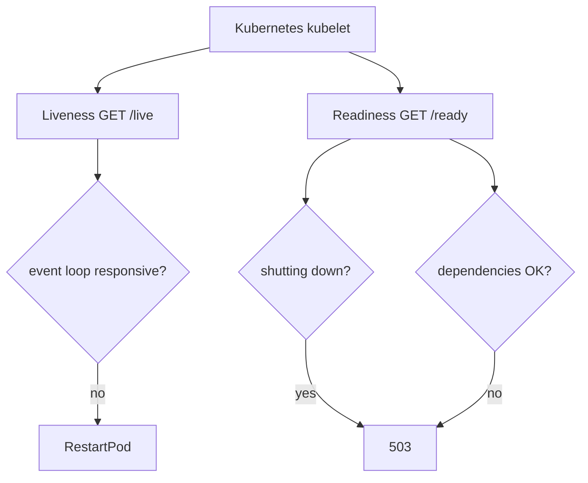
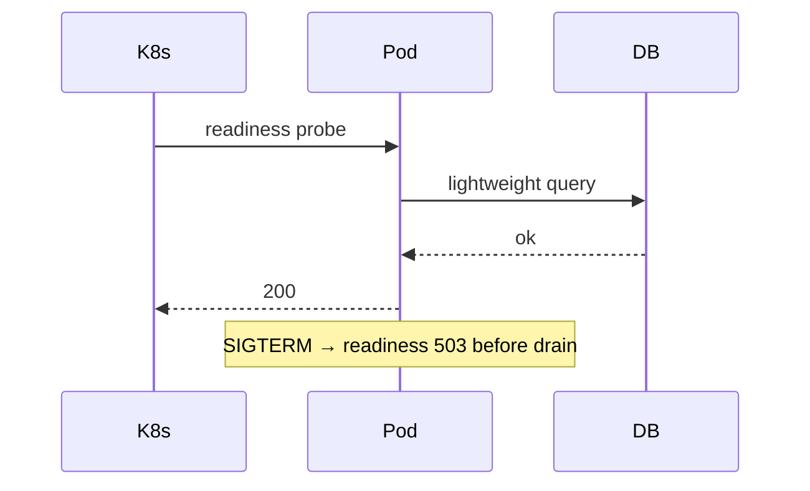

# Health Readiness and Liveness Hooks

## Overview

**Health endpoints** let orchestrators ([[16-DevOps/README|DevOps]] Kubernetes) distinguish **liveness** (process up—restart if dead) from **readiness** (able to serve traffic—remove from load balancer). Node HTTP servers expose `/health/live`, `/health/ready`, or combined routes returning 200 vs 503. Readiness must fail during **startup**, **dependency outage**, **shutdown drain**, and **severe event-loop stall**—while liveness stays narrow to avoid restart loops during dependency blips.

## Learning Objectives

- Implement separate liveness and readiness HTTP handlers
- Check dependencies (DB, cache) in readiness without blocking event loop
- Flip readiness false on SIGTERM before drain ([[06-NodeJS/10-Production-Node/Graceful Shutdown and Drain|Graceful Shutdown and Drain]])
- Configure K8s probes: paths, timeouts, failure thresholds
- Avoid health checks that hammer dependencies or lie about capacity

## Prerequisites

- [[06-NodeJS/05-Networking/http and https Platform Servers|http and https Platform Servers]]
- [[06-NodeJS/10-Production-Node/Graceful Shutdown and Drain|Graceful Shutdown and Drain]]
- [[06-NodeJS/08-Diagnostics-and-Performance/perf_hooks and Event Loop Delay|perf_hooks and Event Loop Delay]]

## Difficulty

`intermediate`

## Estimated Time

- Reading: 1.5 hours
- Exercises: 2 hours
- Mini project: 4 hours

## History

Kubernetes codified **liveness/readiness/startup probes** (2015+) replacing ad-hoc "hit homepage" checks. Node apps often wrongly used `/` (200 OK while DB down) or expensive checks causing cascading failures.

## Problem It Solves

- **Traffic to broken pods** during startup or DB outage
- **Restart storms** when liveness hits failing dependencies
- **Deploy race** sending requests before server listens
- **Hidden loop stalls**—HTTP 200 but unusable latency

## Internal Implementation



Probe types:

- **Liveness**: cheap, in-process only (deadlock detection optional)
- **Readiness**: DB ping, migration complete, warm cache, not draining
- **Startup**: lenient readiness for slow boot

## Mermaid Diagrams

### Structure

```mermaid
flowchart LR
    Health[HealthModule] --> Live[/live]
    Health --> Ready[/ready]
    Ready --> DB[DB ping]
    Ready --> Flag[shuttingDown flag]
```

### Sequence / Lifecycle



## Examples

### Minimal Example

```typescript
import http from 'node:http';

let ready = false;
let live = true;

http.createServer((req, res) => {
  if (req.url === '/health/live') {
    res.writeHead(live ? 200 : 503).end(live ? 'ok' : 'dead');
    return;
  }
  if (req.url === '/health/ready') {
    res.writeHead(ready ? 200 : 503).end(ready ? 'ok' : 'not ready');
    return;
  }
  res.end('app');
}).listen(3000, () => { ready = true; });
```

### Production-Shaped Example

```typescript
import http from 'node:http';
import { monitorEventLoopDelay } from 'node:perf_hooks';

const loopDelay = monitorEventLoopDelay({ resolution: 20 });
loopDelay.enable();

export interface HealthState {
  shuttingDown: boolean;
  bootComplete: boolean;
  checkDependencies: () => Promise<boolean>;
}

export function mountHealthRoutes(
  server: http.Server,
  state: HealthState,
): void {
  server.on('request', (req, res) => {
    if (req.url === '/health/live') {
      const stalled = loopDelay.percentile(99) / 1e6 > 500;
      const ok = !stalled;
      res.writeHead(ok ? 200 : 503, { 'Content-Type': 'application/json' });
      res.end(JSON.stringify({ ok, loopDelayP99Ms: loopDelay.percentile(99) / 1e6 }));
      return;
    }
    if (req.url === '/health/ready') {
      void handleReady(state, res);
      return;
    }
  });
}

async function handleReady(state: HealthState, res: http.ServerResponse): Promise<void> {
  if (state.shuttingDown || !state.bootComplete) {
    res.writeHead(503).end(JSON.stringify({ ok: false, reason: 'shutting_down_or_booting' }));
    return;
  }
  const depsOk = await state.checkDependencies();
  res.writeHead(depsOk ? 200 : 503, { 'Content-Type': 'application/json' });
  res.end(JSON.stringify({ ok: depsOk }));
}
```

K8s manifest snippet ([[16-DevOps/README|DevOps]]):

```yaml
livenessProbe:
  httpGet:
    path: /health/live
    port: 3000
  periodSeconds: 10
readinessProbe:
  httpGet:
    path: /health/ready
    port: 3000
  periodSeconds: 5
startupProbe:
  httpGet:
    path: /health/ready
    port: 3000
  failureThreshold: 30
```

## Trade-offs

| Check in readiness | Upside | Downside |
| --- | --- | --- |
| DB ping | Accurate | Load on DB |
| Static ok | Cheap | Lies during outage |
| Loop delay | Catches stall | False positives |

### When to Use

- Every orchestrated Node service
- Separate live vs ready semantics
- Startup probe for slow migrations

### When Not to Use

- Expensive full integration test in liveness probe
- Readiness hitting external APIs every 1s at high replica count

## Exercises

1. Fail readiness when mock DB down; verify 503.
2. On SIGTERM, readiness 503 while liveness 200 until exit.
3. Tune loop delay threshold with artificial block.

## Mini Project

Health module in [[06-NodeJS/projects/Graceful Shutdown Harness/README|Graceful Shutdown Harness]] with K8s YAML.

## Portfolio Project

Document probe contract in [[06-NodeJS/projects/Node Runtime Toolkit/README|Node Runtime Toolkit]] Deployment.md.

## Interview Questions

1. Liveness vs readiness?
2. Why readiness should fail on SIGTERM before drain?
3. Risk of DB check in liveness probe?
4. What does startupProbe solve?

### Stretch / Staff-Level

1. Design health checks for worker-heavy Node where HTTP is admin-only port.

## Common Mistakes

- Single `/health` doing everything
- Liveness calls database → restart loop during DB incident
- Readiness true before server listens
- No startup probe on 60s boot migrations
- Health on same port as heavy app without rate limit (usually OK)

## Best Practices

- Liveness: process up + optional loop delay
- Readiness: deps + not draining + boot complete
- Timeouts < probe period; cache dependency checks briefly
- JSON body with reason codes for operators
- Align with [[06-NodeJS/10-Production-Node/Graceful Shutdown and Drain|Graceful Shutdown and Drain]]

## Summary

**Liveness** keeps the pod alive; **readiness** gates traffic. Node apps expose cheap live checks and dependency-aware ready checks, flipping ready **false** during shutdown. Configure probes in [[16-DevOps/README|DevOps]] and optionally incorporate **event-loop delay** for stall detection.

## Further Reading

- [Kubernetes configure probes](https://kubernetes.io/docs/tasks/configure-pod-container/configure-liveness-readiness-startup-probes/)

## Related Notes

- [[06-NodeJS/10-Production-Node/Graceful Shutdown and Drain|Graceful Shutdown and Drain]]
- [[06-NodeJS/08-Diagnostics-and-Performance/perf_hooks and Event Loop Delay|perf_hooks and Event Loop Delay]]
- [[06-NodeJS/10-Production-Node/Operational Readiness Checklist for Node Processes|Operational Readiness Checklist for Node Processes]]
- [[16-DevOps/README|DevOps]]
- [[07-Backend/10-Production-Services/Health Dependencies and Readiness Semantics|Health Dependencies and Readiness Semantics]]
- [[07-Backend/README|Backend]]

## Progress Checklist

- [ ] Explained from first principles
- [ ] Drew at least one Mermaid diagram
- [ ] Implemented a minimal version
- [ ] Documented trade-offs and non-goals
- [ ] Completed exercises
- [ ] Practiced interview questions aloud
- [ ] Linked prerequisites and dependents
