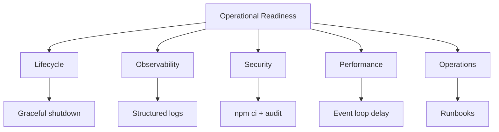
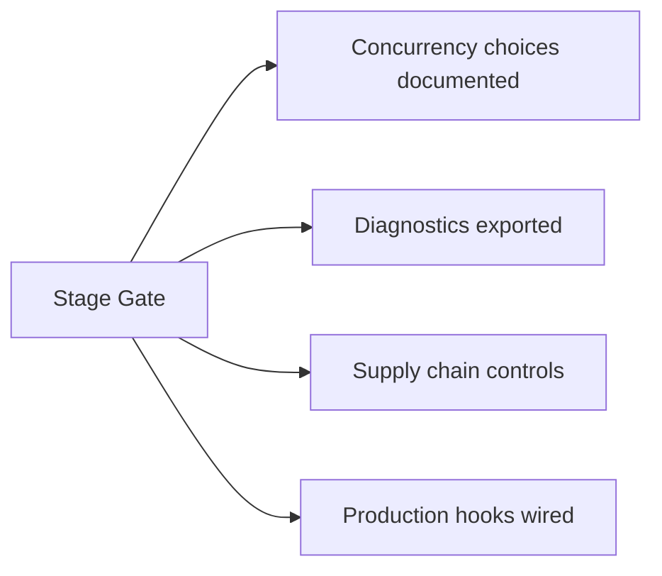
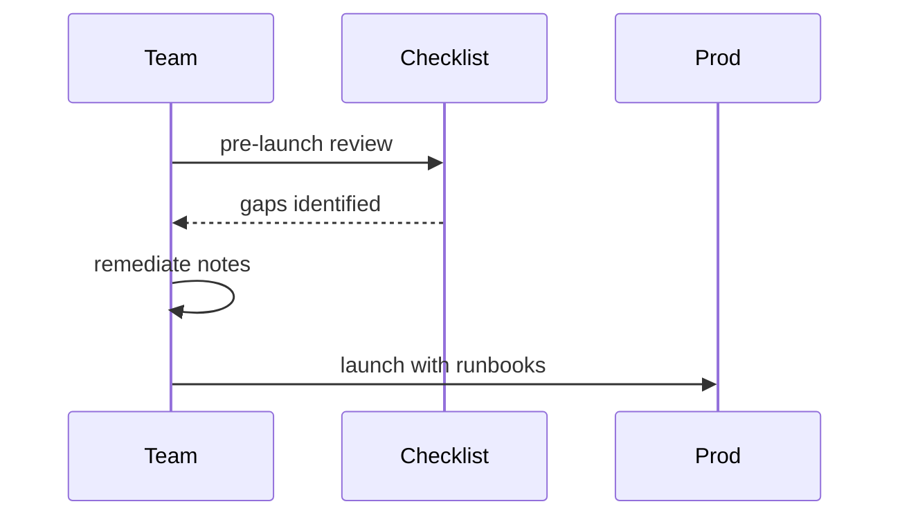

# Operational Readiness Checklist for Node Processes

## Overview

**Operational readiness** means a Node process can run reliably in production: correct **signals**, **health probes**, **observability**, **resource limits**, **supply-chain hygiene**, and **documented runbooks**. This note synthesizes modules 06–10 into a gate checklist before traffic—complementing platform concerns in [[16-DevOps/README|DevOps]] (containers, CI, K8s) and product SLAs in [[07-Backend/10-Production-Services/Operational Readiness for Backend Services|Operational Readiness for Backend Services]]. It is the stage gate for claiming "production Node" fluency in the [[06-NodeJS/README|Node.js track]].

## Learning Objectives

- Apply a pre-production checklist covering lifecycle, observability, security, and perf
- Identify gaps in an existing Node service during review
- Document runbooks for deploy, rollback, incident, and dependency CVE
- Align process settings with container limits and orchestrator probes
- Connect checklist items to specific topic notes for remediation

## Prerequisites

- [[06-NodeJS/10-Production-Node/Graceful Shutdown and Drain|Graceful Shutdown and Drain]]
- [[06-NodeJS/10-Production-Node/Health Readiness and Liveness Hooks|Health Readiness and Liveness Hooks]]
- [[06-NodeJS/09-Security-and-Supply-Chain/npm Lockfiles Integrity and Audit|npm Lockfiles Integrity and Audit]]
- [[06-NodeJS/08-Diagnostics-and-Performance/perf_hooks and Event Loop Delay|perf_hooks and Event Loop Delay]]

## Difficulty

`advanced`

## Estimated Time

- Reading: 2 hours
- Exercises: 3 hours (audit a sample app)
- Mini project: 4 hours (fill checklist for portfolio project)

## History

SRE practice formalized **launch checklists** (Google). Node-specific gaps emerged: **`unhandledRejection`**, event-loop blocking, install-script supply chain, and single-thread assumptions in horizontal pod autoscaling.

## Problem It Solves

- **Premature production** with missing SIGTERM handling
- **Invisible failures** without metrics/logs
- **Repeat incidents** from undocumented known gaps
- **Review friction** without shared readiness vocabulary

## Internal Implementation



## Mermaid Diagrams

### Structure



### Sequence / Lifecycle



## Examples

### Minimal Example

Core binary gates (must pass):

```markdown
- [ ] SIGTERM → drain → exit 0 ([[06-NodeJS/10-Production-Node/Graceful Shutdown and Drain|Graceful Shutdown and Drain]])
- [ ] /health/live and /health/ready ([[06-NodeJS/10-Production-Node/Health Readiness and Liveness Hooks|Health Readiness and Liveness Hooks]])
- [ ] JSON logs with correlationId ([[06-NodeJS/10-Production-Node/Structured Logging and Correlation IDs|Structured Logging and Correlation IDs]])
- [ ] npm ci in CI ([[06-NodeJS/09-Security-and-Supply-Chain/npm Lockfiles Integrity and Audit|npm Lockfiles Integrity and Audit]])
- [ ] unhandledRejection policy explicit ([[06-NodeJS/01-Process-and-Runtime/unhandledRejection uncaughtException and Fatal Errors|unhandledRejection]])
```

### Production-Shaped Example

Full checklist template:

```typescript
export interface ReadinessReport {
  lifecycle: {
    sigtermDrain: boolean;
    abortInFlight: boolean;
    connectionTracking: boolean;
  };
  observability: {
    structuredLogs: boolean;
    correlationIds: boolean;
    eventLoopDelayMetric: boolean;
    errorTracking: boolean;
  };
  security: {
    lockfileCommitted: boolean;
    auditGate: boolean;
    secretsNotInImage: boolean;
    pathTraversalReviewed: boolean;
  };
  performance: {
    heapSizedForContainer: boolean;
    cpuOffloadDocumented: boolean;
    profilingRunbook: boolean;
  };
  operations: {
    runbooks: boolean;
    rollbackTested: boolean;
    oncallPlaybook: boolean;
  };
}

export function scoreReadiness(r: ReadinessReport): number {
  const booleans = Object.values(r).flatMap((section) => Object.values(section));
  return booleans.filter(Boolean).length / booleans.length;
}
```

Expanded gate sections:

| Area | Check | Topic link |
| --- | --- | --- |
| Lifecycle | `unhandledRejection` / `uncaughtException` handlers | [[06-NodeJS/01-Process-and-Runtime/unhandledRejection uncaughtException and Fatal Errors|Process runtime]] |
| Lifecycle | Worker pool drain on shutdown | [[06-NodeJS/06-Concurrency-and-Scaling/Worker Pools and Message Passing|Worker Pools]] |
| Config | Env validated; secrets injected | [[06-NodeJS/10-Production-Node/Configuration Twelve-Factor on Node|Twelve-Factor Config]] |
| Observability | Loop delay p99 alert | [[06-NodeJS/08-Diagnostics-and-Performance/perf_hooks and Event Loop Delay|perf_hooks]] |
| Security | Safe fs paths for user input | [[06-NodeJS/09-Security-and-Supply-Chain/Path Traversal and Safe Filesystem Access|Path Traversal]] |
| Security | Install script policy | [[06-NodeJS/09-Security-and-Supply-Chain/Dependency Confusion Typosquatting and Install Scripts|Install Scripts]] |
| Testing | HTTP integration + contract tests | [[06-NodeJS/10-Production-Node/Testing Node Servers Integration and Contract Tests|Testing Node Servers]] |
| Platform | Probes match terminationGracePeriodSeconds | [[16-DevOps/README|DevOps]] |

Runbook outline:

```markdown
## Deploy
1. CI green (test, npm ci, audit)
2. Rolling update via K8s
3. Watch error rate + loop delay 15m

## Incident: high latency
1. Check loop delay metric
2. CPU profile 60s ([[06-NodeJS/08-Diagnostics-and-Performance/Flamegraphs Bottlenecks and Production Profiling Discipline|Flamegraphs]])
3. Scale replicas if I/O bound ([[16-DevOps/README|DevOps]])

## CVE in dependency
1. npm audit / advisory link
2. Patch version PR, lockfile review
3. Emergency deploy
```

## Trade-offs

| Strict gate | Upside | Downside |
| --- | --- | --- |
| All items required | Fewer incidents | Slower first ship |
| Risk-tiered | Pragmatic | Needs judgment |

### When to Use

- Before first production traffic or major tier promotion
- Quarterly ops review of existing services
- Post-incident hardening template

### When Not to Use

- Blocking local dev prototypes
- Checkbox without linked remediation owners

## Exercises

1. Audit [[06-NodeJS/projects/Node Runtime Toolkit/README|Node Runtime Toolkit]] against checklist; file gaps.
2. Write SIGTERM runbook for your sample server.
3. Table-top: dependency confusion incident—steps from [[06-NodeJS/09-Security-and-Supply-Chain/Dependency Confusion Typosquatting and Install Scripts|Install Scripts note]].

## Mini Project

Generate **`READINESS.md`** from typed `ReadinessReport` in portfolio repo.

## Portfolio Project

Complete stage gate in [[06-NodeJS/README|Node.js track README]] Implementation Checklist.

## Interview Questions

1. Top five things you verify before shipping a Node microservice?
2. How readiness differs from "CI passes"?
3. What metrics prove event loop health?
4. How handle npm audit failure near release?

### Stretch / Staff-Level

1. Define tier-1 vs tier-3 service readiness requirements for your org.

## Common Mistakes

- Health check hits `/` returning 200 while DB down
- No owner for on-call runbooks
- Checklist exists but probes not wired in K8s
- Ignoring `unhandledRejection` until random crash
- Single global checklist ignoring service tier

## Best Practices

- Tie each item to automated test or monitor where possible
- Store checklist in repo; update after incidents
- Pair with [[16-DevOps/README|DevOps]] platform defaults
- Review concurrency ADR ([[06-NodeJS/06-Concurrency-and-Scaling/Choosing Threads Processes and Offload|Choosing Threads Processes and Offload]])
- Practice interview questions from module sets ([[06-NodeJS/_interview/README|Node.js Interview Questions]])

## Summary

Operational readiness for Node is **checklist-driven synthesis**: graceful **lifecycle**, **health**, **structured observability**, **supply-chain controls**, **performance signals**, and **runbooks**—validated before production and owned ongoing. Use this gate with [[16-DevOps/README|DevOps]] platform setup and [[07-Backend/10-Production-Services/Operational Readiness for Backend Services|Operational Readiness for Backend Services]] for complete service readiness.

## Further Reading

- [[02-JavaScript/07-Production-JavaScript/Observability and Operational Readiness|Observability and Operational Readiness]]
- [[06-NodeJS/README|06 Node.js — Stage Gate Checklist]]

## Related Notes

- [[06-NodeJS/10-Production-Node/Graceful Shutdown and Drain|Graceful Shutdown and Drain]]
- [[06-NodeJS/10-Production-Node/Health Readiness and Liveness Hooks|Health Readiness and Liveness Hooks]]
- [[06-NodeJS/10-Production-Node/Structured Logging and Correlation IDs|Structured Logging and Correlation IDs]]
- [[06-NodeJS/08-Diagnostics-and-Performance/Flamegraphs Bottlenecks and Production Profiling Discipline|Flamegraphs Bottlenecks and Production Profiling Discipline]]
- [[16-DevOps/README|DevOps]]
- [[07-Backend/README|Backend]]

## Progress Checklist

- [ ] Explained from first principles
- [ ] Drew at least one Mermaid diagram
- [ ] Implemented a minimal version
- [ ] Documented trade-offs and non-goals
- [ ] Completed exercises
- [ ] Practiced interview questions aloud
- [ ] Linked prerequisites and dependents
