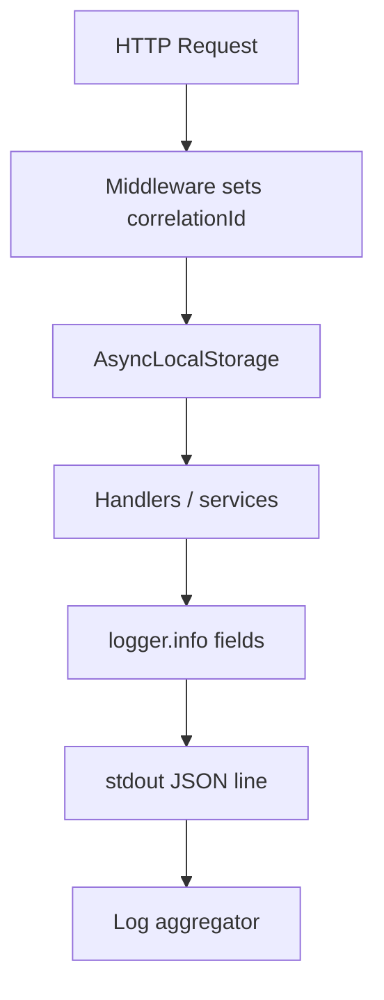
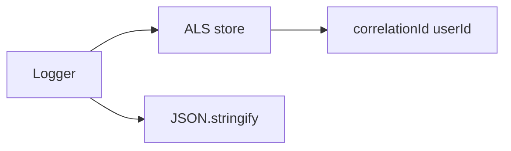
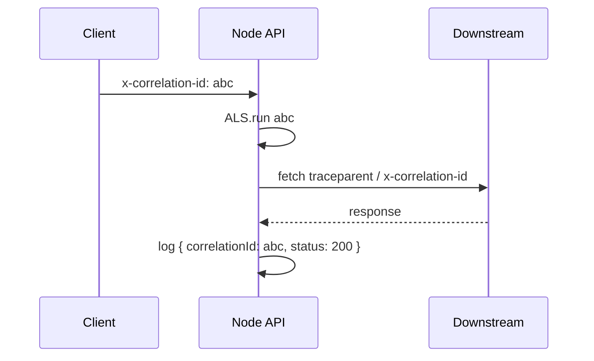

# Structured Logging and Correlation IDs

## Overview

**Structured logging** emits **JSON** (or key-value) records with stable field names—`level`, `msg`, `timestamp`, `correlationId`—so log aggregators ([[16-DevOps/README|DevOps]] ELK, CloudWatch, Datadog) can query and correlate. **Correlation IDs** tie one user request across async handlers, outbound fetch calls, and worker jobs. Node implements propagation via **`AsyncLocalStorage`** ([[06-NodeJS/08-Diagnostics-and-Performance/Diagnostics Channel and Async Context Tracking|Diagnostics Channel and Async Context Tracking]]) and HTTP headers (`x-correlation-id`, W3C **`traceparent`**). Plain `console.log` strings fail at scale.

## Learning Objectives

- Design JSON log schema with required and optional fields
- Propagate correlation IDs from ingress HTTP through async work
- Redact secrets and PII from log payloads
- Choose log levels and sampling for high-traffic services
- Bridge logs to traces in [[07-Backend/README|Backend]] and platform tooling

## Prerequisites

- [[06-NodeJS/08-Diagnostics-and-Performance/Diagnostics Channel and Async Context Tracking|Diagnostics Channel and Async Context Tracking]]
- [[02-JavaScript/07-Production-JavaScript/Observability and Operational Readiness|Observability and Operational Readiness]]
- [[06-NodeJS/05-Networking/Request Response Lifecycle and Headers|Request Response Lifecycle and Headers]]

## Difficulty

`advanced`

## Estimated Time

- Reading: 2 hours
- Exercises: 2–3 hours
- Mini project: 5 hours

## History

Ops evolved from grep-ing unstructured files to **JSON-per-line** (2010s). Distributed systems required **correlation** beyond single-server timestamps. OpenTelemetry unified logs/traces/metrics; Node **`AsyncLocalStorage`** made implicit context practical.

## Problem It Solves

- **Unqueryable logs** ("Error happened" with no request id)
- **Broken causality** after `await` loses manual id parameters
- **Secret leakage** in string-interpolated errors
- **Alert noise** without structured severity fields

## Internal Implementation



Standard fields:

- `timestamp` (ISO8601 UTC)
- `level` (debug/info/warn/error)
- `msg` (human-readable summary)
- `correlationId` / `traceId`
- `service`, `version`, `env`
- `err` (serialized Error: name, message, stack)

## Mermaid Diagrams

### Structure



### Sequence / Lifecycle



## Examples

### Minimal Example

```typescript
import { randomUUID } from 'node:crypto';

export function log(level: string, msg: string, fields: Record<string, unknown> = {}): void {
  const line = JSON.stringify({
    level,
    msg,
    ts: new Date().toISOString(),
    ...fields,
  });
  process.stdout.write(line + '\n');
}

log('info', 'server started', { port: 3000 });
```

### Production-Shaped Example

```typescript
import { AsyncLocalStorage } from 'node:async_hooks';
import { randomUUID } from 'node:crypto';
import http from 'node:http';

interface LogContext {
  correlationId: string;
  userId?: string;
}

const als = new AsyncLocalStorage<LogContext>();

export function createLogger(service: string) {
  return {
    info(msg: string, extra: Record<string, unknown> = {}) {
      write('info', service, msg, extra);
    },
    error(msg: string, err: unknown, extra: Record<string, unknown> = {}) {
      write('error', service, msg, { ...extra, err: serializeError(err) });
    },
  };
}

function write(level: string, service: string, msg: string, extra: Record<string, unknown>): void {
  const ctx = als.getStore();
  process.stdout.write(JSON.stringify({
    level,
    msg,
    service,
    ts: new Date().toISOString(),
    correlationId: ctx?.correlationId,
    userId: ctx?.userId,
    ...extra,
  }) + '\n');
}

function serializeError(err: unknown): Record<string, unknown> {
  if (err instanceof Error) {
    return { name: err.name, message: err.message, stack: err.stack };
  }
  return { message: String(err) };
}

export function withRequestContext<T>(req: http.IncomingMessage, fn: () => T): T {
  const correlationId = (req.headers['x-correlation-id'] as string) ?? randomUUID();
  return als.run({ correlationId }, fn);
}
```

Redaction helper:

```typescript
const REDACT_KEYS = new Set(['password', 'authorization', 'cookie', 'jwt']);

export function redact(obj: Record<string, unknown>): Record<string, unknown> {
  const out: Record<string, unknown> = {};
  for (const [k, v] of Object.entries(obj)) {
    out[k] = REDACT_KEYS.has(k.toLowerCase()) ? '[REDACTED]' : v;
  }
  return out;
}
```

## Trade-offs

| Dimension | Structured JSON | Plain text |
| --- | --- | --- |
| Query | Field filters | Regex fragile |
| Size | Larger | Smaller |
| Dev UX | Needs pretty printer | Readable locally |

### When to Use

- Every production Node service
- Cross-service calls ([[07-Backend/09-API-Observability-and-Testing/Structured Logs with Request Correlation|Structured Logs with Request Correlation]])
- Incident response requiring request trail

### When Not to Use

- Logging full bodies by default (PII/cost)

## Exercises

1. Trace one request id through three nested async functions via ALS.
2. Add redaction test ensuring `password` never appears in output.
3. Forward correlation id to outbound `fetch` headers.

## Mini Project

Logger module for [[06-NodeJS/projects/Node Runtime Toolkit/README|Node Runtime Toolkit]] with pino-compatible schema.

## Portfolio Project

Monitoring.md with log field dictionary and sample queries for [[16-DevOps/README|DevOps]] platform.

## Interview Questions

1. Why JSON logs over string concatenation?
2. How does correlation id cross `await` without parameter threading?
3. What fields belong in error logs vs metrics?
4. How prevent secret leakage in logs?

### Stretch / Staff-Level

1. Map correlationId to OpenTelemetry trace_id/span_id propagation.

## Common Mistakes

- `console.log('user', user)` dumping PII
- New correlation id per internal span (breaks trace)
- Logging at `info` in hot loops (cost)
- Missing correlation on worker boundary
- String logs in prod, JSON only in "logging env"

## Best Practices

- One correlation id per inbound request; propagate outbound
- stdout for logs; stderr for errors if platform distinguishes
- Stable schema version field (`logSchemaVersion: 1`)
- Use ALS at HTTP edge ([[06-NodeJS/08-Diagnostics-and-Performance/Diagnostics Channel and Async Context Tracking|Diagnostics Channel and Async Context Tracking]])
- Sample debug logs in production

## Summary

Production Node logs should be **structured JSON** with **correlation IDs** carried by **AsyncLocalStorage** from HTTP ingress through async work. Redact secrets, forward ids to downstream calls, and ship to [[16-DevOps/README|DevOps]] aggregators—not ad-hoc printf debugging.

## Further Reading

- [[02-JavaScript/07-Production-JavaScript/Observability and Operational Readiness|Observability and Operational Readiness]]
- [Pino — Node JSON logger](https://getpino.io/)

## Related Notes

- [[06-NodeJS/08-Diagnostics-and-Performance/Diagnostics Channel and Async Context Tracking|Diagnostics Channel and Async Context Tracking]]
- [[06-NodeJS/10-Production-Node/Operational Readiness Checklist for Node Processes|Operational Readiness Checklist for Node Processes]]
- [[07-Backend/README|Backend]]
- [[16-DevOps/README|DevOps]]

## Progress Checklist

- [ ] Explained from first principles
- [ ] Drew at least one Mermaid diagram
- [ ] Implemented a minimal version
- [ ] Documented trade-offs and non-goals
- [ ] Completed exercises
- [ ] Practiced interview questions aloud
- [ ] Linked prerequisites and dependents
