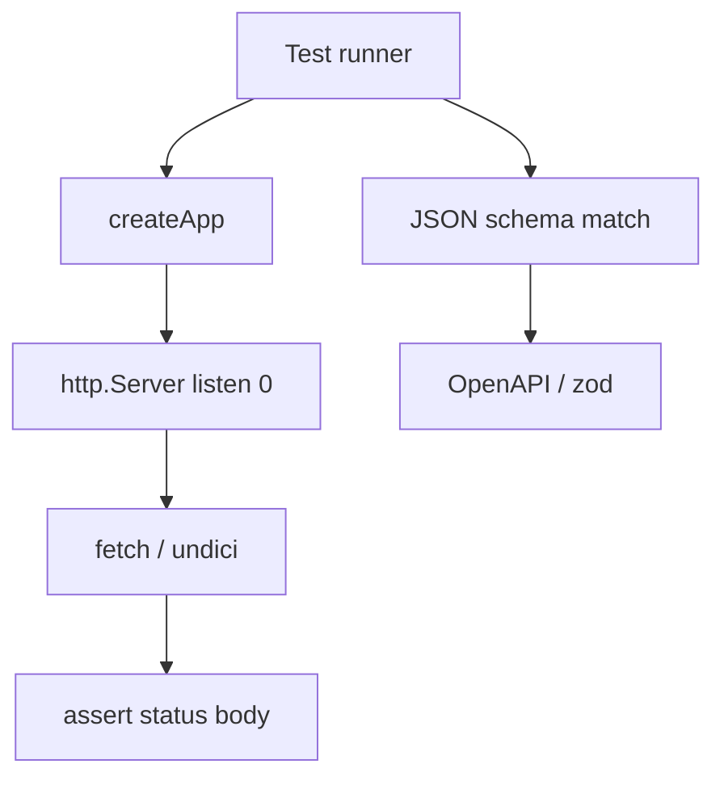
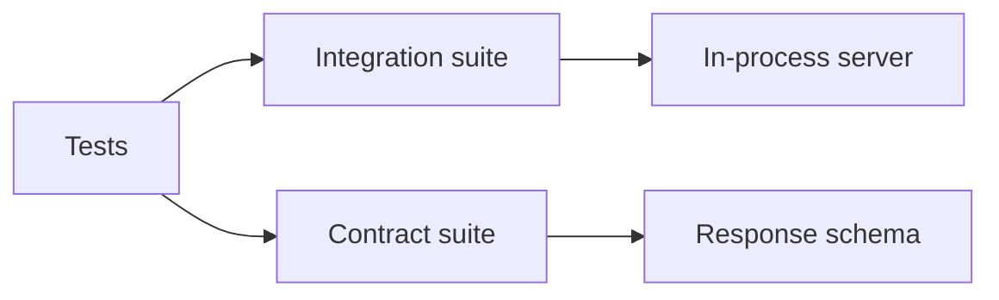
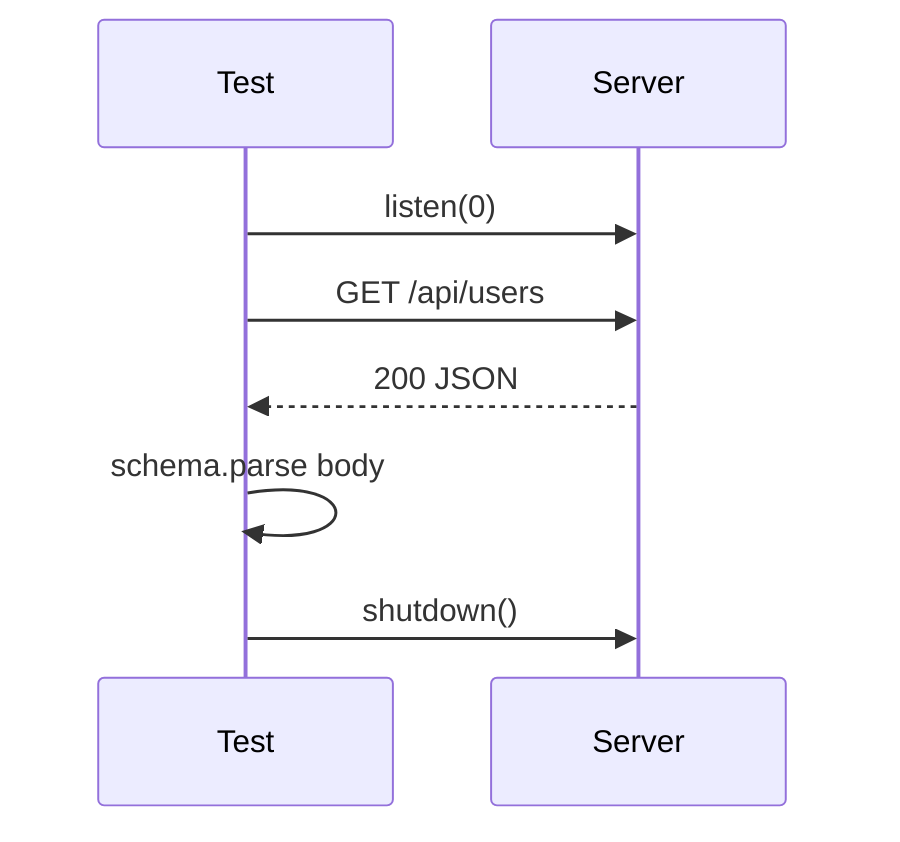

# Testing Node Servers Integration and Contract Tests

## Overview

**Integration tests** exercise real Node HTTP servers, streams, and process lifecycle—binding **`localhost:0`**, issuing requests, asserting headers/status/body, and verifying **shutdown** behavior. **Contract tests** lock HTTP API shapes (status codes, JSON schema, error envelopes) between services—often consumer-driven—without testing business logic internals. Node **`node:test`** + **`node:assert`**, Vitest, or testcontainers complement unit tests from [[02-JavaScript/07-Production-JavaScript/Testing JavaScript|Testing JavaScript]]. Product API testing patterns extend in [[07-Backend/09-API-Observability-and-Testing/Contract Integration and Load Testing|Contract Integration and Load Testing]] and [[07-Backend/01-HTTP-APIs-and-Contracts/OpenAPI as Executable Contract|OpenAPI as Executable Contract]].

## Learning Objectives

- Spin up ephemeral HTTP servers on random ports in tests
- Write integration tests for routes, middleware, and error paths
- Define contract tests with schema validation (zod/OpenAPI)
- Test graceful shutdown and connection drain behavior
- Isolate tests from real external services with fakes or testcontainers

## Prerequisites

- [[02-JavaScript/07-Production-JavaScript/Testing JavaScript|Testing JavaScript]]
- [[06-NodeJS/05-Networking/http and https Platform Servers|http and https Platform Servers]]
- [[06-NodeJS/10-Production-Node/Graceful Shutdown and Drain|Graceful Shutdown and Drain]]

## Difficulty

`advanced`

## Estimated Time

- Reading: 2.5 hours
- Exercises: 3–4 hours
- Mini project: 6 hours

## History

Early Node tests mocked `http` heavily; flakiness led to **supertest** (inject internal server) and **`listen(0)`** patterns. Contract testing grew with microservices (Pact). Node 18+ **`node:test`** reduced Jest dependency for core workflows.

## Problem It Solves

- **False confidence** from mocked `fetch` never matching real server
- **Breaking API changes** undetected until production consumers fail
- **Shutdown regressions** not covered by unit tests
- **Env coupling** tests requiring manual server start

## Internal Implementation



Layers:

1. **Unit**: pure functions, no listen
2. **Integration**: real TCP, real Node http stack
3. **Contract**: request/response shape frozen
4. **E2E**: full deploy (often [[16-DevOps/README|DevOps]] CI env)

## Mermaid Diagrams

### Structure



### Sequence / Lifecycle



## Examples

### Minimal Example

```typescript
import { test } from 'node:test';
import assert from 'node:assert/strict';
import http from 'node:http';

test('GET / returns 200', async () => {
  const server = http.createServer((_req, res) => {
    res.writeHead(200, { 'Content-Type': 'application/json' });
    res.end(JSON.stringify({ ok: true }));
  });

  await new Promise<void>((r) => server.listen(0, r));
  const { port } = server.address() as { port: number };

  const res = await fetch(`http://127.0.0.1:${port}/`);
  assert.equal(res.status, 200);
  const body = await res.json();
  assert.equal(body.ok, true);

  await new Promise<void>((r) => server.close(() => r()));
});
```

### Production-Shaped Example

App factory + contract schema:

```typescript
import http from 'node:http';
import { z } from 'zod';

export function createApp(): http.Server {
  return http.createServer((req, res) => {
    if (req.url === '/api/v1/users/1' && req.method === 'GET') {
      res.writeHead(200, { 'Content-Type': 'application/json' });
      res.end(JSON.stringify({ id: '1', email: 'a@example.com' }));
      return;
    }
    res.writeHead(404).end();
  });
}

export const UserResponseSchema = z.object({
  id: z.string(),
  email: z.string().email(),
});

// test file
import { test } from 'node:test';
import assert from 'node:assert/strict';

test('GET /api/v1/users/1 contract', async (t) => {
  const server = createApp();
  t.after(() => new Promise<void>((r) => server.close(() => r())));
  await new Promise<void>((r) => server.listen(0, r));
  const { port } = server.address() as { port: number };

  const res = await fetch(`http://127.0.0.1:${port}/api/v1/users/1`);
  assert.equal(res.status, 200);
  const json = await res.json();
  UserResponseSchema.parse(json); // contract assertion
});
```

Shutdown integration test:

```typescript
test('graceful shutdown completes in-flight request', async () => {
  const { server, shutdown } = createGracefulServer(handler, { graceMs: 5000 });
  await listen(server);
  const port = getPort(server);

  const slow = fetch(`http://127.0.0.1:${port}/slow`);
  await new Promise((r) => setTimeout(r, 50));
  const shutting = shutdown();
  const res = await slow;
  assert.equal(res.status, 200);
  await shutting;
});
```

## Trade-offs

| Type | Upside | Downside |
| --- | --- | --- |
| Integration | Real stack | Slower |
| Contract | API stability | Schema maintenance |
| Mock-heavy unit | Fast | Misses wire bugs |

### When to Use

- HTTP servers before every release
- Public API modules consumed by other teams
- Shutdown and health endpoints

### When Not to Use

- Testing framework internals instead of behavior
- Contract every private function

## Exercises

1. Test 404 and 500 paths with assert on JSON error envelope.
2. Add contract test failing when extra field removed—discuss semver.
3. Test readiness 503 during mocked shutdown flag.

## Mini Project

Integration suite for [[06-NodeJS/projects/HTTP Server From Scratch/README|HTTP Server From Scratch]] or Toolkit.

## Portfolio Project

Testing.md in [[06-NodeJS/projects/Node Runtime Toolkit/README|Node Runtime Toolkit]] with CI matrix.

## Interview Questions

1. Integration vs unit test for Node HTTP?
2. How bind server without port conflicts in parallel tests?
3. What belongs in a contract test vs integration test?
4. How test SIGTERM graceful shutdown in CI?

### Stretch / Staff-Level

1. Outline Pact consumer-driven flow between Node services ([[07-Backend/09-API-Observability-and-Testing/Contract Integration and Load Testing|Contract Integration and Load Testing]]).

## Common Mistakes

- Hard-coded port 3000 collisions in parallel CI
- Not closing servers → hung CI
- Testing implementation (mock spy) not HTTP contract
- Flaky timing without awaiting listen
- No negative path tests (malformed body, abort)

## Best Practices

- `listen(0)` + `fetch` (undici built-in Node 18+)
- Factory `createApp()` for testability
- `t.after`/`afterAll` close servers and pools
- Schema-validate JSON responses in contract tests
- Run shutdown tests in isolated job if timing-sensitive

## Summary

Test Node servers by **listening on ephemeral ports**, asserting real HTTP behavior, and **validating response contracts** with schemas. Cover errors, health, and **graceful shutdown**—complementing JS unit tests with production-shaped integration coverage; deeper API product tests live in [[07-Backend/09-API-Observability-and-Testing/Contract Integration and Load Testing|Contract Integration and Load Testing]] and [[07-Backend/03-Validation-Errors-and-Versioning/Problem Details and Error Envelopes|Problem Details and Error Envelopes]].

## Further Reading

- [Node.js test runner](https://nodejs.org/api/test.html)
- [[02-JavaScript/07-Production-JavaScript/Testing JavaScript|Testing JavaScript]]

## Related Notes

- [[06-NodeJS/10-Production-Node/Graceful Shutdown and Drain|Graceful Shutdown and Drain]]
- [[06-NodeJS/10-Production-Node/Health Readiness and Liveness Hooks|Health Readiness and Liveness Hooks]]
- [[06-NodeJS/projects/HTTP Server From Scratch/README|HTTP Server From Scratch]]
- [[07-Backend/09-API-Observability-and-Testing/Contract Integration and Load Testing|Contract Integration and Load Testing]]
- [[07-Backend/01-HTTP-APIs-and-Contracts/OpenAPI as Executable Contract|OpenAPI as Executable Contract]]
- [[07-Backend/README|Backend]]
- [[16-DevOps/README|DevOps]]

## Progress Checklist

- [ ] Explained from first principles
- [ ] Drew at least one Mermaid diagram
- [ ] Implemented a minimal version
- [ ] Documented trade-offs and non-goals
- [ ] Completed exercises
- [ ] Practiced interview questions aloud
- [ ] Linked prerequisites and dependents
