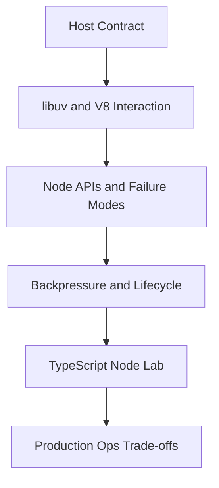
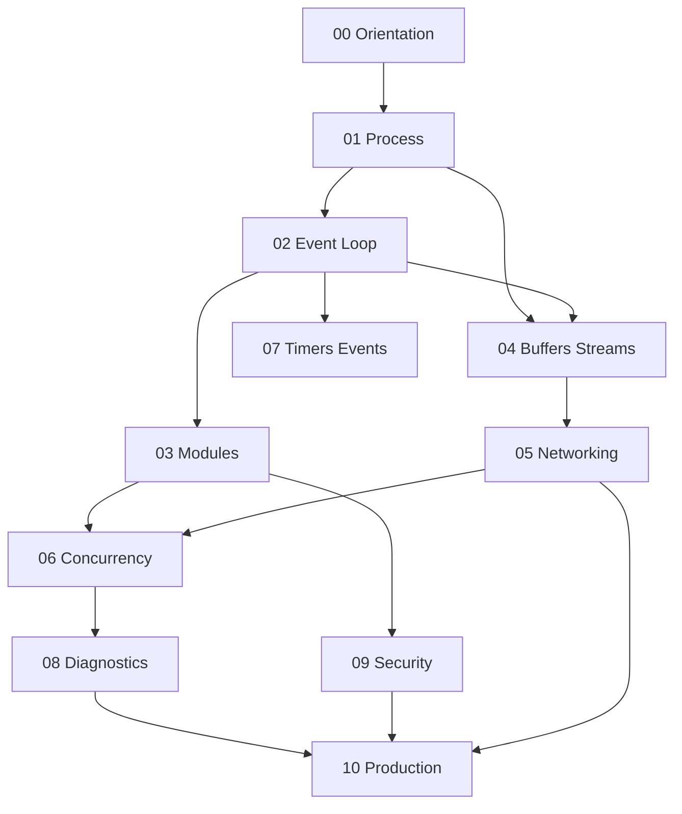

# 06 Node.js

A first-principles track for the **Node.js host runtime**: V8 + libuv, process lifecycle, event-loop phases, modules at execution time, buffers and streams, networking primitives, workers and clustering, diagnostics, supply-chain security, and production process readiness—implemented and observed in TypeScript on Node.

## Objectives

- Explain how Node embeds V8 and drives I/O through libuv
- Predict event-loop phase ordering, `nextTick`, microtasks, and thread-pool work
- Use buffers, streams, and backpressure correctly under failure
- Build thin `http`/`net` servers without framework magic
- Choose workers, child processes, and cluster under concrete constraints
- Operate Node processes: shutdown, config, observability, and supply-chain hygiene
- Hand off ECMAScript semantics to JavaScript and product APIs to Backend

## Why This Track Matters

Most “Node bugs” are host bugs: blocked event loops, ignored backpressure, unsafe path joins, `unhandledRejection` policies that crash or leak, dual-package hazards, and install-script supply-chain attacks. Framework knowledge cannot replace the runtime model underneath Express.

## Teaching Contract

Every topic note follows:

## Scope Boundaries

| This track owns | Handoff |
| --- | --- |
| Process model, signals, exit, env, `NODE_OPTIONS` | — |
| libuv phases, thread pool, handles/requests | Promise/microtask *language* semantics → [[02-JavaScript/README\|JavaScript]] |
| Buffer, Node streams, `fs`, `net`, thin `http`/`https` | Express/Fastify product APIs → [[07-Backend/02-Frameworks-and-Middleware/Express Application and Router Internals\|Express Application and Router Internals]] |
| `worker_threads`, `cluster`, `child_process` | Multi-service architecture → Backend / [[09-System-Design/README\|System Design]] |
| CJS/ESM *execution*, loaders, dual-package hazard in Node | Portable `package.json`/`exports` *contracts* → JavaScript |
| Diagnostics, heap flags, loop delay, graceful shutdown | Containers/CI platforms → [[16-DevOps/README\|DevOps]] |
| npm lockfiles, integrity, install-script risk | Auth products, ORMs → Backend / [[08-Databases/README\|Databases]] |
| — | DOM / browser hosts → future frontend material |

## Prerequisites

- [[02-JavaScript/00-Orientation/ECMAScript Engines and Host Runtimes|ECMAScript Engines and Host Runtimes]]
- [[02-JavaScript/05-Async-and-Concurrency/Event Loop and Task Queues|Event Loop and Task Queues]]
- [[02-JavaScript/05-Async-and-Concurrency/Promises Internals|Promises Internals]]
- [[02-JavaScript/06-Modules-and-Tooling/ES Modules|ES Modules]]
- [[01-Computer-Science/05-Concurrency-Fundamentals/Asynchronous Event-Driven Models|Asynchronous Event-Driven Models]]

## Roadmap

## Topics

### 00 — Orientation

- [[06-NodeJS/00-Orientation/Why Node.js Exists|Why Node.js Exists]]
- [[06-NodeJS/00-Orientation/V8 libuv and the Node Host|V8 libuv and the Node Host]]
- [[06-NodeJS/00-Orientation/Node Program Lifecycle|Node Program Lifecycle]]
- [[06-NodeJS/00-Orientation/Deno Bun and WinterCG Portability|Deno Bun and WinterCG Portability]]
- [[06-NodeJS/00-Orientation/Node Versioning LTS and Compatibility Policies|Node Versioning LTS and Compatibility Policies]]

### 01 — Process and Runtime

- [[06-NodeJS/01-Process-and-Runtime/Process argv env and stdio|Process argv env and stdio]]
- [[06-NodeJS/01-Process-and-Runtime/Signals Exit Codes and Lifecycle Hooks|Signals Exit Codes and Lifecycle Hooks]]
- [[06-NodeJS/01-Process-and-Runtime/unhandledRejection uncaughtException and Fatal Errors|unhandledRejection uncaughtException and Fatal Errors]]
- [[06-NodeJS/01-Process-and-Runtime/NODE_OPTIONS and Runtime Flags|NODE_OPTIONS and Runtime Flags]]
- [[06-NodeJS/01-Process-and-Runtime/Working Directory Paths and fileURLToPath|Working Directory Paths and fileURLToPath]]
- [[06-NodeJS/01-Process-and-Runtime/Child Process Spawning Basics|Child Process Spawning Basics]]

### 02 — Event Loop and libuv

- [[06-NodeJS/02-Event-Loop-and-libuv/libuv Architecture Overview|libuv Architecture Overview]]
- [[06-NodeJS/02-Event-Loop-and-libuv/Event Loop Phases|Event Loop Phases]]
- [[06-NodeJS/02-Event-Loop-and-libuv/process.nextTick vs Microtasks vs Timers|process.nextTick vs Microtasks vs Timers]]
- [[06-NodeJS/02-Event-Loop-and-libuv/Handles and Requests|Handles and Requests]]
- [[06-NodeJS/02-Event-Loop-and-libuv/Thread Pool and Blocking Work|Thread Pool and Blocking Work]]
- [[06-NodeJS/02-Event-Loop-and-libuv/Starvation Backpressure and Loop Health|Starvation Backpressure and Loop Health]]

### 03 — Modules and Loading

- [[06-NodeJS/03-Modules-and-Loading/CJS and ESM Execution in Node|CJS and ESM Execution in Node]]
- [[06-NodeJS/03-Modules-and-Loading/Custom Loaders and Module Hooks|Custom Loaders and Module Hooks]]
- [[06-NodeJS/03-Modules-and-Loading/package.json type exports and Dual Package Hazard|package.json type exports and Dual Package Hazard]]
- [[06-NodeJS/03-Modules-and-Loading/node_modules Resolution in Practice|node_modules Resolution in Practice]]
- [[06-NodeJS/03-Modules-and-Loading/Native Addons and N-API Concepts|Native Addons and N-API Concepts]]

### 04 — Buffers Streams and IO

- [[06-NodeJS/04-Buffers-Streams-and-IO/Buffer and Typed Array Boundaries|Buffer and Typed Array Boundaries]]
- [[06-NodeJS/04-Buffers-Streams-and-IO/Readable Writable and Duplex Streams|Readable Writable and Duplex Streams]]
- [[06-NodeJS/04-Buffers-Streams-and-IO/Transform Streams and Object Mode|Transform Streams and Object Mode]]
- [[06-NodeJS/04-Buffers-Streams-and-IO/pipeline and Finished|pipeline and Finished]]
- [[06-NodeJS/04-Buffers-Streams-and-IO/Backpressure and HighWaterMark|Backpressure and HighWaterMark]]
- [[06-NodeJS/04-Buffers-Streams-and-IO/fs Promises Sync and Streaming|fs Promises Sync and Streaming]]
- [[06-NodeJS/04-Buffers-Streams-and-IO/Web Streams Interop with Node Streams|Web Streams Interop with Node Streams]]

### 05 — Networking

- [[06-NodeJS/05-Networking/net Sockets and Servers|net Sockets and Servers]]
- [[06-NodeJS/05-Networking/http and https Platform Servers|http and https Platform Servers]]
- [[06-NodeJS/05-Networking/Request Response Lifecycle and Headers|Request Response Lifecycle and Headers]]
- [[06-NodeJS/05-Networking/Keep-Alive Timeouts and Connection Limits|Keep-Alive Timeouts and Connection Limits]]
- [[06-NodeJS/05-Networking/TLS Certificates and Secure Servers Concepts|TLS Certificates and Secure Servers Concepts]]
- [[06-NodeJS/05-Networking/http2 Concepts|http2 Concepts]]
- [[06-NodeJS/05-Networking/DNS Lookup Caching and Happy Eyeballs Concepts|DNS Lookup Caching and Happy Eyeballs Concepts]]

### 06 — Concurrency and Scaling

- [[06-NodeJS/06-Concurrency-and-Scaling/worker_threads Model|worker_threads Model]]
- [[06-NodeJS/06-Concurrency-and-Scaling/Worker Pools and Message Passing|Worker Pools and Message Passing]]
- [[06-NodeJS/06-Concurrency-and-Scaling/SharedArrayBuffer Atomics on Node|SharedArrayBuffer Atomics on Node]]
- [[06-NodeJS/06-Concurrency-and-Scaling/cluster and Multi-Process Scaling|cluster and Multi-Process Scaling]]
- [[06-NodeJS/06-Concurrency-and-Scaling/child_process IPC Patterns|child_process IPC Patterns]]
- [[06-NodeJS/06-Concurrency-and-Scaling/Choosing Threads Processes and Offload|Choosing Threads Processes and Offload]]

### 07 — Timers Events and IPC

- [[06-NodeJS/07-Timers-Events-and-IPC/Timers Immediate and Scheduling Nuance|Timers Immediate and Scheduling Nuance]]
- [[06-NodeJS/07-Timers-Events-and-IPC/EventEmitter Host Semantics and MaxListeners|EventEmitter Host Semantics and MaxListeners]]
- [[06-NodeJS/07-Timers-Events-and-IPC/AbortSignal Propagation Across Node APIs|AbortSignal Propagation Across Node APIs]]
- [[06-NodeJS/07-Timers-Events-and-IPC/MessagePort BroadcastChannel and Structured Clone|MessagePort BroadcastChannel and Structured Clone]]

### 08 — Diagnostics and Performance

- [[06-NodeJS/08-Diagnostics-and-Performance/Diagnostics Channel and Async Context Tracking|Diagnostics Channel and Async Context Tracking]]
- [[06-NodeJS/08-Diagnostics-and-Performance/Inspector CPU Profiling and Heap Snapshots|Inspector CPU Profiling and Heap Snapshots]]
- [[06-NodeJS/08-Diagnostics-and-Performance/perf_hooks and Event Loop Delay|perf_hooks and Event Loop Delay]]
- [[06-NodeJS/08-Diagnostics-and-Performance/Memory Limits and Heap Flags|Memory Limits and Heap Flags]]
- [[06-NodeJS/08-Diagnostics-and-Performance/Flamegraphs Bottlenecks and Production Profiling Discipline|Flamegraphs Bottlenecks and Production Profiling Discipline]]

### 09 — Security and Supply Chain

- [[06-NodeJS/09-Security-and-Supply-Chain/Path Traversal and Safe Filesystem Access|Path Traversal and Safe Filesystem Access]]
- [[06-NodeJS/09-Security-and-Supply-Chain/Prototype Pollution at the Host Boundary|Prototype Pollution at the Host Boundary]]
- [[06-NodeJS/09-Security-and-Supply-Chain/npm Lockfiles Integrity and Audit|npm Lockfiles Integrity and Audit]]
- [[06-NodeJS/09-Security-and-Supply-Chain/Secrets Env Injection and Least Privilege|Secrets Env Injection and Least Privilege]]
- [[06-NodeJS/09-Security-and-Supply-Chain/Dependency Confusion Typosquatting and Install Scripts|Dependency Confusion Typosquatting and Install Scripts]]

### 10 — Production Node

- [[06-NodeJS/10-Production-Node/Graceful Shutdown and Drain|Graceful Shutdown and Drain]]
- [[06-NodeJS/10-Production-Node/Configuration Twelve-Factor on Node|Configuration Twelve-Factor on Node]]
- [[06-NodeJS/10-Production-Node/Structured Logging and Correlation IDs|Structured Logging and Correlation IDs]]
- [[06-NodeJS/10-Production-Node/Health Readiness and Liveness Hooks|Health Readiness and Liveness Hooks]]
- [[06-NodeJS/10-Production-Node/Testing Node Servers Integration and Contract Tests|Testing Node Servers Integration and Contract Tests]]
- [[06-NodeJS/10-Production-Node/Operational Readiness Checklist for Node Processes|Operational Readiness Checklist for Node Processes]]

## Suggested Study Order

1. Orientation (00) and Process (01) before loop internals
2. Event Loop (02) before streams and networking
3. Modules (03) alongside JS module contracts
4. Buffers/Streams (04) before Networking (05)
5. Concurrency (06) and Timers/Events (07) after loop fluency
6. Diagnostics (08) and Security (09) before claiming production readiness
7. Production Node (10) and portfolio as synthesis

## Mini Projects

- [[06-NodeJS/projects/HTTP Server From Scratch/README|HTTP Server From Scratch]]
- [[06-NodeJS/projects/Stream Pipeline Toolkit/README|Stream Pipeline Toolkit]]
- [[06-NodeJS/projects/Worker Pool Lab/README|Worker Pool Lab]]
- [[06-NodeJS/projects/Graceful Shutdown Harness/README|Graceful Shutdown Harness]]
- [[06-NodeJS/projects/Module Resolution and Exports Clinic/README|Module Resolution and Exports Clinic]]

## Portfolio Project

- [[06-NodeJS/projects/Node Runtime Toolkit/README|Node Runtime Toolkit]]

## Exercises

Module sets live under [[06-NodeJS/_exercises/README|Node.js Exercises]].

## Interview Questions

Module sets live under [[06-NodeJS/_interview/README|Node.js Interview Questions]].

## Implementation Checklist

- [x] Event-loop phase tracer + nextTick/microtask ordering labs
- [x] Buffer/stream backpressure + pipeline error propagation
- [x] Thin `http` server lab
- [x] Worker-thread pool
- [x] Graceful-shutdown coordinator
- [x] Path-safe filesystem helper
- [x] Diagnostics / perf_hooks sampler
- [x] Five mini projects + Node Runtime Toolkit

## Code Labs

See [[06-NodeJS/code/README|Node.js code labs]].

## References

- [[00-References/NodeJS/README|Node.js References]]

## Related Tracks

- [[02-JavaScript/README|JavaScript]]
- [[01-Computer-Science/README|Computer Science]]
- [[07-Backend/README|Backend]]
- [[08-Databases/README|Databases]]
- [[09-System-Design/README|System Design]]
- [[16-DevOps/README|DevOps]]
- [[18-Security/README|Security]]
- [[Career/README|Career]]

## Stage Gate Checklist

- [ ] Can explain libuv phases and when the thread pool runs
- [ ] Can implement correct stream backpressure and pipeline error handling
- [ ] Can build a thin HTTP server and shut it down gracefully
- [ ] Can choose workers vs cluster vs child processes with rationale
- [ ] Labs green; at least three mini projects and portfolio docs completed
- [ ] Interview sets practiced with diagrams and production failure modes
