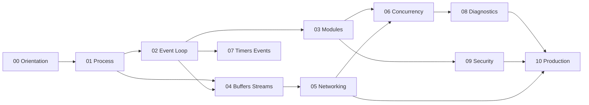

# Node.js Exercises

Eleven module sets move from host contracts through TypeScript labs on the event loop, streams, networking, concurrency, diagnostics, supply-chain hygiene, and production process readiness.

## Learning Path

## Exercise Sets

1. [[06-NodeJS/_exercises/Orientation Exercises.md|Orientation Exercises]] — separate the Node host from JavaScript semantics, V8/libuv roles, lifecycle, and runtime portability before writing servers
2. [[06-NodeJS/_exercises/Process and Runtime Exercises.md|Process and Runtime Exercises]] — practice argv/env/stdio, signals, exit codes, fatal error policies, paths, and child-process spawning
3. [[06-NodeJS/_exercises/Event Loop and libuv Exercises.md|Event Loop and libuv Exercises]] — trace loop phases, nextTick/microtasks, handles/requests, thread-pool work, and starvation
4. [[06-NodeJS/_exercises/Modules and Loading Exercises.md|Modules and Loading Exercises]] — execute CJS/ESM correctly, resolve `node_modules`, defend against dual-package hazards, and reason about loaders
5. [[06-NodeJS/_exercises/Buffers Streams and IO Exercises.md|Buffers Streams and IO Exercises]] — use buffers, readable/writable/transform streams, backpressure, `pipeline`, and fs streaming under failure
6. [[06-NodeJS/_exercises/Networking Exercises.md|Networking Exercises]] — build thin `net`/`http`/`https` servers with correct timeouts, TLS concepts, DNS, and connection limits
7. [[06-NodeJS/_exercises/Concurrency and Scaling Exercises.md|Concurrency and Scaling Exercises]] — choose workers, cluster, child processes, and offload paths with explicit IPC contracts
8. [[06-NodeJS/_exercises/Timers Events and IPC Exercises.md|Timers Events and IPC Exercises]] — master timers/immediates, EventEmitter semantics, AbortSignal propagation, and MessagePort IPC
9. [[06-NodeJS/_exercises/Diagnostics and Performance Exercises.md|Diagnostics and Performance Exercises]] — profile CPU/heap, measure event-loop delay, track async context, and interpret flamegraphs
10. [[06-NodeJS/_exercises/Security and Supply Chain Exercises.md|Security and Supply Chain Exercises]] — harden path access, block prototype pollution, audit dependencies, and enforce least-privilege secrets
11. [[06-NodeJS/_exercises/Production Node Exercises.md|Production Node Exercises]] — synthesize graceful shutdown, twelve-factor config, structured logging, health probes, and integration testing

## Completion Standard

- State host contracts, failure modes, and loop/thread-pool assumptions before coding.
- Implement against shared lab vectors in [[06-NodeJS/code/README|code labs]] with observable behavior.
- Measure loop delay and memory before optimizing; preserve correctness oracles.
- Debug drills must formalize reproduction, phase ordering, and regression vectors.
- Production scenarios include telemetry, rollout, rollback, and operational failure modes.

## Related Notes

- [[06-NodeJS/README|Node.js]]
- [[06-NodeJS/code/README|code labs]]
- [[06-NodeJS/_interview/README|Node.js Interview Questions]]
- [[Career/README|Career]]
