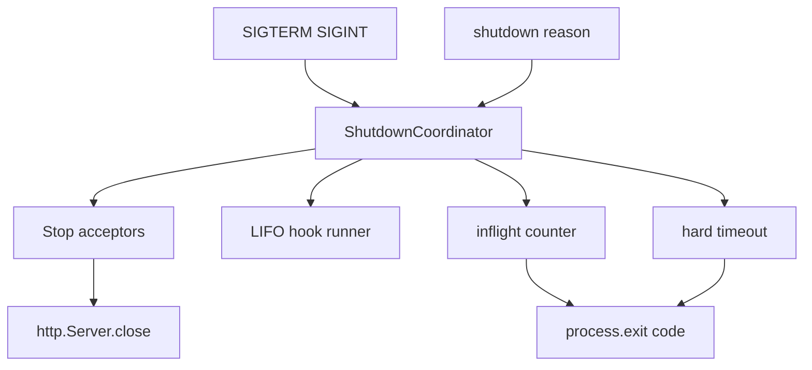

# Architecture — Graceful Shutdown Harness

## Summary

`ShutdownCoordinator` centralizes drain state, hook registry, inflight tracking, and timeout enforcement. Source: [[06-NodeJS/code/src/shutdown-coordinator.ts|shutdown-coordinator.ts]].

## Component Diagram

## Public Surface

| Symbol | Responsibility |
| --- | --- |
| `ShutdownCoordinator` | State machine and registration |
| `registerHook` | Named async teardown, LIFO order |
| `registerServer` | Wraps `server.close` with promisify |
| `trackInflight` | Wraps async work for drain gating |
| `isReady` | Readiness boolean for health routes |

## Invariants

- Drain starts at most once per process lifetime unless explicit reset in tests only.
- Inflight count never negative; `trackInflight` always decrements in `finally`.
- Readiness false for entire drain phase.
- Exit code 0 only when inflight zero before hard timeout.

## Failure Model

Hook rejection records error, continues unless `failFast: true`. Hard timeout logs summary and exits 1. Double signal does not restart drain.

## Contract

Formalized in [[06-NodeJS/projects/Node Runtime Toolkit/ADR/ADR-004 Graceful Shutdown Contract|ADR-004 Graceful Shutdown Contract]].

## Related Documents

- [[06-NodeJS/projects/Graceful Shutdown Harness/README|Project README]]
- [[06-NodeJS/projects/HTTP Server From Scratch/Architecture|HTTP Server Architecture]]
