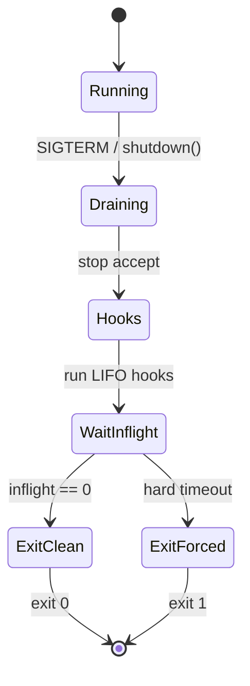

# Graceful Shutdown Harness

## One-Line Purpose

Coordinate signal-aware shutdown: stop accepting work, drain in-flight HTTP and async tasks, run ordered teardown hooks, enforce hard timeout, and exit with explicit codes—making `SIGTERM` behavior testable without Kubernetes.

## Status

**Active.** The learning surface targets [[06-NodeJS/code/src/shutdown-coordinator.ts|shutdown-coordinator.ts]] with integration against [[06-NodeJS/code/src/http-server.ts|http-server.ts]] in [[06-NodeJS/code/tests/labs.test.ts|labs.test.ts]].

## Prerequisites

- [[06-NodeJS/10-Production-Node/Graceful Shutdown and Drain|Graceful Shutdown and Drain]]
- [[06-NodeJS/01-Process-and-Runtime/Signals Exit Codes and Lifecycle Hooks|Signals Exit Codes and Lifecycle Hooks]]
- [[06-NodeJS/01-Process-and-Runtime/unhandledRejection uncaughtException and Fatal Errors|unhandledRejection uncaughtException and Fatal Errors]]
- [[06-NodeJS/10-Production-Node/Health Readiness and Liveness Hooks|Health Readiness and Liveness Hooks]]
- [[06-NodeJS/projects/HTTP Server From Scratch/README|HTTP Server From Scratch]]

## Architecture



See [[06-NodeJS/projects/Graceful Shutdown Harness/Architecture|Architecture]] for hook ordering and idempotency.

## Acceptance Criteria

- [ ] First `shutdown()` call is idempotent; subsequent calls noop or return same promise.
- [ ] Registered `http.Server` stops accepting; existing connections complete or timeout.
- [ ] Teardown hooks run LIFO; hook failure logged but later hooks still run unless configured fail-fast.
- [ ] In-flight counter tracks async work started via `trackInflight()` wrapper.
- [ ] Hard timeout forces `process.exit(1)` in test subprocess with evidence of partial drain.
- [ ] Readiness flips to not-ready immediately on drain start.
- [ ] `unhandledRejection` during drain follows configured policy (fail vs log).

## Run and Test

```bash
cd 06-NodeJS/code
npm install
npm test -- tests/labs.test.ts -t "ShutdownCoordinator"
```

Subprocess tests spawn Node with `--test` or vitest fork to observe real signal handling where platform allows.

## Benchmarks

| Workload | Variants | Primary metrics |
| --- | --- | --- |
| 0 inflight | immediate shutdown | ms to exit 0 |
| 100 slow requests | drain vs hard kill | completed vs aborted count |
| 10 LIFO hooks | sequential vs parallel hook groups | hook order verification |
| Double SIGTERM | idempotency | single drain execution |

Benchmark entry point (when added): `06-NodeJS/code/bench/shutdown.bench.ts`.

## Security and Failure Constraints

- Hooks must not log secrets from `process.env` in default mode.
- Forced exit after timeout is intentional—document data-loss trade-off.
- Do not disable `unhandledRejection` handlers silently during drain.
- Signal handlers registered once; no duplicate listener leak across hot reload tests.

## Exercises and Reflection

1. Integrate with [[06-NodeJS/projects/Worker Pool Lab/README|Worker Pool Lab]] `pool.close()`.
2. Add readiness HTTP endpoint that returns 503 during drain.
3. Compare drain timeout with platform load balancer deregistration delay.

**Reflection prompts**

- Why is LIFO hook order common for nested resource acquisition?
- What breaks if health checks still pass while drain has started?
- When is immediate `process.exit` correct despite open handles?

## Interview Questions

- Describe graceful shutdown under SIGTERM in Node.
- How do liveness and readiness differ during drain?
- What happens to in-flight promises after `server.close()`?

## Related Notes

- [[06-NodeJS/projects/Graceful Shutdown Harness/Architecture|Architecture]]
- [[06-NodeJS/projects/Graceful Shutdown Harness/Testing|Testing]]
- [[06-NodeJS/projects/Graceful Shutdown Harness/Security|Security]]
- [[06-NodeJS/README|Node.js MOC]]
- [[06-NodeJS/code/README|Node.js Code Labs]]
- [[06-NodeJS/projects/Node Runtime Toolkit/README|Node Runtime Toolkit]]
- [[Career/README|Career]]
